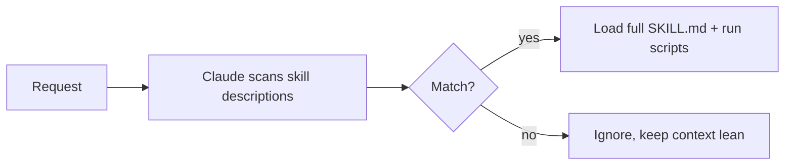

<LevelBadge level="advanced" />

<VerifyNote lastVerified="2026-06-23" source="https://code.claude.com/docs/en/skills">
スキルファイルのレイアウト、漸進的開示、そしてスキルがどこで動くか（Claude Code、Claude.ai、Cowork）は進化しています — 公式のスキルドキュメントで確認してください。
</VerifyNote>

**スキル** は、Claude が **関連するときだけ** 読み込む専門知識 — 指示に加えて、任意のスクリプトとリソース — をパッケージ化したものです。すべてを [CLAUDE.md](/docs/claude-code/claude-md) に詰め込む代わりに、Claude にオンデマンドで取り込める能力のライブラリを与えます。

## 構造

スキルは `SKILL.md` を含むフォルダです: YAML フロントマター + 指示。

```markdown
---
name: pdf-forms
description: Use when the user needs to fill, read, or generate PDF forms.
---

# PDF Forms
Steps and rules for working with PDF forms…
(optionally reference scripts/ or resources/ in this folder)
```

**`description` がトリガー** です — Claude はそれを読んで、いつスキルを起動するかを判断します。「Use when…」の形で、適切なタイミングで読み込まれ、それ以外では読み込まれない程度に具体的に書きましょう。

## 漸進的開示（なぜスキルがスケールするか）

Claude はすべてのスキルの本文を最初から読み込むわけではありません — 軽量な `name` + `description` を見て、リクエストが一致したときだけ完全な指示を取り込み（スクリプトを実行し）ます。これにより、多くのスキルをインストールしていてもコンテキストを軽く保てます。



## どこに置くか

- 個人: `~/.claude/skills/<name>/SKILL.md`
- プロジェクト（共有可能）: `.claude/skills/<name>/SKILL.md`
- チーム配布のために [プラグイン](/docs/claude-code/plugins-marketplaces) に同梱。

AILmanac は [すぐ使える 7 つのスキルパック](/docs/templates/skills) を提供しています — 1 つコピーして試してみてください。

## 実例: 自分自身をトリガーするスキル

`~/.claude/skills/release-notes/SKILL.md` を作成します:

```markdown
---
name: release-notes
description: Use when the user asks to write release notes or a changelog from git history.
---

# Release Notes
1. Run `git log <last-tag>..HEAD --oneline` to get the commits.
2. Group them into Features / Fixes / Breaking changes.
3. Write user-facing notes — what changed for *users*, not commit messages.
4. Output Markdown ready to paste into a GitHub release.
```

後でこう入力します: *「v1.4 以降のリリースノートを書いて。」* Claude はこれらの手順をコンテキストに持っていませんでした — しかしリクエストが `description` に一致するので、完全な `SKILL.md` を取り込み、`git log` を実行し、グループ化されたノートを生成します。あなたは何も名前で呼び出していません。**description がルーティングを行った**のです。同じフォルダに `scripts/` ファイルを追加すれば、スキルはそれをステップ 1 の一部として実行できます。

## スキル vs コマンド vs サブエージェント vs MCP

| ツール | 何であるか | あなた vs Claude のどちらがトリガーするか |
|---|---|---|
| [スラッシュコマンド](/docs/claude-code/slash-commands) | 保存されたプロンプト | **あなた** が呼び出す |
| **スキル** | オンデマンドの専門知識 + スクリプト | **Claude** が関連するときに読み込む |
| [サブエージェント](/docs/claude-code/subagents) | 独自のコンテキストを持つ委譲されたエージェント | Claude が委譲する |
| [MCP](/docs/claude-code/mcp) | 外部ツール/データへの接続 | 呼び出すツールを提供する |

経験則: **あなた**がオンデマンドで起動したい → スラッシュコマンド。**Claude** が手順を知っていて関連するときに適用すべき → スキル。作業が別のコンテキストで起こるべき → サブエージェント。外部システムに到達する必要がある → MCP。

## よくある間違い

- **トリガーしない description。** 「Helps with PDFs」は漠然としすぎています。「Use when the user needs to fill, read, or generate PDF forms」は、いつ読み込むべきかを Claude に正確に伝えます。description は起動メカニズムのすべてです — 人間向けではなく、マッチング向けに書きましょう。
- **代わりにすべてを CLAUDE.md に入れる。** [CLAUDE.md](/docs/claude-code/claude-md) は*すべての*セッションで読み込まれ、常にコンテキストを消費します。スキルは*関連するときだけ*読み込まれます。状況依存の手順はスキルに移し、CLAUDE.md は常に真であるプロジェクトルールのために残しましょう。
- **1 つの巨大なスキル。** 鋭く記述された多数の小さなスキルは、1 つの何でも屋よりうまくルーティングされます — 漸進的開示は、各 description が具体的なときだけ役立ちます。
- **共有可能であることを忘れる。** git にコミットされた `.claude/skills/` 内のプロジェクトスキルは、チーム全体にその能力を与えます。`~/.claude/skills/` 内の個人的なものはあなたのものに留まります。

## 次に

- [はじめてのスキルを書く（ウォークスルー）](/docs/walkthroughs/first-skill)
- [SKILL.md テンプレート](/docs/templates/skills)
- [プラグインとマーケットプレイス](/docs/claude-code/plugins-marketplaces)
