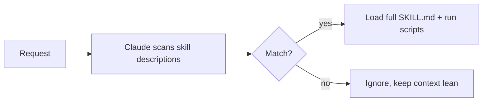

<LevelBadge level="advanced" />

<VerifyNote lastVerified="2026-06-23" source="https://code.claude.com/docs/en/skills">
スキルファイルのレイアウト、漸進的開示、スキルが動く場所（Claude Code、Claude.ai、Cowork）は進化しています。公式の Skills ドキュメントで確認してください。
</VerifyNote>

<Callout type="objectives" items={["スキルとは何か、そしてすべてを CLAUDE.md に詰め込むのと何が違うのかを定義する", "SKILL.md（フロントマター＋指示）を読み書きし、なぜ description がトリガーなのかを理解する", "漸進的開示とは何か、なぜ多数のスキルがコンテキストを膨らませずにスケールできるのかを説明する", "スキルが存在する 3 つの場所を知る：個人、プロジェクト、プラグインに同梱", "スキル、スラッシュコマンド、サブエージェント、MCP のあいだで正しく選ぶ", "スキルが起動しない原因となる、よくある 4 つの間違いを避ける"]} />

**スキル**は専門知識 — 指示に加え、任意のスクリプトとリソース — をパッケージ化し、Claude が**関連するときだけ**読み込むものです。すべてを [CLAUDE.md](/docs/claude-code/claude-md) に詰め込む代わりに、Claude が必要に応じて引き込む能力のライブラリを与えます。

## 構造

スキルは `SKILL.md` を含むフォルダです：YAML フロントマター ＋ 指示。

```markdown
---
name: pdf-forms
description: Use when the user needs to fill, read, or generate PDF forms.
---

# PDF Forms
Steps and rules for working with PDF forms…
(optionally reference scripts/ or resources/ in this folder)
```

<Callout type="tip" items={["description がトリガーです — Claude はそれを読んでスキルをいつ起動するかを決めます。「Use when…」の形で、適切なタイミングで読み込まれ、それ以外では読み込まれない程度に具体的に書きましょう。"]} />

## 漸進的開示（なぜスキルはスケールするのか）

Claude はすべてのスキルの本体を最初から読み込むわけではありません。軽量な `name` ＋ `description` だけを見て、リクエストが一致したときにのみ完全な指示を引き込み（そしてスクリプトを実行）ます。これにより、多くのスキルをインストールしてもコンテキストはスリムに保たれます。



## どこに置くか

<Steps items={[{title:"個人", body:"~/.claude/skills/<name>/SKILL.md — あなた専用のまま、すべてのプロジェクトで利用可能。"},{title:"プロジェクト（共有可能）", body:".claude/skills/<name>/SKILL.md — git にコミットすればチーム全員がその能力を得る。"},{title:"プラグインに同梱", body:"チーム配布のためにスキルをプラグイン内にパッケージ化。「プラグインとマーケットプレイス」を参照。"}]} />

AILmanac には [7 つの既製スキルパック](/docs/templates/skills)が同梱されています。1 つコピーして試してみましょう。

## 実例：自分自身を起動するスキル

`~/.claude/skills/release-notes/SKILL.md` を作成します：

```markdown
---
name: release-notes
description: Use when the user asks to write release notes or a changelog from git history.
---

# Release Notes
1. Run `git log <last-tag>..HEAD --oneline` to get the commits.
2. Group them into Features / Fixes / Breaking changes.
3. Write user-facing notes — what changed for *users*, not commit messages.
4. Output Markdown ready to paste into a GitHub release.
```

後で下のプロンプトを入力します。Claude はこれらのステップをコンテキストに持っていませんでしたが、リクエストが `description` に一致するので、完全な `SKILL.md` を引き込み、`git log` を実行し、グループ化されたノートを生成します。名前で何かを呼び出したわけではありません。**description がルーティングをした**のです。同じフォルダに `scripts/` ファイルを追加すれば、スキルはステップ 1 の一部としてそれを実行できます。

<PromptCard title="意図でスキルを起動する — 名前は不要">{`Draft release notes since v1.4.`}</PromptCard>

## スキル vs コマンド vs サブエージェント vs MCP

| ツール | それが何か | あなた vs Claude のどちらが起動するか |
|---|---|---|
| [スラッシュコマンド](/docs/claude-code/slash-commands) | 保存されたプロンプト | **あなた**が呼び出す |
| **スキル** | オンデマンドの専門知識 ＋ スクリプト | **Claude** が関連するときに読み込む |
| [サブエージェント](/docs/claude-code/subagents) | 独自のコンテキストを持つ委任されたエージェント | Claude が委任する |
| [MCP](/docs/claude-code/mcp) | 外部ツール/データへの接続 | 呼び出すツールを提供する |

<Callout type="takeaways" items={["オンデマンドで自分で発火させたい → スラッシュコマンド。", "Claude が手順を知っていて、関連するときに適用すべき → スキル。", "作業を別のコンテキストで行わせたい → サブエージェント。", "外部システムに到達する必要がある → MCP。"]} />

## よくある間違い

<Callout type="warning" items={["起動しない description。「PDF を扱うのに役立つ」は曖昧すぎます。「Use when the user needs to fill, read, or generate PDF forms」は、いつ読み込むべきかを Claude に正確に伝えます。description は起動メカニズムそのものです。人間向けではなくマッチング向けに書きましょう。", "代わりにすべてを CLAUDE.md に入れる。CLAUDE.md は毎セッション読み込まれ、常にコンテキストを消費します。スキルは関連するときだけ読み込まれます。状況依存の手順はスキルに移し、CLAUDE.md には常に真であるプロジェクトのルールだけを残しましょう。", "1 つの巨大なスキル。小さく、鋭く記述された多数のスキルのほうが、1 つの何でも屋よりうまくルーティングされます。漸進的開示は各 description が具体的なときにのみ役立ちます。", "共有できることを忘れる。.claude/skills/ にあり git にコミットされたプロジェクトスキルは、チーム全員にその能力を与えます。~/.claude/skills/ にある個人スキルはあなた専用のままです。"]} />

## 用語のおさらい

<Flashcards cards={[{front:"スキルとは何ですか？", back:"指示に加え、任意のスクリプトとリソースをパッケージ化した SKILL.md を含むフォルダで、Claude が関連するときだけ読み込むもの。"},{front:"スキルのトリガーは何ですか？", back:"description フィールド — Claude はそれを読んでスキルをいつ起動するかを決めます。「Use when…」の形で、適切なタイミングで読み込まれ、それ以外では読み込まれない程度に具体的に書きます。"},{front:"漸進的開示とは何ですか？", back:"Claude は最初に軽量な name ＋ description だけを見て、リクエストが一致したときにのみ完全な SKILL.md を引き込み（そしてスクリプトを実行）ます。多くのスキルがあってもコンテキストをスリムに保ちます。"},{front:"個人スキルとプロジェクトスキルの置き場所は？", back:"個人：~/.claude/skills/<name>/SKILL.md（あなた専用）。プロジェクト：.claude/skills/<name>/SKILL.md（git にコミットしてチームと共有）。"},{front:"スキル vs スラッシュコマンド？", back:"スラッシュコマンドはオンデマンドで自分で呼び出します。スキルはリクエストが description に一致したときに Claude が自動で読み込みます。"},{front:"スキル vs CLAUDE.md？", back:"CLAUDE.md は毎セッション読み込まれ、常にコンテキストを消費します。スキルは関連するときだけ読み込まれます。常に真のルールは CLAUDE.md に、状況依存の手順はスキルに。"}]} />

## 理解度チェック

<Quiz title="理解度チェック" questions={[{q:"SKILL.md において、Claude がいつスキルを起動するかを実際に決めるのは何ですか？", options:["フォルダ名","フロントマターの description フィールド","本文の最初の見出し","ユーザーによる手動呼び出し"], answer:1, explain:"description がトリガーです — Claude はそれを読んでスキルをいつ起動するかを決めます。「Use when…」の形で、適切なタイミングで読み込まれる程度に具体的に書きましょう。"},{q:"漸進的開示とは何ですか？", options:["Claude はすべてのスキルの本体を最初から読み込む","Claude は name ＋ description だけを見て、リクエストが一致したときにのみ完全な SKILL.md を読み込む","スキルは手順を 1 行ずつユーザーに開示する","CLAUDE.md がセッションを通じて徐々に読み込まれる"], answer:1, explain:"漸進的開示とは、Claude が軽量な name ＋ description を見て、リクエストが一致したときにのみ完全な指示を引き込み（そしてスクリプトを実行）ことを意味します。多くのスキルをインストールしてもコンテキストをスリムに保ちます。"},{q:"**チーム全員**に git 経由で能力を届けたい。スキルをどこに置きますか？", options:["~/.claude/skills/<name>/SKILL.md","/etc/claude/skills/","\.claude/skills/<name>/SKILL.md を git にコミット","CLAUDE.md の中"], answer:2, explain:".claude/skills/ にあり git にコミットされたプロジェクトスキルは、チーム全員にその能力を与えます。~/.claude/skills/ にある個人スキルはあなた専用のままです。"},{q:"自分で、オンデマンドで、名前で何かを発火させたい。どのツールが合いますか？", options:["スキル","スラッシュコマンド","サブエージェント","MCP"], answer:1, explain:"目安：オンデマンドで発火させたい → スラッシュコマンド。Claude が関連するときに手順を読み込む → スキル。別のコンテキスト → サブエージェント。外部システムに到達 → MCP。"},{q:"状況依存の手順を CLAUDE.md に入れるより、スキルを好むのはなぜですか？", options:["CLAUDE.md は手順を含められない","CLAUDE.md は毎セッション読み込まれ常にコンテキストを消費するが、スキルは関連するときだけ読み込まれる","スキルは CLAUDE.md より速く動く","CLAUDE.md は git で共有できない"], answer:1, explain:"CLAUDE.md は毎セッション読み込まれ、常にコンテキストを消費します。スキルは関連するときだけ読み込まれます。状況依存の手順はスキルに移し、CLAUDE.md には常に真であるプロジェクトのルールだけを残しましょう。"}]} />

## 次へ

- [最初のスキルを書く（ウォークスルー）](/docs/walkthroughs/first-skill)
- [SKILL.md テンプレート](/docs/templates/skills)
- [プラグインとマーケットプレイス](/docs/claude-code/plugins-marketplaces)
