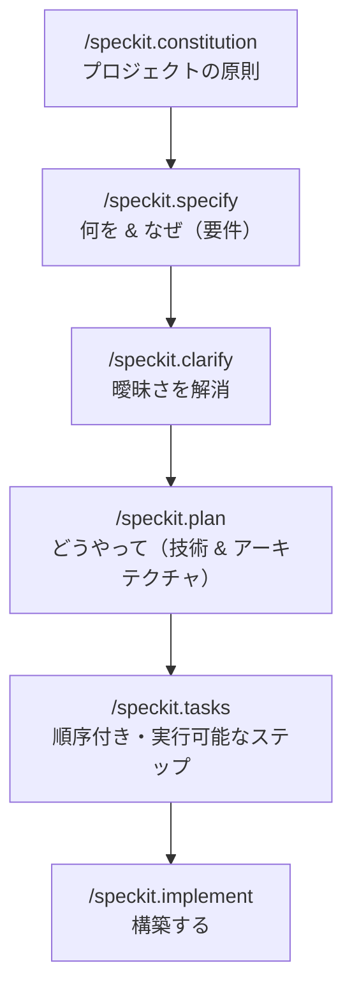

<LevelBadge level="intermediate" />

# Spec Kit によるスペック駆動開発

バイブコーディング — 「ダッシュボードを作って」と頼み、返ってきたものをそのまま受け入れる — は、機能が大きくなるまではうまく機能します。ところが機能が大きくなるとエージェントは脱線します。以前の決定を忘れたり、関数を作り直したり、技術的には動くけれど意図したものではないものを出してきたりします。**スペック駆動開発（SDD: Spec-Driven Development）** は、2026年にエージェント型コーディング界隈で広く支持されるようになった、その解決策です。プロンプトを使い捨てとして扱う代わりに、**書かれてレビュー可能な仕様を信頼できる唯一の情報源**にし、エージェントにそこ*から*コードを生成させるのです。

GitHub のオープンソース **[Spec Kit](https://github.com/github/spec-kit)** は、その考え方を、今日 Claude Code の中で実行できる具体的なワークフローに落とし込みます。

<Callout type="objectives" items={["スペック駆動開発とは何か、そしてそれが解決する問題を理解する", "Spec Kit のフェーズを辿る: constitution → specify → plan → tasks → implement", "Specify CLI をインストールし、Claude Code に組み込む", "任意のクオリティゲート（clarify、analyze、checklist）を知る", "SDD がそのオーバーヘッドに見合うときと、省くべきときを判断する"]} />

<VerifyNote lastVerified="2026-06-28" source="https://github.com/github/spec-kit">
Spec Kit は急速に進化しています（約116k★、MIT ライセンス）。コマンド名、`specify init` のエージェント選択フラグ、サポートされるツールはリリースごとに変わります — 正確な構文に頼る前に、リポジトリの README で現在のクイックスタートを確認してください。以下のスラッシュコマンド名は、最近のリリースで導入された `/speckit.*` 名前空間を使っています。
</VerifyNote>

## なぜ単なるプロンプトではなくスペックなのか

プロンプトはターンが終わった瞬間に消えてしまいます。**スペックはアーティファクトです**。読むことができ、PR でレビューでき、修正でき、再実行できます。このたった一つの転換が、大きなエージェント型ビルドが失敗する三つの原因を解消します。

- **ドリフト** — 何も書き留められていないため、エージェントが以前の決定と矛盾すること。スペックがその記憶になります。
- **曖昧さ** — 「いい感じにして」は十通りに解釈できます。要件を散文に落とし込むことを強制すると、コードが存在する*前*に — つまり修正が安価なうちに — ギャップが表面化します。
- **レビュー不能な差分** — 2,000行の生成された PR は判断が困難です。レビュー済みのスペック＋プランは、その差分を意外なものではなく*想定されたもの*にします。

メンタルモデルはこうです。**意図こそが価値が高く、長続きするものであり、コードはその下流にある、再生成可能なアーティファクトである。** SDD は、Claude Code 自身の [Plan Mode](/docs/claude-code/plan-mode) の規律ある親戚です — まず計画し、次に構築する — それを機能全体にスケールアップし、リポジトリ内のファイルとして永続化したものです。

## Spec Kit のワークフロー

Spec Kit は、機能をスラッシュコマンドの短いパイプラインとして構造化します。各コマンドは Markdown のアーティファクトをリポジトリ（`.specify/` 配下）に書き込むので、すべてのフェーズが検査可能でバージョン管理されます。

<Steps items={[{title: "Constitution", body: "プロジェクトごとに一度 /speckit.constitution を実行します。これは統治となる原則 — コードスタイル、テストの基準、譲れないアーキテクチャ上の決まり — を .specify/memory/constitution.md に書き込みます。以降のすべてのフェーズはこれと照合されるので、これがあなたの長続きするガードレールになります（原則に特化した CLAUDE.md だと考えてください）。"}, {title: "Specify", body: "/speckit.specify を実行し、何を構築するのか、そしてなぜ構築するのかを説明します — ユーザーストーリー、要件、成功基準です。技術スタックは意図的に含めません。エージェントは構造化されたスペックを生成し、あなたは先に進む前にそれを読んで修正します。"}, {title: "Plan", body: "技術的な選択 — フレームワーク、データストア、制約 — とともに /speckit.plan を実行します。ここでようやく「どうやって」が書かれます。アーキテクチャ、コンポーネント、そしてそれらがどうスペックを満たすかです。技術的な決定はスペックではなくここに置かれるので、スペックは実装に依存しないままになります。"}, {title: "Tasks", body: "/speckit.tasks を実行して、プランを番号付きで順序付けられた、個別にレビュー可能な小さなステップのリストに分解します。これがビルドを監査可能にするものです — どんなコードが書かれる前にも、その順序を見ることができます。"}, {title: "Implement", body: "/speckit.implement を実行すると、エージェントがタスクリストを実行し、プランと constitution に沿って機能を構築します。前段の各フェーズがレビュー済みなので、結果として得られる差分は意外なものではなく、想定されたものになります。"}]} />

### 任意のクオリティゲート

機能が重要度の高いものであるときは、さらに三つのコマンドがループを引き締めます。

- **`/speckit.clarify`** — スペックを精査して仕様が不十分な箇所を見つけ、計画の*前*に的を絞った質問をします。`specify` の直後に実行するのが最適です。
- **`/speckit.analyze`** — スペック、プラン、タスクを相互チェックし、一貫性とカバレッジのギャップを確認します。
- **`/speckit.checklist`** — 検証用のチェックリストを生成し、「完了」が定義され、テスト可能になるようにします。

<Callout type="tip" items={["/speckit.plan の前に /speckit.clarify を実行する — 曖昧さを直すのは、アーキテクチャが確定する前が最も安価です。", "生成された各アーティファクトを PR のように扱う: 読み、修正し、そうしてから次のフェーズに進む。", ".specify/ のアーティファクトをコミットする — それらはコードの背後にある意図のレビュー可能な記録です。"]} />

## Claude Code で動かす

Spec Kit は **Specify** という CLI を提供しており、これがスラッシュコマンドをプロジェクトに足場として組み込みます。30以上のコーディングエージェントをサポートしており、Claude Code もその一つです。

<Steps items={[{title: "Specify CLI をインストールする", body: "uv を使ってリポジトリからインストールします。（Python + uv が必要です。）"}, {title: "プロジェクトを初期化する", body: ".specify/ 構造とエージェントコマンドを足場として組み込みます。新規または既存のリポジトリで init を実行し、プロンプトが出たらエージェントとして Claude Code を選びます（または README にある現在の統合フラグを渡します）。"}, {title: "Claude Code を開いてコマンドを確認する", body: "プロジェクトフォルダで claude を起動します。/speckit.constitution、/speckit.specify、/speckit.plan、/speckit.tasks、/speckit.implement がスラッシュコマンドとして現れれば、組み込まれていることがわかります。"}]} />

<PromptCard title="Install the Specify CLI (uv)">{`uv tool install specify-cli --from git+https://github.com/github/spec-kit.git`}</PromptCard>

<PromptCard title="Scaffold spec-driven workflow into a project">{`# new project
specify init my-feature

# or in the current repo
specify init --here`}</PromptCard>

<PromptCard title="Then, inside Claude Code, run the pipeline">{`/speckit.constitution Establish principles: TypeScript strict, tests for every public function, no secrets in code.
/speckit.specify Build a CSV export for the reports page: users pick a date range and download a CSV of matching rows.
/speckit.clarify
/speckit.plan Next.js App Router, server action for the query, stream the CSV; no new dependencies.
/speckit.tasks
/speckit.implement`}</PromptCard>

<Callout type="warning" items={["specify init の正確なエージェント選択フラグはリリースごとに変わります — フラグを盲目的にコピーするのではなく、README のクイックスタートを確認してください。", "SDD は検証の必要をなくしません: 生成されたコードを読み、実行してください。スペックは差分をレビュー可能にするのであって、自動的に正しくするわけではありません。", "シークレットや認証情報をスペック、プラン、constitution に決して入れないでください — それらは他のファイルと同様にコミットされてしまいます。"]} />

## いつ使うべきか（そしていつ使わないか）

SDD は前もっての手間と引き換えにコントロールを得ます。その取引は、作業が大きい、曖昧、あるいは他の人にレビューされなければならないときには価値がありますが — そうでないときには純粋なオーバーヘッドです。

<Callout type="info" items={["SDD を使うべきとき: グリーンフィールドの機能、複数ファイルにまたがるビルド、チームメイトがレビューしなければならないもの、あるいはサブエージェント群に渡す作業。", "SDD を省くべきとき: 使い捨てのスクリプト、ごく小さな修正、探索的な使い捨てコード — 素のプロンプトや Plan Mode の方が速いです。", "ブラウンフィールドでも機能します: /speckit.specify を新規プロジェクトだけでなく、既存コードベースへの機能拡張に向けてください。"]} />

<Flashcards title="SDD at a glance" cards={[{front: "SDD における信頼できる唯一の情報源は何か?", back: "書かれた仕様。コードはその下流にある、再生成可能なアーティファクトです。"}, {front: "/speckit.constitution は何をするか?", back: "以降のすべてのフェーズが照合される、長続きするプロジェクトの原則（スタイル、テストの基準、アーキテクチャのルール）を書き込みます。"}, {front: "技術スタックの決定はどこに属するか?", back: "/speckit.plan の中です — スペックではありません。スペックは実装に依存しないまま（何を & なぜ）にしておき、プランが「どうやって」です。"}, {front: "Spec Kit のビルドを監査可能にするものは何か?", back: "/speckit.tasks がどんなコードが書かれる前にも順序付き・レビュー可能なタスクリストを生成し、各フェーズが検査可能な Markdown アーティファクトを書き込みます。"}, {front: "いつ SDD を使うべきでないか?", back: "使い捨てのスクリプト、ごく小さな修正、使い捨ての探索 — 手間が、それが節約するもの以上にかかります。"}]} />

## 理解度チェック

<Quiz title="Check yourself" questions={[{q: "スペック駆動開発の中核となる考え方は何か?", options: ["より詳細な使い捨てのプロンプトを書く", "レビュー可能な仕様を信頼できる唯一の情報源にし、そこからコードを生成する", "計画を飛ばしてエージェントに即興で任せる"], answer: 1, explain: "SDD は意図を長続きする価値の高いアーティファクトとして、コードを下流の再生成可能な出力として扱います — 使い捨てプロンプトのバイブコーディングの正反対です。"}, {q: "Spec Kit のどのフェーズが技術スタックとアーキテクチャを捉えるべきか?", options: ["/speckit.specify", "/speckit.plan", "/speckit.constitution"], answer: 1, explain: "specify は「何を」「なぜ」を説明し（実装に依存しない）、plan が「どうやって」 — フレームワーク、データストア、アーキテクチャ — を決める場所です。"}, {q: "スペック駆動開発がそのオーバーヘッドに見合わないのはいつか?", options: ["チームメイトがレビューしなければならない複数ファイルのグリーンフィールド機能", "使い捨ての一行スクリプトやごく小さな修正", "サブエージェントに渡すあらゆる作業"], answer: 1, explain: "SDD の前もっての手間は、大きく、曖昧で、レビューされる作業で報われます。些細な修正には、素のプロンプトや Plan Mode の方が速いです。"}]} />

<Callout type="takeaways" items={["スペック駆動開発は、プロンプトではなくレビュー可能なスペックを信頼できる唯一の情報源にし、ドリフト、曖昧さ、レビュー不能な差分を消し去ります。", "GitHub の Spec Kit（Specify CLI）は、SDD を /speckit.* スラッシュコマンドとして Claude Code に持ち込みます。", "パイプラインは constitution → specify → (clarify) → plan → (analyze) → tasks → (checklist) → implement で、それぞれが検査可能なアーティファクトを書き込みます。", "「何を」「なぜ」はスペックに、「どうやって」はプランに留める; 進む前にすべてのアーティファクトを PR のようにレビューする。", "大きく、曖昧で、レビューされる機能に使う; 使い捨ての作業には省く — そして常に、生成されたコードを必ず検証する。"]} />

## 次へ

- [Plan Mode](/docs/claude-code/plan-mode) — 組み込みの、より軽量な「構築する前に計画する」ループ
- [Slash Commands](/docs/claude-code/slash-commands) — /speckit.* コマンドが Claude Code のコマンドシステムにどう収まるか
- [CLAUDE.md & Memory Files](/docs/claude-code/claude-md) — constitution の背後にある「原則を記憶として」の考え方
- [Subagents](/docs/claude-code/subagents) — レビュー済みのタスクリストをエージェント群に渡す
- [Coding & Software Development](/docs/playbooks/coding) — SDD が依拠する、すべてを検証するという心構え

## 出典 & 参考資料

- [github/spec-kit — Toolkit for Spec-Driven Development](https://github.com/github/spec-kit) (MIT)
- [Spec Kit README & quickstart](https://github.com/github/spec-kit/blob/main/README.md)
- [Anthropic — Plan Mode in Claude Code](https://code.claude.com/docs/en/interactive-mode)
