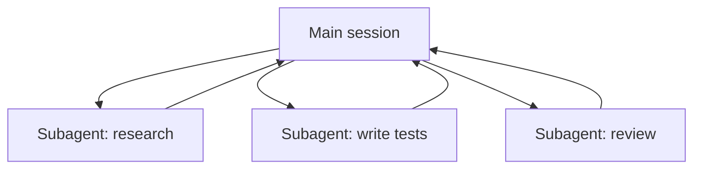

<LevelBadge level="advanced" />

<VerifyNote lastVerified="2026-06-23" source="https://code.claude.com/docs/en/sub-agents">
サブエージェントのフロントマターのフィールド、組み込みエージェントの一覧、`/agents` インターフェースは時とともに変わります。公式ドキュメントで確認してください。
</VerifyNote>

<Callout type="objectives" items={["サブエージェントとは何か — 独自のコンテキストウィンドウと範囲を絞ったツールセットを持つ別の Claude","委譲する 3 つの理由：コンテキストを守る、専門化する、並列化する","Claude がすでに委譲する組み込みエージェント：Explore、Plan、General-purpose","自分のサブエージェントを .claude/agents/ で定義する方法と、なぜ description と tools が 2 つの肝になるフィールドなのか","並列化すべきでないとき、そしてこれが API エージェントやフリート規模のワークフローとどうつながるか"]} />

**サブエージェント**は、**独自のコンテキストウィンドウ**と**範囲を絞ったツールセット**を持つ別の Claude インスタンスで、メインセッションが作業の一塊を委譲する相手です。トランスクリプト全体ではなく結果を報告するので、メインセッションは集中を保ち、散らかりません。

## なぜ委譲するか

3 つの仕事、1 つのツール。サブエージェントに手を伸ばすたびに、これらを念頭に置きましょう：

- **メインコンテキストを守る。** リサーチの深掘りや大きなファイルのスイープは数千トークンを消費しかねません。サブエージェントでそれを行えば、結論だけが返ってきます。
- **専門化する。** サブエージェントに、あつらえたシステムプロンプトと必要なツールだけ（例：読み取り専用のレビュアー）を与えます。
- **並列化する。** 独立したサブタスクを同時に実行します — 例：3 つのモジュールを同時に探索する。

## すでに持っている組み込み

自分のものを定義する前に、Claude Code には自動で委譲するサブエージェントが同梱されていることを知っておきましょう：

| 組み込み | 何をするか |
| --- | --- |
| **Explore** | 速い読み取り専用のエージェント（より安価なモデルで動作）。コードベースに触れずに検索・理解します。 |
| **Plan** | プランモード中にコンテキストを収集し、リサーチをメインの読み取り専用の会話の外に保ちます。 |
| **General-purpose** | 探索と変更が混ざる複雑で多段階の作業向けの、全ツールエージェント。 |

これらを名前で呼び出すことはまれです。タスクが合致すると Claude が手を伸ばします。カスタムサブエージェントは、*あなた*が同じ指示で何度も作り直すワーカーのためのものです。

## 自分のものを定義する

サブエージェントは YAML フロントマター付きの Markdown ファイルです（本文がそのシステムプロンプトになります）。必須は `name` と `description` だけで、それ以外はすべて任意です。プロジェクトごとに `.claude/agents/` に（git にチェックインしてチームで共有）、またはユーザーごとに `~/.claude/agents/` に保存します。`/agents` コマンドで、または手作業で作成します。

<Steps items={[{title: "場所を選ぶ", body: "プロジェクトごとに .claude/agents/（チームで共有するためにコミット）、またはユーザーごとに ~/.claude/agents/。"},{title: "ファイルを作成する", body: "/agents コマンドを使うか、YAML フロントマター付きの Markdown ファイルを手作業で書きます。"},{title: "必須フィールドを設定する", body: "必須は name と description だけ。それ以外はすべて任意です。"},{title: "本文をシステムプロンプトとして書く", body: "フロントマターの下の Markdown 本文が、サブエージェントのシステムプロンプトになります。"},{title: "ツールを絞る", body: "tools の許可リストを追加し、サブエージェントが仕事に必要なことだけをできるようにします。"}]} />

スターターの `code-reviewer` サブエージェント：

<PromptCard title="code-reviewer サブエージェント (.claude/agents/code-reviewer.md)">{`---
name: code-reviewer
description: Expert code reviewer. Use proactively after code changes.
tools: Read, Glob, Grep
model: sonnet
---

You are a senior reviewer. Read the changed files, then report only
high-confidence issues: correctness bugs, security risks, and missing
tests. For each, show the file:line, the problem, and a concrete fix.
Do not restate what the code does. Never edit files.`}</PromptCard>

サブエージェントを良くするのは 2 つのことです：

- **`description` がルーティングのシグナルです。** Claude はそれを読んで*いつ*委譲するかを決めるので、トリガーのように書きましょう — 「Use proactively after code changes」は自動で引き込み、曖昧な「helps with code」は引き込みません。これがファイル中で最も効果の大きい 1 行です。
- **ツールを厳しく絞る。** `tools` フィールドは許可リストです（または `disallowedTools` を拒否リストとして使う）。`Read, Glob, Grep` しかできないレビュアーは、誤ってコードを編集*できません* — この制限はヒントではなく保証です。`tools` を省くと、サブエージェントはメインセッションが持つすべてを継承します。

## 実例：並列レビューのファンアウト

3 つのモジュールに触れる機能を完成させ、それぞれを速く独立してチェックしたいとします。メインセッションで：

<PromptCard title="3 つのレビュアーを一度にファンアウトする">{`Review the changes in auth/, billing/, and api/ — use the code-reviewer subagent on each, in parallel.`}</PromptCard>

Claude は 3 つの `code-reviewer` インスタンスを一度に生成します。それぞれが自分のモジュールだけを読み、ファイル内容に自分のコンテキストを使い、短い指摘リストを返します。メインセッションは生の diff を見ることはなく、3 つのすっきりしたレポートだけを受け取ります — そして全体は、3 つの合計ではなく最も遅い 1 つのレビューとほぼ同じ時間で終わります。レビュアーは読み取り専用なので、3 つのエージェントが同時に動いても書き込みで衝突しません。

## 並列化すべきでないとき

<Callout type="warning" items={["依存するステップは順次実行すべきです — ステップ B がステップ A の出力を必要とする作業をファンアウトしないでください。","共有ファイルへの書き込みは衝突しかねません。隔離する（Git ワークツリー参照）か直列化してください。","小さなタスクでは調整のオーバーヘッドが利益を上回ることがあります。サブタスクが大きく独立しているときに委譲しましょう。"]} />

衝突する書き込みを隔離するには、[Git ワークツリー](/docs/claude-code/worktrees)を参照してください。

## サブエージェント vs API/SDK の「エージェント」

このページは Claude Code 組み込みの委譲についてです。*自分の*エージェントをプログラムで構築するのは [API でエージェントを構築する](/docs/api/building-agents) です。メンタルモデル — ゴール、ツールのループ、隔離されたコンテキスト — は同じです。

## よくある間違い

<Flashcards title="落とし穴 — 各カードをめくると修正法" cards={[{front: "曖昧な description", back: "サブエージェントを*いつ*使うかを言っていなければ、Claude は適切なタイミングで委譲しません（あるいはまったく委譲しません）。「Use when…」/「Use proactively after…」で始めましょう。"},{front: "ツールを開けっ放しにする", back: "レビュー向けのサブエージェントは書き込めるべきではありません。許可リストが意図を保証に変えます。"},{front: "共有メモリを期待する", back: "サブエージェントが得るのは、その description、システムプロンプト、そして渡したタスクであって、メインの会話ではありません。必要なコンテキストは委譲時に渡しましょう。"},{front: "依存する作業をファンアウトする", back: "並列化は独立したサブタスクにのみ役立ちます。B が A の出力を必要とするなら、順番に実行しましょう。"}]} />

## 数体のエージェントでは足りないとき

1 ターンあたり数体のサブエージェントを委譲するのが、このページの主役です。タスクが**数十・数百**のエージェントを必要とするとき — コードベース全体のスイープ、500 ファイルのマイグレーション、多数のソースで突き合わせるリサーチ — オーケストレーションは単一のコンテキストウィンドウを超えます。それが [動的ワークフローと ultracode](/docs/claude-code/dynamic-workflows) の出番です：Claude が計画を保持するスクリプトを書き、ランタイムがバックグラウンドでエージェントをファンアウトします。

<Quiz title="理解度チェック" questions={[{q: "サブエージェントのフロントマターのどのフィールドが、いつ委譲するかを Claude が読むルーティングのシグナルですか？", options: ["name", "description", "model"], answer: 1, explain: "description が最も効果の大きい 1 行です — Claude はそれを読んでいつ委譲するかを決めます。トリガーのように、例えば「Use proactively after code changes」と書きましょう。"}, {q: "レビュアーのサブエージェントに tools: Read, Glob, Grep が与えられています。その許可リストは何を保証しますか？", options: ["より安価なモデルで動く", "誤ってコードを編集できない", "メインセッションのツールを継承する"], answer: 1, explain: "tools フィールドは許可リストなので、Read, Glob, Grep に限定されたレビュアーは書き込めません — この制限はヒントではなく保証です。tools を省くと、代わりにすべてを継承します。"}, {q: "サブエージェントを並列化しても役立たないのはどんなときですか？", options: ["サブタスクが独立していて大きいとき", "ステップ B がステップ A の出力を必要とするとき", "各エージェントが別々のモジュールを読むとき"], answer: 1, explain: "依存するステップは順次実行しなければなりません。並列化は独立したサブタスクにのみ役立ちます。B が A の出力を必要とするなら、順番に実行しましょう。"}]} />

<Callout type="takeaways" items={["サブエージェントは、独自のコンテキストウィンドウと範囲を絞ったツールを持つ別の Claude。トランスクリプトではなく結果を返す。","メインコンテキストを守るため、専門化するため、あるいは独立した作業を並列化するために委譲する。","Claude はすでに Explore、Plan、General-purpose の組み込みを同梱し、自動でそれらに手を伸ばす。","必須のフロントマターは name と description だけ — そして description が、いつ Claude が委譲するかを決めるルーティングのシグナル。","tools の許可リストが意図を保証に変える。独立したサブタスクだけをファンアウトし、共有書き込みは隔離する。"]} />

## 次へ

- [動的ワークフローと ultracode](/docs/claude-code/dynamic-workflows) — フリート規模でサブエージェントをオーケストレーションする
- [マルチサブエージェントのワークフローを設計する（ウォークスルー）](/docs/walkthroughs/multi-subagent-workflow)
- [コンテキスト管理](/docs/claude-code/context-management)
- [Git ワークツリー](/docs/claude-code/worktrees)
