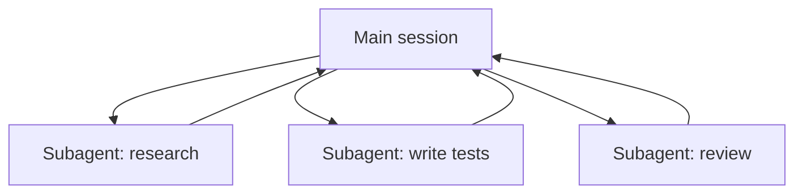

<LevelBadge level="advanced" />

<VerifyNote lastVerified="2026-06-20" source="https://code.claude.com/docs/en/sub-agents">
サブエージェントの設定や `/agents` インターフェースは時とともに変わります。公式ドキュメントで確認してください。
</VerifyNote>

**サブエージェント** は、**独自のコンテキストウィンドウ** と **範囲を絞ったツールのセット** を持つ、別個の Claude インスタンスです。メインセッションがそこに作業のひと塊を委譲します。サブエージェントは全トランスクリプトではなく結果を報告するので、メインセッションは集中したまま、ごちゃつきません。

## なぜ委譲するのか

- **メインのコンテキストを守る。** リサーチの深掘りや大きなファイルの一掃は数千トークンを消費しかねません。それをサブエージェントで行えば、結論だけが返ってきます。
- **専門化する。** サブエージェントに、調整したシステムプロンプトと、必要なツールだけ（例: 読み取り専用のレビュアー）を与えます。
- **並列化する。** 独立したサブタスクを同時に実行します — 例: 3 つのモジュールを同時に探索する。

## 定義の仕方

サブエージェントは、フロントマター（名前、説明、許可されたツール、ときにモデル）付きの Markdown ファイルとして設定され、`/agents` インターフェース経由で管理されます。`description` は、メインエージェントに *いつ* 委譲すべきかを伝えます。ツールは厳密に絞りましょう — レビュアーが書き込みアクセスを必要とすることはめったにありません。

## 並列化すべきでないとき

:::warning 並列はタダではない
- **依存するステップ** は順次でなければなりません — ステップ B がステップ A の出力を必要とする作業を、扇形に展開しないこと。
- **共有ファイルへの書き込み** は衝突しうる。隔離する（[Git ワークツリー](/docs/claude-code/worktrees) を参照）か、直列化しましょう。
- **調整のオーバーヘッド** が、小さなタスクでは利益を上回ることがあります。サブタスクが十分大きく、独立しているときに委譲しましょう。
:::

## サブエージェント vs API/SDK の「エージェント」

このページは、Claude Code に組み込まれた委譲についてです。*自分自身* のエージェントをプログラムで構築するのは [API でエージェントを構築する](/docs/api/building-agents) です。メンタルモデル — 目標、ツールループ、隔離されたコンテキスト — は同じです。

## 次に

- [複数サブエージェントのワークフローを設計する（ウォークスルー）](/docs/walkthroughs/multi-subagent-workflow)
- [コンテキスト管理](/docs/claude-code/context-management)
- [Git ワークツリー](/docs/claude-code/worktrees)
