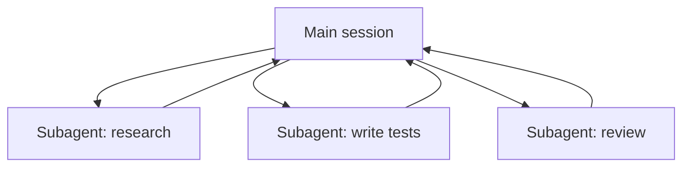

<LevelBadge level="advanced" />

<VerifyNote lastVerified="2026-06-23" source="https://code.claude.com/docs/en/sub-agents">
サブエージェントのフロントマターのフィールド、組み込みエージェントの一覧、そして `/agents` インターフェースは時間とともに変化します — 公式ドキュメントで確認してください。
</VerifyNote>

**サブエージェント**とは、**独自のコンテキストウィンドウ**と**範囲を絞ったツールセット**を持つ別の Claude インスタンスであり、メインセッションが作業の一部を委譲する先です。サブエージェントは全トランスクリプトではなく結果だけを報告するため、メインセッションは焦点を保ち、雑然としません。

## なぜ委譲するのか

- **メインのコンテキストを守る。** リサーチの深掘りや大きなファイルの一掃は数千トークンを消費しかねません。それをサブエージェントで行えば、結論だけが返ってきます。
- **専門化する。** サブエージェントに、調整したシステムプロンプトと、必要なツールだけ（例: 読み取り専用のレビュアー）を与えます。
- **並列化する。** 独立したサブタスクを同時に実行します — 例: 3 つのモジュールを同時に探索する。



## すでに手元にある組み込みエージェント

独自のものを定義する前に、Claude Code には自動的に委譲する組み込みのサブエージェントが付属していることを知っておきましょう:

- **Explore** — コードベースを検索・理解するための、高速で読み取り専用のエージェント（より安価なモデルで動作）。コードには手を触れません。
- **Plan** — プランモード中にコンテキストを収集し、調査がメインの読み取り専用の会話から外れるようにします。
- **General-purpose** — 探索と変更が混在する、複雑で多段階の作業のためのフルツールのエージェント。

これらを名前で呼び出すことはめったにありません。タスクが適合すれば Claude が自ら手を伸ばします。カスタムのサブエージェントは、*あなた*が同じ指示で繰り返し作り直しているワーカーのためのものです。

## 独自のサブエージェントを定義する

サブエージェントは YAML フロントマターを持つ Markdown ファイルです（本文がそのシステムプロンプトになります）。必須なのは `name` と `description` だけで、それ以外はすべて任意です。プロジェクトごとに `.claude/agents/` に保存する（git にチェックインしてチームで共有する）か、ユーザーごとに `~/.claude/agents/` に保存します。`/agents` コマンドで作成するか、手作業で作成します:

```markdown
---
name: code-reviewer
description: Expert code reviewer. Use proactively after code changes.
tools: Read, Glob, Grep
model: sonnet
---

You are a senior reviewer. Read the changed files, then report only
high-confidence issues: correctness bugs, security risks, and missing
tests. For each, show the file:line, the problem, and a concrete fix.
Do not restate what the code does. Never edit files.
```

サブエージェントを優れたものにするのは 2 つの点です:

- **`description` がルーティングのシグナルになる。** Claude はそれを読んで*いつ*委譲するかを判断するので、トリガーのように書きましょう — 「Use proactively after code changes」と書けば自動的に呼び出されますが、漠然とした「helps with code」では呼び出されません。これはファイルの中で最もレバレッジの高い 1 行です。
- **ツールの範囲をきつく絞る。** `tools` フィールドは許可リストです（または `disallowedTools` を拒否リストとして使います）。`Read, Glob, Grep` しかできないレビュアーは、誤ってあなたのコードを編集することは*できません* — この制限はヒントではなく保証です。`tools` を省略すると、サブエージェントはメインセッションが持つすべてを継承します。

## 実例: 並列レビューのファンアウト

3 つのモジュールにまたがる機能を仕上げ、それぞれを高速かつ独立してチェックしたいとします。メインセッションで:

> 「`auth/`、`billing/`、`api/` の変更をレビューして — それぞれに code-reviewer サブエージェントを並列で使って。」

Claude は `code-reviewer` インスタンスを 3 つ同時に起動します。各インスタンスは自分のモジュールだけを読み、ファイルの内容に自身のコンテキストを消費し、短い指摘リストを返します。メインセッションが生の差分を見ることは決してなく、整理された 3 つのレポートだけを受け取ります — そして全体は、3 つすべての合計ではなく、最も遅い 1 つのレビューインスタンスとおおよそ同じ時間で完了します。レビュアーは読み取り専用なので、同時に動く 3 つのエージェントが書き込みで衝突することはありません。

## 並列化すべきでないとき

:::warning 並列はタダではない
- **依存するステップ**は順次でなければなりません — ステップ B がステップ A の出力を必要とする作業を、扇形に展開しないこと。
- **共有ファイルへの書き込み**は衝突しうる。隔離する（[Git ワークツリー](/docs/claude-code/worktrees) を参照）か、直列化しましょう。
- **調整のオーバーヘッド**が、小さなタスクでは利益を上回ることがあります。サブタスクが十分大きく、独立しているときに委譲しましょう。
:::

## サブエージェント vs API/SDK の「エージェント」

このページは、Claude Code に組み込まれた委譲についてです。*自分自身*のエージェントをプログラムで構築するのは [API でエージェントを構築する](/docs/api/building-agents) です。メンタルモデル — 目標、ツールループ、隔離されたコンテキスト — は同じです。

## よくある間違い

- **漠然とした `description`。** *いつ*サブエージェントを使うかを書いていなければ、Claude は適切なタイミングで委譲しません（あるいはまったく委譲しません）。「Use when…」/「Use proactively after…」で始めましょう。
- **ツールを開けっ放しにする。** レビュー用のサブエージェントは書き込みができるべきではありません。許可リストは意図を保証に変えます。
- **共有メモリを期待する。** サブエージェントが受け取るのは、その `description`、システムプロンプト、そしてあなたが渡したタスクだけ — メインの会話ではありません。必要なコンテキストは委譲時に渡してください。
- **依存する作業をファンアウトする。** 並列性は*独立した*サブタスクにしか役立ちません。B が A の出力を必要とするなら、順次で実行してください。

## 次に

- [複数サブエージェントのワークフローを設計する（ウォークスルー）](/docs/walkthroughs/multi-subagent-workflow)
- [コンテキスト管理](/docs/claude-code/context-management)
- [Git ワークツリー](/docs/claude-code/worktrees)
