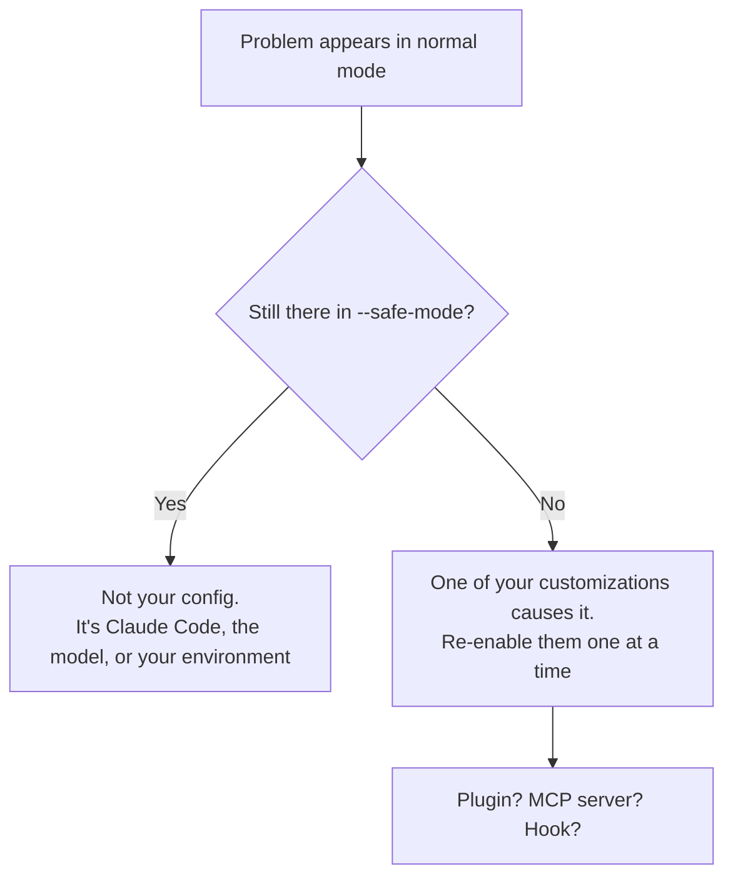

<LevelBadge level="intermediate" />

<Callout type="objectives" items={["症状の表を使って、Claude Codeのあらゆる問題をワンステップで対処法にたどり着かせる", "手作業でデバッグを始める前に、たいていのセットアップ問題を解決する2つの診断コマンドを実行する", "プラグイン、MCPサーバー、フックのどれが真の原因かを切り分ける", "典型的な4つのランタイム障害を直す: メモリ肥大、ハング、コンパクションのスラッシング、検索が何も見つけない", "バグ報告を出す前に、適切な証拠を集める"]} />

<VerifyNote lastVerified="2026-07-17" source="https://code.claude.com/docs/en/troubleshooting">
このページのコマンド、フラグ、環境変数は、公式のClaude Codeトラブルシューティングドキュメントと照合して検証済みです。診断機能はリリースごとに変わります — 正確なフラグに頼る前に、公式ドキュメントで確認してください。
</VerifyNote>

## 大きな考え方

Claude Codeの問題はほぼすべて2種類のどちらかであり、その対処法はまったく異なります:

- **セットアップが間違っている** — プラグイン、MCPサーバー、フック、設定ファイル、足りないバイナリ。対処法は*設定*です。
- **セッションに負荷がかかっている** — コンテキストウィンドウが一杯、巨大なファイルがメモリを膨れ上がらせた、ターミナルが描画できない。対処法は*衛生管理*です。

どちらなのかを当てずっぽうで探るのが、人が午後をまるごと失うポイントです。下の表は、その当てずっぽうを省きます。

:::tip 別の種類の「おかしさ」ですか？
このページは**ツール**の不具合についてです — 起動しない、ハングする、検索が何も見つけない。**モデル**の挙動がおかしい場合 — 事実をでっち上げた、指示を忘れた、まっとうな依頼を拒否した — それは別のページです: [Claudeはなぜそうしたのか？](/docs/contribute/troubleshooting)
:::

## ここから始める: 症状 → 行き先

自分の症状を見つけてください。このページの残りは読まなくて構いません。

| 症状 | 行き先 |
|---|---|
| `command not found`、インストール失敗、`EACCES`、PATH や TLS のエラー | [公式: インストールとログイン](https://code.claude.com/docs/en/troubleshoot-install) |
| ログインのループ、OAuthエラー、`403 Forbidden`、「organization disabled」 | [公式: ログインと認証](https://code.claude.com/docs/en/troubleshoot-install#login-and-authentication) |
| 設定が反映されない、フックが発火しない、MCPサーバーが読み込まれない | 下の[設定を切り分ける](#設定を切り分ける) |
| `API Error: 5xx`、`529 Overloaded`、`429`、バリデーションエラー | [エラーとレート制限](/docs/api/errors-and-rate-limits) |
| `model not found` / 「アクセス権がない可能性があります」 | [最新のモデルと料金](/docs/whats-new/models-and-pricing) |
| VS Code や JetBrains が Claude を検出しない | [IDE統合](/docs/claude-code/ide-integrations) |
| CPU やメモリの使用率が高い | 下の[メモリとCPU](#メモリとcpu) |
| ハング、フリーズ、無反応 | 下の[ハングとフリーズ](#ハングとフリーズ) |
| `Autocompact is thrashing` | 下の[コンパクションのスラッシング](#コンパクションのスラッシング) |
| 検索、`@file`、エージェント、Skillがファイルを見つけられない | 下の[検索が何も見つけない](#検索が何も見つけない) |
| IDEのターミナルで四角、にじみ、誤ったグリフが出る | 下の[ターミナルの文字化け](#ターミナルの文字化け) |

## まず実行すべき2つのコマンド

手作業でデバッグを始める前に、組み込みの健康診断を実行しましょう。インストール、設定、拡張機能、コンテキスト使用量を診断し、確認のうえ適用できる修正を提案してくれます。

<Steps items={[{title: "セッション内から健康診断を実行する", body: "/doctor（エイリアスは /checkup）は、インストール、設定、拡張機能、コンテキスト使用量を検査し、適用できる修正を提案します。これだけで、セットアップに関する不満のほとんどは解決します。"}, {title: "Claude Codeがそもそも起動しないなら、シェルから実行する", body: "claude doctor はセッションの外から同じ健康診断を行うため、壊れた設定が、それを診断するはずのツールを妨げることがありません。"}, {title: "問題がツールやコネクタ絡みに見えるなら、MCPを個別に確認する", body: "/mcp は設定済みの全MCPサーバーのライブステータスを表示します — サーバーが誤動作したのではなく読み込みに失敗したのかを見分ける最速の方法です。"}]} />

<PromptCard title="壊れたセットアップを診断する">{`# inside a session
/doctor

# if the session won't start at all
claude doctor

# check MCP server status
/mcp`}</PromptCard>

## 設定を切り分ける

設定が反映されない、フックが発火しない、あるいは単に何かが*おかしい*とき、問うべきは「何が壊れているか」ではありません — **自分のカスタマイズのどれが壊れているか**です。それは、すべてを一度に取り除くことで答えられます。

`--safe-mode` は、あらゆるカスタマイズを無効にしてClaude Codeを起動します: プラグインなし、MCPサーバーなし、フックなし。

<PromptCard title="クリーンな設定で試す">{`claude --safe-mode`}</PromptCard>

これにより、きれいな二択の結果が得られます:



カスタマイズが原因だと分かったら、二分探索しましょう: 問題が再発するまで、グループ単位で再有効化していきます。犯人になりやすい順に並べると、[MCPサーバー](/docs/claude-code/mcp)、[フック](/docs/claude-code/hooks)、[プラグイン](/docs/claude-code/plugins-marketplaces)、[設定](/docs/claude-code/settings)です。

<Callout type="tip" items={["--safe-mode は、あからさまな故障だけでなく、原因不明の遅さに対しても正しい第一手です。おしゃべりなMCPサーバーは、その両方の非常によくある原因です。"]} />

## メモリとCPU

Claude Codeはたいていの環境で動作しますが、大規模なコードベースでは相応のリソースを消費することがあります。安いものから順に並べてあるので、上から順に試してください。

<Steps items={[{title: "定期的にコンパクトする", body: "/compact を実行してコンテキストを縮小します。コンテキストウィンドウの肥大は、セッションが重くなる最大の原因です。/docs/claude-code/context-management を参照してください。"}, {title: "大きなタスクの合間に再起動する", body: "1つのプロセスに午後いっぱいの状態を溜め込ませるのではなく、無関係な作業に切り替えるときはClaude Codeを閉じて起動し直しましょう。"}, {title: "大きなビルドディレクトリを隠す", body: "ビルド成果物、キャッシュ、ベンダー依存物を .gitignore に追加し、そもそも検索や読み込みの対象に入らないようにします。"}, {title: "自分のカスタマイズを除外する", body: "claude --safe-mode で起動し直します。使用量が下がれば、プラグイン、MCPサーバー、フックが原因です — そこから二分探索しましょう。"}, {title: "それでもメモリが多いなら、証拠を取る", body: "/heapdump を実行すると、JavaScriptヒープのスナップショットとメモリの内訳が ~/Desktop（Desktopフォルダのない Linux ではホームディレクトリ）に書き出されます。"}]} />

`/heapdump` の内訳は、レジデントセットサイズ、JSヒープ、array buffer、および計上されていないネイティブメモリを報告します。この内訳こそが有用な部分です: メモリの増加がJavaScriptオブジェクトにあるのか、それともネイティブコード側にあるのかが分かります。何がメモリを保持し続けているかを調べるには、`.heapsnapshot` ファイルを Chrome DevTools の **Memory → Load** で開いてください。

<VerifyNote lastVerified="2026-07-17" source="https://code.claude.com/docs/en/troubleshooting">
`/heapdump` は `~/Desktop` に書き出し、Desktopフォルダのない Linux システムではホームディレクトリにフォールバックします。メモリ問題を報告するときは両方のファイルを添付してください。
</VerifyNote>

## ハングとフリーズ

Claude Codeが応答しなくなったら:

<Steps items={[{title: "現在の操作をキャンセルする", body: "Ctrl+C を押します。セッションを終了させずに、実行中の処理を中断します。"}, {title: "それでも無反応なら、ターミナルを終了させる", body: "ターミナルを閉じて起動し直します。破壊的に感じますが、そうではありません。"}, {title: "続きから再開する", body: "同じディレクトリで claude --resume を実行します。再起動しても会話は失われません — トランスクリプトはプロセスより長く残ります。"}]} />

<Callout type="tip" items={["長い会話を失うのが怖いからこそ、人はハングを終了させずに耐えてしまいます。その必要はありません — 同じディレクトリで claude --resume を実行すればセッションは戻ってきます。"]} />

## コンパクションのスラッシング

このエラーは不穏に見えますが、実際には*保護*です:

```
Autocompact is thrashing: the context refilled to the limit...
```

これは、自動コンパクションが**成功した**ことを意味します — そのうえで、ファイルやツールの出力が即座にコンテキストウィンドウ全体を埋め直す、という事態が数回続いたのです。Claude Codeは、前進していないループでAPI呼び出しを浪費するより、リトライをやめます。

原因はほぼ常に、大きすぎる何かを丸ごと読み込んでいることです。自分の状況に合う対処法を選んでください:

| 状況 | 対処法 |
|---|---|
| 巨大なファイル1つが問題 | ファイル全体ではなく、行範囲や単一の関数を読むようClaudeに頼む |
| もう不要な大きな出力がコンテキストにある | それを捨てるフォーカスを付けて `/compact` |
| その大きな読み込みが本当に必要 | [サブエージェント](/docs/claude-code/subagents)に移し、別のコンテキストウィンドウを消費させる |
| それまでの会話がもう重要でない | `/clear` |

<PromptCard title="肥大を捨てるフォーカス付きでコンパクトする">{`/compact keep only the plan and the diff`}</PromptCard>

サブエージェントという選択肢は忘れられがちですが、多くの場合これが最善です: サブエージェントは*自分の*コンテキストで巨大なファイルを読み、結論だけをあなたのコンテキストに返します。[コンテキスト管理](/docs/claude-code/context-management)と[サブエージェント](/docs/claude-code/subagents)を参照してください。

## 検索が何も見つけない

Searchツール、`@file` メンション、カスタムエージェント、カスタムSkillが、存在すると分かっているファイルを見つけられない場合、同梱の `ripgrep` バイナリがあなたのシステムで実行できていない可能性が高いです。対処法は、プラットフォーム純正の `ripgrep` をインストールし、それを使うようClaude Codeに伝えることです。

<Steps items={[{title: "自分のプラットフォーム向けに ripgrep をインストールする", body: "macOS: brew install ripgrep — Ubuntu/Debian: sudo apt install ripgrep — Alpine: apk add ripgrep — Arch: pacman -S ripgrep — Windows: winget install BurntSushi.ripgrep.MSVC"}, {title: "同梱バイナリの使用をやめるようClaude Codeに伝える", body: "環境に USE_BUILTIN_RIPGREP=0 を設定します。この手順を踏まないと、ripgrep をインストールしても何も変わりません。"}, {title: "検証する", body: "失敗していた検索や @file メンションをやり直します。それでも空振りなら /doctor を実行してください。"}]} />

<PromptCard title="macOSで検索を直す">{`brew install ripgrep
export USE_BUILTIN_RIPGREP=0`}</PromptCard>

### WSLという例外

WSLでは、検索結果が不完全なのはたいてい壊れたバイナリのせいでは**ありません**。Windows/Linux間のファイルシステム境界をまたぐ読み込みにはディスク性能上のペナルティがあるため、検索は期待より少ない件数を返します。検索は動いてはいます — ただ、取りこぼすのです。

<Callout type="warning" items={["WSLでは、結果が不完全であっても claude doctor は Search を OK と報告します。診断が緑でも、この可能性は排除できません — まさにそれが、この問題の診断を難しくしています。"]} />

抜け出す方法は3つ、良い順に: プロジェクトを `/mnt/c/` ではなく Linux のファイルシステム（`/home/`）へ移す。WSL経由ではなく Windows でネイティブに Claude Code を動かす。あるいは検索対象のファイルが減るよう検索を絞り込む — 「auth のコードを探して」より「auth-service パッケージ内の JWT 検証ロジックを検索して」の方が優れています。

## ターミナルの文字化け

VS Code、Cursor、Devin Desktop の統合ターミナル内で、文字が四角、にじみ、誤ったグリフとして描画されるのは、**GPUレンダラー**の問題であり、フォントやエンコーディングの問題ではありません。

<PromptCard title="IDEターミナルのグリフ化けを直す">{`/terminal-setup`}</PromptCard>

これは `terminal.integrated.gpuAcceleration` を `"off"` に設定します。エディタの設定で手動で設定し、ウィンドウを再読み込みしても構いません — 結果は同じです。

## 大きな表が途中で切れる

200行を超えるMarkdownの表は、最初の200行を描画し、続けて `… N more rows not shown` という行を表示します。これは**表示上の上限のみ**です — 表の全体は会話の中に残っており、`/copy` はすべての行をコピーします。ターミナルで読むには大きすぎる表なら、ファイルに書き出すようClaudeに頼みましょう。

<VerifyNote lastVerified="2026-07-17" source="https://code.claude.com/docs/en/troubleshooting">
200行の表示上限は Claude Code v2.1.208 で導入されました。それ以前は全行が描画されていたため、非常に大きな表を含むセッションを再開すると、再描画中に停止することがありました。
</VerifyNote>

## 良いバグ報告を出す

ここに当てはまるものが何もなければ報告してください — ただし証拠を携えて。「遅いです」という報告はどこにも行き着きませんが、ヒープスナップショットと `--safe-mode` の結果が付いた報告は修正されます。

<Steps items={[{title: "/doctor と /mcp を実行する", body: "健康診断の内容と、実際に読み込まれているMCPサーバーを記録します。報告されるバグの半分はここで答えが出ます。"}, {title: "--safe-mode で何か変わるかを記録する", body: "この1つの事実が、メンテナにClaude Code側を見るべきか、あなたのカスタマイズ側を見るべきかを伝えます。報告の中で最も価値のある一行です。"}, {title: "リソース問題では成果物を添付する", body: "メモリの問題では、/heapdump が書き出した両方のファイル — スナップショットと内訳 — を添付してください。"}, {title: "送る", body: "Claude Code内で /feedback を使ってAnthropicに直接報告するか、まず github.com/anthropics/claude-code で既知の問題を確認しましょう。"}]} />

<Callout type="takeaways" items={["まず /doctor（エイリアス /checkup）を実行する — セッションが起動しないなら、シェルから claude doctor として実行します。インストール、設定、拡張機能、コンテキスト使用量を診断し、修正を適用できます。", "claude --safe-mode はすべてのカスタマイズを一度に無効化します。問題がそれを生き延びるかどうかは、集められる中で最も情報量の多い事実です。", "メモリ肥大: /compact、タスク間の再起動、ビルドディレクトリの .gitignore、次に --safe-mode、そして証拠として /heapdump。", "ハングは会話の喪失ではありません — Ctrl+C、次にターミナルを再起動、そして同じディレクトリで claude --resume。", "Autocompactのスラッシングは、大きすぎる読み込み1つがウィンドウを埋め直していることを意味します。分割して読む、フォーカス付きで /compact、あるいは読み込みをサブエージェントに委ねましょう。", "検索が何も見つけないのは、たいてい同梱の ripgrep が実行できないためです: プラットフォームの ripgrep をインストールし、かつ USE_BUILTIN_RIPGREP=0 を設定しましょう。WSLではファイルシステム境界のペナルティが原因で、しかも claude doctor は Search を OK と報告し続けます。"]} />

<Quiz title="理解度チェック" questions={[{q: "フックが発火せず、設定も無視されているようです。試すべき最も情報量の多いことは何ですか？", options: ["Claude Codeを再インストールする", "claude --safe-mode を実行し、問題がそれを生き延びるか確認する", "CLAUDE.md を削除する"], answer: 1, explain: "--safe-mode はすべてのカスタマイズを一度に無効化します。問題が消えるなら、プラグイン、MCPサーバー、フックのいずれかが原因であり、二分探索できます。生き延びるなら、あなたの設定は原因ではない — これも同じくらい有用な情報です。"}, {q: "Claude Codeがタスクの途中でハングし、Ctrl+C も効きません。ターミナルを閉じます。会話はどうなりますか？", options: ["失われる — だからハングは終了させずに耐えるべき", "残る — 同じディレクトリで claude --resume を実行する", "先に /compact を実行していた場合のみ保存されている"], answer: 1, explain: "再起動しても会話は失われません。同じディレクトリで claude --resume を実行すればセッションを拾い直せます。トランスクリプトを失う恐怖こそが、人が不必要にハングに耐えてしまう理由です。"}, {q: "「Autocompact is thrashing: the context refilled to the limit...」と表示されました。実際には何が起きたのですか？", options: ["コンパクションが失敗し、コンテキストが壊れた", "コンパクションは成功したが、ファイルやツールの出力が即座にウィンドウを数回続けて埋め直した", "プランのトークンを使い切った"], answer: 1, explain: "コンパクションは成功しました — そのうえで、大きすぎる何かが繰り返しコンテキストを埋め直したのです。Claude Codeは、前進していないループでAPI呼び出しを浪費しないようリトライをやめます。大きすぎる読み込みを直しましょう: 分割する、フォーカス付きで /compact、あるいはサブエージェントに移す。"}, {q: "@file メンションが何も見つけないので brew で ripgrep をインストールしましたが、検索はまだ壊れています。何を見落としましたか？", options: ["マシンを再起動する必要がある", "同梱バイナリではなく自分のバイナリを使うよう、USE_BUILTIN_RIPGREP=0 も設定しなければならない", "brew は誤ったバージョンを入れる — apt を使うべき"], answer: 1, explain: "ripgrep をインストールしただけでは何も変わりません。実行できなかった同梱バイナリではなく、プラットフォームのバイナリを使うよう、環境に USE_BUILTIN_RIPGREP=0 を設定する必要があります。"}, {q: "WSLで、検索が期待より少ない件数しか返さないのに claude doctor は Search を OK と報告します。何が起きていますか？", options: ["doctor が嘘をついている — ripgrep バイナリが壊れている", "Windows/Linux間のファイルシステム境界をまたぐ読み込みにディスクのペナルティがあり、機能はしつつも取りこぼしている", "プロジェクトが大きすぎてインデックスできない"], answer: 1, explain: "WSLでは、ファイルシステムをまたぐ読み込みのペナルティにより、検索はネイティブのファイルシステムより少ない結果を返します。機能自体はしているので doctor は Search を OK と報告し、それが発見を難しくします。プロジェクトを /home/ に移す、Windowsでネイティブに動かす、あるいはより絞り込んだ検索を投げましょう。"}]} />

## 次へ

- [Claudeはなぜそうしたのか？](/docs/contribute/troubleshooting) — ツールではなく*モデル*の挙動のトラブルシューティング
- [コンテキスト管理](/docs/claude-code/context-management) — `/compact` と `/clear`、そしてセッションを軽く保つこと
- [エラーとレート制限](/docs/api/errors-and-rate-limits) — `429`、`529`、そしてAPIでのリトライ戦略
- [MCPのトークンコスト](/docs/claude-code/mcp-token-cost) — 接続したサーバーが静かに問題を起こしているとき
