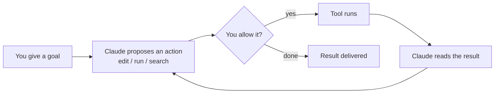

<LevelBadge level="beginner" />

<VerifyNote lastVerified="2026-06-20" source="https://code.claude.com/docs/en/overview">
インストールコマンドと正確な機能セットは頻繁に変わります。セットアップについては公式の Claude Code ドキュメントを真実の源として扱ってください。
</VerifyNote>

<Callout type="objectives" items={["Claude Code を単なるチャットウィンドウではなくエージェント型にしているものを説明する", "エージェントループを思い描く：ゴール、アクション、権限、観察、繰り返し", "Claude Code が動く場面と、設定がどう一緒について回るかを挙げる", "設定する事柄を効果の大きさ順に並べる、まず CLAUDE.md から", "プランモードを使った安全な最初のセッションの流れを一通りたどる"]} />

**Claude Code** は Anthropic の*エージェント型*コーディングツールです。チャットウィンドウと違い、**プロジェクトの中で実際に物事を行えます**：ファイルの読み取りと編集、シェルコマンドの実行、コードベースの検索、外部ツールの呼び出し — すべてあなたの許可のもとで。

## メンタルモデル：エージェントループ

これが他のすべてを腑に落ちさせる、たった 1 つの考え方です。平易な言葉で目的を与えます（「auth モジュールにテストを追加して、落ちたものを直して」）。Claude は**計画し、行動し、結果を観察し、繰り返し**ます、ゴールが達成されるまで。あなたは[権限](/docs/claude-code)と[プランモード](/docs/claude-code)を通じて主導権を保ちます。

<Callout type="tip" items={["ループはあなたが許可したアクションでのみ前に進みます。その権限ゲートを通らずに編集も実行も起きません — だからこそ次のセクションが重要なのです。"]} />

## どこで実行できるか

同じ Claude Code が場面を超えてあなたについて回ります — どこで作業しても**設定、フック、権限を共有**します。

- **ターミナル（CLI）** — 元々の場面。どんなシェルでも動きます。
- **IDE 拡張機能** — VS Code と JetBrains、インライン diff 付き。
- **デスクトップと Web** — そして場面を超えて設定、フック、権限を共有します。

## 設定する事柄（おおよその効果順）

これを梯子だと考えてください：まず上の段を習得し、本当に必要が生じたときにだけパワー機能を重ねます。

<Steps items={[{title: "CLAUDE.md", body: "永続的なプロジェクト指示。最高の効果、最小の労力 — ここから始めます。"}, {title: "プランモード", body: "編集が実行される前に調査して提案します。"}, {title: "権限", body: "Claude が確認なしで何をしてよいかを決めます。"}, {title: "settings.json", body: "すべての土台となる完全な設定システム。"}, {title: "パワー機能", body: "スラッシュコマンド、フック、スキル、サブエージェント、MCP サーバー — 必要に応じて重ねます。"}]} />

各段はそれぞれのレッスンにリンクします：[CLAUDE.md](/docs/claude-code)、[プランモード](/docs/claude-code)、[権限](/docs/claude-code)、[settings.json](/docs/claude-code)、[スラッシュコマンド](/docs/claude-code)、[フック](/docs/claude-code)、[スキル](/docs/claude-code)、[サブエージェント](/docs/claude-code)、[MCP サーバー](/docs/claude-code)。

## 最初のセッション（その流れ）

<Steps items={[{title: "インストールして認証する", body: "現在のコマンドは公式ドキュメントを参照してください。"}, {title: "プロジェクトを開く", body: "プロジェクトに cd して Claude Code を起動します。"}, {title: "スターターの CLAUDE.md を生成する", body: "/init を実行してプロジェクト指示の足場を作ります。"}, {title: "小さく具体的なことを尋ねる", body: "試しに：このアプリでルーティングがどう動くか説明して。"}, {title: "まずプランモードで変更を加える", body: "提案された計画をレビューし、それから実行させます。"}]} />

その最初のセッションで覚えておく価値のある 2 つのコマンド：

<PromptCard title="プロジェクト指示の足場を作る">{`/init`}</PromptCard>

<PromptCard title="安全で読み取り専用の最初の質問">{`Explain how routing works in this app.`}</PromptCard>

現在のインストールと認証のコマンドについては、[公式ドキュメント](https://code.claude.com/docs/en/overview)を参照してください。

<Callout type="tip" items={["読み取り専用で始めましょう。最初の本格的なタスクではプランモードを使います — Claude はファイルに触れずに調査し、計画を見せます。信頼を築く最も安全な方法です。"]} />

## 主要用語をひと目で

<Flashcards title="Claude Code の語彙" cards={[{front: "エージェント型ツール", back: "プロジェクトの中でアクションを取るツール — ファイルの読み取り/編集、コマンドの実行、コードの検索、外部ツールの呼び出し — 単なるチャットウィンドウではない。"}, {front: "エージェントループ", back: "平易な言葉でゴールを与えると、Claude が計画し、行動し、結果を観察し、ゴールが達成されるまで繰り返す。"}, {front: "プランモード", back: "Claude が編集が実行される前に調査して計画を提案する — 最も安全な始め方。"}, {front: "CLAUDE.md", back: "永続的なプロジェクト指示。最高の効果、最小の労力。/init で生成される。"}, {front: "権限", back: "制御ゲート：Claude が先に確認せずに何をしてよいか。"}]} />

<Quiz title="理解度チェック" questions={[{q: "Claude Code がチャットウィンドウと違うのは何ですか？", options: ["より長い回答を書く", "あなたの許可のもと、プロジェクトの中でアクションを取れる — ファイルの編集、コマンドの実行、コードの検索", "ターミナルでしか動かない"], answer: 1, explain: "Claude Code はエージェント型です：プロジェクトの中で行動します（ファイルの読み取り/編集、シェルコマンドの実行、検索、ツールの呼び出し）、すべてあなたの許可のもとで。"}, {q: "エージェントループで、Claude がアクションを提案した直後に何が起きますか？", options: ["ツールが自動で実行される", "あなたがそれを許可するか決める", "結果が届けられる"], answer: 1, explain: "提案されたすべてのアクションは権限ゲートを通ります — あなたが許可したときだけツールが実行されます。"}, {q: "最小の労力で最高の効果があるセットアップ手順はどれですか？", options: ["MCP サーバー", "フック", "CLAUDE.md"], answer: 2, explain: "CLAUDE.md — 永続的なプロジェクト指示 — は、最小の労力で最高の効果があるため最初に挙げられています。"}]} />

<Callout type="takeaways" items={["Claude Code はエージェント型：単にチャットするのではなく、あなたの許可のもとプロジェクトの中で行動する。", "ループは「ゴール → 提案 → 許可 → 実行 → 観察 → 繰り返し」 — あなたは権限とプランモードを通じて制御する。", "ターミナル、VS Code/JetBrains、デスクトップと Web で動き、場面を超えて設定・フック・権限を共有する。", "効果順に設定する：まず CLAUDE.md、次にプランモード、権限、settings.json、それからパワー機能。", "最初のセッションはプランモードで読み取り専用から始め、編集を実行させる前に信頼を築く。"]} />

## 次へ

- 最も効果の大きいセットアップ → [CLAUDE.md とメモリファイル](/docs/claude-code)
- 一通りやってみる → [ウォークスルー：実際のリポジトリ向けに Claude Code をカスタマイズする](/docs/walkthroughs)
- 自分の自動化を構築する → [テンプレートとレシピ](/docs/templates)
