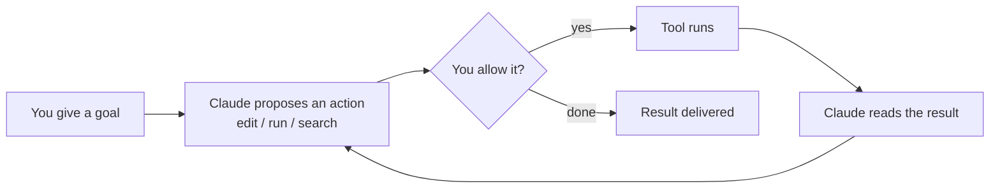

<LevelBadge level="beginner" />

<VerifyNote lastVerified="2026-06-20" source="https://code.claude.com/docs/en/overview">
インストールコマンドや正確な機能セットは頻繁に変わります。セットアップに関しては公式の Claude Code ドキュメントを信頼できる情報源として扱ってください。
</VerifyNote>

**Claude Code** は Anthropic の *エージェント型* コーディングツールです。チャットウィンドウとは異なり、**プロジェクト内で実際に作業を行える** のが特徴です。ファイルの読み取りと編集、シェルコマンドの実行、コードベースの検索、外部ツールの呼び出し — すべてあなたの許可のもとで行います。

## メンタルモデル: エージェントループ

これが、他のすべてを理解しやすくする唯一の考え方です。

平易な言葉で目的を伝えます（「auth モジュールにテストを追加して、失敗したものを修正して」）。Claude は **計画し、実行し、結果を観察し、それを繰り返して** 目標が達成されるまで進めます。あなたは [権限](/docs/claude-code) と [プランモード](/docs/claude-code) を通じて制御を保ちます。

## どこで実行できるか

- **ターミナル (CLI)** — 最初のインターフェース。あらゆるシェルで動作します。
- **IDE 拡張機能** — VS Code と JetBrains。インラインの差分表示付き。
- **デスクトップとウェブ** — そして、設定・フック・権限をすべてのインターフェース間で共有します。

## 何を設定するか（効果の大きい順におおよそ並べると）

1. **[CLAUDE.md](/docs/claude-code)** — 永続的なプロジェクト指示。最も影響が大きく、最も労力が少ない。
2. **[プランモード](/docs/claude-code)** — 編集を実行する *前に* 調査して提案する。
3. **[権限](/docs/claude-code)** — Claude が確認なしに行ってよいこと。
4. **[settings.json](/docs/claude-code)** — 設定システム全体。
5. **[スラッシュコマンド](/docs/claude-code)**、**[フック](/docs/claude-code)**、**[スキル](/docs/claude-code)**、**[サブエージェント](/docs/claude-code)**、**[MCP サーバー](/docs/claude-code)** — パワー機能。必要に応じて積み重ねていきます。

## はじめてのセッション（その流れ）

1. インストールと認証を行う（現在のコマンドは [公式ドキュメント](https://code.claude.com/docs/en/overview) を参照）。
2. `cd` でプロジェクトに移動し、Claude Code を起動する。
3. `/init` を実行して、出発点となる **CLAUDE.md** を生成する。
4. 小さく具体的なことを頼む。例: *「このアプリでルーティングがどう動くか説明して。」*
5. 次に、まず **プランモード** で変更を試し、計画を確認してから実行させる。

:::tip 読み取り専用から始めよう
最初の本格的なタスクには [プランモード](/docs/claude-code) を使いましょう。Claude はファイルに触れることなく調査し、計画を見せてくれます。信頼を築くのに最も安全な方法です。
:::

## 次に

- 最も効果の大きいセットアップ → [CLAUDE.md とメモリファイル](/docs/claude-code)
- 一通り通しでやってみる → [ウォークスルー: 実際のリポジトリで Claude Code をカスタマイズする](/docs/walkthroughs)
- 独自の自動化を作る → [テンプレートとレシピ](/docs/templates)
