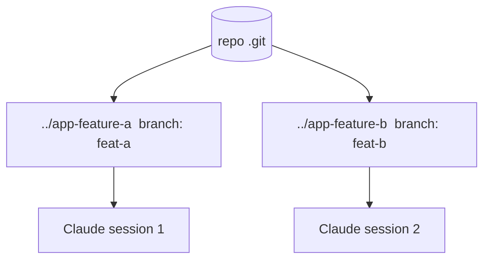

<LevelBadge level="advanced" />

**git ワークツリー** を使うと、1 つのリポジトリに **複数の作業ディレクトリ** を持たせ、それぞれを別々のブランチにチェックアウトできます。これを Claude Code と組み合わせれば、同じプロジェクトで **複数のセッションを並列に** 実行でき、各セッションが自分のファイルを編集して衝突しません。

## 解決する問題

2 つの Claude セッションが同じ作業ディレクトリを同時に編集すると、互いの変更が衝突します。ワークツリーは各セッションに **専用のディレクトリとブランチ** を与えるので、マージするまで並列作業は隔離されたままです。



## 基本

```bash
# from your repo
git worktree add ../app-feature-a -b feat-a   # new dir + new branch
git worktree add ../app-fix-123 -b fix-123
git worktree list
# when done with one:
git worktree remove ../app-feature-a
```

各ワークツリーのディレクトリで Claude Code セッションを開き、それぞれ独立して作業させます。

## 価値があるとき

- 同時に進めたい **並列の機能/修正**。
- あるワークツリーで **長いタスクを実行** しつつ、別のワークツリーで作業を続けたいとき。
- メインのチェックアウトから隔離した **リスクの高い実験**。

## 落とし穴

:::warning マージ時の取り込みに注意
- ブランチはいずれ **マージ** されます — コンフリクトは作業中ではなく、そのときに表面化します。ワークツリーは焦点を絞り、短命に保ちましょう。
- **状態を持つ共有リソース**（1 つの開発用 DB、1 つのポート）を、分離せずに 2 つのワークツリーから実行しないこと。
- `git worktree remove` で後片付けをして、不要なディレクトリが溜まらないようにしましょう。
:::

## ワークツリー vs サブエージェント

- **[サブエージェント](/docs/claude-code/subagents)** = 1 つのセッション *内* の並列性（委譲、隔離されたコンテキスト）。
- **ワークツリー** = ディスク上のセッション *間* の並列性（隔離されたブランチ/ファイル）。両者はうまく組み合わせられます。ワークツリー内のセッションが、自らサブエージェントを生成することもできます。

## 次に

- [サブエージェントと並列エージェント](/docs/claude-code/subagents)
- [ヘッドレスモードと Agent SDK](/docs/claude-code/headless-and-agent-sdk)
- [コンテキスト管理](/docs/claude-code/context-management)
