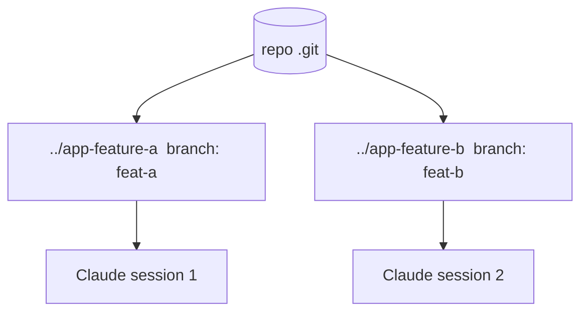

<LevelBadge level="advanced" />

<Callout type="objectives" items={["git ワークツリーとは何か — 1 つのリポジトリ、複数の作業ディレクトリ、それぞれが独自のブランチ上にある","それが解決する正確な問題：並列の Claude セッションが同じファイルで衝突するのを止める","ワークツリーを追加・一覧表示・削除する 4 つのコマンド","この手法が真価を発揮するとき — そしてマージ時に噛みつく 3 つの落とし穴","ワークツリーがサブエージェントとどう組み合わさるか：セッションをまたぐ並列性 vs 1 つの中での並列性"]} />

**git ワークツリー**は、1 つのリポジトリに**複数の作業ディレクトリ**を持たせ、それぞれを別のブランチにチェックアウトできるようにします。これを Claude Code と組み合わせれば、同じプロジェクトで**複数のセッションを並列に**実行でき、各セッションが自分のファイルを編集し、衝突しません。

## それが解決する問題

2 つの Claude セッションが同じ作業ディレクトリを同時に編集すると、互いの変更につまずきます。ワークツリーは各セッションに**独自のディレクトリとブランチ**を与えるので、マージするまで並列作業は隔離されたままです。

## 基本

4 つのコマンドがワークフロー全体を担います：ワークツリーを追加し（新しいディレクトリ＋新しいブランチ）、存在するものを一覧表示し、終わったら 1 つ削除します。

<Steps items={[{title: "機能用のワークツリーを追加する", body: "リポジトリから、git worktree add ../app-feature-a -b feat-a が新しいディレクトリと新しいブランチを一度に作ります。"},{title: "修正用にもう 1 つ追加する", body: "git worktree add ../app-fix-123 -b fix-123 — 1 つ目と並んだ、2 つ目の隔離されたディレクトリ/ブランチ。"},{title: "持っているものを見る", body: "git worktree list がすべての作業ディレクトリと、それが乗っているブランチを表示します。"},{title: "終わったら片付ける", body: "git worktree remove ../app-feature-a がワークツリーを取り壊し、古いディレクトリが溜まらないようにします。"}]} />

<PromptCard title="4 コマンドのワークフロー">{`# from your repo
git worktree add ../app-feature-a -b feat-a   # new dir + new branch
git worktree add ../app-fix-123 -b fix-123
git worktree list
# when done with one:
git worktree remove ../app-feature-a`}</PromptCard>

各ワークツリーのディレクトリで Claude Code セッションを開き、独立して作業させます。

## いつ価値があるか

- 同時に進めたい**並列の機能/修正**。
- 1 つのワークツリーで**長いタスクを実行**しながら、別のワークツリーで作業を続ける。
- メインのチェックアウトから隔離された**リスクのある実験**。

## 落とし穴

<Callout type="warning" items={["マージバックに注意：ブランチはいずれマージされます — 衝突は作業中ではなく、そのときに表面化します。ワークツリーは焦点を絞り、短命に保ちましょう。","2 つのワークツリーから、状態を持つ共有リソース（1 つの開発用 DB、1 つのポート）を分離せずに実行しないでください。","git worktree remove で片付け、古いディレクトリが溜まらないようにしましょう。"]} />

## ワークツリー vs サブエージェント

並列性の 2 つの異なる軸 — 競合せず、積み重なります。

| | 何を並列化するか | 隔離 |
| --- | --- | --- |
| **[サブエージェント](/docs/claude-code/subagents)** | 1 つのセッション*内*の作業（委譲） | 隔離されたコンテキスト |
| **ワークツリー** | ディスク上でセッションを*またぐ*作業 | 隔離されたブランチ/ファイル |

うまく組み合わさります：ワークツリー内のセッションは、それ自体がサブエージェントを生成できます。

<Callout type="tip" items={["同じリポジトリに同時に触れる 2 つの Claude セッションが必要なときはワークツリーを使い、1 つのセッションが作業の一塊を隔離されたコンテキストにオフロードする必要があるときはサブエージェントを使いましょう。"]} />

<Quiz title="理解度チェック" questions={[{q: "git ワークツリーは何を与えてくれますか？", options: ["単一の作業ディレクトリ内の複数のブランチ", "1 つのリポジトリに対する複数の作業ディレクトリ、それぞれが独自のブランチ上にある", ".git フォルダのバックアップコピー"], answer: 1, explain: "git ワークツリーは、1 つのリポジトリに複数の作業ディレクトリを持たせ、それぞれを別のブランチにチェックアウトできるようにします — 並列セッションが衝突しません。"}, {q: "新しいディレクトリ**と**新しいブランチを 1 ステップで作るコマンドはどれですか？", options: ["git worktree list", "git worktree add ../app-feature-a -b feat-a", "git worktree remove ../app-feature-a"], answer: 1, explain: "git worktree add ../app-feature-a -b feat-a が新しいディレクトリと新しいブランチを一緒に作ります。list は既存のワークツリーを表示し、remove は 1 つを取り壊します。"}, {q: "並列ワークツリーからのマージ衝突は、実際にはいつ表面化しますか？", options: ["両方のセッションが編集している間、継続的に", "作業中ではなく、マージバック時に", "ブランチが隔離されているので、決して起きない"], answer: 1, explain: "作業中はブランチが隔離されたままなので、衝突は作業中には現れません — マージバック時に表面化します。ワークツリーを焦点を絞り短命に保つことで、それを抑えられます。"}, {q: "ワークツリーとサブエージェントはどう関係しますか？", options: ["2 つの名前を持つ同じ機能", "ワークツリーはディスク上でセッションをまたいで並列化し、サブエージェントは 1 つのセッション内で並列化する — そして組み合わさる", "どちらか 1 つを選ばねばならず、両方使うと隔離が壊れる"], answer: 1, explain: "サブエージェントは 1 つのセッション内の並列性（隔離されたコンテキスト）、ワークツリーはディスク上でセッションをまたぐ並列性（隔離されたブランチ/ファイル）です。ワークツリー内のセッションは、それ自体がサブエージェントを生成できます。"}]} />

<Callout type="takeaways" items={["git ワークツリー = 1 つのリポジトリ、複数の作業ディレクトリ、それぞれが独自のブランチ上 — 衝突なしの並列 Claude セッションの基盤。","1 つの作業ディレクトリ上の 2 つのセッションは互いにつまずく。セッションごとのワークツリーは、マージするまでファイルとブランチを隔離する。","git worktree add ../dir -b branch がディレクトリ＋ブランチを作り、list が表示し、remove が片付ける。","並列の機能/修正、他の作業と並行する長時間タスク、隔離されたリスクのある実験に価値がある。","マージバックに注意し、状態を持つリソース（DB、ポート）をワークツリー間で共有せず、必ず片付ける — そしてワークツリーはサブエージェントと組み合わさることを忘れずに。"]} />

## 次へ

- [サブエージェントと並列エージェント](/docs/claude-code/subagents)
- [ヘッドレスモードと Agent SDK](/docs/claude-code/headless-and-agent-sdk)
- [コンテキスト管理](/docs/claude-code/context-management)
