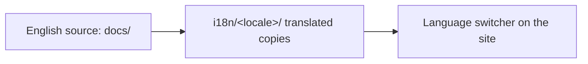

<LevelBadge level="intermediate" />

AILmanac は英語が第一ですが、**翻訳されることを前提に作られています** — それが「世界中の誰もが」使えるようになる方法です。あなたの言語に届けたい場合は、こちらの手順をどうぞ。

## ここでの i18n の仕組み

このサイトは Docusaurus 組み込みの国際化機能を使っています。**英語が正典の原典です。** ロケールとは翻訳されたファイルの並行セットであり、ロケールが有効になると Docusaurus は言語切り替えを提供します。

## 黄金律: 公開する前に担当すること

:::warning 本番環境に中途半端な翻訳は置かない
ロケールが**本番で有効になるのは、誰かがその維持を引き受けたときだけ**です。30% しか翻訳されておらず数か月放置されたロケールは、翻訳がない場合よりも信頼性を損ないます。中途半端なページを散在させるより、*完結したセクション*をきちんと翻訳するほうが優れています。
:::

## 翻訳を貢献する方法

1. **Issue を作成し**（*translation* テンプレートを使用）、どの言語のどのセクションを担当するかを記載します。
2. まず**まとまりのあるかたまりを翻訳します** — 例えば *Start Here* 全体 — ランダムなページではなく。
3. **コード、コマンド、`VerifyNote` の出典は変更せず**、本文、見出し、アドモニションのテキストを翻訳します。
4. **モデル ID やリンクは翻訳しない**。`/docs/...` のパスはそのままにします。
5. **PR を作成します。** メンテナーがレビューし、ロケールに担当者がいて最初のセクションが完結したら有効化します。

## ヒント

- **下書きには Claude を使い**、その後で流暢な人間がレビューします — AI 翻訳は優れた初稿であって、最終的な権威ではありません（[ハルシネーション](/docs/foundations/hallucinations)は翻訳にも当てはまります）。
- 英語版ページの**レベルとトーンに合わせます**。
- **翻訳しづらい用語にはフラグを立てます**（あなたの言語の技術コミュニティで一般的なら「prompt」「token」などはそのままにします）。

## 次に読む

- [10分で貢献する](/docs/contribute/contribute-in-10-minutes)
- [コンテンツスタイルガイド](/docs/contribute/style-guide)
- [行動規範とガバナンス](/docs/contribute/governance)
