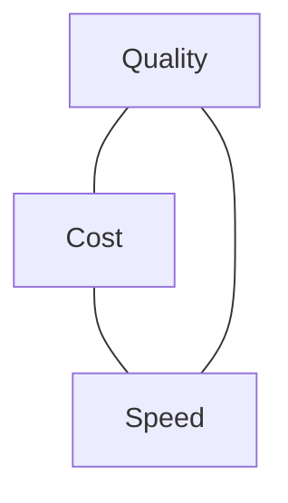

<LevelBadge level="intermediate" />

品質、コスト、速度は互いに引っ張り合います。3つすべてを同時に最大化することはできませんが、それぞれを重要なところに*振り向け*、それ以外のすべてで節約することは*できます*。

## トライアングル

大きいモデルは賢いですが遅く高価です。小さいモデルは速く安いですが能力は劣ります。良いエンジニアリングとは、**各タスクをこのトライアングル上の適切な点に振り分けること**です。

## 最大のレバー（おおよそ重要度順）

1. **モデルを適正サイズにする。** 分類にOpusを使わないこと。Sonnetから始め、単純で大量のステップにはHaikuまで落とし、難しい部分のためにOpusを取っておきましょう。[モデルの選択](/docs/api/choosing-a-model)。
2. **モデルのティア分け/カスケード。** まず安いモデルを使い、必要なときだけ（例：確信度の低いケース）より強いモデルにエスカレーションします。
3. **[プロンプトキャッシュ](/docs/api/prompt-caching)。** 安定したプロンプトの接頭辞を呼び出し間で再利用します。繰り返されるシステムプロンプト、RAGのコンテキスト、エージェントのツールカタログでは大きな節約になります。
4. **入力トークンを削る。** 重要なものだけを送ります。[RAG](/docs/foundations/rag)は、ナレッジベース全体を詰め込むよりも優れています。入力が短いほど安く、しかもしばしば結果も良くなります。
5. **出力に上限を設ける。** 適切な`max_tokens`と、厳密なフォーマット指示を使いましょう。
6. **バッチ処理する。** レイテンシが問題にならないオフライン作業はバッチで。

## レイテンシに特化した工夫

- **ストリーミング**で応答を流し、ユーザーがすぐに出力を見られるようにします。合計時間が変わらなくても、*体感*速度には大きく効きます（[ストリーミング](/docs/api/streaming)）。
- 独立したサブ呼び出しを**並列化**します。
- 繰り返しの作業を**キャッシュ**し、できるところは事前計算します。
- インタラクティブな経路には**より小さいモデル**を選び、重い処理は非同期で行います。

## 闇雲に最適化しない

まず計測しましょう。トークンと秒は実際にどこに消えているのか？それから最大の項目を最適化します。そして、コスト削減のあとは[評価](/docs/foundations/evals)で必ず品質を再確認しましょう。間違っている安い構成は、安くはありません。

## 次に読む

- [Claudeモデルの選択](/docs/api/choosing-a-model)
- [プロンプトキャッシュとコスト最適化](/docs/api/prompt-caching)
- [トークン、コンテキスト、価格](/docs/api/tokens-and-pricing)
