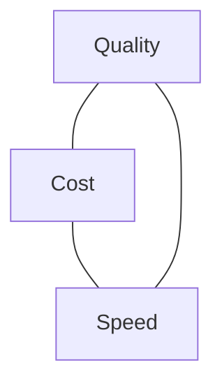
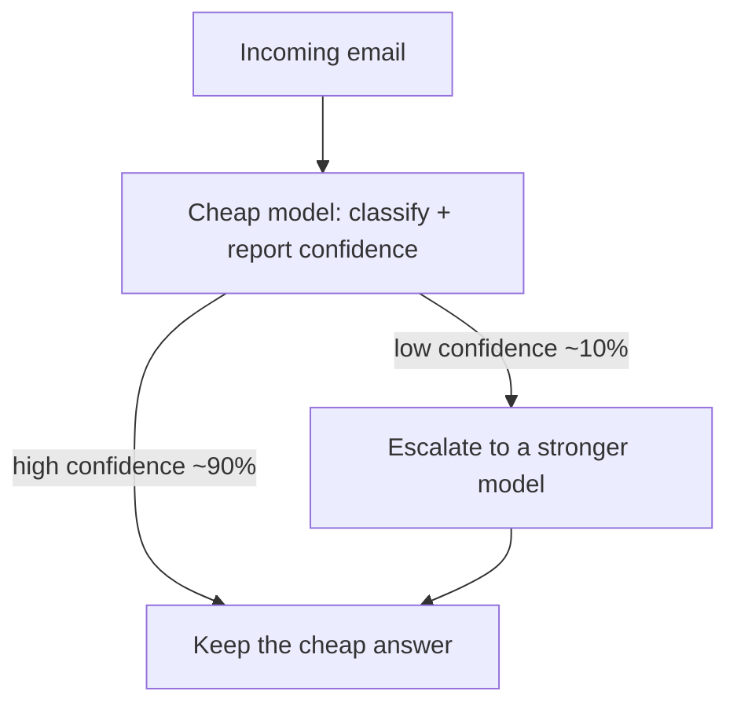

<LevelBadge level="intermediate" />

<Callout type="objectives" items={["コスト/品質/速度のトライアングル — なぜ3つすべてを同時に最大化できないのか","重要なところに支出し、それ以外で節約するための6つの最大のレバー","チープファーストのカスケードがどのように90%の量を小さなモデルにルーティングし、難しいケースで品質を落とさずにコストを約70%削減するか","体感速度を作り変えるレイテンシ特化の勝ち手(ストリーミング、並列化、キャッシュ、非同期)","なぜ『闇雲な最適化』は品質を焼き払うのか — まず計測し、次に評価で守る"]} />

品質、コスト、速度は互いに引っ張り合います。3つすべてを同時に最大化することはできませんが、それぞれを重要なところに*振り向け*、それ以外のすべてで節約することは*できます*。

## トライアングル

```mermaid
flowchart TD
  Q[Quality] --- C[Cost]
  C --- S[Speed]
  S --- Q
```

大きいモデルは賢いですが遅く高価です。小さいモデルは速く安いですが能力は劣ります。良いエンジニアリングとは、**各タスクをこのトライアングル上の適切な点に振り分けること**です。

## 最大のレバー（おおよそ重要度順）

<Steps items={[{title: "モデルを適正サイズにする", body: "分類にOpusを使わないこと。Sonnetから始め、単純で大量のステップにはHaikuまで落とし、難しい部分のためにOpusを取っておきましょう。単独で最大のレバー — /docs/api/choosing-a-model を参照。"}, {title: "モデルのティア分け/カスケード", body: "まず安いモデルを使い、必要なときだけ(例:確信度の低いケース)より強いモデルにエスカレーションします。以下の実例を参照。"}, {title: "プロンプトキャッシュ", body: "安定したプロンプトの接頭辞を呼び出し間で再利用します — 繰り返されるシステムプロンプト、RAGのコンテキスト、エージェントのツールカタログで大きな節約になります。/docs/api/prompt-caching を参照。"}, {title: "入力トークンを削る", body: "重要なものだけを送ります。RAGは、ナレッジベース全体を詰め込むよりも優れています。入力が短いほど安く、しかもしばしば結果も良くなります。"}, {title: "出力トークンに上限を設ける", body: "適切な max_tokens と、厳密なフォーマット指示を設定しましょう。出力トークンは最高料金で課金されます — 上限を設けることでテールを切り落とせます。"}, {title: "オフライン作業はバッチで", body: "インタラクティブである必要のないものには、Message Batches APIを使いましょう。レイテンシと引き換えに、トークン単位で大きな割引が得られます。"}]} />

## 実例:チープファーストのカスケード

カスケードは、曖昧に聞こえるので人々がスキップするレバーです。具体的にしましょう。10万件のサポートメールをトリアージする必要があるとします。素朴なアプローチはすべてのメールを最強のモデルに通します。カスケードは、量の大部分を安いモデルにルーティングし、難しいケースだけをエスカレーションします。

```mermaid
flowchart TD
  In[Incoming email] --> Cheap[Cheap model: classify + report confidence]
  Cheap -->|high confidence ~90%| Done[Keep the cheap answer]
  Cheap -->|low confidence ~10%| Strong[Escalate to a stronger model]
  Strong --> Done
```

安いモデルがケースの90%を単独で解決し、より強いモデルがトークンあたりでおよそ5倍のコストがかかるとします。相対的な*コスト単位*(1 = 1メールに対する1回の安いパス)で数えると:

- **全部強力:** `100k × 5 = 500k` コスト単位。
- **カスケード:** `100k × 1`(すべてのメールが安いパスを受ける)`+ 10k × 5`(エスカレーションする10%)`= 150k` コスト単位。

これは約 **70% の削減** であり、本当に難しいケースはまだ最良のモデルにかかります。倍率と割合は例示的です — 自分の[トークン数と料金](/docs/api/tokens-and-pricing)を当てはめて、[評価](/docs/foundations/evals)で*実際の*エスカレーション率を測ってください。教訓は変わりません。節約は高価な料金の*率そのもの*ではなく、それを払う*頻度がいかに稀か*から来ます。

## レイテンシに特化した勝ち手

<Callout type="tip" items={["応答をストリーミング — ユーザーは最初のトークンを即座に見るので、合計時間が変わらなくても体感速度は跳ね上がる(/docs/api/streaming)。","独立したサブ呼び出しを並列化する — 3つのツールにファンアウトするリクエストは sum(latency) ではなく max(latency) で終わる。","繰り返しの作業をキャッシュし、できるところは事前計算 — 最速のトークンは生成しなくてよいトークン。","インタラクティブな経路にはより小さいモデルを選び、重い処理は非同期に移して、ユーザーがそれを待たないようにする。","インタラクティブなエンドポイントの max output tokens を減らす — 長い生成はテールレイテンシの主要な原因。"]} />

## 闇雲に最適化しない

まず計測しましょう。トークンと秒は実際にどこに消えているのか？それから最大の項目を最適化します。そして、コスト削減のあとは[評価](/docs/foundations/evals)で必ず品質を再確認しましょう。間違っている安い構成は、安くはありません。

<Quiz title="自己チェック" questions={[{q: "通常、単独で最大のコストレバーはどれですか？", options: ["プロンプトキャッシュを有効にする", "モデルをタスクに合わせて適正サイズにする(小さなモデルで十分な仕事にフラッグシップを使わない)", "小さい max_tokens を設定する", "バッチモードを使う"], answer: 1, explain: "モデルの選択は圧倒的に最大の倍率であり、しばしばティア間で5〜10倍です。キャッシュ、上限、バッチも意味がありますが、どれも『Haikuクラスのモデルで正しく終わる仕事にフラッグシップ料金を払うのをやめる』には勝てません。"}, {q: "チープファーストのカスケードで、節約は実際にどこから来ますか？", options: ["安いモデルがトークンあたりで本質的に安いこと", "高価な料金を払う頻度がいかに稀かということ — ほとんどのケースは安いティアで解決する", "プロンプトキャッシュがカスケードの背後に隠れていること", "応答をストリーミングすること"], answer: 1, explain: "計算(100k × 1 + 10k × 5 vs 100k × 5)は、節約がエスカレーション率に支配されていることを示します。90%を安いに、10%を強いにルーティングするなら、高価な料金は量の10分の1に対して払っているだけです。"}, {q: "ユーザーに応答が速いと感じさせたい。モデル選択を変えずに最も助けになるレバーは？", options: ["max_tokens を 5 に設定して応答を短くする", "生成に合わせてトークンをストリーミングし、最初のトークンまでの時間を大きく縮める", "リクエストを並列に2回リトライして最速のものを保持する", "ローディングスピナーを追加する"], answer: 1, explain: "ストリーミングは合計生成時間を変えずに『体感』レイテンシを作り変えます — ユーザーは生成されるままの出力を見るので、4秒の応答が瞬時に感じられます。小さな max_tokens で切り詰めると品質が損なわれ、並列リトライはコストを燃やします。"}, {q: "ワークフローでSonnetからHaikuに移行してコストを削減しました。必要な次のステップは？", options: ["出荷する — コストが下がった、それが勝ちの全部", "評価を再実行して品質が崩れていないことを確認する — 間違っている安い構成は安くない", "プロンプトをキャッシュしてさらに安くする", "すべてのリクエストにOpusへのフォールバックを追加する"], answer: 1, explain: "すべてのコスト削減は評価で守らなければなりません。安い誤った答えは通常、高価な正しい答えよりも高くつきます — リトライ、エスカレーション、下流のクリーンアップを通じて。変更後は必ず品質を測ってください。"}]} />

<Callout type="takeaways" items={["トライアングルは現実:品質、コスト、速度は引っ張り合う — エンジニアリングとは3つすべてを最大化することではなく、各タスクを適切な点にルーティングすること。","モデルの適正サイズ化が単独で最大のレバー;カスケードは難しい少数派にだけフラッグシップ料金を払うことでそれを掛け算する。","プロンプトキャッシュ、厳しい max_tokens、RAG駆動の入力削減はモデル選択と複合する。","レイテンシの体感は別の軸 — ストリーミング、並列サブ呼び出し、非同期の重い処理は生のコストを変えずにUXを作り変える。","すべてのコスト削減は評価で守らなければならない — 間違っている安い構成は安くない。"]} />

## 次に読む

- [Claudeモデルの選択](/docs/api/choosing-a-model)
- [プロンプトキャッシュとコスト最適化](/docs/api/prompt-caching)
- [トークン、コンテキスト、価格](/docs/api/tokens-and-pricing)
