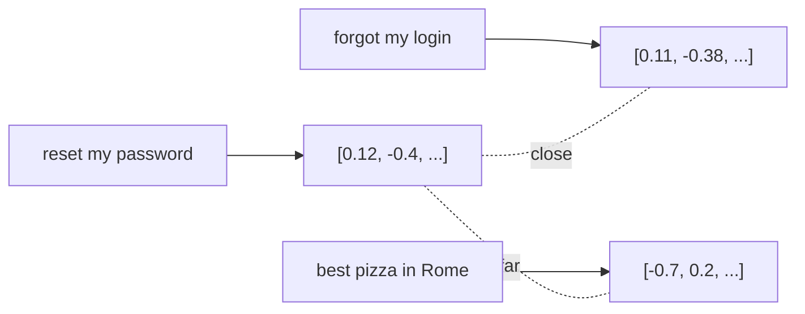

<LevelBadge level="intermediate" />

**埋め込み（embedding）**は、テキストの一片を、その*意味*を捉えた数値のリスト（**ベクトル**）に変換します。意味が似たテキストは、たとえ共通する単語がなくても、互いに近いベクトルになります。これが**セマンティック検索**と[RAG](/docs/foundations/rag)の背後にある仕掛けです。

## 直感的なイメージ

すべての文が、巨大な多次元空間の中の点として配置され、**意味が似たものどうしが近くに来る**ように並んでいると想像してください。「パスワードをリセットするには？」は「ログインを忘れた」の近くに着地し、「ローマで一番のピザ」からは遠く離れます。

## セマンティック検索 vs キーワード検索

- **キーワード検索**は文字どおりの単語に一致します（「password」が「password」を見つける）。
- **セマンティック検索**は*意味*に一致します。「サインインできない」が、「password」という単語がなくてもパスワードリセットの文書を見つけます。

最良の結果は、しばしば両方を**組み合わせる**ことで得られます（ハイブリッド検索）。

## ベクトル検索の仕組み

1. 文書を（通常は**チャンク**に分割して）**埋め込み**、ベクトルを**ベクトルデータベース**に保存します。
2. クエリの時点で、**クエリを埋め込み**ます。
3. （コサイン類似度/距離で）**最も近い**ベクトルを見つけます。
4. それらのチャンクを返します。多くの場合、[RAG](/docs/foundations/rag)に渡すためです。

## 実践的なメモ

- **チャンク分割は重要です。** 大きすぎる = ノイズの多い一致、小さすぎる = 文脈の喪失。調整しましょう。
- **1つの埋め込みモデルを一貫して使いましょう** — 異なるモデルのベクトルは比較できません。
- **メタデータ + フィルター**（日付、ソース、種類）は、検索をはるかに精密にします。
- ベクトルDBが常に必要なわけではありません。小規模なコーパスなら、シンプルなインメモリ検索で十分です。

## 次に読む

- [検索拡張生成（RAG）](/docs/foundations/rag)
- [ファインチューニング vs プロンプティング vs RAG](/docs/foundations/finetune-vs-prompt-vs-rag)
- [ハルシネーションとその減らし方](/docs/foundations/hallucinations)
