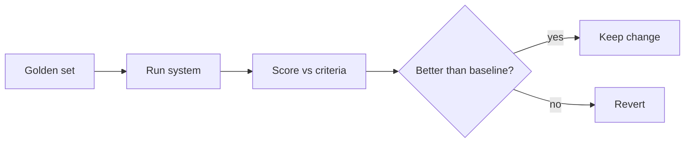

<LevelBadge level="advanced" />

AIの上に何かを出荷するなら、**評価（eval）**こそが、それが機能していることを知る方法であり、ある変更が改善だったのか改悪だったのかを知る方法です。評価がなければ手探りで飛んでいるようなものです。あるケースを助けるプロンプトの微調整が、別の10ケースを密かに壊しかねません。

## 実用最小限の評価

始めるのにフレームワークは要りません。

1. **ゴールデンセットを集める。** 20〜100件の実際の入力と、その*正しい*もしくは*許容できる*出力（または明確な基準）。簡単なケース、トリッキーなケース、過去に痛い目を見たエッジケースを網羅しましょう。
2. **「良い」とは何かを定義する。** タスクごとに、完全一致、重要な事実を含む、有効なJSONスキーマ、捏造された数値がない、トーンなど。
3. **現在の構成をそのセットに対して実行し、採点する。**
4. **1つだけ変える**（プロンプト、モデル、検索）、再実行して**比較する**。スコアが改善したときだけ変更を残します。

## メトリクスの選び方

- **可能なら決定論的なチェックを。** スキーマは有効か？正しい値を含むか？コードはテストを通過するか？これらは安価で信頼できます。
- ファジーな品質（有用性、トーン）には**LLM-as-judge（審判役のLLM）**を。モデルにルーブリックに対して出力を採点させます。便利ですが、**較正しましょう** — 審判には偏り（長さ、位置）があります。サンプルで人間の評価に対して審判を検証してください。
- 最も重要度の高い部分には**人間によるレビュー**を。

## いつ実行するか

- **プロンプトやモデルを変更する前後に。**
- **モデル移行のとき** — 新しいモデルは挙動を変えうる（[エラーと移行](/docs/api/errors-and-rate-limits)）。
- 本番システムでは**CI内で**、ゲートとして。

:::tip 段階を分ける
[RAG](/docs/foundations/rag)や[エージェント](/docs/api/building-agents)では、最終的な回答だけでなく各段階を評価しましょう（検索は正しい文書を見つけたか？ツールは正しく呼ばれたか？）。失敗箇所を特定しやすくなります。
:::

## 次に読む

- [ハルシネーションとその減らし方](/docs/foundations/hallucinations)
- [APIでのエージェント構築](/docs/api/building-agents)
- [モデルとプロバイダーの選択](/docs/foundations/choosing-a-model-provider)
