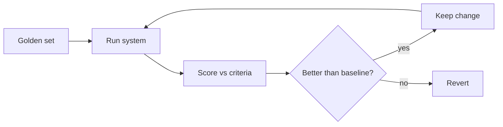

<LevelBadge level="advanced" />

<Callout type="objectives" items={[
  "実用最小限の eval を構築する — 明確な合格基準を持つ 20〜100 件の実際の入力からなるゴールデンセット",
  "タスクごとに正しいメトリクスを選ぶ: 決定論的チェック、LLM-as-judge、または人間レビュー",
  "eval をゲートとして実行する — すべてのプロンプト変更、モデル交換の前後、そして CI で",
  "リグレッションを局所化するために、最後だけでなくすべての段階(検索、ツール呼び出し、最終回答)をスコアリングする"
]} />

AI の上に何かを出荷するなら、**evals** こそがそれが機能していることを知る方法であり、変更が改善だったのか改悪だったのかを知る方法です。それがなければ手探りで飛んでいます: あるケースを助けるプロンプトの微調整が、密かに他の10ケースを壊しかねません。Evals は「雰囲気ベース」の反復を測定可能なループに変えます。

## 実用最小限の eval

始めるのにフレームワークは要りません。ループ全体は4ステップです:

<Steps items={[
  {title: "ゴールデンセットを集める", body: "20〜100件の実際の入力と、正しいまたは許容できる出力(または合格とみなすものの明確な基準)。簡単なケース、トリッキーなケース、そして本番ですでに痛い目を見たエッジケースを網羅しましょう。"},
  {title: "タスクごとに「良い」の意味を定義する", body: "完全一致か? 特定の重要な事実を含むか? スキーマに合う有効な JSON か? 幻覚された数値がないか? ブランドに合ったトーンか? 合格基準を書き留めましょう — ケースごとに1行で十分。"},
  {title: "ベースラインを実行してスコアリング", body: "現在のセットアップをセットに対して実行し、スコアを記録します。これがこれから超えるべき数値です。保存しましょう — 未来のあなたが必要とします。"},
  {title: "1つ変える、再実行、比較", body: "プロンプトの微調整、モデル交換、検索変更 — 一度に1変数。スコアが上がり、何もリグレッションしなければ、変更を保持。そうでなければ元に戻す。これがループ全体です。"}
]} />

```mermaid
flowchart LR
  G[Golden set] --> R[Run system]
  R --> S[Score vs criteria]
  S --> C{Better than baseline?}
  C -->|yes| K[Keep change]
  C -->|no| X[Revert]
  K --> R
```

## メトリクスの選び方

すべての質問が同じテストに値するわけではありません。メトリクスをタスクに合わせましょう:

| タスクタイプ | メトリクス | コスト | 信頼性 |
|---|---|---|---|
| 構造化出力(JSON、SQL) | スキーマ検証、完全一致 | 無料 | 高 |
| コード生成 | 書かれたテストを実行 | 安 | 高 |
| 抽出(日付、エンティティ) | 文字列含む/正規表現 | 無料 | 高 |
| 分類 | 精度、適合率、再現率 | 無料 | 高 |
| 要約、下書き、トーン | ルーブリック付き LLM-as-judge | 中 | 中 — 較正必須 |
| 高リスクの記述、安全性 | サンプル上の人間レビュー | 高 | 最高 |

3つの経験則:

- **可能な場合は決定論的チェック。** 答えが「このスキーマに合う有効な JSON」または「コードがこれらのテストを通過する」なら、LLM に尋ねない — チェックするだけ。
- **ファジーな品質には LLM-as-judge。** 有用性、トーン、事実性 vs ソース。安価で速いが、*バイアス*(長さ、位置、自己選好)がある。数値を信頼する前に、サンプルで人間の評価に対してジャッジを検証しましょう。
- **最高リスクのスライスには人間。** リリースあたり10件の人間グレードでも0より勝る。

<PromptCard title="LLM-as-judge starter rubric">{`You are grading assistant responses against a source document.

For each response, output a JSON object with these fields:
- grounded: true if every factual claim is supported by the source, else false
- complete: true if the response answers all parts of the question, else false
- concise: true if the response contains no filler or repetition, else false
- overall_score: 1-5 (1 = unusable, 5 = ship it)
- reasoning: one sentence explaining the score

Do not consider length. Do not consider whether the response comes first or second.

<source>{{SOURCE}}</source>
<question>{{QUESTION}}</question>
<response>{{RESPONSE}}</response>

Return only the JSON, no preamble.`}</PromptCard>

## いつ実行するか

- **プロンプトやモデルの変更の前後。** 例外なし。ゴールデンセットの全ポイントは、安全だと思った変更を捕まえることです。
- **モデル移行のとき。** 新しいモデルは振る舞いを変えます — 時に静かに。モデル ID を切り替える前に eval を実行しましょう。[エラーと移行](/docs/api/errors-and-rate-limits) を参照。
- **本番システムでは CI 内で。** 緑の eval をマージゲートに変えます。リグレッションはユーザーに見られる前に捕まえられます。
- **報告されたバグごとに。** 失敗ケースをゴールデンセットに追加しましょう。セットはシステムと共に成長します。

## 最終回答だけでなく、すべての段階を評価する

[RAG](/docs/foundations/rag) と [エージェント](/docs/api/building-agents) では、単一の「最終回答」スコアは物事がどこで壊れているかを隠します。リグレッションが1箇所に着地するよう、各段階を別々にスコアリングしましょう:

| 段階 | チェックすべき事項 |
|---|---|
| 検索 | top-k は答えを含むドキュメントを含んでいたか? |
| ツール選択 | エージェントはこのターンに正しいツールを選んだか? |
| ツール引数 | 引数は良く形成され、正しかったか? |
| 最終回答 | ゴールデン基準に一致するか? |

検索スコアが下がったが最終回答スコアが安定しているとき、それが検索リグレッションであり、プロンプト問題ではないことがわかります。その種の局所化こそ、eval を単なるスコアリングではなく、実際にデバッグに有用にするものです。

## よくある間違い

- **回答を生成したのと同じモデルでグレード。** 自己選好バイアスがスコアを膨らませる。ジャッジには異なるモデルを — さらに良いのは異なるファミリーを — 使いましょう。
- **「正しい」答えを漏らすジャッジプロンプト。** ジャッジがゴールド回答を見たら、それに一致することを報酬とする理由を見つけます。類似性ではなく基準でジャッジしましょう。
- **1日目に凍結されたゴールデンセット。** セットは本番が驚かせるたびに成長すべき。停滞したセットは過去を測ります。
- **タスクではなく eval に最適化。** すべてのケースが合格するまで小さなセットに対してプロンプトを調整すると、過学習した可能性があります。反復中に決して見ない ~20% のケースを検証スライスとして保持しましょう。

<Quiz title="理解度チェック" questions={[
  {q: "実用最小限の eval とは何か?", options: ["データに対してファインチューニングされたモデル", "スコアリングできる合格基準を持つ 20〜100 件の実際の入力からなるゴールデンセット", "レイテンシとコストを追跡するダッシュボード"], answer: 1, explain: "「良い」の明確な定義を持つ 20〜100 件の実際の入力で始めるには十分です。フレームワークは要りません — スコアリングできるものが必要です。"},
  {q: "決定論的チェックを LLM-as-judge より優先すべきときは?", options: ["決して — LLM ジャッジの方がニュアンスがある", "合格基準が客観的な場合(スキーマ有効、完全一致、テスト通過)", "LLM ジャッジが払えないときだけ"], answer: 1, explain: "コードで合否を決められるなら、そうしましょう — 決定論的チェックは無料で、速く、バイアスがありません。LLM-as-judge は真にファジーな品質次元のために取っておきましょう。"},
  {q: "RAG エージェントで、なぜ各段階を別々にスコアリングするのか?", options: ["コンプライアンスを満たすため", "リグレッションが*どこで*壊れたか(検索、ツール、または最終回答)を教えるため", "eval を遅く、より徹底的にするため"], answer: 1, explain: "単一のエンドツーエンドスコアは、どの段階がリグレッションしたかを隠します。段階レベルスコアはバグを局所化できます — 検索が下がったが最終が保持されている? それは検索リグレッションであり、プロンプトのものではありません。"},
  {q: "eval セットに過学習したことを示す赤旗は?", options: ["ゴールデンセットが決して変わらず 100% 合格する", "LLM ジャッジを使う", "CI で eval を実行する"], answer: 0, explain: "100% 合格率で凍結されたゴールデンセットは通常、それを暗記するよう調整したことを意味します。反復中に決して見ない検証スライスを保持し、実際の本番失敗からセットを成長させましょう。"}
]} />

<Callout type="takeaways" items={[
  "20〜100 件の実際の入力 + 合格基準 + 一度に1変数 = 動作する eval ループ。",
  "決定論的 > LLM-judge > 人間 — タスクが許す最も安いメトリクスを選ぶ。",
  "パイプラインでは最終回答だけでなく、すべての段階をスコアリングする。",
  "ゴールデンセットは報告されたバグごとに成長する。停滞したセットは過去を測る。"
]} />

## 次に

- [Evaluating Your AI Agent](/docs/playbooks/evaluating-agents) — より深いプレイブック: 軌跡スコアリング、LLM-judge 較正、CI ゲート
- [ハルシネーションとその減らし方](/docs/foundations/hallucinations)
- [API でのエージェント構築](/docs/api/building-agents)
- [モデルとプロバイダーの選択](/docs/foundations/choosing-a-model-provider)
