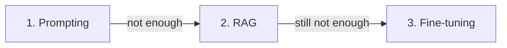

<LevelBadge level="intermediate" />

モデルが思いどおりに動かないとき、レバーは3つあります。そして人々は最も高価なものに真っ先に手を伸ばします。ここでは、実際にうまくいく順番を示します。

## この順番で試す

### 1. プロンプティング — 常にここから始める
より明確な指示、例、役割、出力の制約（[プロンプティングの基礎](/docs/prompting/basics)）。問題の**大部分**を解決し、追加コストはかからず、反復は即座にできます。「モデルがXを苦手としている」のほとんどは、実は「プロンプトが曖昧だった」だと判明します。

### 2. RAG — *あなたの*知識が必要なとき
ギャップが**不足している情報や最新の情報**（あなたの文書、あなたのデータ、現在の事実）なら、[RAG](/docs/foundations/rag)を加えましょう。モデルに手を触れずに、知識を更新可能かつ引用可能に保てます。

### 3. ファインチューニング — 最後の手段、規模における*挙動/フォーマット*のために
ファインチューニングは、あなたの例でモデルをさらに訓練します。プロンプティング + RAGでも一貫した**スタイル、フォーマット、タスクの挙動**が得られず、しかも**高品質な例が多数**あり、それを正当化できる利用量があるときにだけ手を伸ばしましょう。

## 意思決定の表

| あなたの問題 | 手を伸ばすべきもの |
|---|---|
| 曖昧/誤った出力、誤ったフォーマット | **プロンプティング** |
| あなたのデータを知らない / 現在の情報が必要 | **RAG** |
| 非常に特定のスタイル/挙動を、一貫して、規模で必要 | **ファインチューニング** |
| アクションを実行する必要がある | （これらではなく、[ツール利用/エージェント](/docs/api/tool-use)） |

## なぜ人々は誤るのか

ファインチューニングは「モデルに教える」ことのように*聞こえる*ので、本物の解決策のように感じられます。しかしそれは最も遅く、最も高価で、最も柔軟性に欠ける選択肢であり、**新しい知識をうまく追加できず**（それはRAGの仕事です）、下手にやってしまいがちです。まずはプロンプティングとRAGを出し切りましょう。たいていステップ3は不要です。

:::tip 組み合わせられる
強力なシステムは、しばしば良い**プロンプト** + 知識のための**RAG**であり、ファインチューニングは狭い挙動上のニーズのために取っておかれます。これらは相互排他的ではありません。
:::

## 次に読む

- [検索拡張生成（RAG）](/docs/foundations/rag)
- [プロンプティングの基礎](/docs/prompting/basics)
- [AI品質の評価（評価）](/docs/foundations/evals)
