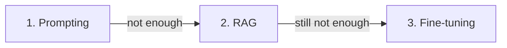

<LevelBadge level="intermediate" />

<Callout type="objectives" items={["モデルが思いどおりに動かないときに手にできる3つのレバー","実際に効く順番 — そしてなぜファインチューニングはほぼ絶対にステップ1ではないか","RAGが正しい修正となる場合と、やり過ぎになる場合","ファインチューニングが本当に得意なこと(そして苦手なこと)","実際の本番システムで3つがどのように組み合わさるか"]} />

モデルが思いどおりに動かないとき、レバーは3つあります — そして人々は最も高価なものに真っ先に手を伸ばします。ここでは、実際にうまくいく順番を示します。

## この順番で試す

```mermaid
flowchart LR
  A[1. Prompting] -->|not enough| B[2. RAG]
  B -->|still not enough| C[3. Fine-tuning]
```

<Steps items={[{title: "1. プロンプティング — 常にここから始める", body: "より明確な指示、例、役割、出力の制約(/docs/prompting/basics を参照)。問題の大部分を解決し、追加コストはかからず、反復は即座にできる。『モデルがXを苦手としている』のほとんどは、実は『プロンプトが曖昧だった』だと判明する。"}, {title: "2. RAG — あなたの知識が必要なとき", body: "ギャップが不足している情報や最新の情報(あなたの文書、あなたのデータ、現在の事実)なら、RAG(/docs/foundations/rag)を加える。モデルに手を触れずに知識を更新可能かつ引用可能に保てる — 文書を差し替えれば次の答えにそれが反映される。"}, {title: "3. ファインチューニング — 最後の手段、規模における挙動/フォーマットのために", body: "ファインチューニングはあなたの例でモデルをさらに訓練する。プロンプティング + RAGでも一貫したスタイル、フォーマット、タスクの挙動が得られず、しかも高品質な例が多数あり、それを正当化できる利用量があるときにだけ手を伸ばす。"}]} />

## 意思決定の表

| あなたの問題 | 手を伸ばすべきもの |
|---|---|
| 曖昧/誤った出力、誤ったフォーマット | **プロンプティング** |
| あなたのデータを知らない / 現在の情報が必要 | **RAG** |
| 非常に特定のスタイル/挙動を、一貫して、規模で必要 | **ファインチューニング** |
| アクションを実行する必要がある | (これらではなく、[ツール利用/エージェント](/docs/api/tool-use)) |

<Flashcards title="どのレバーがどの問題を解決するか" cards={[{front: "症状:出力が曖昧、フォーマットが誤り、タスクの要点を外している。", back: "プロンプティングで修正する。役割、制約、例、目標フォーマットを加える。最も安く速い — 10回中9回はこれが答えの全部。"}, {front: "症状:モデルが自社の文書、現在の価格表、先週のニュースを知らない。", back: "RAGで修正する。クエリ時に関連するチャンクを取得し、コンテキストとして注入する。知識は更新可能かつ引用可能なまま — 再訓練不要。"}, {front: "症状:数千の呼び出しにわたって非常に一貫したハウススタイル、JSONスキーマ、または狭い分類挙動が必要で、プロンプティングでは漂流し続ける。", back: "ファインチューニングを検討する。プロンプティング + RAGが失敗した後にのみ、そして数百から数千の高品質な例と、訓練コストを回収できる呼び出し量を持っている場合にのみ。"}, {front: "症状:モデルがアクションを実行する必要がある(メール送信、クエリ実行、API呼び出し)。", back: "この3つのどれでもない — それはツール利用/エージェント。/docs/api/tool-use を参照。"}]} />

## なぜ人々は誤るのか

ファインチューニングは「モデルに教える」ことのように*聞こえる*ので、本物の解決策のように感じられます。しかしそれは最も遅く、最も高価で、最も柔軟性に欠ける選択肢であり、**新しい知識をうまく追加できず**(それはRAGの仕事です)、下手にやってしまいがちです。まずはプロンプティングとRAGを出し切りましょう。たいていステップ3は不要です。

<Callout type="warning" items={["フロンティアモデルをあなたのデータでファインチューニングしても、新しい事実を確実に追加することはない — スタイルと挙動をシフトさせる。事実は依然としてハルシネーションする。","ファインチューニングされたモデルはそのベースバージョンに固定される。ベンダーがより良いベースを出したら、再訓練するか行き詰まるかだ。","悪い訓練データは悪い挙動を増幅する — 平凡なデータセットはモデルを悪化させる、良くはしない。","『ファインチューニングが必要』の要求のほとんどは、実は『プロンプトが40行の場当たり的なルール』であり — まずプロンプトをリファクタリングしろ。"]} />

:::tip 組み合わせられる
強力なシステムは、しばしば良い**プロンプト** + 知識のための**RAG**であり、ファインチューニングは狭い挙動上のニーズのために取っておかれます。これらは相互排他的ではありません。
:::

<PromptCard title="具体例:『モデルが自社製品について質問に答えられない』">{`# Wrong first move: fine-tune on the product manual.
# Right first move: retrieve the relevant chapter and inject it.

# 1. PROMPTING (baseline)
System: "You are a support agent for Acme Widgets. Be concise, cite doc sections."
User:   "Does the Widget Pro support Bluetooth 5.3?"
# Fails — model has no idea what a Widget Pro is.

# 2. + RAG (usually enough)
System: "You are a support agent for Acme Widgets. Be concise, cite doc sections."
Context: [top-3 chunks from product manual retrieved by embedding search]
User:    "Does the Widget Pro support Bluetooth 5.3?"
# Works — model reads the retrieved specs and answers with a citation.

# 3. + Fine-tuning (only if house voice / format is still drifting after 1+2)
# Train on 500-2000 (prompt, ideal answer) pairs to lock in the style — NOT to teach facts.`}</PromptCard>

<Quiz title="自己チェック" questions={[{q: "モデルがタスクに対して曖昧でフォーマット外の答えを返します。最初に何を試しますか？", options: ["理想的な出力のバッチでファインチューニング", "より良いコンテキストを取得できるようRAGを追加", "プロンプトを引き締める — 役割、制約、例、目標フォーマット", "より大きなモデルに切り替える"], answer: 2, explain: "プロンプティングは常にステップ1です。『モデルがXを苦手としている』のほとんどは、実は『プロンプトが曖昧だった』と判明します。無料で、反復は即座に、問題の大部分を解決します。"}, {q: "あなたのモデルは社内wikiを知りません。どのレバーですか？", options: ["プロンプティング — wikiを説明するより長いシステムプロンプトを書く", "RAG — クエリ時に関連するwikiページを取得して注入する", "ファインチューニング — wikiコーパスで訓練してモデルにそれを『知って』もらう", "どれでもない — ただモデルを切り替える"], answer: 1, explain: "不足しているまたは最新の情報こそがRAGが解決する問題です。ファインチューニングは事実の追加には信頼できず、ベースモデルに固定されます。RAGは知識を更新可能かつ引用可能に保ちます — wikiページを差し替えれば次の答えにそれが反映されます。"}, {q: "ファインチューニングが実際に得意なのは何ですか？", options: ["モデルに新しい事実知識を追加する", "プロンプティング + RAGでは届かない、規模における一貫したスタイル、フォーマット、狭いタスク挙動を固定する", "モデルを速くする", "システムプロンプトを不要にする"], answer: 1, explain: "ファインチューニングはスタイルと挙動をシフトさせ、事実ではありません。狭い、高量の挙動上のニーズ(例:数百万の呼び出しにわたって特定のトーンで厳密なJSONスキーマを生成する)に対する正しい最終手段のツールです。事実はRAGに属します。"}, {q: "成熟した本番システムはどの組み合わせの形をしていますか？", options: ["すべてファインチューニングし、プロンプティングをスキップする", "強いプロンプト + 知識のためのRAG、そして狭い挙動上のニーズのために取っておかれたファインチューニング — これらは相互排他的ではない", "3つのうち1つだけ — 混ぜるとコンフリクトが起きる", "プロンプト + ファインチューニング、決してRAGは使わない"], answer: 1, explain: "3つのレバーは合成できます。良いプロンプトが枠組みを設定し、RAGが最新の知識を供給し、ファインチューニング(使うなら)が規模で1つの特定の挙動を固定します。"}]} />

<Callout type="takeaways" items={["モデルが思いどおりに動かないときの3つのレバー:プロンプティング、RAG、ファインチューニング — この順番で。","プロンプティングは『モデルがXを苦手としている』苦情の9/10をゼロコスト、即時反復で修正する。","RAGはギャップが不足している情報や最新の情報のときに正しい修正 — ファインチューニングは事実の追加には信頼できない。","ファインチューニングは規模における一貫したスタイル/フォーマット/挙動の最終手段であり、それを正当化するために数百から数千の高品質な例と呼び出し量を必要とする。","実際の本番システムでは3つが合成する:強いプロンプト + RAG + 狭いファインチューニング。"]} />

## 次に読む

- [検索拡張生成(RAG)](/docs/foundations/rag)
- [プロンプティングの基礎](/docs/prompting/basics)
- [AI品質の評価(評価)](/docs/foundations/evals)
