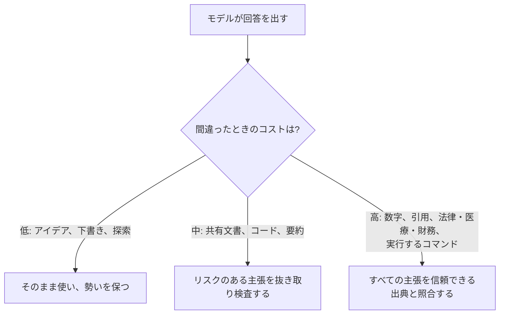

<LevelBadge level="intermediate" />

**ハルシネーション**とは、モデルが誤った内容を完全な自信を持って述べてしまう現象です。これは嘘をついているわけでも、壊れているわけでもありません。LLM の仕組みの裏返しなのです。LLM は*もっともらしい*テキストを生成しますが、もっともらしさは必ずしも真実とは限りません（[LLMとは何か？](/docs/foundations/what-is-an-llm) を参照）。プロンプトだけで完全に取り除くことはできませんが、大幅に減らし、残りを見つけ出すことはできます。

## なぜ起こるのか

モデルは、ありそうな続きを予測します。何かを「知らない」とき、*最ももっともらしく見える*続きは、しばしば自信に満ちた、整った——そして誤った——回答になります。「自信がない」という余地をあなたが作らない限り、それを示す組み込みのシグナルは存在しません。

## リスクの高い領域

出力が次のものを含む場合は、最も懐疑的になりましょう。

- **引用、引用文、参考文献** — 捏造された論文、偽の URL、誤って帰属された引用文。
- **具体的な数字、日付、統計** — もっともらしいが捏造された数値。
- **ニッチまたはごく最近の事実** — モデルが確実に学習した範囲を超えるもの。
- **API やライブラリの詳細** — 存在しないメソッドやパラメータ。
- **人物や法律・医療に関する具体的事項** — 重大であり、微妙に間違いやすい。

## 減らすためのツールキット

これらを重ねて使いましょう。それぞれが役立ちます。

1. **出典に根拠づける。** 出典のテキストを貼り付け、*「上記のテキストのみから回答してください。そこに書かれていない場合は、その旨を述べてください」*と指示します。これは [RAG](/docs/foundations/rag) の中核となる考え方です。
2. **逃げ道を与える。** *「自信がない場合は『わかりません』と言ってください」*と明示的に許可します。これにより自信満々な推測が劇的に減ります。
3. **根拠と引用を求める。** *「各主張を裏付ける文を正確に引用してください」*。裏付けのない主張が一目瞭然になります。
4. **創造性を下げる。** モデルが温度（temperature）の制御を公開している事実重視のタスクでは、これを下げます（[サンプリング制御](/docs/foundations/sampling-controls) を参照）。
5. **ツールを使う。** 計算、最新データ、検索が必要な場合は、記憶に頼らせるのではなく、電卓・検索・[ツール](/docs/api/tool-use) をモデルに与えます。
6. **クロスチェックする。** 同じ質問を2通りの聞き方で尋ねたり、2回目のパスで1回目を批評させたりします。

## コピペで使えるハルシネーション対策プロンプト

上記のツールキットの大部分は、再利用可能な1つのラッパーに集約できます。出典を指定された場所に貼り付け、質問してください。これは回答を根拠づけ、モデルに逃げ道を与え、引用を一度に強制します。

```text
あなたは以下の SOURCE のみから回答します。
ルール:
- 回答が SOURCE に含まれていない場合は、正確に次のように答えてください: 「出典に記載がありません。」
- すべての主張の後に、それを裏付ける SOURCE 内の文を正確に引用してください。
- 外部の知識、推定、想定を加えないでください。

SOURCE:
"""
[ここに文書、文字起こし、またはデータを貼り付けてください]
"""

QUESTION: [あなたの質問]
```

なぜ機能するのか：「出典に記載がありません」という逃げ道が推測へのプレッシャーを取り除き、文を引用するルールが裏付けのない主張を隠すことを不可能にします。本当にモデル自身の知識が欲しいときは SOURCE ブロックを外してください——ただし、その場合は検証の責任があなたに戻ってきます。

## 本当にあなたを守ってくれる心構え

:::warning 重要なものは——必ず検証する
出力を100%信頼できるものにするプロンプトは存在しません。重要なもの——報告書の中の数字、引用、これから実行するコマンド、医療・法律・財務の詳細——については、**信頼できる出典と照合してください**。AI は最終的な権威ではなく、素早い初稿として扱いましょう。これが[責任ある利用](/docs/security/responsible-use)の核心です。
:::

シンプルなルール：**間違ったときのコストが、検証の量を決める。** ブレインストーミング中？ 自由に信頼しましょう。統計を公開する？ 毎回検証しましょう。



## 次へ

- [検索拡張生成 (RAG)](/docs/foundations/rag)
- [AI品質の評価 (Evals)](/docs/foundations/evals)
- [責任ある利用、倫理、検証](/docs/security/responsible-use)
