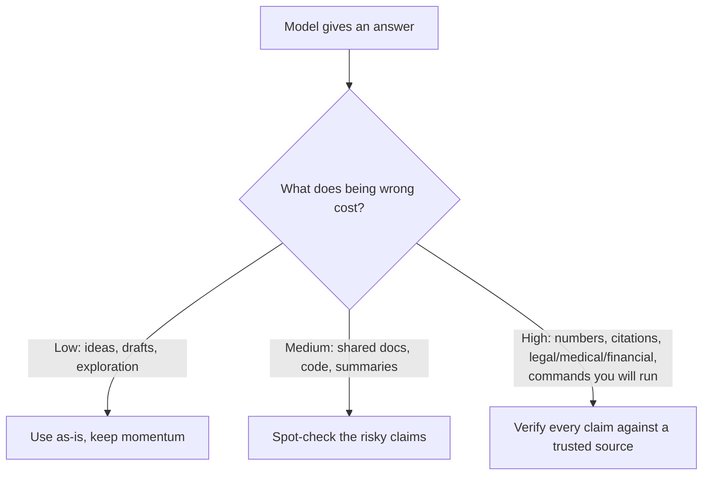

<LevelBadge level="intermediate" />

<Callout type="objectives" items={["なぜモデルが自信たっぷりで整った誤答を作り出すのかを理解する", "最も懐疑的になるべき5つのハイリスク領域を見分ける", "6部構成のツールキットを使ってハルシネーションを劇的に減らす", "根拠づけし、逃げ道を与え、引用を強制する、コピペできるアンチ・ハルシネーション・プロンプトを1つ使う", "検証の労力を「間違えたときのコスト」に見合わせるマインドセットを身につける"]} />

**ハルシネーション** とは、モデルが誤った内容を完全な自信を持って述べてしまう現象です。これは嘘をついているわけでも、壊れているわけでもありません。LLMの仕組みの裏返しなのです。LLMは *もっともらしい* テキストを生成しますが、もっともらしさは必ずしも真実とは限りません（[LLMとは何か？](/docs/foundations/what-is-an-llm) を参照）。プロンプトだけで完全に取り除くことはできませんが、劇的に減らし、残りを捕まえることはできます。

## なぜ起こるのか

モデルは、ありそうな続きを予測します。何かを「知らない」とき、*最ももっともらしく見える* 続きは、しばしば自信に満ちた、整った——そして誤った——回答になります。あなたが不確実さのための余地を作らない限り、それを示す組み込みの「自信がない」シグナルは存在しません。

<Callout type="tip" items={["ほとんどのハルシネーションへの対策は、意図的に不確実さのための余地を作ること——モデルに「わからない」と言う許可を与えることです。"]} />

## ハイリスクな領域

出力が次のものを含む場合は、最も懐疑的になりましょう。

- **引用、引用文、参考文献** — 捏造された論文、偽のURL、誤って帰属された引用文。
- **具体的な数字、日付、統計** — もっともらしいが捏造された数値。
- **ニッチまたはごく最近の事実** — モデルが確実に学習した範囲を超えるもの。
- **APIやライブラリの詳細** — 存在しないメソッドやパラメータ。
- **人物や法律・医療に関する具体的事項** — 重大であり、微妙に間違いやすい。

## 減らすためのツールキット

これらを重ねて使いましょう。それぞれが役立ちます。

<Steps items={[
  {title: "出典に根拠づける", body: "出典のテキストを貼り付け、「上記のテキストのみから回答してください。そこに書かれていない場合は、その旨を述べてください」と指示します。これはRAG (/docs/foundations/rag) の中核となる考え方です。"},
  {title: "逃げ道を与える", body: "「自信がない場合は『わかりません』と言ってください」と明示的に許可します——これにより自信満々な推測が劇的に減ります。"},
  {title: "根拠と引用を求める", body: "「各主張を裏付ける文を正確に引用してください」。裏付けのない主張が一目瞭然になります。"},
  {title: "創造性を下げる", body: "モデルが温度（temperature）の制御を公開している事実重視のタスクでは、これを下げます（Sampling Controls を /docs/foundations/sampling-controls で参照）。"},
  {title: "ツールを使う", body: "計算、最新データ、検索が必要な場合は、記憶に頼らせるのではなく、電卓・検索・ツール (/docs/api/tool-use) をモデルに与えます。"},
  {title: "クロスチェックする", body: "同じ質問を2通りの聞き方で尋ねたり、2回目のパスで1回目を批評させたりします。"}
]} />

## コピペで使えるアンチ・ハルシネーション・プロンプト

上記のツールキットの大部分は、再利用可能な1つのラッパーに集約できます。出典を指定された場所に貼り付け、質問してください——これは回答を根拠づけ、モデルに逃げ道を与え、引用を一度に強制します。

<PromptCard title="アンチ・ハルシネーション・ラッパー">{`You answer ONLY from the SOURCE below.
Rules:
- If the answer is not in the SOURCE, reply exactly: "Not stated in the source."
- After every claim, quote the exact sentence from the SOURCE that supports it.
- Do not add outside knowledge, estimates, or assumptions.

SOURCE:
"""
[paste the document, transcript, or data here]
"""

QUESTION: [your question]`}</PromptCard>

なぜ機能するのか：「Not stated in the source」という逃げ道が推測へのプレッシャーを取り除き、文を引用するルールが裏付けのない主張を隠すことを不可能にします。本当にモデル自身の知識が欲しいときはSOURCEブロックを外してください——ただし、その場合は検証の責任があなたに戻ってきます。

## 本当にあなたを守ってくれる心構え

<Callout type="warning" items={["出力を100%信頼できるものにするプロンプトは存在しません。重要なもの——報告書の中の数字、引用、これから実行するコマンド、医療・法律・財務の詳細——については、信頼できる出典と照合してください。AIは最終的な権威ではなく、素早い初稿として扱いましょう。これが責任ある利用 (/docs/security/responsible-use) の核心です。"]} />

シンプルなルール：**間違ったときのコストが、検証の量を決める。** ブレインストーミング中？ 自由に信頼しましょう。統計を公開する？ 毎回検証しましょう。

<Callout type="takeaways" items={["ハルシネーションは、もっともらしさに基づく生成の副産物であり、プロンプトだけで完全に取り除けるバグではない。", "引用、数字・日付、ニッチまたは最近の事実、APIの詳細、人物・法律・医療の具体的事項には最も懐疑的になること。", "ツールキットを重ねる：出典に根拠づける、逃げ道を与える、引用を求める、温度を下げる、ツールを使う、クロスチェックする。", "1つのラッパープロンプトが、根拠づけ＋逃げ道＋引用の強制を一度にこなす。", "検証の労力を「間違えたときのコスト」に見合わせる——安いときは自由に信頼し、重大なときはすべての主張を検証する。"]} />

<Quiz title="理解度チェック" questions={[
  {
    q: "なぜモデルはハルシネーションを起こすのか？",
    options: [
      "ユーザーに対して意図的に嘘をついているから",
      "最ももっともらしく見える続きを予測しており、それが常に真実とは限らないから",
      "壊れていて再学習が必要だから",
      "回答の途中で必ずメモリを使い果たすから"
    ],
    answer: 1,
    explain: "ハルシネーションはLLMの仕組みの裏返しです：もっともらしいテキストを生成しますが、もっともらしさは必ずしも真実とは限りません。モデルが何かを知らないとき、最ももっともらしく見える続きは、しばしば自信に満ち、整っていて、そして誤りです。"
  },
  {
    q: "次のうち、最も懐疑的になるべきハイリスクな領域はどれか？",
    options: [
      "アイデアを出すためのオープンエンドなブレインストーミング",
      "すでに自分が書いた文の言い換え",
      "具体的な数字、日付、統計",
      "自分で確かめられる単純な定義を尋ねること"
    ],
    answer: 2,
    explain: "具体的な数字、日付、統計はハイリスクな領域です——もっともらしくても捏造されている可能性があります。他のハイリスク領域には、引用・引用文、ニッチまたは最近の事実、APIの詳細、人物・法律・医療に関する具体的事項があります。"
  },
  {
    q: "「自信がない場合は『わかりません』と言ってください」のような明示的な逃げ道をモデルに与えることの、最も直接的な効果は何か？",
    options: [
      "モデルが速くなる",
      "自信満々な推測を劇的に減らす",
      "温度を自動的に上げる",
      "モデルをライブ検索に接続する"
    ],
    answer: 1,
    explain: "「わからない」と言うことを明示的に許可すると、自信満々な推測を生み出すプレッシャーが取り除かれ、ハルシネーションした回答が劇的に減ります。"
  },
  {
    q: "回答にどれだけの検証が必要かを決めるルールは何か？",
    options: [
      "回答の長さ",
      "モデルが述べた自信のレベル",
      "間違ったときのコスト",
      "プロンプトを書くのにかかった時間"
    ],
    answer: 2,
    explain: "間違ったときのコストが検証の量を決めます。ブレインストーミング中？ 自由に信頼しましょう。統計を公開する？ 毎回検証しましょう。"
  },
  {
    q: "アンチ・ハルシネーション・ラッパー・プロンプトにおいて、裏付けのない主張を隠せなくしているのは何か？",
    options: [
      "温度をゼロまで下げること",
      "すべての主張の後にSOURCEから裏付けとなる文を正確に引用させるルール",
      "質問を2回すること",
      "SOURCEブロックを外すこと"
    ],
    answer: 1,
    explain: "文を引用するルールが、各主張をSOURCE内の正確な文で裏付けることをモデルに強制するため、実際には裏付けのない主張が一目瞭然になります。「Not stated in the source」という逃げ道が推測へのプレッシャーを取り除きます。"
  }
]} />

## 次へ

- [検索拡張生成（RAG）](/docs/foundations/rag)
- [AI品質の評価（Evals）](/docs/foundations/evals)
- [責任ある利用、倫理、検証](/docs/security/responsible-use)
