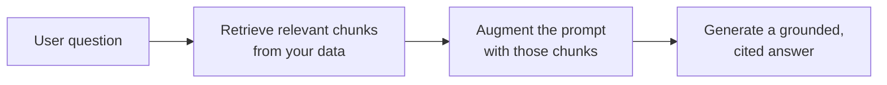

<LevelBadge level="intermediate" />

**RAG**は、モデルが訓練されたことのない**あなたの**データ（文書、ナレッジベース、コードベース）について、モデルに質問へ答えさせます。アイデアはシンプルです。関連する断片を**検索（retrieve）**し、それらでプロンプトを**拡張（augment）**し、その断片に根拠づけられた回答を**生成（generate）**します。

## ループ

1. データを**インデックス化**します。チャンクに分割し、[埋め込み](/docs/foundations/embeddings)、ベクトル（および/またはキーワード）インデックスに保存します。
2. 質問に最も関連する上位チャンクを**検索**します。
3. **拡張**：それらのチャンクを、*「以下のコンテキストからのみ回答してください。そこになければ、ないと言ってください」*のような指示とともにプロンプトに入れます。
4. **生成** — そして理想的には、各主張がどのチャンクから来たかを**引用**します。

## なぜファインチューニングではなくRAGなのか？

RAGは知識を**新鮮**に保ち（モデルではなくデータを更新する）、**引用**を提供し、再訓練よりはるかに安価です。「自分の文書について答える」というほとんどのニーズには、これが正しい最初のツールです。[ファインチューニング vs プロンプティング vs RAG](/docs/foundations/finetune-vs-prompt-vs-rag)を参照してください。

## 失敗モード（RAGの品質が死ぬところ）

- **悪い検索 = 悪い回答。** 正しいチャンクが検索されなければ、モデルはそれを使えません。「RAGが間違っている」問題のほとんどは*検索*の問題です。
- **チャンク分割が粗すぎ/細かすぎ** — 関連性を台無しにします（[埋め込み](/docs/foundations/embeddings)）。
- **根拠づけの指示がない** — モデルは検索した事実と自身の推測を混ぜてしまいます。コンテキストからのみ回答し、欠落を認めるよう指示しましょう。
- **詰め込みすぎ** — 無関係なチャンクはシグナルを薄め、[トークン](/docs/foundations/tokens-and-context)のコストがかかります。少数の高品質なチャンクを検索しましょう。
- **引用がない** — 検証できないので、信頼できません。

:::tip 検索を別々に評価する
「正しいチャンクを検索したか？」を「モデルはうまく答えたか？」とは別に測りましょう。問題を素早く特定できます。[評価](/docs/foundations/evals)を参照してください。
:::

## 次に読む

- [埋め込みとベクトル検索](/docs/foundations/embeddings)
- [ファインチューニング vs プロンプティング vs RAG](/docs/foundations/finetune-vs-prompt-vs-rag)
- [リサーチと統合のプレイブック](/docs/playbooks/research)
