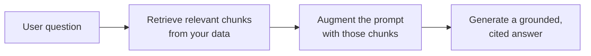

<LevelBadge level="intermediate" />

<Callout type="objectives" items={[
  "RAGとは何か、そして「検索・拡張・生成」のループ",
  "インデックス化・検索・拡張・引用付き生成のやり方",
  "「自分のドキュメントについて回答する」用途でRAGがファインチューニングに勝る理由",
  "RAGの品質を台無しにする5つの失敗パターン",
  "最大の2つのギャップを埋める、コピペできるグラウンディングプロンプト"
]} />

**RAG** は、モデルが学習したことのない**あなたの**データ — ドキュメント、ナレッジベース、コードベース — について質問に答えられるようにする手法です。考え方はシンプルです。関連する断片を**検索（retrieve）**し、それらでプロンプトを**拡張（augment）**し、その断片に基づいた回答を**生成（generate）**します。

## ループ

<Steps items={[
  {title: "データをインデックス化する", body: "チャンクに分割し、埋め込みを生成し（/docs/foundations/embeddings を参照）、ベクトル（および/またはキーワード）インデックスに保存する。"},
  {title: "検索する", body: "質問に最も関連性の高い上位チャンクを取り出す。"},
  {title: "拡張する", body: "それらのチャンクを、「以下のコンテキストのみから回答せよ。コンテキストに無ければ、無いと述べよ」といった指示とともにプロンプトに入れる。"},
  {title: "生成する", body: "回答を生成する。理想的には、各主張がどのチャンク由来かを引用する。"}
]} />

インデックス化における埋め込みのステップについては、[埋め込みとベクトル検索](/docs/foundations/embeddings)を参照してください。

## なぜファインチューニングではなくRAGなのか？

<Callout type="tip" items={[
  "新鮮: モデルではなくデータを更新する",
  "検証可能: 引用を提供する",
  "安価: 再学習よりはるかに安い"
]} />

ほとんどの「自分のドキュメントについて回答する」用途では、RAGが最初に選ぶべき正しいツールです — [ファインチューニング vs プロンプティング vs RAG](/docs/foundations/finetune-vs-prompt-vs-rag)を参照してください。

## 失敗パターン（RAGの品質が死ぬ場所）

<Callout type="warning" items={[
  "悪い検索 = 悪い回答。正しいチャンクが検索されなければ、モデルはそれを使えない。「RAGが間違っている」問題のほとんどは検索の問題である。",
  "チャンク分割が粗すぎたり細かすぎたりすると関連性が損なわれる（埋め込みを参照）。",
  "グラウンディング指示がない: モデルは検索した事実と自身の推測を混ぜてしまう。コンテキストのみから回答し、ギャップを認めるよう指示すること。",
  "詰め込みすぎ: 無関係なチャンクはシグナルを薄め、トークンを浪費する。少数の高品質なチャンクを検索すること。",
  "引用がない: 検証できないので、信頼できない。"
]} />

チャンク分割の失敗は[埋め込み](/docs/foundations/embeddings)に関係し、詰め込みすぎは[トークン](/docs/foundations/tokens-and-context)を浪費します。

<Callout type="tip" items={[
  "検索を別々に評価する: 「正しいチャンクを検索できたか？」を「モデルはうまく回答したか？」とは別に測定する。問題を素早く局所化できる。Evals (/docs/foundations/evals) を参照。"
]} />

## コピペ用: グラウンディングプロンプト

最もレバレッジの高い単一の修正は、グラウンディング指示です。検索したチャンクを次のようなテンプレートに入れてください。これはモデルに、コンテキスト*のみ*から回答し、各主張を引用し、推測する代わりにギャップを認めることを強制します。

<PromptCard title="グラウンディングプロンプト">{`You are answering strictly from the context below.

Rules:
- Use ONLY the context to answer. Do not use outside knowledge.
- Cite the source after each claim, like [chunk 2].
- If the answer is not in the context, reply exactly:
  "I don't have that in the provided sources."
- Quote numbers and names verbatim — never paraphrase a figure.

Context:
[chunk 1] ...
[chunk 2] ...
[chunk 3] ...

Question: <the user's question>`}</PromptCard>

これを*少数の*高品質なチャンク（検索したすべてではない）と組み合わせれば、最大の2つのギャップを一度に埋められます。すなわち、幻覚的な混入と検証不能な回答です。そして検索と生成を別々に[評価](/docs/foundations/evals)すれば、どちらの半分を調整すべきかがわかります。

## 用語をマスターする

<Flashcards cards={[
  {front: "RAG", back: "あなたのデータの関連する断片を検索し、それらでプロンプトを拡張し、その断片に基づいた回答を生成する。"},
  {front: "インデックス化ステップ", back: "データをチャンクに分割し、埋め込みを生成し、ベクトルおよび/またはキーワードインデックスに保存する。"},
  {front: "拡張ステップ", back: "検索したチャンクを、グラウンディング指示とともにプロンプトに入れる: コンテキストのみから回答し、ギャップを認める。"},
  {front: "なぜファインチューニングよりRAGか", back: "新鮮（モデルではなくデータを更新）、引用を提供、再学習よりはるかに安価。"},
  {front: "RAGの第1の失敗パターン", back: "悪い検索。正しいチャンクが検索されなければ、モデルはそれを使えない — 「RAGが間違っている」問題のほとんどは検索の問題である。"},
  {front: "グラウンディング指示", back: "モデルに、コンテキストのみから回答し、各主張を引用し、回答がそこに無いときはそう述べるよう指示する。"}
]} />

<Quiz title="理解度チェック" questions={[
  {
    q: "RAGの3文字は順番に何を表しますか？",
    options: ["Read, Analyze, Generate", "Retrieve, Augment, Generate", "Rank, Aggregate, Group", "Reduce, Append, Generate"],
    answer: 1,
    explain: "RAG = 関連チャンクを検索（Retrieve）し、それらでプロンプトを拡張（Augment）し、根拠に基づいた回答を生成（Generate）する。"
  },
  {
    q: "「RAGが間違っている」とき、最も多くの場合の本当の問題は何ですか？",
    options: ["モデルが小さすぎる", "検索 — 正しいチャンクが取り出されなかった", "コンテキストウィンドウのトークンが少なすぎる", "埋め込みが誤ってファインチューニングされている"],
    answer: 1,
    explain: "悪い検索 = 悪い回答。正しいチャンクが検索されなければ、モデルはそれを使えない。「RAGが間違っている」問題のほとんどは検索の問題である。"
  },
  {
    q: "「自分のドキュメントについて回答する」用途で、RAGがファインチューニングより通常好まれるのはなぜですか？",
    options: ["モデルを大きくするから", "知識を新鮮に保ち、引用を提供し、再学習より安いから", "プロンプトが一切不要になるから", "モデルが決して幻覚を起こさないことを保証するから"],
    answer: 1,
    explain: "RAGは知識を新鮮に保ち（モデルではなくデータを更新）、引用を提供し、再学習よりはるかに安い。"
  },
  {
    q: "モデルが事実と推測を混ぜるのを止めるための、最もレバレッジの高い単一の修正は何ですか？",
    options: ["可能なすべてのチャンクを検索する", "コンテキストのみから回答することを強制するグラウンディング指示", "温度（temperature）を上げる", "トークンを節約するために引用を省く"],
    answer: 1,
    explain: "グラウンディング指示は、モデルにコンテキストのみから回答し、各主張を引用し、推測する代わりにギャップを認めることを強制する。"
  },
  {
    q: "検索を生成とは別に評価するのはなぜですか？",
    options: ["モデルプロバイダーによって要求されるから", "問題を素早く局所化できる — どちらの半分を調整すべきかがわかるから", "トークンコストが自動的に下がるから", "そうしないと生成を測定できないから"],
    answer: 1,
    explain: "「正しいチャンクを検索できたか？」を「モデルはうまく回答したか？」とは別に測定することで、問題を素早く局所化でき、どちらの半分を調整すべきかがわかる。"
  }
]} />

<Callout type="takeaways" items={[
  "RAG = 関連チャンクを検索し、プロンプトを拡張し、根拠に基づいた引用付きの回答を生成する。",
  "インデックス化（チャンク分割 + 埋め込み + 保存）し、上位チャンクを検索し、グラウンディング指示で拡張し、引用付きで生成する。",
  "ドキュメントQ&AではファインチューニングよりRAGを選ぶ: 新鮮、引用付き、安価。",
  "ほとんどの失敗は検索の失敗である — すべてではなく、少数の高品質なチャンクを検索する。",
  "常にグラウンディング指示を加えて引用する。検索と生成を別々に評価する。"
]} />

## 次へ

- [埋め込みとベクトル検索](/docs/foundations/embeddings)
- [ファインチューニング vs プロンプティング vs RAG](/docs/foundations/finetune-vs-prompt-vs-rag)
- [リサーチと統合のプレイブック](/docs/playbooks/research)
