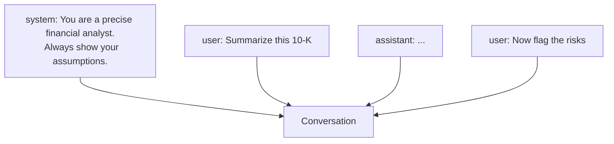

<LevelBadge level="beginner" />

すべてのAIの会話は**メッセージ**から構成され、各メッセージには**役割（role）**があります。3つの役割を理解すれば、モデルをどう操縦するか——そしてなぜ一部の指示は定着し、他は定着しないのか——がわかります。

## 3つの役割

- **システム（System）** — 会話全体のための最上位のセットアップ。モデルが何者であるべきか、ルール、フォーマット。一度設定すれば、全体に適用されます。
- **ユーザー（User）** — それはあなたです。あなたの質問と入力を、ターンごとに。
- **アシスタント（Assistant）** — モデルの返答。（例として*アシスタントに言葉を言わせる*こともできます。[few-shot](/docs/prompting/few-shot)を参照。）

## なぜシステムプロンプトが最も強力なレバーなのか

システムメッセージは、**それに続くすべて**を枠づけます。ここでモデルの役割、基準、トーン、厳格なルールを設定し、モデルはそれを重く扱います。会話（やアプリ）全体で一貫した挙動が欲しいなら、ユーザーのターンに埋め込むのではなく、ここに置きましょう。

実際には：
- **チャットアプリ：** あなたのアカウントの[カスタム指示](/docs/claude-app/custom-instructions)が、個人用のシステムプロンプトとして機能します。
- **Claude Code：** [CLAUDE.md](/docs/claude-code/claude-md)が、あなたのプロジェクトにとってこの役割を果たします。
- **API：** [`system`パラメータ](/docs/api/first-call)。

同じ考え方の、3つの表面です。

## 実践的なヒント

- **システムプロンプトで具体的に**役割、ルール、出力フォーマットを述べましょう。最も効果の高い場所です。
- **ユーザーのターンは実際のタスクに集中させ**、毎ターンでルールを貼り直さないようにしましょう。
- **指示が衝突したら？** 後から来た明示的なユーザー指示が、曖昧なシステム指示を上書きすることがあります。意外な結果を避けるため、一貫性を保ちましょう（[トラブルシューティング](/docs/contribute/troubleshooting)）。

## 次に読む

- [プロンプティングの基礎](/docs/prompting/basics)
- [カスタム指示とスタイル](/docs/claude-app/custom-instructions)
- [トークン、コンテキスト、メモリ](/docs/foundations/tokens-and-context)
