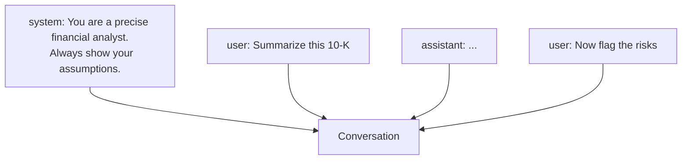

<LevelBadge level="beginner" />

<Callout type="objectives" items={["すべてのAI会話を構成する3つのロールと、それぞれの用途", "システムプロンプトが挙動を制御する最も影響力のある場所である理由", "同じ考え方が、チャットアプリ、Claude Code、APIでどう現れるか", "よくある落とし穴:ルールをシステムメッセージではなくユーザーターンに埋めてしまうこと"]} />

すべてのAI会話は **メッセージ** で構成されていて、各メッセージには **ロール** があります。3つのロールを理解すれば、モデルの操縦方法がわかります。そしてなぜ一部の指示は定着し、他は定着しないのかも見えてきます。

## 3つのロール

<Steps items={[{title: "system — 常設のブリーフ", body: "会話全体の最上位のセットアップです。モデルが誰であるべきか、ルール、出力フォーマット。一度設定すれば、以降のすべてのターンに適用されます。"}, {title: "user — 毎回のあなたのターン", body: "あなたの質問と入力を一度に1ターンずつ。実際のタスクに集中させ、毎ターン常設ルールを貼り直さないでください。"}, {title: "assistant — モデルの返信", body: "モデルの応答です。few-shot例としてアシスタントの口に言葉を入れることもできます(/docs/prompting/few-shot 参照)。モデルはそれを過去のターンとして扱い、同じスタイルで続けます。"}]} />

```mermaid
flowchart TD
  S["system: You are a precise financial analyst.
  Always show your assumptions."] --> C[Conversation]
  U1[user: Summarize this 10-K] --> C
  A1[assistant: ...] --> C
  U2[user: Now flag the risks] --> C
```

## システムプロンプトが最も強力なレバーである理由

システムメッセージは **その後のすべて** の枠組みを作ります。ここでモデルのロール、基準、トーン、厳格なルールを設定します。そしてモデルはこれを重く重み付けします。会話全体(またはアプリ全体)で一貫した挙動が欲しいなら、ここに置くべきです。ユーザーターンに埋め込むのではなく。

同じ考え方、3つの表面:

| 表面 | システムプロンプトの役割を果たすもの |
|---|---|
| **チャットアプリ**(Claude.ai、ChatGPT、Gemini) | アカウントの[カスタムインストラクション](/docs/claude-app/custom-instructions) |
| **Claude Code** | プロジェクトルートの[`CLAUDE.md`](/docs/claude-code/claude-md) |
| **API** | リクエストの `system` パラメータ([最初の呼び出し](/docs/api/first-call)) |

## Before/After の実例

最もよくある間違いは、常設ルールをシステムメッセージではなく毎回のユーザーターンに入れることです。何が変わるか見てみましょう。

**Before — ルールがユーザーターンに詰め込まれ、毎回繰り返される:**

<PromptCard title="ユーザーターン内のルール(脆弱)">{`user: You are a precise financial analyst. Always show your assumptions.
Never invent numbers. Now: summarize this 10-K.
[10-K text]`}</PromptCard>

**After — ルールをシステムメッセージに引き上げ、ユーザーターンをクリーンに保つ:**

<PromptCard title="システムメッセージ内のルール(持続的)">{`system: You are a precise financial analyst. Always show your assumptions.
Never invent numbers. Cite the section of the filing for each claim.

user: Summarize this 10-K.
[10-K text]

user: Now flag the risks.`}</PromptCard>

「After」版はターンをまたいで挙動を安定させ、毎ターン送り直すトークンを半減させ、アプリの変更を容易にします。常設ブリーフを1ヶ所で編集できるからです。

## アシスタントの口に言葉を入れる

活用されていない技:アシスタントターンを **few-shot例** または **フォーマットプライマー** として前置きすると、モデルはそのスタイルで続きを書きます。これが大きなプロンプトなしにテンプレートやルーブリックを強制する方法です。

<PromptCard title="アシスタントにフォーマットに従うようにプライミングする">{`system: You are a code reviewer. Return only the sections below.

user: Review this pull request. [diff]

assistant: ## Summary
- 
## Risks
- 
## Suggested changes
-`}</PromptCard>

モデルはあなたが仕込んだアシスタントターンを過去の応答として扱い、同じ形で完成させます。

## よくある間違い

<Callout type="tip" items={["毎回のユーザーターンにルールを入れる — 常設ルールはシステムメッセージに一度だけ置き、ユーザーターンは実際のタスクに使う。", "ターン間で自分と矛盾する — 後の明示的なユーザー指示は、あいまいなシステム指示を上書きすることがある。一貫性を保つこと。", "アシスタントロールを読み取り専用扱いする — フォーマット、トーン、few-shotパターンをプライミングできる。", "変化する事実でシステムプロンプトを過負荷にする — 揮発性の事実(ドキュメント、データ、現在の状態)は、システムメッセージではなくユーザーターンや検索コンテキストに入れる。"]} />

## 自分でチェック

<Quiz title="自分でチェック" questions={[{q: "トーン、フォーマット、ロールのような常設ルールはどこに置くべきですか?", options: ["モデルが忘れないように、毎回のユーザーターンで繰り返す", "システムメッセージに一度だけ設定する", "アシスタントの最初の応答内", "プロンプトではなく、モデル設定内"], answer: 1, explain: "システムメッセージは会話全体の枠組みを作ります。そこにルールを一度設定するほうが、毎回のユーザーターンで繰り返すより持続的で、安価で、変更が容易です。"}, {q: "Claude Codeで、APIの system パラメータと同じ役割を果たすファイルは?", options: ["package.json", "CLAUDE.md", "README.md", ".env"], answer: 1, explain: "プロジェクトルートの CLAUDE.md は Claude Code の常設ブリーフです。そのプロジェクトのシステムプロンプトに相当します。"}, {q: "モデルが返信する前に、自分でアシスタントターンにテキストを書き込めますか?", options: ["いいえ — アシスタントロールは読み取り専用", "はい — アシスタントターンを仕込むとフォーマットやスタイルがプライミングされ、モデルがそこから続く", "APIでのみ可能で、チャットアプリでは不可", "ファインチューニングを使う場合のみ"], answer: 1, explain: "アシスタントターンを仕込むのはテンプレートや few-shot スタイルを強制する一般的な手法です。モデルはそれを過去の応答として扱います。"}, {q: "ユーザーターンがシステムプロンプトと矛盾する内容を言ったとき、何が起きがちですか?", options: ["常にシステムプロンプトが勝つ", "後の明示的なユーザー指示は、あいまいなシステム指示を上書きすることがある — 驚きを避けるため一貫性を保つこと", "モデルが応答を拒否する", "モデルが両者を平均する"], answer: 1, explain: "システムプロンプトは重く重み付けされますが、明確で明示的なユーザー指示はあいまいなものを上書きできます。ロール間の一貫性が重要です。"}]} />

<Callout type="takeaways" items={["3つのロール:system が枠組みを設定し、user が毎ターン尋ね、assistant が返信する(または仕込まれる)。", "システムプロンプトは最も影響力のあるレバー — 常設ルールをそこに一度だけ置く。", "チャットのカスタムインストラクション、CLAUDE.md、APIの `system` フィールドは、3つの表面での同じ考え方。", "揮発性の事実はユーザーターンや検索に属し、システムメッセージには属さない。"]} />

## 次へ

- [プロンプティングの基礎](/docs/prompting/basics)
- [カスタムインストラクションとスタイル](/docs/claude-app/custom-instructions)
- [トークン、コンテキスト、メモリ](/docs/foundations/tokens-and-context)
