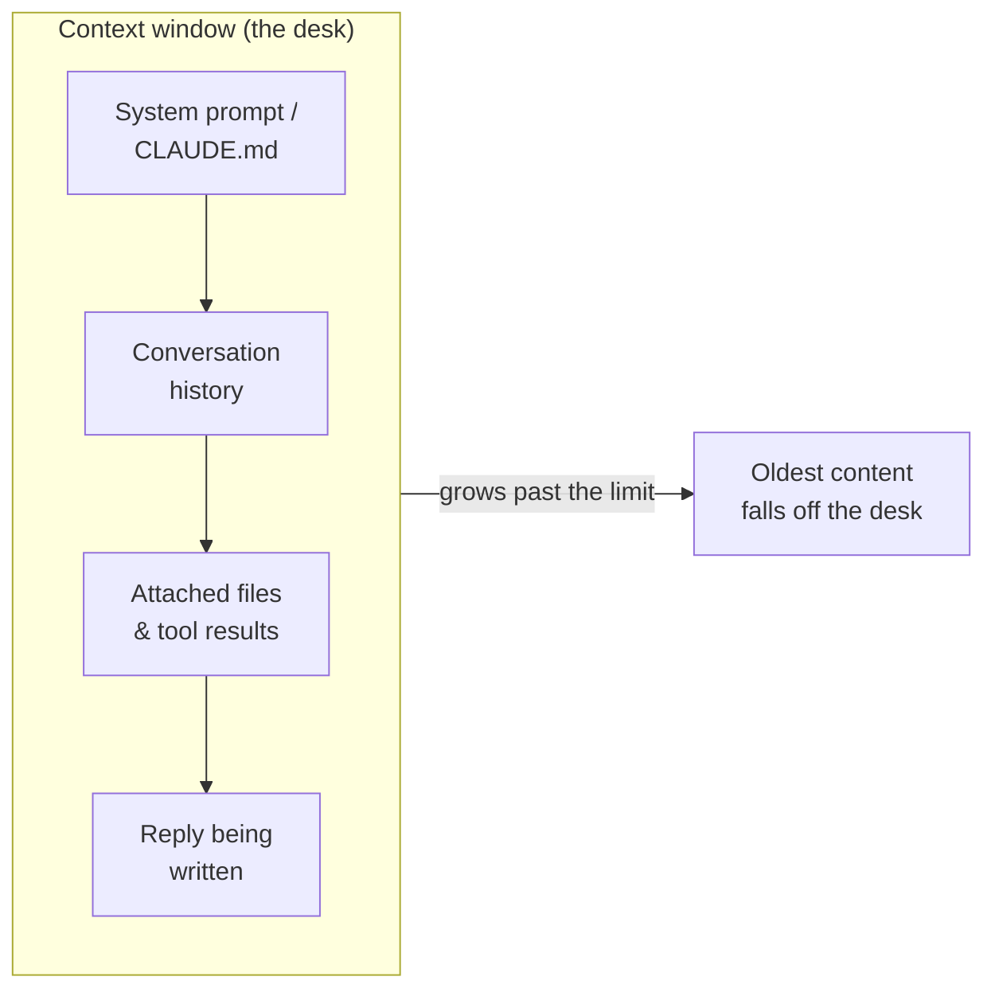

<LevelBadge level="beginner" />

3つの考え方が、多くの「なぜこうなったの?」という瞬間を解き明かしてくれます。それは **トークン**、**コンテキストウィンドウ**、そして **メモリ** です。これらを理解すれば、話のドリフト、忘却、想定外の請求に驚かなくなります。

<Callout
  type="objectives"
  items={[
    "テキストをモデルと同じように読む — 単語や文字ではなくトークンで",
    "コンテキストウィンドウを有限のデスクとしてイメージし、いつ物が落ちるかを予測する",
    "「コンテキストの腐敗(context rot)」を見抜く — なぜモデルは長い入力の中間を見失うのか",
    "「メモリ」の4つの本当の出どころと、意図的にそれを与える方法を知る"
  ]}
/>

## トークン: モデルが思考する単位

モデルは文字や単語を読みません — **トークン**、つまり英語ではおよそ単語の¾ほどのテキストの塊を読みます。"Unbelievable" は 3〜4 トークンかもしれません。よく使う単語はそれぞれ 1 トークン。スペースやカンマ、コードの一部もそれぞれトークンを消費します。あなたの入力 *も* モデルの出力 *も* 両方カウントされ、トークンこそが [価格と上限](/docs/api/tokens-and-pricing) を測る単位そのものです。

手で数える必要はありませんが、おおまかな感覚があると役立ちます。**約750語 ≈ 約1,000トークン**。何か入力して観察してみてください。

<TokenEstimator />

:::tip なぜ比率が変わるのか
平易な英語はトークンあたり¾語くらいに収まります。コード、JSON、非ラテン文字、長いURL、まれな単語は *より多くの* トークンに分割されます — だから500行のファイルや中国語の段落は、語数から想像するよりコストがかかります。請求や上限に驚いたとき、たいていこれが理由です。
:::

## コンテキストウィンドウ: ワーキングメモリ

**コンテキストウィンドウ** とは、モデルが一度に考慮できるトークンの最大数です — *あなたのシステムプロンプト、これまでの会話すべて、添付したファイル、そして書いている途中の返信* が、すべてまとめて含まれます。これはモデルのデスクだと考えてください。大きいけれど有限です。ウィンドウのサイズはモデルによって異なり、増え続けています — 1つを暗記するのではなく、現在の数値は [モデルと価格](/docs/whats-new/models-and-pricing) を参照してください。

モデルがその瞬間に「知っている」ものはすべて、そのデスクの上にあります。

会話がウィンドウを超えて大きくなると、**最も古い内容が落ちていきます**。だから非常に長いチャットは、どう始まったかを「忘れた」ように見えたり、当初の指示からそれていったりするのです。

## コンテキストの腐敗: 単に *満杯* か *空* かの問題ではない

もっと微妙な問題があります。すべてがまだ収まっている場合でも、モデルは長い入力の **先頭と末尾** を、**中間** よりも確実に使う傾向があります。50ページの貼り付けの中央に、唯一重要な一文を埋め込むと、それは軽視されるかもしれません — しばしば *「中間で迷子(lost in the middle)」* と呼ばれる失敗モードです。

<VerifyNote lastVerified="2026-06-29" source="https://arxiv.org/abs/2307.03172">「中間で迷子(lost in the middle)」効果 — コンテキストの中ほどに置かれた情報の利用が低下する現象 — は Liu et al. (2023) によって文書化されました。新しいロングコンテキストモデルはこれをよりうまく扱いますが、以下の実践的な習慣は依然として役立ちます。</VerifyNote>

<Steps
  items={[
    {title: "依頼を先頭に置く", body: "長いドキュメントを貼り付ける前に、実際の指示や質問を先に置く — その後ろに埋めない。"},
    {title: "末尾で言い直す", body: "長い内容のあとに、重要な指示を1行で繰り返す。先頭+末尾の位置が最も強い。"},
    {title: "貼る前に削る", body: "無関係なセクションを落とす。中間のノイズが減れば、残ったシグナルにより多くの注意が向く。"},
    {title: "巨大なら分割する", body: "非常に大きな入力では、すべてを投げ込むのではなく要約するかチャンクに分ける — もしくは新しいサブタスク用に新規チャットを始める。"}
  ]}
/>

以下は同じ依頼を、指示が強い位置に来るように構成したものです。

<PromptCard title="指示を先頭に、末尾で言い直す">{`Task: Find every place this contract caps our liability, and quote the exact clause.

[... paste the full 40-page contract here ...]

Reminder of the task: list only the liability-cap clauses, with exact quotes and section numbers. Ignore everything else.`}</PromptCard>

:::tip Claude Code では
長いエージェントセッションも同じ天井にぶつかります。Claude Code はそれを意図的に管理します — 履歴をコンパクト化し、何を視界に留めるかをあなたが操れるようにします。[コンテキスト管理](/docs/claude-code/context-management) と [コンテキストエンジニアリング](/docs/frontiers/context-engineering) を参照してください。
:::

## メモリ: 与えない限り、存在しない

デフォルトでは、各会話は **白紙の状態** です。モデルはあなたの前回のチャットを覚えていません。メモリのように見えるものはすべて、次の4つのうちのどれかです。

| 出どころ | それは何か | あなたが制御する方法 |
| --- | --- | --- |
| **再送される履歴** | チャットアプリは毎ターン会話を再送し、ウィンドウが満杯になるまで続ける | 新規チャットを始める。スレッドを焦点の絞られた状態に保つ |
| **メモリ機能** | 一部の Claude のサーフェスはチャットをまたいで事実を引き継ぐ | [チャット間のメモリ](/docs/claude-app/memory) 設定 |
| **あなたが与えるファイル** | 意図的に添付する永続的なコンテキスト | [プロジェクト](/docs/claude-app/projects)、[CLAUDE.md](/docs/claude-code/claude-md) |
| **あなた自身のコード** | API は **ステートレス** — 過去のメッセージを再送する | [最初の API 呼び出し](/docs/api/first-call) |

一貫した要点: *モデルに何かを覚えていてほしいなら、それをデスクの上に置き続けなければなりません。*

## なぜこれが重要なのか

ほぼすべての「以前の指示を無視した」「話を見失った」という問題は、3つのうちの1つにたどり着きます。ウィンドウが満杯になった、新しいセッションが冷たい状態で始まった、あるいは重要な詳細が長い貼り付けの死んだ中間に座っていた、のいずれかです。これを知っていれば、重要なものを *視界に* 保つようにプロンプトとセッションを構成できます。

## 確認しよう

<Quiz
  questions={[
    {
      q: "平易な英語750語は、おおよそ何トークンですか?",
      options: ["約250", "約1,000", "約3,000", "ちょうど750"],
      answer: 1,
      explain: "便利な目安は、通常の英語で約750語 ≈ 約1,000トークンです。コードや非ラテン文字はこれより多くなります。"
    },
    {
      q: "長いチャットが、どう始まったかを「忘れ」始めます。最も可能性が高い原因は:",
      options: [
        "モデルが壊れている",
        "会話が大きくなるにつれて、最も古い内容がコンテキストウィンドウから落ちた",
        "モデルが以前のメッセージを永続的に学習した",
        "トークンが返金された"
      ],
      answer: 1,
      explain: "コンテキストウィンドウは有限です。会話がそれを超えると、最も古いトークンが「デスク」から落ちます — だから初期の指示が視界から消えることがあります。"
    },
    {
      q: "巨大なドキュメントと、1つの重要な指示を貼り付けなければなりません。最適な配置は?",
      options: [
        "指示はドキュメントのちょうど真ん中だけに",
        "指示を一番先頭に置き、さらに末尾で言い直す",
        "指示なし — モデルに推測させる",
        "モデルが見られない別のチャットに指示を置く"
      ],
      answer: 1,
      explain: "モデルは長い入力の先頭と末尾を最も確実に使います(「中間で迷子」)。依頼を先頭に置き、末尾で言い直しましょう。"
    }
  ]}
/>

## 重要な用語

<Flashcards
  title="語彙を定着させる"
  cards={[
    {front: "トークン", back: "モデルが実際に処理するテキストの塊 — 英語の単語のおよそ¾。入力と出力の両方がカウントされ、価格はトークンあたり。"},
    {front: "コンテキストウィンドウ", back: "モデルが一度に考慮できる最大トークン数: システムプロンプト + 履歴 + ファイル + 返信、すべてまとめて。有限 — 上限を超えた内容は落ちる。"},
    {front: "中間で迷子(lost in the middle)", back: "長い入力の先頭と末尾を、中間よりも確実に使う傾向。重要な指示は強い位置に置く。"},
    {front: "ステートレス性", back: "API は呼び出しの間に何も覚えていない。会話を続けるには、過去のメッセージを自分で再送する。"}
  ]}
/>

:::note 要点
- **トークン** は思考と請求の両方の単位 — 英語750語あたり約1,000、コードや他の文字ではより多い。
- **コンテキストウィンドウ** は有限のデスク。長いチャットが忘れるのは、古い内容がそこから落ちるから。
- ウィンドウ内であっても、**指示を先頭に置き、末尾で言い直す** — 中間は十分に使われない。
- デフォルトでは **メモリは存在しない**。ファイル、プロジェクト、CLAUDE.md、または履歴の再送によって、意図的に与える。
:::

## 次へ

- [LLM とは何か?](/docs/foundations/what-is-an-llm)
- [システム、ユーザー、アシスタントのロール](/docs/foundations/roles)
- [コンテキストエンジニアリング](/docs/frontiers/context-engineering)
- [トークン、コンテキスト、価格 (API)](/docs/api/tokens-and-pricing)
