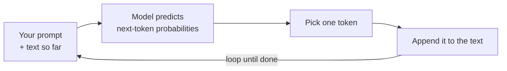

<LevelBadge level="beginner" />

**大規模言語モデル**（LLM）は、Claudeを支える技術であり、一見すると驚くほど単純なことを行います。テキストを読み込み、**次に来るものを予測する**のです。これを一度に1つのまとまりずつ行います。それだけです。それ以外のすべては、これを驚異的にうまくやることから生まれます。

<Callout
  type="objectives"
  items={[
    "一文のメンタルモデルを理解する：LLMは非常に高度なオートコンプリートである",
    "モデルがどのようにループの中で1トークンずつ答えを構築するかを見る",
    "なぜこの仕組みがLLMの強みと癖の両方を説明するのかを理解する",
    "LLMが「何でないか」を知り、それが使い方をどう変えるかを理解する"
  ]}
/>

## 一文のメンタルモデル

> LLMとは、膨大な量のテキストを読み込み、言語が——そしてその中にある考えが——どのように続いていく傾向があるかというパターンを学習した、非常に高度なオートコンプリートである。

質問をするとき、モデルは答えを「調べている」わけではありません。あなたのテキストの最ももっともらしい続きを、トークンごとに生成しているのです（[トークンとコンテキスト](/docs/foundations/tokens-and-context)を参照）。良い質問のもっともらしい続きは、たいてい良い答えになります——だからこそこれが機能するのです。

:::tip たとえ：強化版の予測キーボード
スマートフォンで次の単語を提案してくれるオートコンプリートを思い浮かべてください。今度はそれが、インターネット上のほとんどの本、記事、コードを読み込み、次の単語だけでなく、ぴったり合う1つのエッセイ、翻訳、プログラム全体を提案してくれると想像してみてください。それがLLMの直感的なイメージです。
:::

## 一度に1トークン

エンジン全体は1つのループです。ここまでのすべてを読み、次のまとまりを予測し、それを追加し、繰り返す。

<Steps
  items={[
    {title: "読み込む", body: "モデルは、あなたのプロンプトとこれまでに生成されたすべてを、1つのテキストの塊として取り込みます。"},
    {title: "予測する", body: "次のトークンが何になりうるかの確率を計算します。"},
    {title: "選ぶ", body: "1つのトークンを選択します。これが決定論的か、それとも少しランダムかは、temperatureのようなサンプリング制御が調整するものです。"},
    {title: "追加して繰り返す", body: "選ばれたトークンがテキストに追加され、少し長くなったテキストが再び入力に戻されます——答えが完成するまでループします。"}
  ]}
/>

各ステップは常に**1つ**のトークンだけを予測し、それから少し長くなったテキストを再び入力に戻します。モデルは答え全体の計画を最初から持っているわけではありません——一貫性は、この予測を極めてうまく、何千回も行うことから生まれます。「1つのトークンを選ぶ」ステップがどのように振る舞うか（貪欲か、少しランダムか）は、temperatureのような[サンプリング制御](/docs/foundations/sampling-controls)が調整するものです。

## なぜこれが強みを説明するのか

LLMは文章、コード、推論にまたがるパターンを学習しているため、流れるように**書く、要約する、翻訳する、説明する、コーディングする**ことができます——これらはすべて「このテキストを筋の通った形で続ける」タスクです。明確な設定を与えれば、強力な続きを生み出します。だからこそ[プロンプティング](/docs/prompting/basics)が非常に重要なのです。あなたは、モデルが続けるテキストの始まりを形作っているのです。

## なぜこれが癖を説明するのか

同じ仕組みが、粗削りな部分も説明します。

- **自信たっぷりに間違うことがある。** 流暢に聞こえる続きが、必ずしも真実であるとは限りません——それが[ハルシネーション](/docs/foundations/hallucinations)です。
- **今日の事実を本当に「知っている」わけではない。** あなたがそれを提供するか、調べるためのツールを持っていない限りは。
- **会話と会話の間に記憶を持たない。** あなたが何らかの形で与えない限りは。

## LLMが**何でないか**

:::warning 期待値を調整すれば、より良い結果が得られます
- ❌ **データベースや検索エンジンではない。** 生成するのであって、検証済みの記録を取り出すわけではありません。
- ❌ **電卓ではない。** 数学について推論はできますが、正確である保証はありません——そのためにはツールを与えてください。
- ❌ **人間ではない。** 感情も、意図も、継続的な記憶もありません。強力なテキストエンジンなのです。
:::

ときどき記憶を取り違える、優秀で速く、博識なアシスタントとして扱い、重要なことは**検証**してください。

## 重要な用語

<Flashcards
  title="主要な概念を復習する"
  cards={[
    {front: "LLM（大規模言語モデル）", back: "Claudeを支える技術。テキストを読み込み、次に来るものを一度に1つのまとまりずつ予測する。"},
    {front: "次トークン予測", back: "中核となるループ：ここまでのテキストを読み、次のトークンを予測し、それを追加し、完成するまで繰り返す。"},
    {front: "トークン", back: "モデルが各ステップで予測するテキストのまとまり。モデルは常に一度に1つだけを予測する。"},
    {front: "ハルシネーション", back: "流暢に聞こえるが実際には真実でない続き——取り出すのではなく生成することの副作用。"},
    {front: "サンプリング / temperature", back: "「1つのトークンを選ぶ」ステップの振る舞いを制御する——貪欲か、少しランダムか。"}
  ]}
/>

<Callout
  type="takeaways"
  items={[
    "LLMは非常に高度なオートコンプリートである——答えを調べるのではなく、次のトークンを予測する",
    "一貫性は、その予測ループを一度に1トークンずつ、何千回も実行することから生まれる",
    "同じ仕組みが、強み（書く、要約する、翻訳する、説明する、コーディングする）と癖（自信たっぷりに間違う、リアルタイムの事実がない、記憶がない）の両方を説明する",
    "LLMはデータベースでも、電卓でも、人間でもない——重要なことは検証しよう"
  ]}
/>

## 理解度チェック

<Quiz
  title="理解度チェック"
  questions={[
    {
      q: "質問をしたとき、LLMが根本的に行っていることは何か？",
      options: [
        "検証済みの事実のデータベースで答えを調べる",
        "あなたのテキストの最ももっともらしい続きを、一度に1トークンずつ生成する",
        "最新の答えを求めてリアルタイムのウェブを検索する"
      ],
      answer: 1,
      explain: "LLMは何かを調べているわけではありません——あなたのテキストの最ももっともらしい続きを、トークンごとに生成しているのです。"
    },
    {
      q: "なぜLLMは自信たっぷりに間違うことがあるのか？",
      options: [
        "流暢に聞こえる続きが、必ずしも真実であるとは限らない——それがハルシネーションである",
        "答えの途中でメモリが足りなくなる",
        "知らない質問には答えるのを拒否する"
      ],
      answer: 0,
      explain: "検証済みの記録を取り出すのではなく、もっともらしく聞こえるテキストを生成するため、流暢な続きでも誤っていることがあります——それがハルシネーションです。"
    },
    {
      q: "LLMについて正しい記述はどれか？",
      options: [
        "検証済みの記録を取り出す検索エンジンである",
        "正確であることが保証された電卓である",
        "人間ではなく、あなたが何らかの形で与えない限り、会話と会話の間に継続的な記憶を持たない"
      ],
      answer: 2,
      explain: "LLMは強力なテキストエンジンであり、データベースでも、電卓でも、人間でもありません。あなたが提供しない限り、会話と会話の間に記憶を持ちません。"
    }
  ]}
/>

## 次へ

- [トークン、コンテキスト、メモリ](/docs/foundations/tokens-and-context)
- [ハルシネーションとその減らし方](/docs/foundations/hallucinations)
- [プロンプティングの基礎](/docs/prompting/basics)
