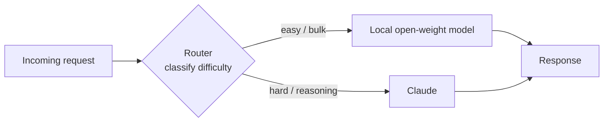

<LevelBadge level="advanced" />

「フロンティアモデル**か**ローカルモデルか」という枠組みは誤った二者択一です。本番環境で最もコスト効率がよく、プライバシーを尊重し、レジリエントなシステムは**両方**を使います — 簡単で大量、あるいは機微なタスクをローカルで処理する小さなオープンウェイトモデルと、難しい推論を担う**スマートレイヤー**としての Claude のようなフロンティアモデルです。このページでは、両者を結びつけてそれぞれが最も得意なことをこなせるようにする、長く使える*パターン*を扱います。これらのパターンはプロバイダー中立であり — Claude は単に「推論」の役割にぴったり合うだけ — どの特定のモデル名よりも長く生き残ります。

<Callout type="objectives" items={[
  "なぜハイブリッド（フロンティア + ローカル）がコスト・プライバシー・レジリエンスのいずれにおいても単独のモデルに勝るのかを理解する",
  "5つの長く使えるハイブリッドパターンを学ぶ: ルーター/ビッグ・リトル、ドラフト後リファイン、プライバシー編集、一括前処理/後処理、オフラインフォールバック",
  "各パターンについて: いつ使うべきか、受け入れるトレードオフ、具体的なスケッチを知る",
  "繰り返し使える4ステップの手法で、自分だけの Claude+ローカルのハイブリッドを設計する",
  "これらのパターンがプロバイダー中立であることを知る — Claude はロックインではなく『スマートレイヤー』としてはまり込む",
]} />

## なぜ二者択一ではなくハイブリッドなのか

ローカルのオープンウェイトモデル（[Ollama でモデルをローカル実行する](/docs/models/run-models-locally-ollama)を参照）とフロンティアモデルは、*それぞれ別の*ことが得意です:

- **ローカル**はプライベートで（データがマシンの外に出ない）、スケール時に安価で（トークン課金がない）、小型モデルなら低レイテンシで、オフラインでも動きます。しかし最も難しい推論、ロングコンテキスト、エージェント的なタスクでは本物の**能力ギャップ**があります。
- **Claude（フロンティア）**はまさにそうした難しいタスクで先行しますが、すべての呼び出しがトークンを消費し、データをクラウド API に送ります。

以下のすべてのパターンの背後にある洞察はこうです: **ほとんどのリクエストは簡単で、難しいものは少数派だ。**安価なローカルモデルが大部分を処理し、本当に難しい一部だけにフロンティアモデルを温存すれば、フロンティア品質の大半をわずかなコストで得られます — しかも機微なデータをローカルに留められます。Microsoft の*Hybrid LLM*論文はこれを定式化しました: 簡単なクエリを小型モデルに送る学習済みルーターは、応答品質を落とすことなく大型モデルへの呼び出しを**最大40%削減**しました（[arXiv 2404.14618](https://arxiv.org/abs/2404.14618)）。オープンソースの [RouteLLM](https://github.com/lm-sys/RouteLLM) フレームワークも同様の結果を報告しています — 約半数のクエリを安価なモデルにルーティングすることで、一般的なベンチマークでフロンティアに近い品質をおよそ**半分のコスト**で実現しています。

> ハイブリッドは誇大宣伝ではなく**制約**で選びましょう。どのモデルがどのタスクに合うかまだ分からないなら、[モデルを選ぶ](/docs/models/choosing-a-model)から始めて — それから戻ってきて、ローカルとフロンティアの*境界をどこに置くか*を決めましょう。

---

## パターン1 — ルーター / ビッグ・リトル

**考え方。**すべてのリクエストの前に薄い**分類器**を置きます。タスクを見て判断します: 簡単/大量 → ローカルモデル、難しい推論 → Claude。これは「big.LITTLE」CPU 設計から借りた発想で、スマートフォンがバックグラウンド処理を小さな高効率コアで動かし、重い負荷のときだけ大きなコアを起こすのと同じです。

**いつ使うか。**リクエストが混在しているとき — 多くは些細で、いくつかは本当に難しい — そして難しいものにだけフロンティア価格を払いたいとき。これは主力となるハイブリッドです。

**トレードオフ。**ルーターは*間違える*ことがあります。難しいタスクをローカルモデルに誤ってルーティングすれば品質が下がり、簡単なものを Claude に誤ってルーティングすれば払いすぎになります。コストと品質を引き換えにする閾値を調整し、その閾値を小さなevalで自分のデータ上で**測定**すべきです（[Evals](/docs/power-user/evals)を参照）。

**スケッチ。**ルーターはルールレイヤー（長さ、キーワード、コードの有無）のように単純にも、小さな分類モデルのように豊かにもできます。安価で透明な選択肢は、**ローカル**モデル自身に難易度を分類させてからディスパッチすることです:

<PromptCard title="ルーター分類プロンプト（ローカルモデルで実行）">{`You are a request router. Classify the user request into exactly one tier.

Return ONLY a JSON object: {"tier": "...", "reason": "..."}

Tiers:
- "local"  → simple, mechanical, or high-volume: short rewrites, formatting,
             single-fact lookup, basic classification/extraction, boilerplate.
- "frontier" → hard reasoning, multi-step planning, long-context synthesis,
             ambiguous instructions, code that must be correct, anything where
             a wrong answer is costly.

Bias toward "local" when in doubt about a CHEAP, low-risk task,
and toward "frontier" when a mistake would be EXPENSIVE.

Request:
"""
{{REQUEST}}
"""`}</PromptCard>

ルーターの出力はルーティングの判断であって最終的な答えではありません — 小さく速く保ちましょう。多数のツールやモデルをまたぐより豊かなルーティングでも、同じ「分類してからディスパッチする」ロジックが一般化します（そしてモデルが[ツール](/docs/api/tool-use)を選ぶ仕組みにも似ています）。

---

## パターン2 — ドラフト後リファイン

**考え方。**ローカルモデルが**安価な初稿**を生成し、Claude がそれを**磨き、修正し、検証**します。生成をゼロから行うのではなく、リファインのためにフロンティアトークンを払う — そして良い初稿は Claude の仕事を短く、より信頼できるものにします。

**いつ使うか。**完璧なものより粗い下書きの方がずっと安価でありながら、最終出力は高品質でなければならないオープンエンドな生成: 長文ライティング、コード、構造化ドキュメント、正確でなければならない要約。

**トレードオフ。**1回ではなく2回のモデル呼び出しはレイテンシを増やし、*悪い*下書きはリファイナーをその誤りへと引き寄せかねません。下書きが高コストな部分で、リファインが比較的安価なときに勝ちが出ます — 「ローカルで下書き + フロンティアでリファイン」が許容できる出力あたりのコストで「フロンティアが全部やる」を実際に上回るかを、自分のデータで検証しましょう。

**スケッチ。**ローカルモデルが下書きする → その下書きを焦点を絞った指示とともに Claude に渡す: *「これは下書きです。誤りを直し、引き締め、主張を検証してください。修正版を返してください。」*これはトークンレベルで**投機的デコーディング**を駆動するのと同じ直感です — 小さなドラフターが提案し、大きなモデルが検証して通ったものだけを残します（[NVIDIA: 投機的デコーディング](https://developer.nvidia.com/blog/an-introduction-to-speculative-decoding-for-reducing-latency-in-ai-inference/)）。タスクレベルでは、これを手作業で同じことをしているのです: 安価な提案、高コストな検証。

---

## パターン3 — プライバシー編集

**考え方。**ローカルモデル（またはローカルの NLP ツール）が、クラウド API に何かが送られる*前に*テキストから**PII を取り除き**ます。Claude は編集済みのバージョンを推論し、必要なら帰り道でローカルに実際の値を再挿入します。

**いつ使うか。**フロンティアの推論が欲しいが、規制対象または機微なデータ（医療、金融、顧客記録）を扱っており、生の PII が環境を**絶対に出てはいけない**とき。編集により、問題の*形*についてクラウドモデルを使いつつ、その中の人々を露出させずに済みます。

**トレードオフ。**編集は決して完璧ではありません — 見逃したエンティティは漏洩であり、過剰な編集はモデルがうまく答えるのに必要なコンテキストを壊します。エディタをセキュリティ制御として扱い、その再現率をテストし、復元マッピングは厳密にローカルに保ちましょう。

**スケッチ。**入力にローカルの検出器/匿名化器を走らせ、エンティティをプレースホルダー（`[PERSON_1]`、`[EMAIL_1]`）に置き換え、編集済みテキストを Claude に送り、それからプレースホルダーをローカルで復元します。Microsoft のオープンソース [Presidio](https://github.com/microsoft/presidio) はここでよく使われる構成要素です — PII を検出して匿名化し、難しいケースの二次パスにローカルモデルを含むプラグイン可能な NLP バックエンドを使えます。決定的でしばしば見落とされる点: ユーザーの最新メッセージだけでなく、取得したドキュメントやツールの結果も含め、モデルに到達する**すべて**を編集すること。

---

## パターン4 — 一括前処理/後処理

**考え方。**ローカルモデルが**大量で反復的な**作業 — 数千件のアイテムにまたがる抽出、分類、タグ付け、正規化 — を処理し、Claude はローカルモデルが低信頼度とフラグした**少数の難しいケース**だけを処理します。

**いつ使うか。**パイプラインのワークロード: 10万件のサポートチケットを分類する、山のようなドキュメントからフィールドを抽出する、コンテンツの濁流にタグを付ける。すべてのアイテムをフロンティア API に通すのは遅くて高価ですが、ほとんどのアイテムは簡単です。

**トレードオフ。**正しいアイテムがエスカレーションされるよう、信頼できる**信頼度 / エスカレーションのシグナル**が必要です。前のめりすぎると払いすぎ、消極的すぎると難しいテールで品質が落ちます。ローカルモデルの自己申告の信頼度は出発点ですが、検証しましょう。

**スケッチ。**ローカルモデルがバッチ全体を処理して信頼度スコアを付け、閾値を下回る（あるいはスキーマ/バリデーションチェックに失敗する）アイテムが難しい判断のために Claude にエスカレーションされます。これはライブリクエストではなくバッチに適用したパターン1です — カスケードが活用するのと同じ「安価が大部分を、フロンティアがテールを処理する」経済性で、簡単な大多数においてはしばしば**40〜70%のコスト削減**を、最小限の品質損失で実現します。

---

## パターン5 — オフラインフォールバック

**考え方。**ローカルモデルは**安全網**です。クラウド API がダウンしている、レート制限されている、または到達不能なとき、リクエストは*完全に*失敗するのではなくローカルモデルに*フェイルオーバー*します。劣化した答えはエラーページに勝ります。

**いつ使うか。**常に最高品質であることよりも可用性が重要なあらゆるもの: 動き続けなければならない社内ツール、オンデバイス機能、プロバイダー障害中にユーザーへハードエラーを見せられないプロダクト。

**トレードオフ。**フォールバックの応答は定義上**低品質**です — フロンティアの上限を「まだ動く」と引き換えにしています。劣化を明示的にする（ラベルを付け、機能セットを絞る）ことで、本物であるかのように黙って弱い答えを出すのを避けましょう。

**スケッチ。**呼び出しを順序付きチェーンでラップします: Claude を試す → 可用性エラー（タイムアウト、429/5xx）でバックオフ付きリトライ → それでも失敗ならローカルモデルにルーティング。LiteLLM や OpenRouter のような LLM ゲートウェイは、オフライン経路でも有用な何かを返せるよう一般的なプロンプトのキャッシュを含め、まさにこのフォールバックチェーンのパターンを実装しています。長く使える原則: **ローカルモデルを最後の砦として温めておく**ことで、障害が体験を壊すのではなく劣化させるに留まります。

---

## 自分だけの Claude+ローカルのハイブリッドを設計する

<Steps items={[
  {title: "リクエストの分布をマッピングする", body: "実トラフィックをサンプリングし、本当に難しい/簡単・大量/機微の割合をラベル付けする。この分布の形が、どのパターンが報われるかを教えてくれる — 長い簡単なテールはルーターや一括前処理を、小さな機微な一部は編集を有利にする。"},
  {title: "制約に合うパターンを選ぶ", body: "混在するライブトラフィック → パターン1（ルーター）。予算内での高品質生成 → パターン2（ドラフト後リファイン）。規制対象/機微なデータ → パターン3（編集）。パイプライン / バッチ量 → パターン4（一括）。可用性が重要 → パターン5（フォールバック）。多くのシステムは2つか3つを組み合わせる。"},
  {title: "境界を設定し、それから測定する", body: "ローカルがどこで止まり Claude がどこで始まるかを決める（ルーターの閾値、信頼度のカットオフ、編集ポリシー）。自分のデータで小さなevalを走らせ、コスト対品質のトレードオフに数字を付ける。リーダーボードやベンダーの謳い文句を信じてはいけない — 自分のタスクで測定する。Evals ページを参照。"},
  {title: "可観測性と安全弁を加える", body: "あらゆるルーティング/エスカレーションの判断とその結果をログに残し、モデルやトラフィックの変化に応じて境界を再調整できるようにする。プロバイダー障害が壊すのではなく優雅に劣化するよう、明示的なフォールバック（パターン5）を保つ。"},
]} />

<VerifyNote lastVerified="2026-06-28" source="https://docs.anthropic.com/en/docs/build-with-claude/models">
具体的なモデル名、コンテキストウィンドウ、トークンあたりの価格、レート制限は頻繁に変わるため、ここでは意図的に**再掲していません** — それらは変動する部分です。ルーターやカスケードのコストや品質の閾値を固定する前に、上記の出典で現在の Claude モデルラインナップと価格を、現在のローカルモデル名は <a href="https://ollama.com/library">Ollama ライブラリ</a> で確認してください。このページのパターンは長く使えますが、境界の裏にある正確な数字はそうではありません。
</VerifyNote>

<Quiz title="理解度チェック" questions={[
  {q: "すべてのハイブリッドパターンを成り立たせる、核となる経済的洞察は何か?", options: ["ローカルモデルは常にフロンティアモデルより優れている", "ほとんどのリクエストは簡単で、本当にフロンティアの推論を必要とするのは少数派だけ", "フロンティアモデルはローカルモデルよりトークンあたり安い"], answer: 1, explain: "実トラフィックの大半は簡単です。安価なローカルモデルが簡単な大多数を処理し、難しい少数派にフロンティアモデルを温存すれば、品質の大半をわずかなコストで得られます。その非対称性こそ、ここのすべてのパターンが活用するものです。"},
  {q: "顧客記録を推論するのにフロンティアモデルを使わなければならないが、生の PII は環境を出られない。どのパターンが合うか?", options: ["ルーター / ビッグ・リトル", "プライバシー編集", "オフラインフォールバック"], answer: 1, explain: "プライバシー編集は、クラウド API に何かが到達する前に PII をローカルで取り除くので、Claude は編集済みのバージョンを推論し、実際の値は環境内に留まります。ルーターは作業を*どこ*へ送るかを決めますが、機微なデータを取り除くわけではありません。"},
  {q: "ルーター / ビッグ・リトルのパターンに固有の主なリスクは何か?", options: ["1つのモデルしか使えない", "誤ルーティングしたタスクは品質を犠牲にする（難しいものをローカルへ送る）か、金を犠牲にする（簡単なものをフロンティアへ送る）", "クラウド API が常にオンラインであることを要求する"], answer: 1, explain: "ルーターは分類器であり、間違うことがあります。難しいタスクを弱いモデルへ誤ルーティングすれば品質が損なわれ、簡単なものをフロンティアへ誤ルーティングすれば金を無駄にします。だからこそ、ルーティングの閾値を自分のデータで調整し測定するのです。"},
  {q: "ドラフト後リファインが割に合わないことがあるのはなぜか?", options: ["常に単一のフロンティア呼び出しより低品質になる", "2回の呼び出しがレイテンシを増やし、悪いローカルの下書きがリファイナーをその誤りへと引き寄せかねない", "フロンティアモデルは自分が書いていないテキストを編集できない"], answer: 1, explain: "ドラフト後リファインは、下書きが高コストな部分でリファインが安価なときにだけ勝ちます。2回のモデル呼び出しはレイテンシを増やし、弱い下書きはリファイナーを迷わせかねません — だからこそ、ローカル下書き + フロンティアリファインがフロンティアが全部やるを実際に上回るかを自分のデータで検証しましょう。"},
]} />

<Flashcards title="5つのハイブリッドパターンを一目で" cards={[
  {front: "ルーター / ビッグ・リトル", back: "各リクエストを分類してからディスパッチ: 簡単/大量 → ローカル、難しい推論 → Claude。主力のハイブリッド。トレードオフ: ルーターは誤ルーティングしうる — 閾値を自分のデータで調整する。"},
  {front: "ドラフト後リファイン", back: "ローカルモデルが安価に下書きし、Claude が磨く/検証する。生成ではなくリファインにフロンティアトークンを払う。トレードオフ: 余分なレイテンシ、そして悪い下書きはリファイナーを引き寄せかねない。"},
  {front: "プライバシー編集", back: "ローカルモデル/NLP ツールが、クラウド API に何かが到達する前に PII を取り除き、ローカルで復元する。フロンティアの推論を機微なデータに使えるようにする。トレードオフ: 見逃したエンティティは漏洩 — ユーザーメッセージだけでなく、ツールの結果や取得したドキュメントも編集すること。"},
  {front: "一括前処理/後処理", back: "ローカルがバッチ全体にわたる大量の抽出/分類を処理し、Claude は低信頼度のエスカレーションだけを処理する。パターン1をバッチに適用したもの。信頼できる信頼度/エスカレーションのシグナルが必要。"},
  {front: "オフラインフォールバック", back: "ローカルモデルは安全網: クラウド API がダウンまたはレート制限されたとき、完全に失敗するのではなくローカルにフェイルオーバーする。劣化した答えはエラーに勝る。劣化を明示的にする。"},
]} />

<Callout type="takeaways" items={[
  "フロンティア対ローカルは誤った二者択一 — 最良のシステムは両方を使い、難しい少数派の作業にはプロバイダー中立な『スマートレイヤー』として Claude を使う",
  "5つのパターンはすべて1つの洞察に乗っている: ほとんどのリクエストは簡単で安い。本当に難しい一部にフロンティアの支出を温存せよ",
  "ルーター/ビッグ・リトルが主力、ドラフト後リファインは予算内で品質を買い、編集は機微なデータを解き放ち、一括前処理はパイプラインをスケールさせ、オフラインフォールバックはレジリエンスを買う — そしてこれらは組み合わさる",
  "あらゆるパターンには境界がある（閾値、信頼度のカットオフ、編集ポリシー） — リーダーボードではなく、自分のデータで小さなevalによって測定せよ",
  "変動する数字（モデル名、価格、制限）は検証ステップの裏に置く。パターンは長く使えるが、詳細はそうではない",
]} />

## 出典とさらに読む

- [Hybrid LLM: Cost-Efficient and Quality-Aware Query Routing (arXiv 2404.14618, ICLR 2024)](https://arxiv.org/abs/2404.14618)
- [RouteLLM — LLM ルーターの提供と評価のためのオープンソースフレームワーク (GitHub, LMSYS)](https://github.com/lm-sys/RouteLLM)
- [RouteLLM: An Open-Source Framework for Cost-Effective LLM Routing (LMSYS ブログ)](https://www.lmsys.org/blog/2024-07-01-routellm/)
- [Microsoft Presidio — PII の検出、編集、匿名化 (GitHub)](https://github.com/microsoft/presidio)
- [Presidio による PII マスキングと LiteLLM — チュートリアル](https://docs.litellm.ai/docs/tutorials/presidio_pii_masking)
- [An Introduction to Speculative Decoding (NVIDIA テクニカルブログ)](https://developer.nvidia.com/blog/an-introduction-to-speculative-decoding-for-reducing-latency-in-ai-inference/)
- [Model fallbacks — 自動フェイルオーバーによる信頼できる AI (OpenRouter ドキュメント)](https://openrouter.ai/docs/guides/routing/model-fallbacks)
- [Anthropic — Claude モデル概要](https://docs.anthropic.com/en/docs/build-with-claude/models)
