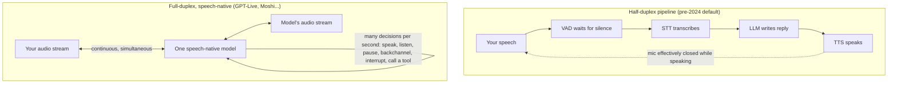

<LevelBadge level="beginner" />

10年間、コンピュータと話すとは、人間のふりをするトランシーバーと交互に順番を取ることでした。**2026年7月8日、OpenAIはGPT-Liveを出荷しました** — 話し*ながら*聞く音声モデルで — トランシーバーの時代は公式に終わり始めました。このページは、内部で実際に何が変わったのか、なぜ古い音声スタックがロボット的に感じられる運命だったのか、そして誇張なしに2026年の音声エージェントの状況全体をどう判断するかを説明します。

<Callout type="objectives" items={[
  "古典的なSTT → LLM → TTSパイプラインがなぜ常に遅く感じられたのかを理解する — それは磨き不足ではなく物理だ",
  "全二重が何を意味するかを知る：聞くのと話すのを同時に行う1つの音声ネイティブモデル",
  "GPT-Liveと現在の音声状況（OpenAI、Google、ElevenLabs、Anthropic、オープンモデル）について検証済みの事実を得る",
  "音声エージェントが今日、真に実用可能なのはいつか — そして何がまだ壊れるかを知る",
]} />

<VerifyNote lastVerified="2026-07-13" source="https://openai.com/index/introducing-gpt-live/">
GPT-Liveは数日前にローンチしたばかりで、詳細（モデルティア、ロールアウト、APIアクセス）は急速に動いています。このページの製品名、提供状況、レイテンシの数値は生ものです — 今日の真実は各プロバイダの公式ページ（出典にリンク）で確認してください。
</VerifyNote>

## 200ミリ秒の問題

ここに、このページのほかのすべてを説明する事実があります：**人間は互いに約0〜200ミリ秒で応答する。** 10言語にわたる画期的な言語横断研究（Stivers et al., *PNAS* 2009）は、応答間隙がテストされたすべての文化で**0ミリ秒**付近に集まることを見出しました — 私たちは相手が話し終える*前に*ルーチンで答え始めます。脳が相手のターンの終わりを予測するからです。

さて、古典的な音声アシスタントスタックと比べてみましょう。それは互いに接着された**3つの別々のモデルのパイプライン**でした：

1. **STT（音声認識）**があなたの音声をテキストに書き起こし、
2. **LLM**が書き起こしを読んで返信を書き、
3. **TTS（音声合成）**が返信を音声に戻す。

各段階は次が始まる前に（おおむね）終わらなければならないので、その遅延が**積み重なります**。さらに悪いことに、パイプラインはあなたがいつ話し終えたかを知りません — 音声には「送信」ボタンがありません — なのでエンジニアは**VAD（音声活動検出）**の沈黙タイマーをボルト留めしました：おおよそ0.5秒から1秒の沈黙を待ってから、ターンが終わったと*推測*します。その単一のハックが、古典的な2つの失敗モードの両方を説明します：考えるために文の途中で止まるとボットが割り込み、きっぱり話し終えてもそれでも沈黙タイマーを待って座り込む。すべて足し合わせると、人間が約0〜200ミリ秒を期待する場所で1〜3秒の無音が生まれます — モデルが一言も言う前に、**桁違いに遅い**のです。

そしてもっと悪化します：パイプラインはトランシーバーのように**半二重**です。ボットが話している間、それは聞いていません。特別なエンジニアリングなしに割り込む（「バージイン」する）ことはできず、ボットは*あなたが*話している間に「うんうん」と言うことも決してできず、あらゆるオーバーラップ — 会話の最も人間的な部分 — は構造上、単に不可能です。

## 「全二重」が実際に意味するもの

**全二重（full-duplex）**は電気通信の用語です：両方向が*同時に*伝送する（電話）、対して**半二重（half-duplex）**は交互に切り替わる（トランシーバー）。AI音声に適用すると：

- **モデルは聞くのと話すのを同時に行う。** 「あなたのターン / 私のターン」という状態機械はなく — 入力音声が連続的に流れ込む一方で、出力音声が流れ出ます。
- **音声ネイティブである。** 1つのモデルが音声を直接消費し生成します。3つのモデルがテキストを渡し合う代わりに。書き起こし段階も合成段階もなく、積み重なるレイテンシもなく — 情報の損失もありません（トーン、ためらい、皮肉、感情が生き残ります。それらが決してテキストに平坦化されなかったからです）。
- **ターンの取り合いはタイマーではなく学習された振る舞いになる。** GPT-Liveに関するOpenAIの説明によれば、モデルは「毎秒何度も」相互作用の決定をします：話すか、聞き続けるか、止めるか、相づちを打つか、割り込むか、ツールを呼ぶか。沈黙検出のハックは消えます。モデルが人間のようにターンの終わりを*予測*するからです。
- **相づちとバージインが無料で付いてくる。** あなたが話している間に「うんうん」とつぶやいたり（**バックチャネル**）、あなたが割り込んだ瞬間に文の途中で止まったり（**バージイン**）、あなたが考えている間に黙っていたり — パイプラインでは不可能かハックだったすべて — ができます。

ほとんど知られていないこと：**全二重は2026年にOpenAIが発明したものではない。** フランスのラボ**Kyutaiは2024年にMoshiをオープンソース化しました** — 約160ms理論値 / 約200ms実用値のレイテンシを持つ全二重音声モデルで、*2つの並列音声ストリーム*（あなたのものと自分のもの）をモデル化し、時間整列されたテキストトークンの「内なる独白（Inner Monologue）」を使って自分の発話を言語的に一貫させます。今日、重みをダウンロードしてローカルで実行できます。今月変わったのは、全二重が研究デモから**数億人のChatGPTユーザーのためのデフォルトインターフェース**になったことです。

## GPT-Live：OpenAIが実際に出荷したもの

OpenAIの発表とローンチ報道（2026年7月8日）に対して検証済み：

- **2つのモデル：GPT-Live-1とGPT-Live-1 mini。** miniはChatGPT VoiceのデフォルトとしてAdvanced Voice Modeを置き換え（無料ティアを含む）、より大きなGPT-Live-1は有料ティア向けです。TechCrunchは、すでに**1億5,000万人以上**がChatGPTの音声機能を使っていると報じています。
- **真の全二重アーキテクチャ。** 出力を生成しながら入力を連続処理し、話す/聞く/止める/割り込む/ツールの決定を毎秒何度も行います。相づち（「うんうん」「うん」）を打ち、速い往復を処理し — 注目すべきことに — **黙ったまま**、呼ばれるまでコンテキストを吸収し続けることができます。
- **フロンティアモデルへの委任。** Web検索、より深い推論、エージェント的な作業のために、GPT-LiveはタスクをOpenAIのフロンティアモデル（ローンチ時はGPT-5.5）に**バックグラウンドで委ね、結果が返ってくる間もあなたと話し続けます**。音声モデルは会話のフロントエンドで、重い思考は別の場所で起きます。この「速い話し手 + 遅い思考者」の分業が、注視すべきアーキテクチャパターンです。
- **ライブ翻訳**は、連続的な聞きながら話す設計から自然に生まれます — モデルはあなたの文を、あなたが言うのとほぼ同時に別の言語でレンダリングできます。（ローンチ報道は、一部の言語でアクセント品質がまだ不均一だと指摘しました。）
- **ローンチ時に開発者APIなし。** GPT-Liveは今のところChatGPT製品です。OpenAIはAPIアクセスが来るとし、サインアップフォームを用意しています。ビルダーには、**Realtime API上のgpt-realtimeが現行の開発者製品**です（下記参照）。
- **ローンチ時の既知の制限：** 音声セッション内でのビデオ/画面共有なし、主要言語以外での不均一な品質、そしてOpenAIは感情的依存の影響を監視していると述べています。

<VerifyNote lastVerified="2026-07-13" source="https://openai.com/index/introducing-gpt-live/">
ティアの提供状況、委任の背後にある正確なフロンティアモデル、APIのタイミングは、ここで最も速く動く主張です — OpenAIの発表を再確認してから繰り返してください。
</VerifyNote>

## 音声の状況、検証済み（2026年7月）

| プレイヤー | 存在するもの | 全二重？ | 備考 |
|---|---|---|---|
| **OpenAI — GPT-Live** | ChatGPT Voice（コンシューマー） | **はい** — 音声ネイティブ | 難しいタスクを会話の途中でフロンティアモデルに委任；まだAPIなし |
| **OpenAI — Realtime API（gpt-realtime）** | 開発者API、GA | 音声対音声、単一モデル | 本番音声エージェント：SIP電話、リモートMCPサーバー、画像入力 |
| **Google — Gemini Live API** | 開発者API（AI Studio / Vertex、GA） | ネイティブ音声、ストリーミング | バージイン、「プロアクティブ音声」（関連するときだけ話す）、感情的な対話、ツール使用 + Google検索 |
| **ElevenLabs — Agents** | エージェントプラットフォーム（2026年3月ローンチ） | 独自のターン取りモデルによるオーケストレートされたスタック | TTS/STT + ターン取り + ツール呼び出し；70以上の言語；500ms未満の初回ターン主張；電話/Web/アプリチャネル |
| **Anthropic — Claude** | [Claudeアプリの音声モード](/docs/claude-app/voice-mode)；Claude Codeでのプッシュトゥトーク`/voice`（2026年3月、多言語が2026年6月にベータ卒業） | **いいえ** — ターンベース | 話して、保存された書き起こし付きで話された返信を得る。検証日時点で音声ネイティブの全二重モデルは発表されていない — 誰にもそうでないと言わせるな |
| **Kyutai — Moshi** | オープンウェイト + コード（GitHub、Hugging Face） | **はい** — オープンソースの証明 | 約160〜200msレイテンシ、デュアルストリーム音声、「内なる独白」；ローカルで実行 |

その表からほとんどの報道が見逃す2つの要点：**(1)** 今日「音声エージェント」は2つの異なるアーキテクチャを意味します — 真に音声ネイティブな全二重モデル（GPT-Live、Moshi、Geminiのネイティブ音声）対、学習されたターン取りモデルを上に載せた非常に速く、よくオーケストレートされたパイプライン（ElevenLabs Agents）。どちらも良く感じられ得ますが、発話をオーバーラップできるのは前者だけです。**(2)** オープンソースの選択肢は本物です：Moshiは、自分のハードウェアで全二重を実行できることを証明しており、それはあなたのユースケースが音声をクラウドに送れない場合に重要です（その判断枠組みは[モデルを選ぶ](/docs/models/choosing-a-model)を参照）。

## 全二重の会話が実際にどう流れるか

<Steps items={[
  {title: "音声が連続的に流れ込む", body: "録音してから送信、はない。あなたのマイク音声はフレームごとにトークンにエンコードされ（Moshiのコーデックは80msフレームを使う）、届くにつれてモデルに供給される — モデルが文の途中でも。"},
  {title: "モデルが絶えずマイクロ決定を行う", body: "毎秒何度も選ぶ：話し続ける、止める、黙っている、相づちを落とす（「うんうん」）、返信を始める。ターン取りは、沈黙タイマーではなく、モデルが実際の会話から学んだ予測である。"},
  {title: "あなたが割り込むと、即座に譲る", body: "バージインはネイティブ：モデルは決して聞くのをやめなかったので、あなたが話し始めた瞬間に聞く。自分の文を切り、あなたが言ったことを吸収し、調整する — 「止まれ」というキーワードは不要。"},
  {title: "難しい質問は、そっと委任される", body: "Web検索や本物の推論が必要なことを尋ねると、GPT-Liveはそれをバックグラウンドでフロンティアモデルに委ね — 会話を生かし続ける（「確認しますね…それはさておき—」）。答えは準備できたときに織り込まれる。"},
  {title: "沈黙は有効な一手", body: "全二重モデルは意図的に何も言わないことができる — ターンを乗っ取らずに、あなたに声に出して考えさせる。パイプラインのボットは文字通りこれができなかった。そのVADはあなたの休止を招待と見なした。"},
]} />

## 音声エージェントが今実用可能になったとき — そして何がまだ壊れるか

**今、真に実用可能：**

- **カスタマーサポートと電話ワークフロー。** 1秒未満のターン取りにバージインが加わり、2大クレーム要因を取り除きます。Realtime APIのSIPサポートとElevenLabs Agentsは、まさにこれを狙っています。
- **ハンズフリーと目が塞がった用途。** 運転、料理、フィールドワーク、アクセシビリティ — 相互作用がついに発話に追いつきます（[Claudeアプリの音声モード](/docs/claude-app/voice-mode)は、すでにこれのキャプチャ・書き起こし版をカバーしています）。
- **ライブ翻訳と語学練習。** 聞きながら話すことが、ほぼ同時通訳と自然な会話ドリルを初めて可能にします。
- **エージェントのフロントエンドとしての音声。** 委任パターン — 速い音声モデルと話しつつ、遅いフロンティアモデルが作業する — は、「長時間走るエージェント的作業」を音声で管理するというOpenAIの表明した賭けです。

**まだ壊れる：**

- **幻覚された音声。** 音声ネイティブモデルは、事実だけでなく*音*でも幻覚し得ます：言語のドリフト、崩れた名前や数字、外れたアクセント（GPT-Liveのローンチ翻訳デモはまさにこの批判を招きました）。確認していない話された数字を決して信じないでください。
- **騒がしい環境とクロストーク。** 常時開いたマイクはすべてを聞きます — わきの会話、テレビ、2人目の話し手。全二重はモデルを周囲の音により*さらされ*やすくし、その逆ではありません。
- **リアルタイムアクションの安全性。** 会話速度で行動するモデルは、聞き間違えた文に会話速度で行動し得ます。お金、メッセージ、削除に触れるあらゆる音声エージェントには、明示的な話された確認ゲートと読み取り専用デフォルトへの傾きが必要です — どのエージェントとも同じルール（[Foundations](/docs/foundations)参照）ですが、より低忠実度の入力チャネルで。
- **感情的依存。** 相づちを打ち、ためらい、あなたに決して飽きないシステムは、友人のように感じられるよう設計されています。OpenAI自身がこれの監視をフラグ付けしています。それに応じて設計（し、使用）してください。

<PromptCard title="音声エージェントのシステムプロンプトの骨格（音声ネイティブモデルとパイプラインの両方で機能）">{`You are a voice assistant for {company}. You are SPEAKING, not writing.

Style:
- Short sentences. One idea per sentence. No lists, no markdown, no URLs read aloud.
- If the user interrupts, stop immediately and address what they said.
- If the user pauses mid-thought, stay silent. Do not fill silence.

Safety:
- Before ANY action that sends, buys, deletes, or changes something:
  say back exactly what you will do and wait for a clear spoken "yes".
- Repeat numbers, names, and addresses back for confirmation — always.
- If audio is unclear or noisy, say what you think you heard and ask.
- If asked for something outside {scope}, say so and offer a human handoff.`}</PromptCard>

<Quiz title="理解度チェック" questions={[
  {q: "古典的なSTT → LLM → TTSスタックはなぜ常に遅く感じられたのですか？", options: ["モデルが小さすぎた", "3つの逐次段階に沈黙検出タイマーが加わって1〜3秒の遅延に積み重なり、人間が期待する約0〜200msに対して遅かった", "マイクがレイテンシを加える", "TTSの声がロボット的だった"], answer: 1, explain: "それは構造的です：各段階が前の段階を待ち、VADが何かが始まる前に沈黙を待ちます。人間は約0〜200ms（Stivers et al., PNAS 2009）で応答するので、パイプラインは設計上桁違いに遅かったのです。"},
  {q: "全二重モデルが、半二重パイプラインには構造上できないことは何ですか？", options: ["事実の質問に答える", "より流暢に話す", "話しながら聞く — バージイン、相づち、オーバーラップする発話を可能にする", "ツールを使う"], answer: 2, explain: "半二重はトランシーバーのようにターンを交互にします：ボットが話している間、それは聞いていません。同時に聞き話すことが全二重の定義的な性質です。"},
  {q: "GPT-Liveは、Web検索や深い推論が必要な質問をどう処理しますか？", options: ["難しい質問には音声を拒否する", "答えが準備できるまで通話を一時停止する", "メモリからのみ答える", "バックグラウンドでフロンティアモデルに委任し、その間も会話を続ける"], answer: 3, explain: "「速い話し手 + 遅い思考者」の分業：音声ネイティブモデルが会話をフロントで担い、重い作業をフロンティアモデル（ローンチ時はGPT-5.5）に委ね、準備できたときに結果を織り込みます。"},
  {q: "GPT-Liveがローンチする*前に*真だったのは、次のうちどれですか？", options: ["約200msレイテンシの全二重音声モデルはすでにオープンソースだった（Kyutaiの Moshi、2024年）", "どのモデルも割り込まれ得なかった", "音声AIは法律でインターネット接続を必要とした", "Claudeは全二重の音声ネイティブモデルを持っていた"], answer: 0, explain: "Moshiは2024年にデュアルストリーム全二重音声と約160〜200msレイテンシでオープンウェイトを出荷しました。GPT-Liveの意義は全二重を発明したことではなく、主流化したことです。Claudeの音声機能は検証日時点でターンベースのままです。"},
]} />

<Flashcards title="音声AIの語彙" cards={[
  {front: "半二重", back: "方向を交互にする通信 — トランシーバー式。古い音声アシスタントのパイプライン：ボットが話している間、それは聞いていない。"},
  {front: "全二重", back: "電話のように、両方向が同時。モデルは聞くのと話すのを同時に行い、話すか、止めるか、譲るかを毎秒何度も決める。"},
  {front: "音声ネイティブモデル", back: "音声を直接消費し生成する単一モデル — STT/TTS段階なし、積み重なるレイテンシなし、そしてトーン/感情が生き残る。発話が決してテキストに平坦化されないから。"},
  {front: "バージイン", back: "エージェントを文の途中で割り込み、それを即座に止めて適応させること。全二重ではネイティブ；パイプラインではボルト留めのハック。"},
  {front: "バックチャネル", back: "*相手*が話している間に出す短い聞き手のシグナル — 「うんうん」「うん」「わかった」。半二重では構造上不可能。"},
  {front: "VAD / エンドポインティング", back: "音声活動検出：古いパイプラインがあなたが話し終えたと推測するために使った沈黙タイマー。割り込みと気まずい待ちの両方の失敗の原因。"},
  {front: "レイテンシの積み重なり", back: "パイプラインの遅延が足し合わさる：VAD待ち + STT + LLM + TTS ≈ 1〜3秒。人間は約0〜200msを期待する — ボットをロボット的に感じさせた差。"},
  {front: "委任（速い話し手 / 遅い思考者）", back: "GPT-Liveのパターン：速い音声ネイティブモデルが会話をフロントで担い、検索/推論をバックグラウンドでフロンティアモデルに委ね、その間チャットを生かし続ける。"},
]} />

<Callout type="takeaways" items={[
  "古いスタックは作りが悪かったのではなく — 構造的に遅すぎた：積み重なったSTT/LLM/TTSレイテンシに沈黙タイマーが加わり、人間が期待する約0〜200msに対して遅かった",
  "全二重 = 話しながら聞く1つの音声ネイティブモデル；バージイン、相づち、意図的な沈黙が、ハックではなく学習された振る舞いになる",
  "GPT-Live（2026年7月8日）はChatGPTで全二重を主流化し、委任を切り開く：速い音声モデルがフロントに、フロンティアモデルの推論がバックグラウンドに",
  "状況は2つに分かれる：音声ネイティブの全二重（GPT-Live、Geminiのネイティブ音声、Moshi — 2024年からオープンソース）対、学習されたターン取りを持つ速いオーケストレートされたパイプライン（ElevenLabs Agents）；Claudeの音声はターンベースのまま",
  "音声エージェントは今やサポート、ハンズフリー、翻訳に実用可能 — だが音声の幻覚、騒がしい部屋、リアルタイムアクションの安全性は依然として確認ゲートを要求する",
]} />

## 次に

- [AIモデルの状況：モデルを選ぶ](/docs/models/choosing-a-model) — どのモダリティにも適用される判断枠組み
- [Claudeと話す（音声モード）](/docs/claude-app/voice-mode) — Claudeの音声機能が今日行うこと
- [Foundations](/docs/foundations) — トークン、コンテキスト、そして音声が受け継ぐエージェント安全の基礎

## 出典とさらに読む

- [Introducing GPT-Live — OpenAI](https://openai.com/index/introducing-gpt-live/) — ローンチ発表（2026年7月8日）
- [OpenAI releases new voice models for more natural live conversations — TechCrunch](https://techcrunch.com/2026/07/08/openai-releases-new-voice-models-for-more-natural-live-conversations/) — ローンチ報道：ティア、1億5,000万人の音声ユーザー、翻訳デモの注意点
- [Introducing gpt-realtime and Realtime API updates for production voice agents — OpenAI](https://openai.com/index/introducing-gpt-realtime/) — 現行の開発者向け音声対音声製品（GA）
- [Gemini Live API capabilities — Google AI for Developers](https://ai.google.dev/gemini-api/docs/live-api/capabilities) — ネイティブ音声、バージイン、プロアクティブ音声、ツール使用
- [ElevenLabs Agents](https://elevenlabs.io/agents) — エージェントプラットフォーム：ターン取りモデル、チャネル、言語
- [Moshi: a speech-text foundation model for real-time dialogue — Kyutai (arXiv 2410.00037)](https://arxiv.org/abs/2410.00037) — オープンな全二重アーキテクチャ：デュアルストリーム、内なる独白、160ms理論値レイテンシ
- [kyutai-labs/moshi — GitHub](https://github.com/kyutai-labs/moshi) — 全二重をローカルで実行するコードと重み
- [Universals and cultural variation in turn-taking in conversation — Stivers et al., PNAS 2009](https://www.pnas.org/doi/10.1073/pnas.0903616106) — 約0〜200msの人間のターン間隙の証拠
- [Claude Code rolls out a voice mode capability — TechCrunch](https://techcrunch.com/2026/03/03/claude-code-rolls-out-a-voice-mode-capability/) — Claudeのプッシュトゥトーク音声入力の状況
