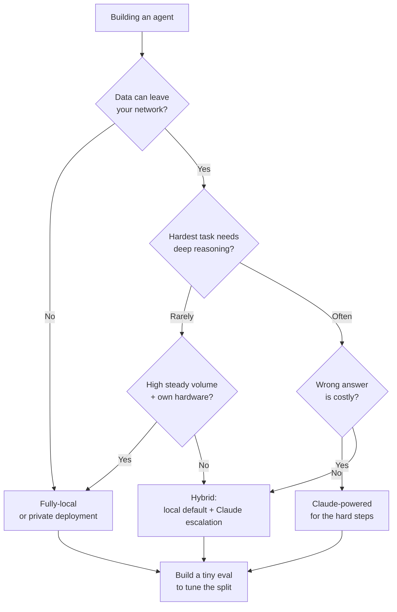

<LevelBadge level="intermediate" />

あなたはエージェントを作っている。最初の本当の分岐点はこれだ。**完全ローカル**のオープンウェイトモデル（プライベートで、実行は無料、あなたのもの）で動かすのか、**Claude**（フロンティア品質、ホスト型）で動かすのか、それとも両者の**ハイブリッド**で動かすのか？ このページは意思決定フレームワークだ — 実際に決め手となる要因、明確な「もし X なら → Y に傾く」フロー、そして**ハイブリッドが通常勝つ**という率直な現実を扱う。つまり、簡単で機微な 90% はローカルで、難しい 10% は Claude で、ということだ。

<Callout type="objectives" items={[
  "ローカル vs Claude vs ハイブリッドを実際に決める要因を挙げられるようになる",
  "自分のエージェントについて、明確な「もし X なら → Y に傾く」意思決定フローをたどれるようになる",
  "なぜハイブリッド（ローカルをデフォルトに + Claude へのエスカレーション）がどちらの極端よりも優れることが多いのかを理解する",
  "リーダーボードではなく、タイブレーカーとしての小さな eval を持ち帰る",
]} />

<VerifyNote lastVerified="2026-06-28" source="https://artificialanalysis.ai/">
ここでの不変の主張 — *トップのオープンウェイトモデルとフロンティアモデルの間には能力差が存在するが、それは狭まり続けている*、そして *ルーティング/カスケード（安いモデル優先、難しいときはエスカレート）は品質を保ちつつコストを節約する* — は安定している。しかし**具体的な数値**（今月その差がどれほど大きいか、どのオープンモデルが先頭か、トークンあたりの Claude 価格、特定ハードウェアでの正確なトークン/秒）は絶えず動く。具体的な数字はすべて生もの扱いとし、それに賭ける前に [Artificial Analysis](https://artificialanalysis.ai/) のようなライブトラッカーで確認すること。
</VerifyNote>

## 3つの選択肢を一息で

- **完全ローカルエージェント** — Ollama/LM Studio/vLLM 経由で自分のハードウェア上で動くオープンウェイトモデル（Llama、Qwen、Mistral、DeepSeek など）。データはマシンから出ない。呼び出しごとのコストなし。オフラインで動く。ハードウェアとモデルの上限で頭打ちになる。→ [ローカル AI エージェント](/docs/models/local-ai-agents)
- **Claude 駆動エージェント** — Claude API を呼び出す。フロンティア級の推論とツール使用、面倒を見るインフラ不要、即座にスケールする。ただしデータはネットワークの外に出て、呼び出しごとに課金され、接続が必要になる。
- **ハイブリッド** — ローカルモデルが日常的/機微な大部分を処理し、難しいまたは高リスクのステップは Claude にエスカレートする。ほとんどの本番エージェントが収束するパターン。→ [Claude + ローカルモデル](/docs/models/claude-plus-local-models)

## 実際に決め手となる要因

自分のエージェントをこれらに通してみよう。ほとんどの決定は最初の2〜3項目だけで片がつく。

| 要因 | 次のとき**ローカル**に傾く… | 次のとき**Claude**に傾く… |
|---|---|---|
| **データの機微性 / プライバシー** | データが規制対象、またはネットワークから出せない | データが非機微、またはコンプライアンスに準拠したデータ契約がある |
| **タスクの難易度 & 推論の深さ** | タスクが狭く、明確にスコープされ、反復的 | タスクに深い多段推論、ロングコンテキスト、込み入ったツール使用が必要 |
| **信頼性の要件** | ミス時にリトライや人手で十分 | 各ステップが正しくなければならず、失敗は高コスト |
| **レイテンシ** | ローカルハードウェアが十分速く応答する | GPU を用意するより速度に金を払いたい |
| **自分のボリュームでのコスト** | 高く安定したボリューム — 固定ハードウェアが償却される | 低い/急峻なボリューム — 呼び出し課金が遊休 GPU に勝る |
| **オフライン要件** | エアギャップ / 無接続で動かす必要がある | 常時オンラインで問題ない |
| **手持ちのハードウェア** | 高性能 GPU / 統合メモリを所有している | 持っておらず、購入/レンタルもしたくない |
| **面倒見の予算** | チューニング、量子化、評価、保守ができる | 運用なしで「ただ動く」状態にしたい |

**通常決め手となる2つ：** データがネットワークから出*られない*なら、それだけで他のすべてに関わらずローカル（あるいはプライベートデプロイ）に押しやられる。出せるなら、次の振り分け要因は**タスクの難易度**だ — 簡単な仕事はローカルで安く済むが、難しい推論こそ[フロンティアの差](/docs/models/choosing-a-model)がいまだに効いてくる場所だ。

<Callout type="info" items={[
  "オープンウェイト vs フロンティアの能力差は本物だが、急速に狭まっている — トップのオープンモデルは日常的なタスクや多くのコーディングタスクで優秀だが、最も難しいエージェント的・長期的・深い推論の仕事では依然として多くのモデルに後れを取る。",
  "その非対称性こそが、ハイブリッドを強力にする理由だ：簡単で機微な大多数をローカルに送り、Claude は真にフロンティア推論を必要とする一片のために確保する。",
]} />

## 意思決定フロー

<Steps items={[
  {title: "データはネットワークから出られるか？", body: "NO なら → ローカル（あるいはプライベート/VPC デプロイ）がベースライン。プライバシーは好みではなく厳格な制約であり、他の要因を支配する。YES なら → フローを続ける。"},
  {title: "エージェントがやるべき最も難しいことは、どれくらい難しいか？", body: "すべてのタスクが狭く反復的なら → 良いローカルモデルなら基準をクリアできるだろう。ローカルに傾く。一部のステップに深い推論、ロングコンテキスト、繊細なマルチツール連携が必要なら → 少なくともそれらのステップは Claude に傾く。"},
  {title: "間違った答えはどれほど高くつくか？", body: "ミスがリトライや人間のひと目で済むなら → ローカルの許容度で十分。たった1つの悪いステップが高コストまたは危険なら → 重要なところでは Claude の信頼性を優先する。"},
  {title: "ボリュームとハードウェアは？", body: "既に所有するハードウェアで高く安定したボリューム → ローカルが見事に償却される。低いまたは急峻なボリュームで GPU なし → Claude の呼び出し課金が遊休の鉄塊を避ける。"},
  {title: "本当にインフラを運用したいのか？", body: "量子化、提供、監視、再評価をいとわないなら → ローカル/ハイブリッドが現実的。運用ゼロを望むなら → Claude、あるいはローカル部分が極めて単純なハイブリッド。"},
  {title: "デフォルトはハイブリッド、そして不要だと証明する", body: "ローカルモデルをデフォルトのワーカーに、Claude を難しい/高リスクの一片のためのエスカレーション経路に。ステップ1が純ローカルを強制するか、タスクが一様に難しい（その場合は純 Claude）のでない限り、ここから始める。"},
]} />

## なぜハイブリッドがしばしば勝つのか

ほとんどの実ワークロードは**偏っている**：リクエストの大多数は簡単かつ/または機微で、小さな少数派が本当に難しい。ハイブリッドはその形を直接利用する。

- **ローカルが簡単/機微な 90% を処理する** — 速く、限界費用は無料、プライベートで、オフライン対応可能。トラフィックの大部分は API に一切触れない。
- **Claude が難しい 10% を処理する** — 多段推論、曖昧なエッジケース、正しさが重要なステップ。フロンティア品質を必要とする一片だけにフロンティア価格を払う。

これが**カスケード / ルーティング**パターンだ：安い（ローカル）モデルをまず試し、品質シグナルがローカルの答えは十分でないと示したときに Claude へエスカレートするか、難易度/機微性の分類器によって最初から振り分ける。これは品質の大半を保ちつつ、全フロンティアコストの何分の一かしか払わない確立された方法であり — 機微なケースを「ローカルのみ」に固定できるため、プライバシー境界も兼ねる。

<PromptCard title="一方の極端にコミットする前のセルフチェック">{`Answer for YOUR agent:
1. Must any data stay on my machine?            (yes -> local baseline)
2. What % of tasks are genuinely HARD?          (high -> Claude leans heavier)
3. What's a wrong answer cost me?               (high -> Claude on those steps)
4. My volume + hardware?                        (high+own GPU -> local amortizes)
5. Can I babysit infra?                         (no -> Claude or simple hybrid)

If answers conflict -> you've just described a HYBRID.
Now build the tiny eval below and let DATA pick the split.`}</PromptCard>

率直な但し書き：ハイブリッドは**可動部品が多い** — 2つのモデル経路、ルーター、保守すべき品質シグナル。あなたのエージェントが一様に単純*または*一様に難しいなら、単一モデルの構成のほうが単純で、おそらく正しい。ワークロードが本当に偏っているときにハイブリッドへ手を伸ばそう。

<Flashcards title="意思決定ガイドの語彙" cards={[
  {front: "完全ローカルエージェント", back: "自分のハードウェア上のオープンウェイトモデルで駆動されるエージェント。プライベート、呼び出しごとのコストなし、オフライン対応可能。ハードウェアとモデルの上限で制約される。"},
  {front: "Claude 駆動エージェント", back: "Claude API を呼び出すエージェント。フロンティア推論とツール使用、インフラ不要、即座のスケール。データはネットワークの外に出て、呼び出しごとに課金される。"},
  {front: "ハイブリッド（カスケード / ルーティング）", back: "ローカルモデルが簡単/機微な大多数を処理し、Claude が難しい/高リスクの少数派を処理する。安いほうをまず試して難しければエスカレートするか、最初から難易度/機微性で振り分ける。"},
  {front: "通常の決め手", back: "まずデータの機微性（ネットワークから出せるか？）、次にタスクの難易度（最も難しいステップはどれほど難しいか？）。残りはタイブレーカー。"},
  {front: "能力差", back: "トップのオープンウェイトモデルは、主に最も難しい推論/エージェント的タスクでフロンティアモデルに後れを取る。本物だが狭まりつつある — まさにそれがハイブリッドをこれほど有効にする理由だ。"},
]} />

<Quiz title="自己チェック" questions={[
  {q: "あなたのエージェントは、法的にネットワークから出せないデータを処理する。これがまず示唆することは？", options: ["Claude を使う — 品質が高いから", "他の要因に関わらず、完全ローカルまたはプライベートデプロイがベースライン", "トークンあたりで最も安いほうを選ぶ"], answer: 1, explain: "プライバシーは厳格な制約だ。データがネットワークから出せないなら、それが決定を支配する — 何かを天秤にかける前に、ローカル（あるいはプライベート/VPC デプロイ）がベースラインになる。"},
  {q: "なぜハイブリッドエージェントは、典型的で偏ったワークロードでしばしば勝つのか？", options: ["フロンティアモデルはスケールにおいて常に安いから", "ローカルが簡単/機微な大多数を安くプライベートに処理し、Claude はフロンティア推論を要する難しい少数派のために確保されるから", "あらゆる評価の必要を取り除くから"], answer: 1, explain: "ほとんどのワークロードは偏っている。簡単/機微な 90% をローカルモデルに、難しい 10% を Claude にルーティングすれば、全フロンティアコストの何分の一かで品質の大半を保てる — そして機微なケースをローカルに固定できる。"},
  {q: "ハイブリッドより単一モデル構成（純ローカル OR 純 Claude）のほうが良い判断となるのはいつか？", options: ["常に — ハイブリッドは決して割に合わない", "ワークロードが一様に単純または一様に難しく、余分なルーターと品質シグナルの仕組みが元を取らないとき", "GPU を持っていないときだけ"], answer: 1, explain: "ハイブリッドは可動部品を増やす（2つの経路、ルーター、品質シグナル）。タスクがすべて簡単かすべて難しいなら、1つのモデルのほうが単純で通常は正しい。ハイブリッドはワークロードが本当に偏っているときに報われる。"},
]} />

## そして、それを片付ける唯一のことをやる：テストする

上記の各要因は選択肢を絞り込む。**小さな eval が勝者を選ぶ。** 雰囲気や公開リーダーボードで選ぶな。

- 実際のワークロードから**10〜50件の実ケース**を、正解付きで集める（最も難しいケースと最も機微なケースを含める）。
- 候補リスト — 候補のローカルモデル、Claude、そして（関係するなら）ハイブリッドルーター — を同じケース群で走らせる。
- 品質を採点し、それから**自分の実ボリュームでのコストとレイテンシ**を天秤にかける。10倍のコストがかかる 2% の品質向上は割に合わないかもしれない。正しくなければならないステップでの 2% 向上は譲れないかもしれない。
- ハイブリッドの場合、eval は**どこに線を引くか** — 何を Claude にエスカレートし、何をローカルに留めるか — も教えてくれる。

eval は取っておこう。新しいオープンウェイトモデルが登場したり価格が変わったりしたとき、それを再実行すれば、神経をすり減らす移行が5分のチェックに変わる。→ [Eval](/docs/power-user/evals)

<Callout type="takeaways" items={[
  "順番に決める：まずデータの機微性（ネットワークから出せるか？）、次にタスクの難易度（最も難しいステップはどれほど難しいか？）。残り — レイテンシ、ボリューム、ハードウェア、面倒見の予算 — はタイブレーカー。",
  "純ローカルはプライバシー、オフライン、安定した高ボリュームでのコストで勝つ。Claude は最も難しい推論、信頼性、運用ゼロのスケールで勝つ。",
  "偏ったワークロードでは通常ハイブリッドが勝つ：簡単/機微な 90% はローカル、難しい 10% は Claude — カスケード/ルーティングし、フロンティア価格は元が取れるところだけで払う。",
  "オープンウェイトの差は本物だが狭まりつつある — まさにそれが今日ハイブリッドをこれほど有効にしている。",
  "雰囲気で決めるな：自分のデータで小さな eval を作り、自分のボリュームでコストとレイテンシを天秤にかけ、次のモデルリリースのために取っておく。",
]} />

## 出典 & さらに読む

- [Artificial Analysis](https://artificialanalysis.ai/) — オープンモデルとフロンティアモデルにまたがる、独立した頻繁更新の能力/価格/速度比較（生ものの具体値を再確認する場所）。
- [Anthropic — モデル概要](https://docs.anthropic.com/en/docs/about-claude/models) — Claude の現在のラインナップ、コンテキスト、能力。
- [Anthropic — API 価格](https://www.anthropic.com/pricing) — 自分のボリューム計算の見積もりのための現在のトークンあたりコスト。
- [Ollama](https://ollama.com/) · [LM Studio](https://lmstudio.ai/) — ローカル/ハイブリッド経路のために、オープンウェイトモデルをローカルで動かす。
- [Meta — Llama](https://www.llama.com/) · [Mistral — モデル](https://docs.mistral.ai/getting-started/models/) — ローカルエージェントでよく使われるオープンウェイトのファミリー。

## 次へ

- ローカル側を作る → [ローカル AI エージェント](/docs/models/local-ai-agents)
- ハイブリッドを配線する → [Claude + ローカルモデル](/docs/models/claude-plus-local-models)
- 選択を広く捉える → [モデルの選び方](/docs/models/choosing-a-model)
- 決定を測定可能にする → [Eval](/docs/power-user/evals)
