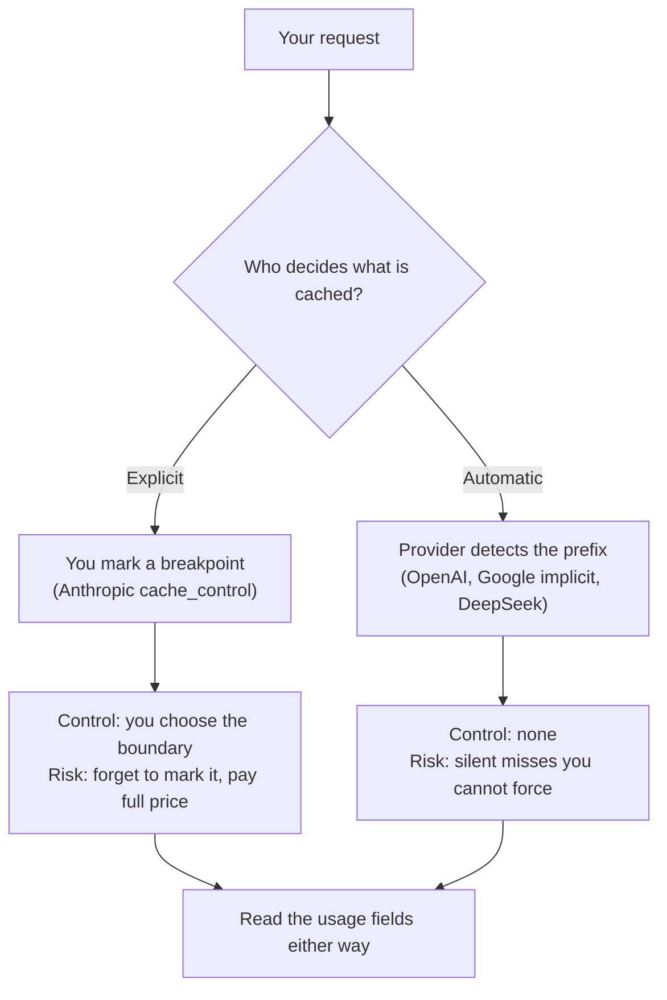

<LevelBadge level="advanced" />

<VerifyNote lastVerified="2026-09-26" source="https://platform.claude.com/docs/en/build-with-claude/prompt-caching">
このページの数値はすべて、各プロバイダーが独自のスケジュールで変更する公表レートまたは閾値です——そして Google の Gemini キャッシュ料金は 2027-01-01 に値上げが予定されています。予算を立てる前に各プロバイダーのドキュメントで再確認してください: [Anthropic](https://platform.claude.com/docs/en/build-with-claude/prompt-caching) · [OpenAI](https://developers.openai.com/api/docs/guides/prompt-caching) · [Google](https://ai.google.dev/gemini-api/docs/caching) · [DeepSeek](https://api-docs.deepseek.com/guides/kv_cache)。
</VerifyNote>

プロンプトキャッシュは本番 LLM アプリにおける単独で最大のコストレバーです——入力側で 90% 超の削減が当たり前に出ます。いまや主要プロバイダーのすべてが備えています。だからこそどこでも同じ機能だと思い込みやすいのですが、実際は違います。

仕組み自体は同一です: プロバイダーがプロンプトの**プレフィックス**を再読み込みせず、処理済みのものを再利用します。異なるのは、誰が決めるのか、キャッシュがどれだけ生き残るのか、対象となるにはプレフィックスがどれだけ長い必要があるのか、そして——これが刺さるのですが——**書き込みにプレミアムを払うのか**です。あるプロバイダーでチューニングしたワークロードは、次のプロバイダーでは静かにキャッシュされなくなったり、キャッシュしないより*高く*つくことすらあります。

<Callout type="objectives" items={[
  "2つの制御モデル——明示的なブレークポイント対自動プレフィックス検出——を見分け、それぞれのコストを理解する",
  "プロバイダー横断の表を読む: 最小プレフィックス、TTL、読み取り割引、書き込みプレミアム、ヒットを証明する usage フィールド",
  "移植可能な損益分岐ルールを適用する: TTL 内に何回再利用すればキャッシュが得になるか",
  "ワークロードをプロバイダー間で移すときにキャッシュを静かに殺す5つの罠を避ける",
  "ドキュメントではなくレスポンスの usage から、どのプロバイダーでも実際のヒット率を検証する",
]} />

Claude のみを扱うなら、まず [プロンプトキャッシュとコスト最適化](/docs/api/prompt-caching) を読んでください——`cache_control` の仕組みを詳しく解説しています。このページはその上に載る移植性のレイヤーです。

## 2つの制御モデル

この領域のすべては2つの設計のいずれかであり、設計があなたの失敗モードを決めます。



**明示的**（Anthropic）: 最後の安定したブロックにマーカーを付けます。頼まない限り何もキャッシュされません。境界を正確に制御でき、複数置くこともできます。代わりにバグも背負います: ブレークポイントのないプロンプトは永遠に全額を払い続け、何も警告してくれません。

**自動**（OpenAI、Google の暗黙キャッシュ、DeepSeek）: プロバイダーがプレフィックスをハッシュ化し、再利用できるものを再利用します。設定するものは何もなく、ミスしたときに直せるものも何もありません。あなたのレバーはプロンプトの*レイアウト*——安定した内容を先に置く——と、OpenAI ではルーティングのヒントだけです。

:::tip どちらのモデルでも手元に残るレバー
プレフィックスの順序は、どこでも効く唯一の制御です。**安定した内容を先、変動する内容を後。** 明示的なシステムではブレークポイントを置ける場所を決め、自動のシステムでは制御できる*唯一*のものです。
:::

## プロバイダー横断の表

<VerifyNote lastVerified="2026-09-26" source="https://developers.openai.com/api/docs/guides/prompt-caching">
以下の読み取り比率は絶対的なドル額ではなく、各プロバイダー自身のベース入力料金に対する倍率です——だからこそ比較可能になります。絶対価格は [モデルと料金](/docs/whats-new/models-and-pricing) と各プロバイダーの料金ページにあります。
</VerifyNote>

| | Anthropic (Claude) | OpenAI | Google (Gemini) | DeepSeek |
|---|---|---|---|---|
| **制御** | 明示的な `cache_control`、最大4ブレークポイント | 自動、プレフィックス一致 | 既定で暗黙的、明示的なキャッシュオブジェクトも利用可 | 自動、ディスク上 |
| **最小プレフィックス** | Fable 5.1 / Mythos 5.1 / Opus 5.5 / Opus 5 / Fable 5 / Mythos 5 で 512 トークン、Sonnet 5 と Opus 4.8 で 1,024、旧モデルで 2,048〜4,096 | GPT-5.6 以降で 1,024 トークン、それ以前はリクエスト設定により変動 | Gemini 3.5〜3.8 Flash と 3.1 Pro Preview で 4,096 トークン、Gemini 2.5 Flash / Pro で 2,048 | トークン数としては非公表——キャッシュ単位はリクエスト境界、検出された共通プレフィックス、固定トークン間隔に落ちる |
| **TTL** | 既定で5分、任意で1時間 | GPT-5.6+ では `prompt_cache_options.ttl` 経由で既定30分、それ以前のモデルは `prompt_cache_retention`——インメモリ（通常5〜10分）または24時間 | 暗黙キャッシュについて固定の公表既定値はない | 未使用になると「数時間から数日のうちに」自動退避 |
| **キャッシュ読み取り** | ベース入力の 0.1 倍、Opus 5.5 で 0.05 倍、Fable 5.1 / Mythos 5.1 で 0.025 倍 | ベース入力の 0.1 倍 | キャッシュ入力レートとして別掲（Gemini 3.8 Flash で 2026-12-31 まで標準レートの 0.1 倍） | キャッシュヒット入力レートが別掲、`deepseek-v4-pro` ではミスレートのおよそ 30 分の 1 | 
| **キャッシュ書き込みプレミアム** | 5分ティアでベース入力の 1.25 倍、1時間ティアで 2 倍 | GPT-5.6+ でベース入力の 1.25 倍 | 暗黙キャッシュではなし、明示的キャッシュは**ストレージ**として Gemini 3.8 Flash で 2026-12-31 まで 100万トークン・時あたり $0.50 を課金 | 公表なし |
| **ヒットの証明** | `usage` 内の `cache_read_input_tokens` と `cache_creation_input_tokens` | `usage` 内のキャッシュ済みトークン数 | `usage.total_cached_tokens` | `prompt_cache_hit_tokens` と `prompt_cache_miss_tokens` |
| **会計 / ルーティングのヒント** | ブレークポイントの配置 | `prompt_cache_key`——GPT-5.6+ ではキャッシュ会計の分離、それ以前はキャッシュルーティング | — | — |

セルフホストのオープンモデルでは、同じ考えが一段下のレイヤーで**プレフィックスキャッシュ**として存在します: vLLM と SGLang は共有プレフィックスの KV キャッシュブロックを再利用します。トークン単価がないので損益分岐を計算する必要もありません——コストは VRAM で、得られるのは請求額ではなくプリフィルのレイテンシです。vLLM は `enable_prefix_caching` として公開しており、V1 エンジンでは既定で有効なので、最近のビルドでは有効化よりむしろ*無効化*する場面のほうが多いでしょう。[Ollama でモデルをローカル実行する](/docs/models/run-models-locally-ollama) と [プライベートなローカル AI スタック](/docs/models/private-local-ai-stack) を参照してください。

## 損益分岐ルール

ここがプロバイダーのドキュメントが練習問題として残している部分です。明示的なシステムではキャッシュは無料ではなく、GPT-5.6 以降は OpenAI でも無料ではありません。書き込みプレミアムがあるということは、**1回しか再利用しないプレフィックスは、キャッシュしないほうが安いことがある**という意味です。

`P` をベース入力レートでのプレフィックスのコスト、`w` を書き込み倍率、`r` を読み取り倍率、`N` を**1つの TTL ウィンドウ内**でプレフィックスを共有する呼び出し回数とします。

```text
Without caching:  N · P
With caching:     w · P  +  (N − 1) · r · P

Caching wins when:   w + (N − 1) · r  <  N
Which solves to:     N  >  (w − r) / (1 − r)
```

公表されている倍率を入れてみます:

| ティア | w | r | 損益分岐 N | 必要な再利用回数 |
|---|---|---|---|---|
| Anthropic 5分、Opus 5.5 | 1.25 | 0.05 | 1.26 | **2回** |
| Anthropic 5分、標準読み取りティア | 1.25 | 0.1 | 1.28 | **2回** |
| Anthropic 1時間 | 2 | 0.1 | 2.11 | **3回** |
| OpenAI GPT-5.6+ | 1.25 | 0.1 | 1.28 | **2回** |
| 自動、書き込みプレミアムなし | 1 | 0.1 | 0 | **1回**——損にならない |

つまり経験則は短くまとまります: **TTL 内に2ヒットで黒字、1時間ティアを買うなら3ヒットを確認してから。** それ未満では、プレフィックスをキャッシュすることは小さく静かな損失です。

<Callout type="tip" items={[
  "N は1日あたりの呼び出し回数ではなく、1つの TTL ウィンドウ内の呼び出し回数です。1日1,000回再利用されるプレフィックスでも、20分間隔のバーストで届くならバーストごとに書き込みを払い直します。",
  "1時間ティアは単純なアップグレードではありません。12倍長いウィンドウを買うために書き込みプレミアムが2倍になります——トラフィックが本当に疎なときだけ価値があります。"
]} />

### 計算例: 5万トークンのプレフィックス、1日1,000回の呼び出し

Claude Opus 5.5 で——ベース入力 $4/MTok、5分書き込み $5/MTok、読み取り $0.20/MTok、すべて Anthropic の料金表から:

<Steps items={[
  {title: "キャッシュをまったく使わない", body: "50,000 トークン × 1,000 回 = 5,000万入力トークン。$4/MTok なら1日 $200、それが毎日、まったく変わらない内容に対して発生します。"},
  {title: "均等に分散したトラフィック——書き込み1回", body: "1日1,000回は約86秒ごとに1回で、5分の TTL に余裕で収まるためキャッシュは切れません。書き込み1回（5万トークン × $5/MTok = $0.25）＋読み取り999回（4,995万トークン × $0.20/MTok = $9.99）で1日約 $10.24——95% の削減です。"},
  {title: "バースト状のトラフィック——書き込み100回", body: "同じ1,000回が、5分より長い間隔をはさんだ100回のバーストで届く場合。書き込み100回（500万トークン × $5/MTok = $25）＋読み取り900回（4,500万トークン × $0.20/MTok = $9）で1日約 $34。依然 83% の削減ですが、均等トラフィック時の請求額の3.3倍です。"},
  {title: "1時間ティアを判断する", body: "1日100バースト、平均間隔約14分なら、1時間のウィンドウはその100回の書き込みの大半を数回にまとめます。書き込みプレミアムは2倍になるので、切り替える前にステップ3の書き込み行を減った書き込み回数と突き合わせて確認してください。"}
]} />

教訓はステップ3とステップ2の対比です: **同じ呼び出し量、同じプレフィックスで請求額に3.3倍の差、それを決めたのは到着パターンと TTL の関係だけ。** 到着パターンは、誰もスプレッドシートに入れない変数です。

## ワークロードを移すときの5つの罠

<Callout type="warning" items={[
  "TTL のギャップ: 10分ごとに走るジョブは OpenAI の既定30分ではヒットし、Anthropic の既定5分ではミスします。同じコード、同じプロンプト、ヒット率ゼロ。",
  "閾値のギャップ: 2,500 トークンのシステムプロンプトは Claude Opus 5.5（最小512トークン）と GPT-5.6（1,024）ではキャッシュされますが、Gemini 3.8 Flash（4,096）ではされません。エラーもなく静かに失敗し、ただ全額の請求が来ます。",
  "無効化要因のギャップ: プレフィックスが変わればどのプロバイダーも無効化しますが、自明でないトリガーが異なります。Anthropic ではツール定義、tool_choice、（モデル次第で）thinking と effort の設定を変えると無効化されます。OpenAI ではモデル、ツール定義、スキーマ、reasoning effort、verbosity、コンテキストのコンパクションの変更が該当します。",
  "書き込みプレミアムのギャップ: 再利用が少ないプレフィックスを自動プロバイダーから明示的プロバイダーへ移すと、キャッシュしないより高くなることがあります。ブレークポイントを付ける前に上の損益分岐ルールを回してください。",
  "可観測性のギャップ: usage のフィールド名に共通の規約はありません。あるプロバイダーのキャッシュフィールドをパースするダッシュボードは、プロバイダーごとのアダプターが必要です。さもなければ移行後にヒット率がゼロに見えます。"
]} />

他に類のない Anthropic 固有の仕組みが1つ: キャッシュはブレークポイントごとに**20ブロックの遡り窓**で探索されます。着実に伸びていく会話はこの窓を追い越し、プレフィックスが変わっていなくてもヒットしなくなります——無効化ルールの全体は [プロンプトキャッシュの経済学](/docs/frontiers/prompt-caching-economics) を参照してください。

## 仮定せず、検証する

ドキュメントは意図を説明しますが、`usage` は実際に課金された内容を説明します。走らせているすべてのプロバイダーで実際のヒット率を確認してください。

<PromptCard title="ワークロードのキャッシュヒット率を監査する">{`Audit prompt caching for this codebase.

1. List every place we call an LLM API, with the provider and model.
2. For each call site, identify the prefix that is stable across calls
   and anything volatile that appears BEFORE it (timestamps, user IDs,
   reordered tool lists, freshly serialized JSON with unstable key order).
3. Report the token length of each stable prefix and compare it to that
   provider's minimum cacheable length. Flag any prefix below it.
4. Estimate the typical gap between consecutive calls sharing each prefix
   and compare it to that provider's cache TTL. Flag any gap that exceeds it.
5. Show me where we read the cache fields back from the response usage.
   If we never read them, say so plainly — that is the finding.

Do not change any code. Give me a table of call site, provider, prefix
tokens, minimum, typical gap, TTL, and the fields we read.`}</PromptCard>

名前を付ける価値のある失敗の兆候が2つあります。ダッシュボード上では同じように見えるのに、対処法が正反対だからです:

- プレフィックスを共有すべき反復リクエストで**キャッシュ済みトークンが常にゼロ** → 安定した内容の前に変動する値が入っているか、プレフィックスが最小長を下回っています。2回の呼び出しで*レンダリング後*のプロンプトのバイト列を diff してください。
- **キャッシュ済みトークンはゼロでないのに請求額がほとんど動かない** → プレフィックスはキャッシュされていますが、変動する後半部分に比べて短いのです。キャッシュは機能しています。お金が出ているのはそこではありません。代わりに出力トークンと [エージェントがトークンを燃やす理由](/docs/models/why-agents-burn-tokens) を見てください。

<Flashcards title="用語を定着させる" cards={[
  {front: "明示的キャッシュ対自動キャッシュ", back: "明示的（Anthropic）: ブレークポイントを付けるまで何もキャッシュされない。自動（OpenAI、Gemini の暗黙キャッシュ、DeepSeek）: プロバイダーが代わりにプレフィックス一致を行い、ヒットを強制することはできない。"},
  {front: "書き込みプレミアム", back: "キャッシュを満たす呼び出しにかかる追加料金——Anthropic の5分ティアと OpenAI GPT-5.6+ でベース入力の 1.25 倍、Anthropic の1時間ティアで 2 倍。1回しか再利用しないプレフィックスがキャッシュすると高くつく理由。"},
  {front: "損益分岐 N", back: "(w - r) / (1 - r)。w は書き込み倍率、r は読み取り倍率。5分ティアでは TTL 内に2回の再利用、Anthropic の1時間ティアでは3回。"},
  {front: "TTL ウィンドウ", back: "未使用のエントリが生き残る時間。Anthropic は5分（任意で1時間）、OpenAI は GPT-5.6+ で既定30分、それ以前のモデルには24時間の保持オプション。N は1日あたりではなく1ウィンドウ内で数える。"},
  {front: "ストレージ課金", back: "Gemini の明示的キャッシュ固有: キャッシュを保持するためにトークン・時単位で支払う（Gemini 3.8 Flash で 2026-12-31 まで100万トークン・時あたり $0.50）。キャッシュ入力レートに上乗せされる。暗黙キャッシュにストレージ料金はない。"},
  {front: "プレフィックスキャッシュ（セルフホスト）", back: "同じ再利用を一段下、vLLM や SGLang の KV キャッシュブロックで行うもの。トークン単価がないので損益分岐もない——支払うのは VRAM で、得るのはプリフィルのレイテンシ。"}
]} />

<Quiz title="理解度チェック" questions={[
  {q: "あるプレフィックスがウィンドウ内でちょうど2回再利用されます。選んではいけないティアはどれ？", options: ["Anthropic の5分ティア", "Anthropic の1時間ティア", "書き込みプレミアムのない自動プロバイダー"], answer: 1, explain: "1時間ティアの2倍の書き込みプレミアムは N > 2.11、つまり3回の再利用を必要とします。ちょうど2回では小さな損です。5分ティアは 1.28 で損益分岐し、自動プロバイダーは損になりません。"},
  {q: "2,500 トークンのシステムプロンプトが Claude では問題なくキャッシュされ、Gemini 3.8 Flash に移したらキャッシュされなくなりました。最も可能性の高い原因は？", options: ["Gemini はキャッシュに対応していない", "プレフィックスが Gemini の最小 4,096 トークンを下回っている", "リクエスト中にキャッシュの TTL が切れた"], answer: 1, explain: "Gemini 3.8 Flash はキャッシュ対象になるのに 4,096 入力トークンを必要とし、Claude Opus 5.5 は 512 です。2,500 トークンのプレフィックスは一方の基準は満たし他方は満たさず、エラーは出ずに全額の請求だけが来ます。"},
  {q: "同じプロンプト、同じ1日1,000回の呼び出し。なぜ請求額が3倍になりうるのか？", options: ["モデルが変わった", "出力トークンが増えた", "呼び出しが TTL より広い間隔のバーストで届き、そのたびに書き込みを払い直した"], answer: 2, explain: "損益分岐 N は1つの TTL ウィンドウ内の再利用を数えます。TTL より広い間隔のバーストはエントリを失効させるので、各バーストが書き込みプレミアムを再び払います——上の計算例は、まさにその変化だけで1日約 $10 から約 $34 になります。"},
  {q: "キャッシュ済みトークンはゼロでないのに、請求額がほとんど動きません。これは何を意味するか？", options: ["キャッシュが壊れている", "プレフィックスはキャッシュされているが、支出の変動部分に比べて小さい", "1時間ティアが必要だ"], answer: 1, explain: "キャッシュ済みトークンがゼロでないことはキャッシュが機能している証拠です。節約が小さいなら、安定したプレフィックスはお金の出どころではありません——代わりに出力トークンと変動する後半部分を見てください。"}
]} />

<Callout type="takeaways" items={[
  "2つの設計、2つの失敗モード: 明示的キャッシュは印を付け忘れて失敗し、自動キャッシュは静かに失敗してヒットを強制できない。",
  "キャッシュは自動的に無料ではない。書き込みプレミアムがあると、1つの TTL 内に N > (w - r) / (1 - r) 回の再利用が必要——5分ティアで2回、Anthropic の1時間ティアで3回。",
  "請求額を決めるのは呼び出し量ではなく到着パターンと TTL の関係: 同じ1日1,000回が Opus 5.5 で均等なら約 $10、バーストなら約 $34。",
  "最小プレフィックス長はプロバイダー間で 512 から 4,096 トークンまで幅がある——Claude でキャッシュされるプロンプトが Gemini Flash では静かにキャッシュされなくなる。",
  "どのプロバイダーでもレスポンスの usage からヒット率を証明すること。フィールド名に共通規約はないので、ダッシュボードにはプロバイダーごとのアダプターが必要。",
  "安定した内容を先、変動する内容を後。セルフホストのプレフィックスキャッシュを含め、すべてのプロバイダーで効く唯一のレバー。",
]} />

## 出典と追加資料

- [Anthropic: プロンプトキャッシュ](https://platform.claude.com/docs/en/build-with-claude/prompt-caching) — モデルごとの最小長、4ブレークポイントの上限、5分と1時間のティア、書き込み／読み取りの倍率、無効化の階層と20ブロックの遡り窓。
- [OpenAI: プロンプトキャッシュ](https://developers.openai.com/api/docs/guides/prompt-caching) — 既定で有効、GPT-5.6+ での最小 1,024 トークン、`prompt_cache_options.ttl`、`prompt_cache_retention`、`prompt_cache_key`、および 1.25 倍の書き込み／0.1 倍の読み取りレート。
- [Google: Gemini のコンテキストキャッシュ](https://ai.google.dev/gemini-api/docs/caching) と [Gemini API の料金](https://ai.google.dev/gemini-api/docs/pricing) — 2.5 以降で既定有効の暗黙キャッシュ、モデルごとのトークン最小値、`usage.total_cached_tokens`、キャッシュ入力＋ストレージのレートと 2027-01-01 の値上げ。
- [DeepSeek: ディスク上のコンテキストキャッシュ](https://api-docs.deepseek.com/guides/kv_cache) と [DeepSeek の料金](https://api-docs.deepseek.com/quick_start/pricing) — 全ユーザーで自動、キャッシュ単位が落ちる位置、退避のウィンドウ、レスポンス内のヒット／ミストークンの内訳。
- [vLLM: 自動プレフィックスキャッシュ](https://docs.vllm.ai/en/latest/features/automatic_prefix_caching/) — モデルを自分でホストするとき、プレフィックスキャッシュが速くするものとしないもの。
- AILmanac の関連ページ: [プロンプトキャッシュとコスト最適化](/docs/api/prompt-caching) · [プロンプトキャッシュの経済学](/docs/frontiers/prompt-caching-economics) · [プロバイダー横断で AI に実際かかるコスト](/docs/models/what-ai-costs-across-providers)

## 次に読む

- [プロバイダー横断で AI に実際かかるコスト](/docs/models/what-ai-costs-across-providers) — これらの倍率を、説明できるワークロード見積もりに変える
- [AI エージェントがトークンを燃やす理由（と請求額を抑える方法）](/docs/models/why-agents-burn-tokens) — キャッシュが触れない、請求額のもう半分
- [モデル間でプロンプトを移植する](/docs/models/porting-prompts-across-models) — 同じプロンプトがプロバイダーを移るときに他に壊れるもの
