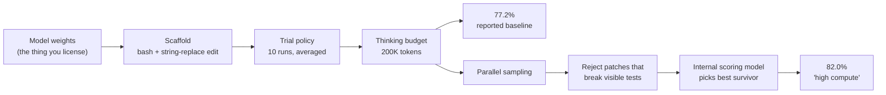

<LevelBadge level="intermediate" />

AILmanacは数十のモデルページでベンチマークの数字を引用しています。すべてのローンチ記事も、すべての比較表も、「フロンティアを超えた」というスレッドもそうです。ところが、数字の意味を決める3つのこと、つまり**どのスキャフォールドで出したのか、何回の試行の平均なのか、モデルが答えをすでに読んでいなかったか**を伝えているものはほとんどありません。

この3つは些末な指摘ではありません。以下で紹介する公表例の一つでは、同じモデルの重みが、まったく同じ500問で**77.2%と82.0%**を記録しており、4.8ポイントの差はすべてハーネスによるものです。別の例では、あるコーディングベンチマークで**70%超**を解くフロンティアモデルが、同じ種類のタスクから作られたより難しいベンチマークでは**約23%**しか解けません。どちらの差も嘘ではありません。しかし、見出しだけを読んでいては、どちらも見えません。

このページは、見出しではなく数字そのものを読むためのマニュアルです。

<Callout type="objectives" items={[
  "SWE-benchのスコアが文字どおり何を測っているのか、そして「Verified」が何を検証したのかを知る",
  "ベンダー自身の方法論の脚注を証拠として、モデルとスキャフォールドを切り分ける",
  "汚染による割引を見抜く:未知のコードで作られたより難しいベンチマークが、なぜスコアを数十ポイント下げるのか",
  "「high compute」や「best-of-n」の数字を、別の価格の別の製品として正しく読む",
  "6つの質問のチェックリストを、どのベンチマークの主張にも2分以内で適用する",
  "ベンチマークが飽和して何も教えてくれなくなった時を見分ける"
]} />

<VerifyNote lastVerified="2026-10-05" source="https://www.swebench.com/original.html">
ベンチマークの構成に関する事実は、メンテナー自身のページによります。[SWE-bench](https://www.swebench.com/original.html)(2,294インスタンス、12のPythonリポジトリ)と[SWE-bench Verified](https://www.swebench.com/verified.html)(500インスタンス、OpenAIと共同で作成)です。スキャフォールドとテスト時計算の方法論は[AnthropicのClaude Sonnet 4.5発表](https://www.anthropic.com/news/claude-sonnet-4-5)から引用しています。このモデルは現在では後継に置き換えられていますが、脚注は現行のスコアとしてではなく**方法論の資料**として引用しています。最新の状況は[Models & pricing](/docs/whats-new/models-and-pricing)を参照してください。SWE-bench Proの数値は[Scaleの発表](https://scale.com/blog/swe-bench-pro)と[SWE-Bench Pro論文](https://arxiv.org/abs/2509.16941)によるもので、**当時テストされたモデルのローンチ時点の数字**です。最新の順位は[ライブのリーダーボード](https://labs.scale.com/leaderboard/swe_bench_pro)を参照してください。OpenAIの記事[*Why we no longer evaluate SWE-bench Verified*](https://openai.com/index/why-we-no-longer-evaluate-swe-bench-verified/)は自動取得をブロックしているため、タイトルと表明されている立場のみを引用しています。
</VerifyNote>

## SWE-benchのスコアが文字どおり測っているもの

まず仕組みから始めます。仕組みそのものが注意点だからです。

SWE-benchは、**人気の高い12のPythonリポジトリ**からプルリクエストとイシューをクロールして作られ、**2,294件のタスクインスタンス**になりました。各インスタンスでは、モデルにイシューの説明とリポジトリのスナップショットが渡されます。モデルはパッチを書きます。パッチは、実際の修正の**前には失敗し、後には通る**テスト、いわゆる「Fail-to-Pass」セットを実行して採点されます。

つまりSWE-benchのスコアとは、次の一文以外の何物でもありません。

> *イシューのテキストとリポジトリを与えられたシステムが、特定の隠れたテスト群を赤から緑にするdiffを生成した。*

この一文が**主張していない**ことに注目してください。そのパッチがメンテナーのマージするものであるとは言っていません。読みやすい、最小限、安全であるとも言っていません。テストでカバーされていない何かを壊さないとも言っていません。人間がそのプルリクエストを受け入れたとも言っていません。このベンチマークは*テストスイートというオラクル*であり、テストスイートは正しさの不完全な仕様です。[コーディングエージェントにおけるリワードハッキング](/docs/frontiers/reward-hacking-in-coding-agents)が、理論上の話ではなく現実の問題であるのも同じ理由です。

### 「Verified」が実際に検証したもの

**SWE-bench Verified**は、OpenAIとの共同で作られた、元のベンチマークの500インスタンスのサブセットです。人間のアノテーターが各インスタンスを確認し、3点を検証しました。問題の記述が明確であること、テストパッチが正しいこと、与えられた情報からタスクが解けることです。

このリストを注意深く読んでください。Verifiedが直したのは**ベンチマーク自身の欠陥**、つまり仕様が不十分なイシュー、壊れた採点器、不可能なタスクです。これは清潔さの保証であって、難しさの保証でも、現実性の保証でもありません。名前に「Verified」とあるせいで、「エンジニアリング能力の測定として妥当性が検証された」と聞こえてしまいます。実際の意味は「この500問は答えられ、正しく採点されることを確認した」です。

<Callout type="key">
**Verified = 問題が公正であること。問題が難しい、代表的、未知であるということではない。** この3つは別々の性質で、次の2つの節は、Verifiedが主張していなかった性質についての話です。
</Callout>

## スキャフォールド税:数字はモデルのスコアではなくシステムのスコア

これはこのページで最も役に立つ内容で、証拠はベンダー自身の脚注です。

AnthropicがClaude Sonnet 4.5を発表した際、方法論の注記には、Claudeの結果はすべて**「bashと文字列置換によるファイル編集という2つのツールだけの、シンプルなスキャフォールド」**を使ったと書かれていました。SWE-bench Verifiedの見出しの数字**77.2%**は、**テスト時計算なし、10試行の平均、200Kの思考バジェット、500問すべて**で出されたものです。

同じ記事には2つ目の数字も報告されていました。「high compute」設定での**82.0%**です。この設定では、複数の試行を並列にサンプリングし、見えている回帰テストを壊すパッチを破棄(リジェクションサンプリング)し、内部のスコアリングモデルで生き残ったものの中から最良を選びます。

同じ重みで、同じ500問。**ハーネスだけで+4.8ポイント**です。

ここから4つの帰結が導かれ、この例をはるかに超えて一般化できます。

**1. リーダーボードの行はモデルではなくエージェントである。** 同じ重みでもスキャフォールドが違えば、別のシステムです。比較表でモデルAが74%、モデルBが71%と並んでいて、行ごとにハーネスが違うなら、その表は少なくともモデルと同じくらいハーネスを測っています。[コーディングエージェントCLIの比較](/docs/models/coding-agent-clis-compared)が存在するのは、ハーネスが第一級の変数だからです。

**2. 「High compute」の数字は、別の価格の別の製品である。** 検証器付きのbest-of-nは、n回の推論実行に加えてスコアリングの1パスです。ベンダーの見出しの数字がhigh computeのものなら、それを再現するのに払う金額は、見た目の価格のおおよそn倍です。料金ページがどちらの数字に対応しているのかを必ず確認してください。[エージェントがトークンを使い果たす理由](/docs/models/why-agents-burn-tokens)は、同じ計算のコスト側の話です。

**3. リジェクションサンプリングには、手元にないかもしれないシグナルが必要である。** 「見えている回帰テストを壊すパッチを破棄する」という手法がSWE-benchで機能するのは、すべてのインスタンスにテストスイートが付いているからです。あなたのコードベースでは、このステップはテストの質に左右されます。high computeのスコアは、一部では*ベンチマークのテストカバレッジ*を測っており、それがフィルターとしてエージェントに移植されています。

**4. 平均の取り方が結果を左右する。** 「10試行の平均」は点数を犠牲にする誠実な選択です。エージェントの実行はばらつきが大きく、10回中の最良の1回なら高く出ます。1回の実行を報告する論文と10試行の平均を報告する論文は比較できず、その違いが見出しに書かれることはまれです。

<Callout type="warning">
スコアにスキャフォールド、試行回数、pass@kの規約のいずれも書かれていなければ、それは再現可能な測定ではなく、小数点付きのマーケティングです。これは、その数字がClaudeに有利でも、他の何かに有利でも変わりません。
</Callout>

## 汚染による割引

2つ目の見えない変数は、モデルが答えを見ているかどうかです。

SWE-benchは、公開されたGitHubの履歴から組み立てられました。公開されたGitHubの履歴は学習データです。この方法で作られたベンチマークでは、モデルが課題を解いているのか、マージ済みの修正を思い出しているのかを証明するきれいな方法がありません。OpenAIの立場は、[*Why we no longer evaluate SWE-bench Verified*](https://openai.com/index/why-we-no-longer-evaluate-swe-bench-verified/)と題された記事で明確に示されています。

**SWE-Bench Pro**は、構造面からの答えです。Scaleは**41の活発にメンテナンスされているリポジトリにまたがる1,865タスク**を作り、学習セットとの重複が設計上起こりにくくなるよう意図的に収集しました。

| サブセット | リポジトリ数 | 汚染への対処 |
| --- | --- | --- |
| Public | 11 | 強いコピーレフト(GPL系)ライセンス。学習に使うのは法的に厄介 |
| Held-out | 12 | ベンチマークとして公開されるが、オープンリリースからは除外 |
| Commercial | 18 | パートナーシップ契約下の非公開コードベース。公開されたことがない |

タスクは意図的に難しくされています。プロのエンジニアが**数時間から数日**かける問題で、通常は複数のファイルにまたがります。

ローンチ時の結果は、覚えておく価値のある数字でした。SWE-bench Verifiedで**70%超**を出す最上位のモデルが、SWE-bench Proの公開セットでは**約23%**になり、コードが公開されたことがないと確認できるcommercialサブセットでは*さらに低く*なりました。

| モデル(ローンチ時にテストされたもの) | SWE-bench Pro、public | SWE-bench Pro、commercial |
| --- | --- | --- |
| OpenAI GPT-5 | 23.3% | 14.9% |
| Claude Opus 4.1 | 23.1% | 17.8% |

これらのモデルはとうに世代交代しています。重要なのは行そのものではなく、その**形**です。同じ種類のタスク、同じ採点の仕組みで、2つの設計上の選択(未知のコード、より長い作業の時間軸)を変えただけで、数字は数十ポイント下がります。同じベンチマークの中での public から commercial への低下は、公表されている中で最もきれいな汚染のシグナルです。タスクの難しさをほぼ一定に保ち、コードが学習に使われた可能性があるかどうかだけを変えているからです。

<Callout type="tip">
**持ち歩ける習慣:** 「同じもの」を測っている2つのベンチマークが40ポイントも食い違うなら、その食い違いこそが情報です。どの設計上の選択が違うのか(未知のデータ、より長い作業の時間軸、より厳しい採点器)を問い、*あなたの*コードベースは難しいほうに似ていると考えてください。あなたのリポジトリは非公開で、長く使われ、テストが手薄です。2021年の有名なDjangoのイシューよりも、commercialサブセットにはるかによく似ています。
</Callout>

## 飽和:ベンチマークが情報を運ばなくなる時

上位が90%台にひしめいているベンチマークは、もう上位を区別できていません。残る差は、採点器のノイズ、スキャフォールドの違い、仕様があいまいな少数のインスタンスが支配しています。

役に立つ目印は、**対になるより難しいバリアント**です。[Ember-1](/docs/models/ember-1-reasoning-token-efficiency)のローンチ表では、SWE-bench Verifiedで80〜93%を出す同じモデルが、作業の途中でユーザーに質問することを求めるSWE-Interactでは**6.7〜21.3%**です。この2つの列のうち、片方だけがまだ何かを測っています。90%台の見出しを見たら、最初にすべきことは、90%台ではない対の数字を探すことです。そこに、実際の能力差が残っています。これは、[能力と信頼性のギャップ](/docs/frontiers/the-capability-reliability-gap)が運用の側から説明している現象と同じです。

### 人間の好みによるリーダーボードでは

アリーナ型のランキングには、鏡像のような問題があります。人間によるペアワイズ投票は、正しさとは無関係に、**より長く、より書式の凝った**回答を確実に高く評価します。LMArenaが、応答の長さとMarkdown構造を統計的に補正する**スタイル制御**ビューを別に提供しているのはそのためです。アリーナの順位を引用するなら、どちらのビューのものかを明記してください。2つの順序は同じではなく、制御なしのほうは部分的に冗長さを測っています。

## 6つの質問、2分で

<Steps items={[
  {
    title: "どのベンチマークの、どのバリアントか?",
    body: "SWE-bench、Verified、Lite、Multimodal、Multilingual、Proは、サイズも難易度も異なる別々のデータセットです。バリアントのない数字は読めません。「SWE-bench 74%」は、互換性のない4つの意味のどれにもなりえます。"
  },
  {
    title: "どのスキャフォールドで出たのか?",
    body: "どのツールか、何ターンか、思考バジェットはいくらか、検索を使ったか。記事に書かれていなければ、その数字は再現できません。Anthropicのbashと文字列置換という2ツールの開示は、Anthropic自身を含め、全員に求めるべき基準です。"
  },
  {
    title: "1回の実行か平均か、pass@1かbest-of-nか?",
    body: "エージェントの評価はばらつきが大きいです。10試行の平均と運のよい1回の実行では、同じシステムでも数ポイント違います。「High compute」「best-of-n」「with verifier」「parallel test-time compute」はすべて、これは思っているよりn倍高くつく、という意味です。"
  },
  {
    title: "答えが学習データに入っている可能性は?",
    body: "モデルのカットオフ前の公開GitHubの履歴から作られていますか?部分的な記憶を前提にしてください。held-outや非公開のサブセットを持つベンチマークを選び、非公開サブセットのスコアを最も重く見てください。それが、あなた自身の未知のリポジトリに最も近い代理指標です。"
  },
  {
    title: "誰が実行したのか?",
    body: "ベンダーがベンダー選定のベンチマークで実行したものは、正当なシグナルですが弱いシグナルです。固定されたハーネスを持つ独立したリーダーボードで、同じモデルを探してください。ベンダーと独立した数字が食い違う場合、その差はたいていスキャフォールドです。"
  },
  {
    title: "飽和していないか、対になる難しい数字は何か?",
    body: "上位5つが天井付近で3ポイント以内に収まっているなら、そのランキングはノイズです。より難しい対のバリアント(対話型、長い作業の時間軸、非公開リポジトリ)を探し、その列を読んでください。"
  }
]} />

## ローンチ記事を問いただす

ベンダーのベンチマークの節を貼り付けて、モデルにステップ2を代わりにやらせます。要約が目的ではなく、**明示されていない**項目のリストが目的です。

<PromptCard title="ベンチマーク主張の監査">
{`You are auditing a benchmark claim for reproducibility. Here is the benchmark section of a model launch post:

<launch_post>
[PASTE THE BENCHMARK SECTION AND ALL FOOTNOTES]
</launch_post>

For each benchmark number reported, produce a row with:
- benchmark name and exact variant (e.g. SWE-bench Verified, 500 instances)
- the score, and whether it is pass@1, best-of-n, or an average of k trials
- the scaffold: tools available, turn limit, thinking/reasoning budget, retrieval
- whether any test-time-compute technique was used (parallel sampling, rejection
  sampling against visible tests, a verifier or scoring model)
- who ran the eval: the vendor, or an independent party with a fixed harness

Then output two lists:
1. NOT STATED — every field above that the post does not disclose.
2. COMPARABILITY RISKS — specific reasons a reader could not place these numbers
   next to another vendor's numbers for the same benchmark.

Do not estimate or infer missing values. If the post does not say it, it goes in
list 1. Quote the footnote text you relied on for each field you did fill in.`}
</PromptCard>

同じベンチマークについて2社の記事に同じプロンプトを実行すると、比較可能性のリスクが、比較表の注意書きの行をほぼそのまま書いてくれます。

## よくある間違い

| 間違い | なぜ誤解を招くか | 代わりにすること |
| --- | --- | --- |
| リーダーボードの行をモデルのスコアとして扱う | モデル**に加えて**スキャフォールド、試行ポリシー、計算バジェットだから | 行の比較は固定された1つのハーネスの中だけで行うか、システム全体として正直に比較する |
| ベンダーAのhigh computeの数字をベンダーBのpass@1の隣に置く | 片方は検証器付きのn回の推論実行、もう片方は1回の実行だから | 計算の規約を揃えるか、非対称性を明記する |
| 「Verified」を「現実的であると検証された」と読む | 問題が答えられ、正しく採点されることを検証しただけだから | きれいなデータセットとして使い、実世界の能力の証拠としては使わない |
| 天井付近のスコアをリードの証拠として引用する | 飽和したベンチマークはノイズを順位付けするから | 対になるより難しいバリアントを引用する |
| 公開GitHubのベンチマークが汚染されていないと考える | データはカットオフより前のもので、クロールに含まれているから | held-outや非公開のサブセットを選び、それらを最も重く見る |
| ベンチマークのスコアを自分のリポジトリに外挿する | あなたのコードは非公開で、長く使われ、テストが手薄だから | 自分のタスクで小さな評価を作る。[AIエージェントを評価する](/docs/playbooks/evaluating-agents)を参照 |
| ビューを示さずにアリーナの順位を引用する | 制御なしのペアワイズ投票は、長さと書式を部分的に高く評価するから | スタイル制御のランキングかどうかを明記する |

最後の行が、実際には最も重要です。公開されたベンチマークが答えるのは「このモデルはこのベンチマークが得意か」です。あなたが本当に知りたいのは「このモデルは自分の仕事が得意か」であり、そのための唯一の道具は自分のタスクでの評価です。[Evals](/docs/power-user/evals)で作り方を扱っています。自分で書いたルーブリックで採点した、実際のチケット20件は、あなたの判断においてこのページのどのリーダーボードよりも重みがあります。

<Quiz questions={[
  {
    q: "あるベンダーが、SWE-bench Verifiedで「high compute」下の82.0%を報告しています。これは、並列サンプリング、見えている回帰テストを壊すパッチの破棄、そして内部のスコアリングモデルによる最良の選択、と説明されています。同じ500問でのシンプルなスキャフォールドの数字は77.2%です。4.8ポイントの差は何を測っていますか?",
    options: [
      "モデルの重みのより良いバージョン",
      "ハーネス:追加の推論実行と検証器であり、モデルの変更ではない",
      "2回の実行間の測定ノイズ",
      "SWE-benchとSWE-bench Verifiedの違い"
    ],
    answer: 1,
    explain: "同じ重みで、同じ500問です。差はすべてテスト時計算によるもので、n回の並列試行、見えているテストに対するリジェクションサンプリング、選択のためのスコアリングモデルです。これは約n倍のコストがかかる別の製品であり、あなた自身のリポジトリにはないかもしれないテストのシグナルに依存します。"
  },
  {
    q: "ローンチ時のSWE-bench Proで、Claude Opus 4.1はpublicサブセットの23.1%を解きましたが、公開されたことのない非公開コードベースであるcommercialサブセットでは17.8%でした。publicからcommercialへの低下が、2つの数字のうちより有益なのはなぜですか?",
    options: [
      "commercialのタスクははるかに長いため、低下はコンテキスト長を測っている",
      "タスクの設計をほぼ一定に保ち、主にコードが学習データに含まれていた可能性があるかどうかだけを変えている",
      "commercialサブセットはpublicより厳しい採点器を使っている",
      "非公開リポジトリはテストカバレッジが低く、採点が厳しくなる"
    ],
    answer: 1,
    explain: "どちらのサブセットも同じベンチマークで、構成も採点も同じです。主に変わるのは、そのリポジトリが学習データにクロールされた可能性があるかどうかで、だからこそこの差は公表されている中で最もきれいな汚染のシグナルであり、commercialのスコアはあなた自身の非公開リポジトリのより良い代理指標になります。"
  },
  {
    q: "SWE-bench Verifiedの背後にある人間のアノテーションは、実際には何を保証しましたか?",
    options: [
      "500タスクが、実際の本番エンジニアリング作業を代表していること",
      "500タスクが、SWE-benchの他の部分より難しいこと",
      "問題の記述が明確で、テストパッチが正しく、与えられた情報からタスクが解けること",
      "500タスクのどれも、どのモデルの学習データにも含まれていないこと"
    ],
    answer: 2,
    explain: "Verifiedが直したのは、ベンチマーク自身の欠陥、つまり仕様が不十分なイシュー、誤った採点器、解けないタスクです。これは清潔さの保証です。難しさ、現実性、汚染については何も言っておらず、この3つは別々の性質です。"
  }
]} />

<Flashcards cards={[
  { front: "SWE-benchを一行で", back: "12の人気Pythonリポジトリのプルリクエストとイシューからクロールした2,294件のタスクインスタンス。モデルにはイシューとリポジトリのスナップショットが与えられ、そのパッチは「Fail-to-Pass」テストが赤から緑になるかで採点される。" },
  { front: "SWE-bench Verifiedが検証したこと", back: "元のベンチマークから500インスタンスを、OpenAIと共同で人間のアノテーターが確認し、問題の記述が明確で、テストパッチが正しく、タスクが解けることを検証した。清潔さの保証であり、難しさ、現実性、汚染のなさの保証ではない。" },
  { front: "スキャフォールド税", back: "リーダーボードの行はモデルに、そのハーネスを加えたもの。Anthropicが公表した方法論では、同じ重みが、同一の500問で77.2%(シンプルな2ツールのスキャフォールド、10試行平均、テスト時計算なし)と82.0%(「high compute」:並列サンプリング、見えているテストに対する破棄、内部スコアリングモデル)を出している。" },
  { front: "「high compute」/best-of-nが実際に要するコスト", back: "n回の推論実行に加えて検証の1パス。見出しがhigh computeの数字なら、再現にはおよそ見た目の価格のn倍かかり、しかも破棄のステップには、あなたのコードベースにないかもしれないテストのシグナルが必要。" },
  { front: "SWE-bench Pro", back: "活発にメンテナンスされている41のリポジトリにまたがる1,865タスク。内訳は、public 11(強いコピーレフト)/held-out 12/パートナーシップ契約下のcommercial 18。タスクはプロのエンジニアが数時間から数日かける内容で、通常は複数ファイルにまたがる。学習セットとの重複が設計上起こりにくいように作られている。" },
  { front: "汚染による割引", back: "ローンチ時、SWE-bench Verifiedで70%超のモデルが、SWE-bench Proのpublicセットでは約23%、commercialセットではさらに低かった(GPT-5 23.3% → 14.9%、Opus 4.1 23.1% → 17.8%)。同じベンチマーク内のpublicからcommercialへの低下は、公表されている中で最もきれいな汚染のシグナル。" },
  { front: "ベンチマークの飽和:その目印", back: "上位が天井付近の数ポイント以内に固まっていれば、ランキングはノイズ。対になるより難しいバリアントを探す。SWE-bench Verifiedで80〜93%のモデルが、SWE-Interactでは6.7〜21.3%になる。飽和していない列こそ、まだ情報を運んでいる。" },
  { front: "アリーナのスタイル制御", back: "人間によるペアワイズ投票は、正しさとは無関係に、より長く書式の凝った回答を高く評価する。そのためLMArenaは長さとMarkdownを補正したスタイル制御ランキングを公開している。引用した順位がどちらのビューのものかを必ず明記すること。" },
  { front: "6つの質問", back: "どのバリアントか?どのスキャフォールドか?1回の実行か平均か、pass@1かbest-of-nか?答えが学習データに入っている可能性は?誰が実行したか?飽和していないか、対になる難しい数字は何か?" }
]} />

<Callout type="takeaways" items={[
  "ベンチマークのスコアはシステムのスコアである。モデル+スキャフォールド+試行ポリシー+計算バジェット。同一の問題での77.2%と82.0%という公表された差がその証拠。",
  "「Verified」は問題が公正であることを意味し、難しい、現実的、未知であることを意味しない。3つの別々の性質に、安心させる一つの言葉。",
  "公開GitHubのベンチマークでは、モデルが思い出しているだけではないと証明できない。held-outと非公開のサブセットを最も重く見る。それがあなたのリポジトリに最も近い代理指標。",
  "「同じもの」を測る2つのベンチマークの40ポイントの食い違いは、誤りではなく情報である。違っている設計上の選択を探す。",
  "天井付近のスコアはノイズを順位付けしている。必ず対になるより難しいバリアントを読む。",
  "公開ベンチマークのどれも、あなたが本当に知りたいことには答えない。ルーブリック付きの自分のチケット20件が、ここにあるどのリーダーボードにも勝る。"
]} />

## 次へ

- [AIエージェントを評価する](/docs/playbooks/evaluating-agents) — 公開ベンチマークでは答えられない、本当の問いに答える評価を作るためのプレイブック
- [モデルは劣化したのか?実際に見分ける方法](/docs/models/is-the-model-nerfed) — もう一つのよくある問いに向けた同じ測定の規律で、自分で実行できる対比較設計のプロトコル付き
- [コーディングエージェントCLIの比較](/docs/models/coding-agent-clis-compared) — 第一級の変数としてのハーネス。まさにスキャフォールド税が示しているとおりのもの

## 出典と参考資料

- [SWE-bench](https://www.swebench.com/original.html) — 構成(2,294インスタンス、12のPythonリポジトリ)とFail-to-Passの採点の仕組み
- [SWE-bench Verified](https://www.swebench.com/verified.html) — OpenAIと作成した500インスタンスのサブセットと、人間のアノテーションが正確に何を確認したか
- [Introducing Claude Sonnet 4.5 — Anthropic](https://www.anthropic.com/news/claude-sonnet-4-5) — ここで引用した方法論の脚注:2ツールのスキャフォールド、10試行の平均、200Kの思考バジェット、そして「high compute」が何を加えるか
- [SWE-Bench Pro: Can AI Agents Solve Long-Horizon Software Engineering Tasks? — arXiv 2509.16941](https://arxiv.org/abs/2509.16941) — 1,865タスク、41リポジトリ、public / held-out / commercialの分割
- [SWE-Bench Pro: Raising the Bar for Agentic Coding — Scale](https://scale.com/blog/swe-bench-pro) — 汚染対策の方針(コピーレフトと非公開の商用コード)と、ローンチ時のpublic対commercialの結果
- [SWE-Bench Pro leaderboard — Scale](https://labs.scale.com/leaderboard/swe_bench_pro) — 上記のローンチ時の数字が過去のものになった後の、最新の順位
- [Why we no longer evaluate SWE-bench Verified — OpenAI](https://openai.com/index/why-we-no-longer-evaluate-swe-bench-verified/) — 表明されている立場として引用。このページは自動取得をブロックしている
- [LMArena leaderboard](https://lmarena.ai/leaderboard) — 同じモデルのデフォルトとスタイル制御のビューを比較する
- 関連:[Evals](/docs/power-user/evals) · [コーディングエージェントにおけるリワードハッキング](/docs/frontiers/reward-hacking-in-coding-agents) · [能力と信頼性のギャップ](/docs/frontiers/the-capability-reliability-gap) · [エージェントがトークンを使い果たす理由](/docs/models/why-agents-burn-tokens)
