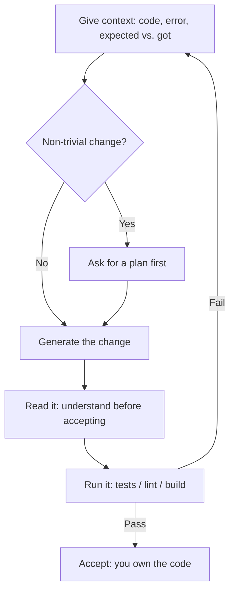

<LevelBadge level="all" />

<Callout type="objectives" items={["AIコーディングが本当に得意なこと — 説明、生成、リファクタリング、デバッグ、翻訳、レビュー — を知る", "黄金のループを回す:コンテキストを与え、計画し、生成し、読み、実行 — そして失敗を新しいコンテキストとして戻す", "曖昧な一行ではなく、働きに見合うプロンプトに手を伸ばす", "2つの厳守ルールを身につける:実行して検証すること、そしてシークレットを決して貼り付けないこと"]} />

コーディングを学んでいるにせよ、本番ソフトウェアを出荷しているにせよ、AIはそのループを変えます。勝者はAIを、速くて知識豊富なペアとして扱い — そして**それが生み出すすべてを検証します**。

## AIが得意なこと

- なじみのないコードやエラーを平易な言葉で**説明する**。
- ボイラープレート、テスト、関数の初稿を**生成する**。
- 明瞭さのために**リファクタリングし**、スタックトレースについて推論して**デバッグする**。
- 言語/フレームワーク間で**翻訳する**。
- 差分をバグや臭いについて**レビューする**。

実際のコードベースでは、ファイルを読み、テストを実行し、あなたの承認のもとで編集できる[Claude Code](/docs/claude-code/what-is-claude-code)を使って、リポジトリ*内で*これを行ってください。

## 黄金のループ

1. **コンテキストを与える** — 関連するコード、エラー、期待した結果と実際の結果。曖昧な入力には曖昧な出力。
2. 些細でない変更については、編集の前に**計画を求める**([プランモード](/docs/claude-code/plan-mode))。
3. 変更を**生成する**。
4. **それを読む** — 受け入れる前に理解する。コードの責任はあなたにあります。
5. **実行する** — テスト/リント/ビルド。*実行せずに「これで動く」を決して信用しない。*

良い結果と悪い結果を分けるのは、先頭に戻る矢印です。テストが失敗したら、やみくもに直すのではなく、その失敗を新しいコンテキストとして再び与えます。

## 働きに見合うプロンプト

<PromptCard title="コードを説明+エッジケースを見つける">{`Explain what this function does and any edge cases it mishandles: {code}`}</PromptCard>

<PromptCard title="テストを生成する">{`Write tests for {function}. Cover the happy path and the edge cases. {code}`}</PromptCard>

<PromptCard title="スタックトレースからデバッグする">{`This throws {error}. Here's the code and stack trace. Find the root cause and propose a minimal fix. {context}`}</PromptCard>

## 厳守すべきルール

:::warning 検証し、シークレットを守る
- 生成されたコードを**実行してレビューする** — 微妙に間違っていたり、存在しないAPIをでっち上げたりすることがあります。
- プロンプトに**シークレット/キーを決して貼り付けない**([プライバシー](/docs/foundations/privacy))。
- エージェント的/自動化されたコーディングでは、[権限](/docs/claude-code/permissions)をロックダウンし、[エージェントのセキュリティ確保](/docs/security/securing-agents)を読んでください。
:::

<Quiz title="理解度チェック" questions={[{q: "黄金のループにおいて、良いAIコーディングの結果と悪い結果を最も分けるものは何ですか?", options: ["常に最大のモデルを使うこと", "先頭に戻る矢印:失敗したテストの出力を、やみくもに修正するのではなく新しいコンテキストとして与え直すこと", "時間節約のために最初の生成結果を受け入れること"], answer: 1, explain: "ループがメソッドそのものです。テストが失敗したら修正を推測するのではなく、失敗を新しいコンテキストとして戻し、次の試行が実際に何が起きたかに基づくようにします。"}, {q: "生成されたコードを受け入れる前になぜ読むのですか?", options: ["読むことがテストランナーを起動するから", "微妙に間違っていたり存在しないAPIをでっち上げていたりすることがあり — いずれにせよコードの責任はあなたにあるから", "SDKが開いていないコードの実行を拒否するから"], answer: 1, explain: "AIの出力は間違っていても自信ありげに見え、存在しない関数を呼び出すこともあります。読むことは、出荷される前にそれを捕まえる方法です — そして誰がタイプしたかに関わらず、コードに対する説明責任はあなたにあります。"}, {q: "次のうちプロンプトに絶対入れてはいけないものは?", options: ["エラーメッセージとスタックトレース", "シークレットやAPIキー", "期待した結果と実際に起きたこと"], answer: 1, explain: "エラー、スタックトレース、期待対実際は結果を改善するまさにそのコンテキストです。シークレットとキーは唯一避けるべきもの — 貼り付ければ漏えいです。"}]} />

<Callout type="takeaways" items={["AIを速くて知識豊富なペアとして扱う — そして生み出すすべてを実際に実行して検証する", "コンテキスト入力、品質出力:コード、エラー、期待対実際を与え、曖昧な依頼は決してしない", "些細でない編集の前に計画を求め、コードが変わる前にアプローチをレビューする", "生成コードを受け入れる前に読む — 微妙に間違っていたり存在しないAPIをでっち上げていたりすることがある", "シークレットやキーをプロンプトに決して貼り付けず、エージェントに自律的にコーディングさせる前に権限をロックダウンする"]} />

## 次のステップ

- [Claude Codeとは何か](/docs/claude-code/what-is-claude-code)
- [実際のリポジトリ向けにClaude Codeをカスタマイズする](/docs/walkthroughs/customize-claude-code)
- [最初のAPI呼び出し](/docs/api/first-call)
