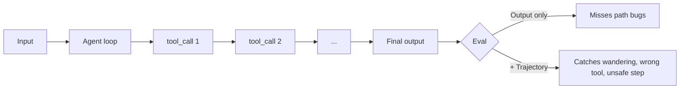

<LevelBadge level="advanced" />

<VerifyNote lastVerified="2026-07-24" source="https://platform.claude.com/docs/en/test-and-evaluate/develop-tests">
Anthropic の評価ガイドが方法論の情報源です(SMART 基準、完全一致、LLM 採点の Likert/二値)。エージェント軌跡評価は新興分野 — フレームワーク名は例示として扱い、API は各ベンダーのドキュメントで確認してください。
</VerifyNote>

<Callout type="objectives" items={["エージェント評価がプロンプト評価と異なる理由を理解する — 最終回答だけでなく軌跡が重要", "20〜100件の実例と明確な合格基準からなるゴールデンセットを構築する", "4つの層で採点する: ツールコールの正確性、軌跡の質、タスク成功、本番でのドリフト", "LLM-as-judge を安全に使う: ルーブリック優先、人間との校正、判定の抜き取りチェック", "CI で動作し、ユーザーに届く前に悪い変更を落とす評価を出荷する"]} />

**エージェント評価**は「プロンプトが正しい単語を返したか?」より難しい質問に答えます: *ループで動作するモデルが、正しいツールを、正しい順序で、正しい引数で選び、正しい結果に到達し、予算と安全境界内に留まったか?*

このステップを飛ばすと、システムプロンプトを調整するたびに静かに劣化する「役に立つ」エージェントを出荷することになります。

## なぜエージェントに独自の評価が必要か

シングルプロンプト評価は1つの入力 → 1つの出力を採点します。エージェントは**軌跡**を生成します: 多くのターンにわたる推論、ツールコール、中間観察、修正のチェーン。2つの失敗モードがこれを難しくします:

- **正しい答え、間違った経路。** エージェントは無駄なループ、危険な行動、幸運な推測の後に正しい出力に偶然到達します。最終回答のみの評価は合格と判定しますが、本番では通用しません。
- **間違った答え、もっともらしい経路。** 各ステップは単独では合理的に見えますが、エージェントがツールを誤用したり、制約を無視したり、中間事実をハルシネートしたりします。返答だけでなくトレースを見る必要があります。



## 4つの評価層

安いものから順に重ねて、高価なグレーダーを待たずに悪い変更を素早く落とせるようにします。

<Steps items={[
  {title: "層1 — ツールコールの正確性(決定的)", body: "各予想ステップについて、ツール名が一致すること、必須パラメータが存在すること、型が検証されることをチェック。純粋なコード、ミリ秒、モデル不要。他のすべてが実行される前に「write_file を呼ぶべきだったのに search を呼んだ」を捕まえる。"},
  {title: "層2 — 軌跡の質(ルーブリック + LLM-judge)", body: "完全なトレースを採点: エージェントは合理的な経路を取ったか、それとも彷徨ったり、ループしたり、戻ったりしたか?最小必要ステップに対する実際のステップ数、冗長なコール、ツールエラー後のリトライ、完了時に停止したか。ここでは明示的なルーブリックで LLM ジャッジを使う。"},
  {title: "層3 — タスク成功(エンドツーエンド)", body: "目標は達成されたか?可能な限り決定的に(スキーマ有効、ファイル書き込み、テスト合格)、曖昧な場合は LLM 採点(要約が忠実、回答が役立つ)。これがヘッドライン指標。"},
  {title: "層4 — 本番でのドリフトと安全性", body: "本番では実トレースをサンプリングし、一部を再採点する。介入率(人間がどれくらい介入したか)、拒否率、成功タスクあたりのコストを監視する。これらが変化すると、モデル、ツール、入力が下で変わっている。"}
]} />

## 価値を予測するメトリクス

すべてのメトリクスがダッシュボードに載るわけではありません。2026年に出荷判断を左右する5つ:

| メトリクス | 何を測るか | なぜ重要か |
|---|---|---|
| **タスク成功率** | ゴールデンセット中、エージェントが正しく完了した割合 | ヘッドライン。他はすべて診断用。 |
| **成功タスクあたりコスト** | $ / 合格ケース(入力+出力トークン、ツールコスト) | 10倍のコストでの成功は退行。 |
| **レイテンシ (p50 / p95)** | タスクあたりのウォールクロック、テール含む | p95 が実ユーザーが感じる値 — 平均は嘘をつく。 |
| **ツールコール精度** | 予想ツールコールのうち名前+引数が正しい割合 | 軌跡の質を予測。計算が安い。 |
| **介入率** | 本番で人間の引き継ぎが必要だったタスクの割合 | 自律性の数字。上昇 = 信頼低下。 |

一緒に追跡すること — 1つだけが動くのは通常ノイズではなく先行シグナルです。

## ゴールデンセットを構築する

<Steps items={[
  {title: "実入力をマイニング", body: "実使用(ログ、サポートチケット、ユーザー要求)から20〜100件のタスクを引く。頻繁な易しい経路、厄介な中間、すでに刺されたエッジケースをカバー。"},
  {title: "ケースごとに合格基準を書く", body: "各ケース: 「完了」はどう見えるか?正確な予想出力、必要な事実、有効な JSON スキーマ、存在すべきファイル、または曖昧なケースのルーブリック。基準を書けないなら、ケースは使えない — 削除するか明確化する。"},
  {title: "理想的な軌跡を注釈", body: "サブセットについて、良いエージェントが取るツール順序をスケッチ。これが層1がチェックする対象。"},
  {title: "凍結、バージョン管理", body: "セットをリポジトリにコミット。ケースをその場で編集しない — スコア履歴を比較可能にするため v1 の隣に v2 を追加。"},
  {title: "失敗から成長させる", body: "本番バグはすべて、修正前に新しい評価ケースになる。それがセットを予測的に保ち、劣化させない方法。"}
]} />

## LLM-as-judge — 安価で速いが、校正が必要

曖昧な出力を手で採点するのはスケールしません。明示的なルーブリックで読む能力のあるモデルはスケールします — Anthropic 自身の [評価方法論ガイド](https://platform.claude.com/docs/en/test-and-evaluate/develop-tests) がトーン、忠実性、有用性、安全性についてこのパターンを推奨しています。

ジャッジには文書化されたバイアスがあります: 長い回答、最初に表示された選択肢、自身の言い回しを反映した出力を好みます。3つの習慣が正直に保ちます:

- **雰囲気ではなくルーブリック。** 「有用性を1〜5で評価」は無用。スケール上の各点を観察可能な行動に固定する。
- **人間ラベルサンプルで校正する。** 30〜50ケースを人間に採点させ、ジャッジ対人間の一致度を測る(Cohen κ ≥ 0.6 を目標)。不一致なら、ルーブリックを厳しくする。
- **ジャッジには別のモデルを使う。** 出力を生成したモデルと同じモデルで採点すると、双方向にバイアスが漏れる。
- **毎週判定を抜き取りチェックする。** ランダムな10件のジャッジスコアとその理由を読む。ドリフトを捕まえる最も安い方法。

<PromptCard title="LLM-as-judge ルーブリックテンプレート">{`You are grading an AI assistant's response against a rubric. Be strict. Cite exact evidence from the response.

<task>{task}</task>
<response>{response}</response>

Rubric (rate 1–5 per dimension):
- Task completion: 1 = ignored task; 3 = partial; 5 = fully done, no gaps.
- Faithfulness: 1 = contains false claims; 3 = mostly grounded, one soft claim; 5 = every claim traceable to input/tools.
- Efficiency: 1 = wandered/looped; 3 = extra steps; 5 = minimum viable path.

Output JSON only:
{"task_completion": N, "faithfulness": N, "efficiency": N, "evidence": "<quote>", "verdict": "pass"|"fail"}`}</PromptCard>

<PromptCard title="軌跡レビュープロンプト(層2)">{`You are auditing an AI agent's tool-call trajectory. The goal was: {goal}
Expected minimum steps: {n_min}

<trajectory>
{list of tool_name(args) -> result, in order}
</trajectory>

Answer in JSON:
{"steps_taken": N, "wasted_steps": N, "wrong_tool_calls": [<indices>], "unsafe_actions": [<indices>], "verdict": "pass"|"fail", "reason": "<one sentence>"}`}</PromptCard>

<PromptCard title="敵対的ケース生成器(セットを成長させる)">{`Generate 5 new eval cases that are likely to break an agent whose current failures cluster around: {failure_pattern}.

For each case give: input, expected output OR pass criterion, ideal tool sequence, and why this case is hard.

Return YAML.`}</PromptCard>

## CI ゲート: 出荷前に悪い変更を落とす

評価は自動的に退行をブロックしたときにだけ元が取れます。すべてのプロンプト/モデル/ツール変更のチェックとして CI に組み込む:

```python
# tests/eval_gate.py — runs on every PR
import json, sys
from anthropic import Anthropic
from my_agent import run_agent

client = Anthropic()
golden = json.load(open("evals/golden.v3.json"))

results = []
for case in golden:
    trace = run_agent(case["input"])
    layer1 = tool_calls_match(trace, case["expected_tools"])   # deterministic
    layer3 = judge(client, case, trace.final_output)           # LLM rubric
    results.append({"id": case["id"], "layer1": layer1, "layer3": layer3["verdict"]})

pass_rate = sum(r["layer3"] == "pass" for r in results) / len(results)
tool_acc  = sum(r["layer1"] for r in results) / len(results)

# Gates — tighten over time
assert pass_rate >= 0.85, f"Task success dropped to {pass_rate:.0%}"
assert tool_acc  >= 0.90, f"Tool-call accuracy dropped to {tool_acc:.0%}"
print(f"PASS: task={pass_rate:.0%} tools={tool_acc:.0%}")
```

実行ごとのスコアを保存してトレンドをチャート化。マージ間の3ポイント以上の低下はノイズではなく本物の退行です。

<Callout type="warning" title="評価が期待外れになるアンチパターン" items={["最終回答だけを判定 — すべての軌跡バグを見逃す。層1と2も採点する。", "静的ゴールデンセット — 本番失敗で成長しなければ本番を予測しなくなる。月次で予算を確保する。", "エージェントとジャッジが同じモデル — 双方向のバイアス。採点には別のモデルにローテーション。", "ゲートにコストやレイテンシがない — 8ツールコールを追加するプロンプト調整は評価に「合格」しつつ請求を10倍にできる。", "雰囲気だけの採点 — 「良く感じる」はメトリクスではない。2つの数字を差分できなければ、自信を持って出荷できない。"]} />

<Callout type="takeaways" items={["エージェントは回答ではなく軌跡を生む — 結果だけでなく経路を評価する", "安い順に重ねる: ツールコール正確性 → 軌跡質 → タスク成功 → 本番ドリフト", "出荷判断を左右する5つのメトリクス: タスク成功率、成功あたりコスト、p50/p95 レイテンシ、ツールコール精度、介入率", "LLM-as-judge はスケールするが、明示的ルーブリック、別モデル、人間ラベルでの校正が必須", "本番失敗で成長しないゴールデンセットは本番を予測しなくなる — 月次で成長させる", "評価をハードゲートとして CI に組み込む — ユーザーより先に退行を捕まえるチェック"]} />

## 自分を確認する

<Quiz title="自分を確認する" questions={[
  {
    q: "なぜエージェントには最終回答評価ではなく軌跡評価が必要か?",
    options: [
      "最終回答評価は CI で実行するには遅すぎる",
      "エージェントは彷徨ったり危険なステップを経て正しい答えに到達できる(正しい答え、間違った経路) — そしてもっともらしい経路で間違った答えを出せる",
      "軌跡評価だけが LLM-as-judge をサポートする",
      "最終回答評価は分類タスクにしか機能しない"
    ],
    answer: 1,
    explain: "2つの失敗モードが出力のみの採点から隠れます: 悪い経路を経た正しい答え(合格判定、本番で退行)ともっともらしい経路を経た間違った答え(静かに失敗)。結果に加えて軌跡を採点する必要があります。"
  },
  {
    q: "評価を階層化しています。安いから高いへの正しい順序は?",
    options: [
      "LLM 採点タスク成功 → 決定的ツールコールチェック → 本番ドリフト → 軌跡ルーブリック",
      "決定的ツールコール正確性 → 軌跡質(LLM-judge) → タスク成功 → 本番ドリフト",
      "本番ドリフト → タスク成功 → 軌跡ルーブリック → ツールコールチェック",
      "軌跡ルーブリック → タスク成功 → ツールコールチェック → 本番ドリフト"
    ],
    answer: 1,
    explain: "層1(決定的ツールコールチェック)はモデルなしでミリ秒で動作するため、悪い変更を素早く落とせます。その後 LLM 採点の軌跡とタスク成功層、次に本番ドリフト監視。"
  },
  {
    q: "LLM-as-judge を信頼できるように保つ習慣のペアはどれ?",
    options: [
      "エージェントと同じモデルで採点し、実行ごとにルーブリックを書き直す",
      "観察可能な固定点のあるルーブリックを使い、人間ラベルサンプルでジャッジを校正する",
      "過剰仕様を避けるため雰囲気ベースのプロンプトを好み、判定を抜き取りチェックしない",
      "常に利用可能な最大モデルをジャッジとして使い、校正不要"
    ],
    answer: 1,
    explain: "固定されたルーブリックはジャッジが基準を発明する自由を取り除き、人間校正(Cohen κ ≥ 0.6 が一般的な目標)はジャッジがグラウンドトゥルースに同意することを証明します。別のモデルを使い、毎週抜き取りチェックすることで完成します。"
  },
  {
    q: "CI ゲートがタスク成功率を通過しましたが、レイテンシとタスクあたりコストが2倍になりました。正しい判断は?",
    options: [
      "出荷する — タスク成功はヘッドラインメトリクス",
      "ゲートを失敗させる: 5つの出荷メトリクスは一緒に動き、合格率が保たれても2倍のコスト/レイテンシ変化は退行",
      "評価を再実行する — 数字はノイズに違いない",
      "出荷を正当化するため合格率のしきい値を緩める"
    ],
    answer: 1,
    explain: "5つのメトリクスは一緒に出荷判断を左右します。合格率を平坦に保ちつつコストやレイテンシを2倍にするプロンプト調整は、ゲートが存在する理由そのもの — 請求と UX の退行は精度低下と同じくらいユーザーに影響します。"
  }
]} />

<Flashcards cards={[
  {front: "軌跡(エージェント評価における)", back: "エージェントがタスク全体で取るツールコール、引数、観察、推論ステップの完全な順序付きチェーン — 最終出力に加えて評価するもの。"},
  {front: "ゴールデンセット", back: "20〜100件の実タスクと明示的な合格基準(サブセットには理想的軌跡も)を含む凍結・バージョン管理されたコレクション。すべてのプロンプト/モデル/ツール変更が採点される対象。"},
  {front: "ツールコール精度", back: "名前が一致し必須パラメータが検証される予想ツール呼び出しの割合。決定的、安価で、軌跡質の強い先行指標。"},
  {front: "LLM-as-judge", back: "(異なる)能力のあるモデルが明示的ルーブリックで出力を採点する採点パターン。速くスケーラブルだが、信頼できるようにするには人間ラベルでの校正が必要。"},
  {front: "介入率", back: "人間の引き継ぎが必要だった本番タスクの割合。介入率の上昇 = 自律性の低下。オフラインスコアが良好でも。"},
  {front: "成功タスクあたりコスト", back: "合計トークン+ツールコストをエージェントが正しく完了したタスク数で割った値。「まだ動く」が「10倍高価」を隠す退行を捕まえる。"},
  {front: "CI 評価ゲート", back: "すべての PR で自動チェックとしてゴールデンセットを実行し、しきい値以下でビルドを強制失敗(例: 合格率 < 85%、ツール精度 < 90%)。マージ前に静かな退行をブロック。"}
]} />

## 次へ

- [API でのエージェント構築](/docs/api/building-agents) · [評価(基礎)](/docs/foundations/evals)
- [エージェントとツールのセキュリティ](/docs/security/securing-agents) · [ハルシネーションとその削減方法](/docs/foundations/hallucinations)
- [ヘッドレスと Agent SDK](/docs/claude-code/headless-and-agent-sdk) · [Managed Agents](/docs/api/managed-agents)
