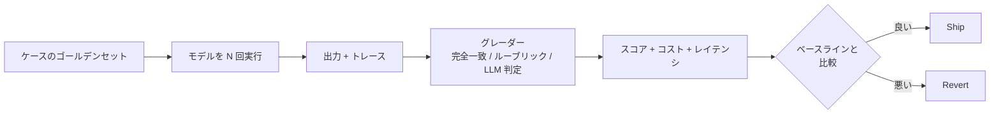

<LevelBadge level="intermediate" />

<VerifyNote lastVerified="2026-07-25" source="https://platform.claude.com/docs/en/test-and-evaluate/develop-tests">
方法論（テスト駆動プロンプト/エージェント設計、SMART 基準、完全一致対 LLM 採点ルーブリック）は Anthropic の公式「Develop tests」ガイドに従います。ここでの概念はモデル非依存であり、OpenAI、Gemini、オープンウェイトモデルにも等しく適用されます。
</VerifyNote>

<Callout type="objectives" items={[
  "評価が実際に何であるかを理解する — モデル出力を固定ルーブリックに対して採点する再現可能なテスト",
  "感覚チェックで十分なときと、評価しかないときを知る",
  "実際に使う 4 種類の評価と、それぞれの適用場面を認識する",
  "最小限有効な評価 — 20 ケース、1 ルーブリック、1 スクリプト — を午後の間に構築する",
  "評価にウソをつかせる 6 つの罠を避ける"
]} />

このサイトから 1 つ習慣を持ち帰るなら、これにしてください。プロンプト設計、モデル選択、ツール接続 — その変更がシステムをより良くしたか悪くしたかを*測定*できるまで、何一つ蓄積されません。それができれば、あらゆる将来の決定 — Sonnet 5 か Fable 5 か、ツール追加、システムプロンプトの締め付け、思考予算の引き上げ — が 1 週間の議論の代わりに 5 分のチェックになります。

評価は「賢く感じる」を、意見の不一致に耐える数字に置き換える方法です。

## 評価とは実際何か

**評価**は 3 つのものを組み合わせたものです：

1. **固定された入力セット** — 通常、実際の使用から抽出された 20 から数百のケース。
2. **ルーブリックまたは正解データ** — 各ケースに対して「正しい」とはどう見えるか？
3. **採点ループ** — すべてのケースでモデルを実行し、出力をルーブリックと比較し、合格/不合格（または段階的スコア）とコスト、レイテンシを報告するスクリプト。

それ以外のすべて — ダッシュボード、LLM 判定者、CI ゲート — はその中心の周りのオプションの足場です。

そのループを変更のたびに再実行します。それがゲームのすべてです。

## 感覚チェックで十分なとき — そうでないとき

すべてのプロンプトに評価が必要なわけではありません。判断を使ってください。

| 状況 | 感覚チェック OK | 評価を構築 |
|---|---|---|
| 自分用のワンオフスクリプト | はい | — |
| 5 人の同僚に出荷するプロンプト | はい（軽く） | 信頼性が重要なら |
| ユーザー向けのもの、あらゆる規模で | — | はい |
| 無人で動くもの（エージェント、バッチジョブ） | — | はい |
| モデルやプロバイダを切り替える決定 | — | はい（そうでなければ推測） |
| 間違った答えがコスト（金銭、安全、法的）を持つもの | — | はい（交渉不可） |

経験則：**「新しいバージョンの方が*感じ*が良いか？」と自分が言うのを初めて聞いたら、止まって評価を構築してください。**次の 10 個の変更でその代金を払います。

## 使う 4 種類の評価

<Steps items={[
  {title: "完全一致 / 構造チェック", body: "出力が特定の文字列と等しい、正規表現に一致する、有効な JSON としてパースされる、またはスキーマに一致する必要がある。安価、高速、明確。分類、抽出、コンパイル必須のコード、ツール呼び出し、構造化出力に使う。"},
  {title: "ルーブリック採点（人間または LLM 判定）", body: "出力を明示的なルーブリックに対して採点する — 「要約はソースに忠実か？ Y/N」「トーンは適切か？ 1〜5 でアンカー付き」。ライティング、要約、説明、品質が曖昧なあらゆる場所で使う。"},
  {title: "参照ベース比較", body: "既知の正解と、意味的類似度、BLEU/ROUGE、または LLM に「A は B と同じ情報を伝えているか？」と尋ねて比較する。翻訳、言い換え、検索拡張回答に使う。"},
  {title: "軌跡 / プロセス評価", body: "エージェントの場合：迷ったり不安全なステップなく、適切な順序で正しいツールを呼び出したか？ 最終回答だけでなく、トレースを採点する。仕組みについてはエージェント固有のプレイブックを参照。"}
]} />

実際のシステムはこれらを混ぜます — JSON スキーマチェックがルーブリック採点をゲートし、それがエンドツーエンドの軌跡チェックをゲートする。安価な層は早く失敗し、高価な層は安価な層が通過したときのみ実行されます。

## 最小限有効な評価を構築する

午後の間に動く評価が持てます。まずこのリストの他のすべてはスキップしてください。

<Steps items={[
  {title: "20 の実入力を掴む", body: "ログ、サポートチケット、自分自身の使用から。一般的な簡単なパス、難しい中間、すでにあなたを焼いた 2〜3 のケースをカバー。20 は本物のリグレッションを検出するのに十分。数百は後のため。"},
  {title: "ケースごとの合格基準を書く", body: "1 文：「出力には顧客の注文番号と pending/approved/denied の払い戻しステータスを含める必要がある」— または「出力はスキーマ X に一致する有効な JSON である必要がある」。書けないなら、そのケースはテスト不能 — カットするか明確化する。"},
  {title: "50 行のスクリプトを書く", body: "各ケースについて：入力をモデルに送り、出力とトークン数を捕捉し、グレーダーを実行し、合格/不合格とコストを記録。結果の CSV で十分 — UI は不要。"},
  {title: "ベースラインを確立する", body: "今日のプロンプトをそのセットに対して実行。スコアを記録。それがあなたの基準。将来のすべての変更はそれに対して測定される。"},
  {title: "1 つのワークフローをそれでゲートする", body: "スクリプトを CI かデプロイ前チェックに配線。スコアを下げる変更はビルドを失敗させる。今、評価は自らを守る — 誰も実行することを覚えておく必要はない。"}
]} />

それだけです。この後のすべて — LLM 判定、キャリブレーション、ダッシュボード、コスト追跡、メトリック別スライシング — は、すでに存在し、すでに悪い変更をブロックする評価上に償却されます。

## 評価にウソをつかせる 6 つの罠

<PromptCard title="罠 1 — ゴールデンセットが偽物">
実際の使用からサンプリングされたのではなく、チームが発明したケース。評価は通るが、ユーザーは評価が見たことのない入力に当たる。

**修正：** 実際のログからケースをマイニング。すべての本番バグは修正する*前*に新しいケースになる。
</PromptCard>

<PromptCard title="罠 2 — ルーブリックが感覚">
アンカーなしで「品質を 1〜5 で評価」。2 人のグレーダー — 人間または LLM — は激しく意見が食い違い、スコアは再実行のたびに跳ねる。

**修正：** スケール上の各ポイントを観察可能な行動にアンカー。「5 = すべての主張がソースに追跡可能；3 = サポートされていない主張が 1 つ；1 = サポートされていない主張が 3 つ以上」。
</PromptCard>

<PromptCard title="罠 3 — LLM 判定がキャリブレーションされていない">
安いのでモデルに採点を任せる。判定には既知のバイアスがある：長い回答、最初の選択肢、自分自身の言い回しを繰り返す出力を好む。

**修正：** 人間に 30〜50 ケースを採点させる。判定対人間の合意を測定（Cohen のカッパ少なくとも 0.6）。選択肢の順序をランダム化。毎週判定をスポットチェック。
</PromptCard>

<PromptCard title="罠 4 — 評価が過学習">
同じ 20 ケースでスコアが最大化するまでプロンプトを微調整し続ける。本番が沈む。

**修正：** dev と holdout セットに分割。反復中は holdout スコアを決して見ない。合成バリエーションではなく、実際の失敗からセットを成長させる。
</PromptCard>

<PromptCard title="罠 5 — 1 つの数字、コストなし">
スコアが上がる；トークン請求が倍になる。またはレイテンシが 8 秒に跳ね上がる。「改善を出荷した」がプロダクトをリグレッションさせた。

**修正：** すべての実行がスコア、ケースごとのコスト、p50/p95 レイテンシを一緒に報告する。変更は 3 つのうち 2 つを静かにリグレッションさせないときのみ「良い」。
</PromptCard>

<PromptCard title="罠 6 — モデルバージョンドリフト">
プロンプトをロックするがモデルはロックしない。プロバイダが静かに更新を出荷；あなたのスコアが歩く。

**修正：** モデルバージョンを明示的に固定（フローティングエイリアスではなく、特定の日付付きスナップショット）。すべてのモデル更新で評価を再実行。現在固定されているファミリーは[モデルと料金](/docs/whats-new/models-and-pricing)を参照。
</PromptCard>

## 労力を下げるツール

始めるのにこれらは何も必要ありません — Python スクリプトと CSV で十分 — しかし動く評価ができたら、これらは時間を節約します：

- **Anthropic の評価ガイド** — 標準的な方法論、[テストケースの開発](https://platform.claude.com/docs/en/test-and-evaluate/develop-tests)に合わせられている。他のプロバイダを使う場合でもここから始める。
- **promptfoo** — YAML 定義の評価スイート、Anthropic、OpenAI、Google、オープンモデル間で動作。並列モデル比較に良い。
- **Braintrust / LangSmith / Humanloop** — UI、コスト追跡、データセットバージョニング付きのホスト型評価プラットフォーム。週に数百ケースを採点するようになったら有用。
- **カスタムスクリプト** — 最も柔軟な選択肢のまま、特にグレーダーが決定論的またはドメイン固有のとき。

何を選んでも、*ケース*は自分のリポジトリに、バージョン付きで保管。ツールは代替可能；キュレーションされたゴールデンセットが資産。

## クロスモデルの注意

一度構築された評価は、**モデルポータビリティを無料で**買います。Claude Sonnet を採点した同じ 20 ケース + グレーダー + スクリプトは、1 行変更するだけで Fable 5、GPT-5、Gemini 3.6、またはローカル Qwen も採点します。だからこそ、真剣なモデル選択を行う人は誰でも、ベンチマークのリーダーボードではなく、自分の評価の中に住んでいます。

公共ベンチマークは「どのモデルが SWE-bench でトップか？」に答えます。あなたの評価は「どのモデルが*私の*ユーザーのチケットを、*私の*予算で、ドリフトなく処理するか」に答えます。プロダクトを出荷するのは 2 番目の質問だけです。

## クイズ — 自己チェック

<Quiz questions={[
  {
    q: "新しいプロンプトが古いものより良いか知りたい。最小限有効な評価は何か？",
    options: [
      "3 人のチームメイトに「感じが良いか？」と尋ねる",
      "20 の実ケース、ケースごとの明示的な合格基準、両方のプロンプトを実行し合格率 + コスト + レイテンシを報告するスクリプト、ベースラインとの比較",
      "先週覚えている 1 つの例で両方のプロンプトを実行",
      "両方を公開し、ライブユーザーで A/B テスト"
    ],
    answer: 1,
    explain: "感覚は意見の不一致に生き残らず、本番での A/B は高価で遅い。明示的なルーブリックを持つ 20 のキュレーションされたケースが 3 つすべてを上回る。"
  },
  {
    q: "チームのルーブリックが「役立ち度を 1〜5 で評価」と言う。スコアは再実行のたびにプラスマイナス 1 ポイント跳ねる。修正は？",
    options: [
      "3 回再実行して平均",
      "各スコアを観察可能な行動にアンカー — 「5 = すべての主張が追跡可能；3 = サポートされていない主張が 1 つ；1 = サポートされていない主張が 3 つ以上」",
      "より大きな判定モデルに切り替え",
      "ケースを追加"
    ],
    answer: 1,
    explain: "感覚のルーブリックは感覚のスコアを生む。各ポイントをアンカーすることで、グレーダー — 人間または LLM — を再現可能にする。"
  },
  {
    q: "評価スコアが 8 ポイント上がった。レポートの他は何も変わっていない。出荷するか？",
    options: [
      "はい — それが評価のためのもの",
      "いいえ — 改善と呼ぶ前にケースごとのコストと p50/p95 レイテンシもチェック",
      "いいえ — 人間のレビューを待つ",
      "はい、ただし最初は EU リージョンだけ"
    ],
    answer: 1,
    explain: "トークン請求を倍にする、または p95 レイテンシを 8 秒に押し上げる品質向上は、本番でのリグレッション。スコア、コスト、レイテンシは一緒に動く — さもなければ自分を欺いている。"
  }
]} />

## 主要な要点

<Callout type="takeaways" items={[
  "評価は固定されたケースセット + ルーブリック + 採点ループ — それ以外はすべて足場",
  "明確な合格基準を持つ 20 の実ケースが、200 の合成ケースを上回る",
  "スコア、コスト、レイテンシを一緒に — 他の犠牲で 1 つを改善するのはリグレッション",
  "ルーブリックを観察可能な行動にアンカー；LLM 判定を人間に対してキャリブレーション",
  "モデルバージョンを固定；すべてのプロバイダ更新で再実行 — 静かなドリフトは現実",
  "良い評価はポータブル：Claude、GPT、Gemini、ローカルモデルをベンチマークではなくあなたのタスクで比較できる"
]} />

## 次

- 軌跡採点付きのオペレータレベルのエージェント評価 → [AI エージェントの評価](/docs/playbooks/evaluating-agents)
- 幻覚の 4 レベルと各検出方法 → [幻覚](/docs/foundations/hallucinations)
- 感覚ではなくデータでモデルを選ぶ → [モデル選択](/docs/models/choosing-a-model)
- タスク成功あたりのコストを制御 → [トークン使用量削減](/docs/power-user/token-economy)
