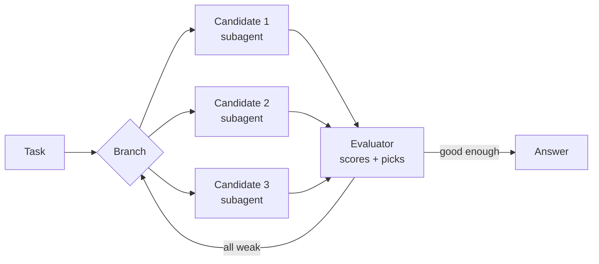
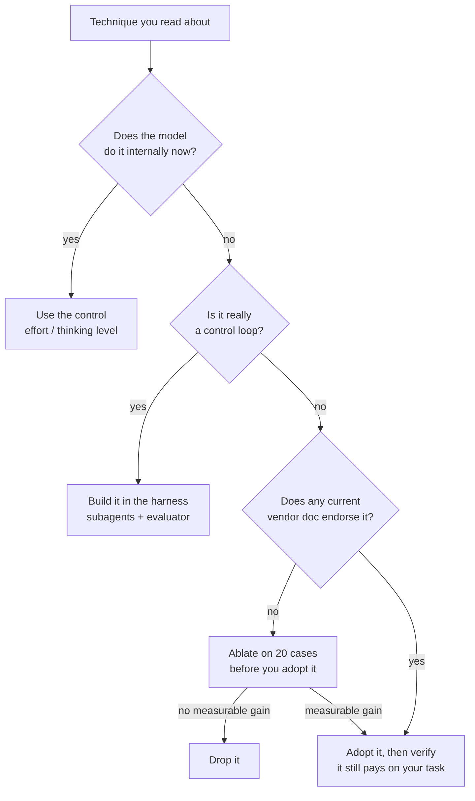

<LevelBadge level="intermediate" />

<Callout type="objectives" items={[
  "有名な各プロンプティングテクニックが実際には何だったのかを1行で把握する",
  "いまやモデルが代わりにやってくれるものと、ハーネスがやってくれるものを見分ける",
  "公式のベンダーガイダンスが現在は積極的に非推奨としている3つのテクニック",
  "ベンダーが公然と意見を異にしている箇所 — そして自分のワークロードでそれを決着させる方法",
]} />

プロンプトエンジニアリングのガイドをほとんど何でも開けば、名前のあるテクニックの一覧が出てきます。Chain-of-Thought、Tree of Thoughts、Self-Consistency、ReAct、Reflexion、Least-to-Most。そのほぼすべてが2022年から2023年の間に発表されたもので、対象は**そうさせなければ推論できなかった**モデルでした。

その制約はもうありません。今日のフロンティアモデルは回答前に内部で推論し、エージェントハーネスは自らツールをループで回します。つまりそれらのテクニックの多くは反証されたのではなく、モデルの中かハーネスの中へと**吸収された**のです。いくつかは今では完全な自爆装置になっています。

このページでは一つずつ名前を挙げ、何のためのものだったのかを述べ、評定を下します。

## 変わったのはただ1つ

以下のすべての評定は、同じ転換に行き着きます。推論があなたのプロンプトから、モデル自身のフォワードパスへ移ったのです。主要3ベンダーはいずれも、自社のドキュメントでそう述べています。

| ベンダー | 現行ガイダンスの記述 |
|---|---|
| **Anthropic** | 拡張思考は「構造化された推論を自動化する」もので、利用できる場合は「一般に手動のchain of thoughtプロンプティングより望ましい」。 |
| **OpenAI** | 「chain-of-thoughtプロンプトは避けること: これらのモデルは内部で推論を行うため、『ステップバイステップで考えて』や『推論を説明して』と促すのは不要です。」 |
| **Google** | 「Gemini 2.5に推論を強制するために複雑なプロンプトエンジニアリング（chain of thoughtなど）」を使っていたなら、代わりにモデルのthinking levelを使うこと。 |

<VerifyNote lastVerified="2026-10-03" source="https://claude.com/blog/best-practices-for-prompt-engineering">
引用はAnthropicの[2026年版プロンプトエンジニアリングのベストプラクティス](https://claude.com/blog/best-practices-for-prompt-engineering)、[OpenAIのreasoningベストプラクティス](https://developers.openai.com/api/docs/guides/reasoning-best-practices)、[GoogleのGemini 3開発者ガイド](https://ai.google.dev/gemini-api/docs/gemini-3)に照らして検証済みです。ベンダーのガイダンスはそれぞれ独立に、しかも頻繁に改訂されます。これを根拠に本番のプロンプトを書き換える前に、原典を読み直してください。
</VerifyNote>

## 評定の表

| テクニック | 何だったのか | 評定 |
|---|---|---|
| **明確で具体的な指示** | 目標、対象読者、形式、制約を述べる | ✅ **いまも本質そのもの** |
| **出力コントラクト** | 「JSONだけを返して」／厳密なかたち | ✅ **いまも必須** |
| **プロンプトチェイニング／分解** | 難しい1つのタスクを複数の呼び出しに分ける | ✅ **いまも必須** |
| **棄権の許可** | 「推測せず、わからないと言って」 | ✅ **いまも必須** |
| **文脈＋動機** | 制約が*なぜ*重要なのかを説明する | ✅ **価値が上がった** |
| **メタプロンプティング／APE** | モデルにプロンプトを書かせる・改善させる | ✅ **過小評価されているが健在** |
| **Chain-of-Thought** | 回答前に「ステップバイステップで考えて」 | 🔁 **モデルの中へ移った** |
| **Least-to-Most** | 簡単な部分問題から順に解く | 🔁 **モデルの中へ移った** |
| **ReAct** | `Thought:` / `Action:` / `Observation:` を交互に出させる | 🔁 **ハーネスの中へ移った** |
| **Reflexion** | 自己批評し、その教訓を保持して再挑戦する | 🔁 **メモリレイヤーへ移った** |
| **Tree of Thoughts** | 部分解を分岐・評価・バックトラックする | 🔁 **ハーネスの中へ移った** |
| **Few-shotの例示** | 3〜5個の模範例を見せる | ⚠️ **議論中 — ベンダー間で見解が異なる** |
| **ロール／ペルソナ** | 「あなたは20年の経験を持つ上級税務弁護士です…」 | ⚠️ **格下げ、薄い版だけ残す** |
| **Self-Consistency** | N個の回答をサンプリングして多数決 | ⚠️ **状況次第、N倍の代価を払うこと** |
| **重厚なXMLスキャフォールディング** | すべてのプロンプトのすべての部分にタグを付ける | ⚠️ **いまは任意、デフォルトではない** |
| **Graph of Thoughts** | 推論ステップの任意のグラフ | 🧪 **研究段階、推奨するベンダーはない** |
| **Temperatureのチューニング** | 創造性を上げ下げする | ⛔ **現行モデルでは明確に却下** |
| **感情的圧力／チップの提示** | 「これは私のキャリアにとって非常に重要です」 | ⛔ **現行のベンダーガイドで支持するものはない** |
| **指示の繰り返し／全部大文字** | 3回、大声で言う | ⛔ **引退** |

このページの残りでは、興味深い行を解説します。

## モデルの中へ移った

### Chain-of-Thought

[Wei et al. (2022)](https://arxiv.org/abs/2201.11903)は、中間の推論ステップを出力するよう促されたモデルが、数学や論理の問題をはるかに多く解けることを示しました。続いて[Kojima et al. (2022)](https://arxiv.org/abs/2205.11916)は、その効果の大半が5語 — 「Let's think step by step」 — で引き出せることを見つけました。4年間、これはプロンプティングにおける単独で最もレバレッジの高い技でした。

フロンティアモデルはいまやそれを促されずに行い、しかもあなたがプロンプト内の文章ではなくeffortやthinking levelを通じて制御する*予算*をそれに費やします。[思考とEffort](/docs/api/thinking-and-effort)と[Effortのチューニング](/docs/api/effort-tuning)を参照してください。

つまりその指示はもう無料ではありません。トークンを消費し、本来の指示と並んでモデルが従わなければならない指示を1つ増やし、思考モデルでは推論を*目に見える回答の中へ*押し出しかねません — まさに入れたくなかった場所です。

<PromptCard title="2023年の習慣 — これを持ち越さないこと">{`You are an expert mathematician with 20 years of experience. This is very
important to my career, so please take a deep breath and work through this
step by step, explaining your reasoning carefully before giving the final
answer. Let's think step by step.

Are there infinitely many primes p with p mod 4 == 3?`}</PromptCard>

<PromptCard title="2026年版 — 同じ問い、無駄なし">{`Are there infinitely many primes p with p mod 4 == 3?

Give the proof sketch, then the one-line answer. If the result is open, say so.`}</PromptCard>

2つ目のプロンプトはより短く、モデルが本来の依頼とすり合わせなければならない指示を含まず、予算を語りではなく証明に費やします。推論の深さは言葉づかいではなく、リクエストのeffort設定から来ます。

**手動のChain-of-Thoughtを残すべきとき:** 思考モードのない小型モデルやローカルモデルを使っている場合（[モデルをローカルで動かす](/docs/models/run-models-locally-ollama)を参照）、あるいは人間が監査するために推論を*目に見える出力の中に*どうしても必要とする場合。

### Least-to-Most

[Zhou et al. (2022)](https://arxiv.org/abs/2205.10625) — モデルに部分問題を列挙させ、それを順に解かせる。Chain-of-Thoughtと同じ話です。これは計画であり、計画は思考モデルが自分で最初にやることになりました。複数の呼び出しに作業を分解するときの*人間側*の習慣としてはいまも有用で、それはつまり[プロンプトチェイニング](/docs/prompting/pattern-library)です。

## ハーネスの中へ移った

### ReAct

[Yao et al. (2022)](https://arxiv.org/abs/2210.03629)は、モデルに固定形式の`Thought:` / `Action:` / `Observation:`テキストを出力させ、それを正規表現でパースすることで、推論とツール呼び出しを交互に行わせました。

この説明をもう一度読んでください。これはツール呼び出しのないAPIに対するテキストプロトコルの回避策です。いまのAPIにはツール呼び出しがあります。ネイティブな[ツール使用](/docs/api/tool-use)と、ツール呼び出しの合間の思考が、*そのまま*ReActです — プロバイダーによって実装され、型チェックされ、ストリーミングされます。2026年に自前でテキストプロトコルを組むのは、余計なコロン1つで壊れうるパーサーを再導入することです。

**ReActから残す価値があるもの:** モデルは*次のツールを選ぶ前にツールの結果について考えられるべきだ*という洞察。それはもうプロンプトではなく、プラットフォームの機能です。

### Tree of Thoughts

[Yao et al. (2023)](https://arxiv.org/abs/2305.10601)はChain-of-Thoughtを探索へ一般化しました。候補となる次の手を複数生成し、スコアを付け、有望な分岐を残し、行き止まりからバックトラックする。

*プロンプト*として（「3つのアプローチを並行して検討し、それから選んで」）は弱いものです。1つのコンテキストウィンドウの中で1つのモデルが探索木を演じても、だいたい似通った3つの段落と自信ありげな選択が出てくるだけです。*アーキテクチャ*としては、別の名前のもとで繁栄しています。

これは分岐を実際の並列エージェントとし、評価器を実際の採点ステップとしたTree of Thoughtsです。[サブエージェント](/docs/claude-code/subagents)や[エージェントチーム](/docs/api/cowork-and-agent-teams)で構築し、[評価（evals）](/docs/foundations/evals)で採点しましょう — 巧みな1段落ではなく。

### Reflexion

[Shinn et al. (2023)](https://arxiv.org/abs/2303.11366)は、失敗した試行のあとにエージェントに短い言語による振り返りを書かせ、そのメモを次の試行へ持ち越させました — 重みに触れずに学習させたのです。

発想は正しく、そして勝ちました。ただプロンプトの中に住むのをやめただけです。いまは**メモリレイヤー**に住んでいます。[メモリとコンテキスト編集](/docs/api/memory-and-context-editing)および[マネージドなエージェントメモリストア](/docs/api/managed-agents-memory-stores)を参照してください。「失敗を振り返って」の現代版は、[コンパクション](/docs/api/compaction)を生き延びる永続ストアに教訓を書き込むエージェントです。

**安い版は手作業で今もやる価値があります:** 悪い実行のあと、プロンプトやツールセットの何が誤誘導したのかをモデルに尋ね、*それ*を直しましょう。振り返りの成果物は、次のターンではなくシステムプロンプトに置くべきものです。

### Graph of Thoughts

[Besta et al. (2023)](https://arxiv.org/abs/2308.09687)は木を任意のグラフに置き換えました — 分岐を統合し、ノードをその場で洗練し、ループさせる。本当に興味深い研究ですが、推奨するベンダーはなく、主要なハーネスも実装しておらず、トークンコストは残酷です。名前は知っておき、何かが変わるまで、その上に構築はしないこと。

## 議論中: few-shotの例示

これは正直に扱うべき項目です。3つのベンダーは、まさに現在、3つの異なる答えを文書で示しています。

| ベンダー | 例示に関するガイダンス |
|---|---|
| **OpenAI** | 「まずzero shotを試す… 推論モデルは良い結果を出すのにfew-shotの例示をあまり必要としない。」 |
| **Anthropic** | 「1つの例（one-shot）から始める。出力がまだ望みどおりでない場合にのみ、例を追加（few-shot）する。」 |
| **Google** | 「few-shotの例示がないプロンプトは効果が低くなりやすい」 — そして常に含めることを推奨。 |

これを、好きなベンダーを選ぶことで解決しないでください。この不一致は本物で、これらのモデルの訓練方法の実際の違いを反映しています。解決は自分のタスクでのアブレーションで行いましょう — 20分の作業で、誰のアドバイスにも勝ります。このページのものも含めて。

<Steps items={[
  {title: "テストセットを固定する", body: "正解がわかっている実際の入力を20件集めます。3件ではありません — 3件では15%の変化とノイズを区別できません。/docs/foundations/evals を参照。"},
  {title: "zero-shot版を書く", body: "指示、制約、出力コントラクト。例示はまったくなし。"},
  {title: "例をちょうど1つ追加する", body: "zero-shot版が最もひどく外した入力を選び、それに対する理想的な出力を見せます。"},
  {title: "さらに3つ追加する", body: "あなたのタスクが実際にばらつく「かたち」をカバーすること — 簡単なケースの4バージョンではなく。"},
  {title: "3つの変種を同じ20件で採点する", body: "同じモデル、同じ設定、変える変数は1つだけ。品質だけでなくトークン数も記録します。"},
  {title: "基準を満たす最も安い変種を出荷する", body: "one-shotがzero-shotと同点なら、zero-shotを出荷しましょう: トークンが少なく、パターンロックも少なく、保守するものがありません。"},
]} />

名前を挙げるに値する失敗モード: 例が多すぎると**パターンロック**が起きます。別のかたちを必要とする入力に対してまで、モデルが例の表面的なかたちを再生産してしまう現象です。出力が奇妙に画一的に見えるなら、指示を追加する前に例を削りましょう。詳しくは[Few-Shotを正しくやる](/docs/prompting/few-shot)。

## 格下げ: ロールとペルソナ

「あなたは一流事務所で20年の経験を持つ世界水準の上級税務弁護士です」は標準的な作法でした。Anthropicの現行ガイダンスはもっと率直です。「過度に具体的なロールはAIの有用性を制限しうる。」

ロールの有用な部分は、そもそも経歴ではありませんでした — **語彙と対象読者**です。それを残し、履歴書は捨てましょう。

- ⛔ 「あなたはバグを書いたことがない伝説の10倍エンジニアです。」
- ✅ 「Lambdaで動くPython 3.12のサービスという前提でこれをレビューして。並行コールドスタート下で壊れそうなものを指摘して。」

2つ目はモデルが知らなかったことを伝えています。1つ目は自信を持てと伝えており、それはレビュアーに求めるものの正反対です。[システムプロンプト](/docs/prompting/system-prompts)と[ロール](/docs/foundations/roles)を参照してください。

## 状況次第: self-consistency

[Wang et al. (2022)](https://arxiv.org/abs/2203.11171) — 同じ質問をN回サンプリングして多数派の答えを取る。これは機能しますし、いまも機能します。問題は請求額です。1つの答えのためにN倍のトークンとN倍のレイテンシがかかります。

フロンティアモデルでは、**1回**の呼び出しのeffortや思考予算を上げる方が、安い呼び出し3回＋投票よりもトークンあたりの精度を稼げるのが通常です。Self-Consistencyがいまも正しい道具であるのは次の場合です。

- 答えが短く検証可能（数値、ラベル、はい/いいえ）で、投票が明確に定義できる。
- 安価なモデルやローカルモデルを使っていて、3回の呼び出しでもフロンティアモデル1回より安い。
- *確信度のシグナル*が必要 — 3対0と2対1は別のことを伝えており、それを他の方法で得るのは難しい。

エッセイ、コード、そして「多数派」が意味を持たないものには不適切な道具です。

## 引退

- **Temperatureのチューニング。** 単に非推奨なのではなく、**却下**されています。現行のフロンティアClaudeモデルでは、デフォルト以外の`temperature`、`top_p`、`top_k`はすべてのリクエストで400エラーを返します。Googleは全Gemini 3モデルについて「temperatureパラメータはデフォルト値の`1.0`に保つことを強く推奨」しており、下げると「ループや性能劣化といった予期しない挙動につながる可能性がある」と警告しています。挙動はプロンプトとeffort設定で形づくりましょう。どのモデルがどのノブを公開しているかは動く標的です。[モデルと価格](/docs/whats-new/models-and-pricing)と[サンプリング制御](/docs/foundations/sampling-controls)を確認してください。
- **感情的圧力。** [Li et al. (2023)](https://arxiv.org/abs/2307.11760)は2023年当時のモデルで「これは私のキャリアにとって非常に重要です」による向上を実際に測定しており、チップを提示する変種も広く流布しました。現行のベンダーガイドでどちらかを推奨するものはありません。測定された効果は、それが測定されたモデルの性質であって、プロンプティングの法則ではないと捉えましょう — そしてフロンティアモデルでの再現を誰も公表していないことにも留意してください。
- **指示の繰り返しと全部大文字。** 長いプロンプトの中盤から指示を取りこぼすモデルへの念入りな保険でした。非常に長い文書のあとで依頼を言い直すのはいまも妥当です（[長いコンテキスト](/docs/prompting/long-context)）。200トークンのプロンプトで3回言うのは、コンテキストを浪費し、解決すべき矛盾を生むだけです。
- **アシスタントターンのプレフィル。** かつてはClaudeに出力形式を強制する確実な方法でした。引退 — 現行モデルは最終アシスタントターンがプレフィルされていると400を返します。出力コントラクトか[構造化出力](/docs/api/structured-output)を使いましょう。

## 任意のテクニックをどう判断するか

このページ全体がその図に圧縮されます。名前のあるテクニックとは、ある能力がどこに住まなければならないかについての仮説です — プロンプトの中か、モデルの中か、ハーネスの中か。能力が移動すれば、テクニックの住所も一緒に移動します。

<Flashcards title="正典を押さえる" cards={[
  {front: "Chain-of-Thought (2022)", back: "回答前に中間の推論ステップを出力するようモデルに促す。いまは思考モデルの内部処理 — 言葉づかいではなくeffortで制御する。"},
  {front: "Zero-shot CoT", back: "「Let's think step by step」 — 例示なしで推論を引き出す。2022〜2024年期で最も多く複製されたプロンプト。思考モデルではもはや冗長。"},
  {front: "Self-Consistency (2022)", back: "N本の推論パスをサンプリングし、多数派の答えを取る。いまも有効だがN倍のコスト。短く検証可能な答えと確信度シグナルに最適。"},
  {front: "Least-to-Most (2022)", back: "部分問題を列挙し、順に解く。内部の計画立案に吸収された。人間側のプロンプトチェイニングとして生き残っている。"},
  {front: "ReAct (2022)", back: "Thought / Action / Observation をパース対象のテキストとして交互に出す。ネイティブなツール使用＋ツール間の思考に置き換わった。"},
  {front: "Reflexion (2023)", back: "失敗後に言語で自己批評し、それを次の試行へ持ち越す。メモリレイヤーへ移った — 教訓は永続的な場所に書くこと。"},
  {front: "Tree of Thoughts (2023)", back: "部分解を分岐・採点・バックトラックする。プロンプトとしては弱いが、アーキテクチャとしては強い — 並列サブエージェント＋評価器。"},
  {front: "Graph of Thoughts (2023)", back: "統合とループを含む、推論ステップの任意のグラフ。研究のみ。ベンダーも主要ハーネスも実装していない。"},
  {front: "パターンロック", back: "few-shotの例が多すぎるときの失敗モード: 別のかたちを必要とする入力に対してまで、出力が例の表面的なかたちを写してしまう。"},
  {front: "吸収の法則", back: "テクニックは反証されるのではなく吸収される — モデルの中か、ハーネスの中へ。その能力がいまどこに住んでいるかを問うこと。"},
]} />

<Quiz title="理解度チェック" questions={[
  {q: "思考モデル向けのプロンプトに「ステップバイステップで考えて」を加えることが、いまでは利益ではなくコストになるのはなぜですか？", options: ["ストリーミング開始が遅くなるから", "モデルはすでに内部で推論しているため、この指示はトークンとすり合わせ対象の指示を1つ増やすだけで、しかも推論を目に見える回答へ押し出しかねないから", "ツール使用が無効になるから", "temperatureが上がるから"], answer: 1, explain: "フロンティアモデルは内部で推論し、それをeffortやthinking levelで予算配分します。この指示はトークンを消費し、本来の依頼と競合し、きれいに保ちたかった出力に推論を移しかねません。"},
  {q: "Tree of Thoughtsの、現代における正しい住所はどこですか？", options: ["3つのアプローチを検討させるプロンプト", "候補の分岐を並列サブエージェントとして走らせ、評価器で採点するハーネス", "より高いtemperature設定", "より長いシステムプロンプト"], answer: 1, explain: "プロンプトとしては似通った3段落と自信ありげな選択しか得られません。アーキテクチャとして — 並列の分岐＋実際の採点ステップ — なら繁栄します。"},
  {q: "主要3ベンダーは現在、few-shotの例示について異なる助言を文書で示しています。このページは何を推奨していますか？", options: ["最も例示に積極的なGoogleに従う", "zero-shotが最も安いのでOpenAIに従う", "自分のケース20件でアブレーションを行い、基準を満たす最も安い変種を出荷する", "可搬性を保つため例示は一切避ける"], answer: 2, explain: "この不一致は本物で、訓練の違いを反映しています。自分のタスクでの20件のアブレーションは、どのベンダーの一般論にも勝ります。"},
  {q: "現行のフロンティアClaudeモデルにデフォルト以外のtemperatureを送るとどうなりますか？", options: ["黙って無視される", "リクエストが400エラーを返す", "出力が非決定的になる", "思考が無効になる"], answer: 1, explain: "現行のフロンティアClaudeモデルでは、デフォルト以外のtemperature、top_p、top_kはすべてのリクエストで400エラーを返します。挙動はプロンプトとeffort設定で形づくりましょう。"},
]} />

<Callout type="takeaways" items={[
  "名前のあるテクニックは、ある能力がどこに住まなければならないか — プロンプト、モデル、ハーネスのどこか — についての仮説。能力が移れば、テクニックも移る。",
  "手動のChain-of-ThoughtとLeast-to-Mostはモデルの中へ移った: 言葉づかいではなくeffortとthinking levelを使う。",
  "ReActとTree of Thoughtsはハーネスの中へ移った: ネイティブなツール使用、並列サブエージェント、そして実際の評価器。",
  "Reflexionはメモリレイヤーへ移った: 教訓は次のターンではなく、永続的な場所へ書く。",
  "few-shotはベンダー間で本当に議論が分かれている — どのガイドを信じるかではなく、自分のケース20件でアブレーションする。",
  "Temperatureのチューニングと感情的圧力は引退。ロール付けは薄く保つ: 語彙と対象読者だけで、履歴書は決して書かない。",
]} />

## 次に読むもの

- 上記すべてのテクニックの土台となる基本 → [プロンプティングの基礎](/docs/prompting/basics)
- few-shotの問いを自分のタスクで決着させる → [Few-Shotを正しくやる](/docs/prompting/few-shot)
- 「ステップバイステップで考えて」に取って代わった推論の制御 → [思考とEffort](/docs/api/thinking-and-effort)
- これを学び直さずにプロンプトを他ベンダーへ持っていく → [AI間のプロンプト翻訳](/docs/prompting/cross-ai-translation)
