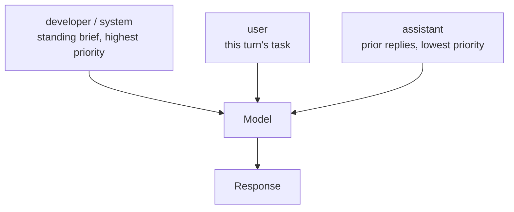

<LevelBadge level="intermediate" />

<Callout type="objectives" items={["4 つすべての実行面でシステムプロンプトを正しく設定する — Anthropic の system パラメータ、OpenAI の developer ロール、Gemini の system_instruction、そして Claude Code の 5 つのフラグ", "常設ブリーフに入れるべきものと、そこに残してはいけないものを見分ける", "押しすぎをやめる — なぜ「CRITICAL: you MUST」が現行モデルでは逆効果になるのか", "プロンプトキャッシュが再利用できる位置にシステムプロンプトを置き、変動する部分を切り出す", "Claude Code のデフォルトプロンプトに追記するか置き換えるかを選ぶ — そして置き換えると何が失われるのかを理解する"]} />

どのモデルにも、会話全体の枠組みを決める層がひとつある。これは手持ちの中でいちばん安いレバーであり — 一度設定すれば全ターンに効く — そして最も多くの人が間違った材料を詰め込む場所でもある。[ロール](/docs/foundations/roles) では*なぜ*それが重要なのかを扱った。このレッスンはオペレーター向けの版だ。正確なパラメータ名、どこまで強く押すか、そしてキャッシュとどう相互作用するか。

## ひとつの概念、4 つの実行面

概念はどこでも通用する。配管はそうではない。

| 実行面 | 設定方法 | 形 |
|---|---|---|
| **Anthropic Messages API** | `system` — **トップレベルのリクエストパラメータ**であり、`messages` の要素ではない | 文字列、またはコンテンツブロックの配列 |
| **OpenAI Responses API** | `instructions` パラメータ、または **`developer`** ロールのメッセージ | 現在のリクエストに適用される。`previous_response_id` で連鎖させると `instructions` は引き継がれない |
| **Google Gemini API** | リクエスト上の `system_instruction`（Java では `systemInstruction`、Go では `SystemInstruction`） | やり取りごとに設定 |
| **Claude Code** | 5 つの CLI フラグ（下記）、加えて [`CLAUDE.md`](/docs/claude-code/claude-md) と [出力スタイル](/docs/claude-code/output-styles) | 置き換えまたは追記 |
| **チャットアプリ** | アカウント上の [カスタム指示](/docs/claude-app/custom-instructions) | チャットをまたいで永続 |

<VerifyNote lastVerified="2026-09-30" source="https://platform.claude.com/docs/en/build-with-claude/prompt-engineering/claude-prompting-best-practices">
パラメータ名は Anthropic のプロンプティングのベストプラクティス資料、[OpenAI のテキスト生成ガイド](https://developers.openai.com/api/docs/guides/text)（`developer` ロールと `instructions` パラメータ）、および [Google の Gemini テキスト生成ガイド](https://ai.google.dev/gemini-api/docs/text-generation)（`system_instruction`）に照らして検証した。ベンダーの API 面は変わる — 出荷前にリンク先のドキュメントで確認すること。
</VerifyNote>

最もよくある移植バグは、Anthropic の `system` をメッセージとして扱うことだ。これはメッセージではない。`messages` の中ではなく、その隣に置かれる。逆方向では、OpenAI の階層は明示的だ — **developer の指示はユーザーの指示に優先し、ユーザーの指示はアシスタント自身の過去のターンに優先する。** 彼ら自身のたとえでは、developer メッセージは関数定義であり、user メッセージはそこに渡す引数である。

<PromptCard title="Anthropic: system はトップレベルのパラメータ">{`curl https://api.anthropic.com/v1/messages \\
  -H "content-type: application/json" \\
  -H "x-api-key: $ANTHROPIC_API_KEY" \\
  -H "anthropic-version: 2023-06-01" \\
  -d '{
    "model": "claude-sonnet-5-5",
    "max_tokens": 1024,
    "system": "You are a precise financial analyst. Show your assumptions. Never invent numbers.",
    "messages": [{"role": "user", "content": "Summarize this filing."}]
  }'`}</PromptCard>

## そこに入れるべきもの

プロンプトの各行を**どれくらいの頻度で変わるか**で並べ替える。会話全体を通して真であるものは常設ブリーフへ上げる。ターンごとに変わるものはユーザーターンに残す。

<Steps items={[
  {title: "アイデンティティとスコープ — 入れる", body: "役割は一文あれば口調と焦点を動かすのに十分だ。Anthropic のドキュメントは、たった一文でも違いが出ると明言している。同時に、役割を過剰に制約しないよう警告している。現行モデルは重いペルソナの足場を必要としないからだ。"},
  {title: "厳格なルールと拒否の境界 — 入れる", body: "モデルが決してしてはいけないこと、必ず含めなければならないこと、確信が持てないときにどうするか。「わかりません」と言う許可を明示的に与えること — その一行だけで、作り話の回答が測定可能に減る。"},
  {title: "出力の契約 — 入れる", body: "妥当な回答の形。セクション、長さ、言語、前置きを許すかどうか。「前置きなしで直接答えること」はここに属し、毎回のユーザーターンに書くものではない。"},
  {title: "ツールのポリシー — 入れる", body: "いつツールに手を伸ばし、いつ直接答えるか。積極性（下記）を調整するのはここだ。"},
  {title: "変動する事実 — 入れない", body: "今日のデータ、現在のファイル、取得したドキュメント、ライブな状態。これらはユーザーターンか検索コンテキストに属する。システムプロンプトに埋め込めば、キャッシュを無効化し、古い事実をモデルに教え込むことになる。"},
  {title: "長い参照資料 — 入れない", body: "大きなドキュメントはユーザーターンの先頭、質問より上に置く。/docs/prompting/long-context を参照。"}
]} />

## どこまで強く押すか

ここは、古いモデル向けに書かれたプロンプトが積極的に害になる領域だ。Opus 4.5/4.6 世代以降に対する Anthropic のガイダンスは率直で、これらのモデルは**先行世代よりシステムプロンプトに敏感に反応する**とされている。だからツールを*過少*に呼んでいたモデルに対して固めたプロンプトは、今では*過剰*に呼ばせてしまう。対処は音量を下げること — `CRITICAL: you MUST use this tool when…` ではなく `Use this tool when…` と書く。

<Callout type="warning" items={["全部大文字、「CRITICAL」、「you MUST」、脅しの枠組みは、ソフトな指示を無視していたモデルの遺産だ。現行モデルでは過剰発火と前のめりなツール呼び出しを引き起こす。", "過剰に制約されたペルソナ（「あなたは決してミスをしない世界最高の 10x エキスパートだ」）はトークンを増やすだけで何も買えない。代わりに、実際に欲しい観点を求めること。", "矛盾した層は、薄いブリーフより悪い。システムプロンプトが「簡潔に」と言い、スキルが「常に推論を説明せよ」と言えば、モデルは推測するしかない。", "あらゆるテクニックを一度に積み上げること — 役割、XML、few-shot、思考の連鎖、出力スキーマ — は最もよくある過剰設計の形だ。ひとつ足して測り、効いたときだけ残す。"]} />

積極性は固定された性質ではなくダイヤルであり、それを設定する場所がシステムプロンプトだ。後から見つけて編集できるように、ポリシーを名前付きタグで包んでおく。

<PromptCard title="行動する方向に押す">{`<default_to_action>
Implement changes rather than only proposing them. If intent is ambiguous, infer the
most useful action and proceed, using tools to find the details you are missing instead
of guessing.
</default_to_action>`}</PromptCard>

<PromptCard title="まず尋ねる方向に押す">{`<do_not_act_before_instructions>
Do not modify files or start an implementation unless you are clearly asked to. When
intent is ambiguous, research and recommend instead of acting. Make changes only on an
explicit request.
</do_not_act_before_instructions>`}</PromptCard>

<VerifyNote lastVerified="2026-09-30" source="https://platform.claude.com/docs/en/build-with-claude/prompt-engineering/claude-prompting-best-practices">
過剰発火に関するガイダンスと 2 つの積極性パターンは、Opus 4.5/4.6 世代以降を対象とした Anthropic のツール利用セクションに従っている。モデル固有の挙動はリリースごとに変わる — そのページ冒頭のモデル別ガイダンスを再確認すること。
</VerifyNote>

## システムプロンプトはあなたのキャッシュ接頭辞

これは請求書に現れる部分だ。Anthropic はキャッシュ可能な接頭辞を固定の順序で組み立てる — **`tools`、次に `system`、次に `messages`** — そしてキャッシュはマークしたブロックまでを含めて覆う。つまりシステムプロンプトは、リクエスト全体の中で最も価値の高いキャッシュ位置に座っている。安定していて、呼び出しごとに再利用され、会話の前に置かれている。

帰結は 2 つ。

- **システムプロンプトをバイト単位で安定させること。** タイムスタンプ、ユーザー名、セッション ID を差し込むと接頭辞が変わり、リクエストごとに必ずキャッシュを外す。
- **一部が必ず変わるなら、安定した部分を先に置き**、その後でキャッシュを区切る。そうすれば変動する末尾だけが読み直される。

キャッシュ可能な最小長はモデルごとに異なり — 現行モデルの一部は 512 トークンからキャッシュし、古いものは最大 4,096 必要 — しきい値を下回るプロンプトはエラーも出さず黙ってキャッシュなしで処理される。頼る前に現在の表を確認すること。

<VerifyNote lastVerified="2026-09-30" source="https://platform.claude.com/docs/en/build-with-claude/prompt-caching">
接頭辞の順序（`tools`、`system`、`messages`）とモデルごとのキャッシュ可能な最小長は Anthropic のプロンプトキャッシュのドキュメントから。最小値はモデル固有で、リリースごとに変わる。[プロンプトキャッシュ](/docs/api/prompt-caching) と [モデルと価格](/docs/whats-new/models-and-pricing) も参照。
</VerifyNote>

Claude Code はその分割の専用版を備えている。置き換え用のプロンプトが固定の指示と実行ごとのコンテキストを混ぜているなら、その間に `__SYSTEM_PROMPT_DYNAMIC_BOUNDARY__` だけを含む行を置く。Claude Code は最初のそうした行で分割してその行を落とし、上側をキャッシュしたまま下側だけが変わるようにする（v2.1.275 以降）。スクリプト化されたマルチユーザー実行では、`--exclude-dynamic-system-prompt-sections` がユーザーごとのコンテキストをプロンプトから最初のユーザーメッセージへ移し、複数のマシンがひとつのキャッシュ済み接頭辞を共有できるようにする。

## Claude Code: 追記か置き換えか

プロンプトを設定するフラグは 5 つ。うち 4 つはテキストを設定し、5 つ目は会話が開始時のテキストを保持し続けるかを制御する。

| フラグ | 何をするか |
|---|---|
| `--system-prompt` | デフォルトプロンプト全体をあなたのテキストで置き換える |
| `--system-prompt-file` | ファイルの内容で置き換える |
| `--append-system-prompt` | あなたのテキストをデフォルトプロンプトに追記する |
| `--append-system-prompt-file` | ファイルの内容をデフォルトプロンプトに追記する |
| `--system-prompt-snapshot` | `off` にすると、最初のリクエストで記録したものを再利用せず、リクエストごとにプロンプトを再構築する |

`--system-prompt` と `--system-prompt-file` は排他だが、どちらの追記フラグもどちらの置き換えフラグとも組み合わせられる。

判断基準は**あなたが何を引き受ける気があるか**だ。

<Steps items={[
  {title: "Claude をコーディングアシスタントのままにしておきたいなら追記", body: "追記はデフォルトのツールガイダンス、安全性の指示、コーディング規約を保つので、違う部分だけを供給すればよい — 呼び出しごとのルール、出力形式、-p スクリプト用のドメインコンテキスト。"},
  {title: "アイデンティティや権限モデルが本当に違うなら置き換え", body: "たとえば無人パイプライン内の非コーディングエージェント。置き換えるとデフォルトプロンプトのすべてが落ちる — ツールガイダンスと安全性の指示も含めて — ので、タスクに今なお必要なものはすべてあなたの責任になる。"},
  {title: "まず正しいレバーに手を伸ばす", body: "Claude が常に従うべきプロジェクト規約は CLAUDE.md に属する。切り替えたり共有したりするペルソナは出力スタイルに属する。フラグは 1 回の呼び出しのためのものだ。"}
]} />

<PromptCard title="ヘッドレス実行 1 回にルールを追記する">{`claude -p --append-system-prompt "Cite file:line for every claim." "audit the auth flow"`}</PromptCard>

実際のデバッグ時間を食うひっかかりがひとつ。デフォルトでは Claude Code はシステムプロンプトを会話の最初のリクエストで**一度だけ**組み立て、それを記録する。同じ会話の以降のリクエストは記録されたプロンプトを再利用する — `--resume` や `--continue` の後も含めて。後の起動でフラグのテキストを変えても、会話がコンパクトされるか新しい会話を始めるまで何も起きない。文面を反復している間は `--system-prompt-snapshot off`（v2.1.257 以降）を渡して、毎リクエスト再構築させること。

<VerifyNote lastVerified="2026-09-30" source="https://code.claude.com/docs/en/cli-reference">
5 つのシステムプロンプトフラグ、追記対置き換えのガイダンス、`__SYSTEM_PROMPT_DYNAMIC_BOUNDARY__` マーカー（v2.1.275 以降）、スナップショット記録の挙動（v2.1.257 以降）は Claude Code の CLI リファレンスから。バージョンで区切られた挙動は頻繁に変わる — [変更履歴](https://code.claude.com/docs/en/changelog) を確認すること。
</VerifyNote>

## 実際のビフォー/アフター

**ビフォー** — すべてが最大音量、変動する事実が焼き込まれ、出力の契約がない。

<PromptCard title="押しすぎでキャッシュに敵対的">{`You are THE BEST code reviewer in the world. You are a 10x engineer.
CRITICAL: You MUST ALWAYS use the search tool before answering. NEVER skip this.
IT IS EXTREMELY IMPORTANT that you are thorough.
The current date is 2026-09-30 and the user is reviewing PR #4412 on branch fix/auth-race.`}</PromptCard>

問題は 4 つ別々にある。最上級表現は何も買えていない。大声はモデルにツールを過剰に呼ばせる。妥当な回答の定義がない。そして最後の行は実行ごとに変わるので接頭辞が決してキャッシュされない。

**アフター** — 役割は一文、本物の出力契約、不確実性の逃げ道、変動する事実はユーザーターンへ移動。

<PromptCard title="落ち着いて、契約優先、キャッシュ可能">{`You are a code reviewer for a TypeScript monorepo.

Rules:
- Search the codebase before claiming a symbol is unused.
- If you cannot verify a claim from the diff or the code, say so instead of guessing.

Output: a Summary section, then Risks, then Suggested changes. No preamble.`}</PromptCard>

日付、PR 番号、ブランチは本来の居場所であるユーザーターンに入る。振る舞いは同じ、キャッシュ接頭辞は安定し、トークンは約 3 分の 1 になる。

## もう手を伸ばすべきでないもの

プリフィル — アシスタントのターンを自分で書き始めて、モデルにあなたの形式で続けさせる手法 — はかつて JSON を強制したり前置きを飛ばしたりする定番だった。**Claude 4.6 以降では、最終アシスタントターンをプリフィルすると 400 エラーが返る。** 代替はすべてシステムプロンプトの中か隣にある。「前置きなしで答えること」という直接的な指示、[構造化出力](/docs/api/structured-output)、または分類用の enum フィールドを持つツールだ。会話の*他の位置*にあるアシスタントメッセージは影響を受けないので、[few-shot の例](/docs/prompting/few-shot) は以前とまったく同じに機能する。

<VerifyNote lastVerified="2026-09-30" source="https://platform.claude.com/docs/en/build-with-claude/prompt-engineering/claude-prompting-best-practices">
Anthropic のプロンプティング資料は、最終アシスタントターンのプリフィルが Claude 4.6 モデル以降ではサポートされなくなり、そうしたリクエストは 400 エラーを返し、それ以前のモデルは依然プリフィルを受け付けると述べている。[モデル間でのプロンプト移植](/docs/models/porting-prompts-across-models) も参照。
</VerifyNote>

<Flashcards title="システムプロンプト早見表" cards={[
  {front: "Anthropic: システムプロンプトはどこに置く？", back: "`system` トップレベルのリクエストパラメータ — `messages` の隣であり、決してその中ではない。文字列またはコンテンツブロックの配列を受け取る。"},
  {front: "OpenAI: ロール名とパラメータは？", back: "メッセージでは `developer` ロール（`system` ではない）、または Responses API の `instructions` パラメータ。`instructions` は現在のリクエストのみに適用される。"},
  {front: "Gemini: パラメータ名は？", back: "リクエスト上の `system_instruction` — Java では `systemInstruction`、Go では `SystemInstruction`。"},
  {front: "指示の階層", back: "developer/system がユーザーに優先し、ユーザーがアシスタントの過去のターンに優先する。OpenAI のたとえ: developer メッセージ = 関数定義、user メッセージ = 引数。"},
  {front: "キャッシュ接頭辞の順序", back: "`tools`、次に `system`、次に `messages`。システムプロンプトはリクエスト中で最も価値の高いキャッシュ位置だ — バイト単位で安定させること。"},
  {front: "Claude Code の追記と置き換え", back: "追記はデフォルトのツールガイダンスと安全性の指示を保つ。置き換えはそのすべてを落とすので、タスクに必要なものはすべてあなたの責任になる。"},
  {front: "なぜ「CRITICAL: you MUST」が逆効果なのか", back: "現行モデルは、そのプロンプト作法が書かれた当時のモデルよりシステムプロンプトに敏感に反応するので、固めた言い回しは今では過剰発火を招く。普通の言い方を使うこと。"},
  {front: "最終アシスタントターンのプリフィル", back: "Claude 4.6 以降では 400 が返る。「前置きなし」の指示、構造化出力、または enum を持つツールを使うこと。"}
]} />

<Callout type="takeaways" items={["概念は同じ、配管は違う: Anthropic の `system` パラメータ、OpenAI の `developer` ロール / `instructions`、Gemini の `system_instruction`、Claude Code の 5 つのフラグ。", "変化の速さで並べ替える — 長持ちするルールは常設ブリーフへ、変動する事実はユーザーターンへ。", "音量を下げる。現行モデルは、過少発火していたモデル向けに固めたプロンプトに対して過剰発火する。", "システムプロンプトはキャッシュ接頭辞（tools → system → messages）に座る: バイト単位で安定させ、変動する末尾を切り離すこと。", "Claude Code では、追記はデフォルトの安全性とツールのガイダンスを保ち、置き換えは責任のすべてをあなたに渡す。", "最終アシスタントターンのプリフィルは Claude 4.6 以降で 400 — 出力契約、構造化出力、またはツールを使うこと。"]} />

<Quiz title="理解度チェック" questions={[
  {q: "Anthropic Messages API では、システムプロンプトはどこに置かれるか？", options: ["`messages` 配列の最初の要素として、role `system` で", "トップレベルの `system` リクエストパラメータとして、`messages` の隣に", "`developer` ロールのメッセージとして", "`instructions` パラメータの中に"], answer: 1, explain: "Anthropic の `system` はメッセージではなくトップレベルのリクエストパラメータだ。これを `messages` の要素として扱うのが最もよくある移植バグ。"},
  {q: "プロンプトに「CRITICAL: You MUST ALWAYS call the search tool.」と書いた。現行の Claude モデルで起きやすい効果は？", options: ["何も起きない — 強調は無視される", "システムプロンプトに古いモデルより敏感に反応するため、望むより頻繁にツールを呼ぶ", "リクエストが拒否される", "モデルがタスクを拒む"], answer: 1, explain: "Opus 4.5/4.6 世代以降に対する Anthropic のガイダンスは、攻撃的な言い回しを弱めることだ。これらのモデルはシステムプロンプトに敏感に反応するので、過少発火に対して書かれたプロンプトは今では過剰発火する。"},
  {q: "現在のタイムスタンプをシステムプロンプトに差し込むと、なぜコストがかかるのか？", options: ["タイムスタンプが余分な出力トークンを消費するから", "キャッシュ可能な接頭辞が変わり、リクエストごとにプロンプトキャッシュを外すから", "API が静的でないシステムプロンプトを拒否するから", "モデルを拡張思考に強制するから"], answer: 1, explain: "キャッシュ接頭辞は tools → system → messages の順に組み立てられる。system のテキストが変わればそれが無効化されるので、リクエストごとのタイムスタンプは毎回の入力全額支払いを意味する。"},
  {q: "Claude Code で `--append-system-prompt` ではなく `--system-prompt` を渡した。何を手放したことになるか？", options: ["何も — 2 つのフラグは等価", "デフォルトプロンプトのツールガイダンスと安全性の指示。これらを自分で供給しなければならない", "CLAUDE.md を使う能力", "プロンプトキャッシュ"], answer: 1, explain: "置き換えはツールガイダンスと安全性の指示を含むデフォルトプロンプト全体を落とす。追記はそれらを保ち、違う部分だけを足す。"}
]} />

## 次へ

- [Claude に特化したプロンプティング](/docs/prompting/prompting-claude)
- [長いコンテキストのためのプロンプティング](/docs/prompting/long-context)
- [プロンプトキャッシュ](/docs/api/prompt-caching)
