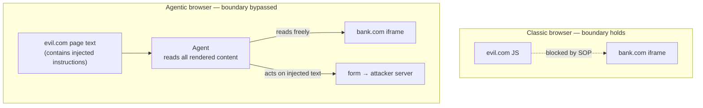

<LevelBadge level="advanced" />

<Callout type="objectives" items={["同一オリジンポリシー — 30年間ひそかにあなたを守ってきた境界 — を理解し、AIエージェントがなぜその上に位置するかを見る", "7つのエージェント型ブラウザのうちどれが脆弱だと判明したか、そしてその建築的理由を確認する", "オリジン境界を越えるiframeエクスフィルトレーション攻撃を段階を追って歩く", "ベンダーのレッドチーム数値を正直に読む:緩和策は攻撃成功率を半減させるが、消しはしない", "全面禁止ではなく実用的なリスク態勢を適用する"]} />

2026年6月30日、ワシントン大学の研究者たちがAIブラウザを再定義する結果を発表しました:**テストした7つのエージェント型ブラウザのうち4つが、悪意あるウェブサイトが別ウェブサイトに属するデータに到達することを許した**。メモリ安全性のバグを通じてではなく。設計通りに動作するエージェントを通じて。

<VerifyNote lastVerified="2026-07-20" source="https://agent-security.cs.washington.edu/agentic_browsers_sop.html" />

## 誰も考えない境界

1つのタブで銀行を開き、別のタブでランダムなフォーラムを開いてください。フォーラムのJavaScriptはあなたの銀行のページ、クッキー、セッションを読むことができません。その保証が**同一オリジンポリシー(SOP)** — オリジンとは`(scheme, host, port)`のトリプルです。UWのFranziska Roesnerが言うように、これが今日ほぼすべてのサイトのブラウジングが安全である理由です。

SOPはページの下、*ブラウザによって*強制されます。ページが言うどんなことも、それを話し抜けることはできません。

さてエージェントを追加します。最も高機能な設計では、エージェントはブラウザの人間ユーザーのように振る舞います:レンダリングされたページを見て、DOMを読み、クリックし、タイプします。画面を見ている人間はSOPに縛られません — あなたの目は2つのタブを読めます。人間を模倣するために作られたエージェントもそうです。

覚えておく価値のある文はこれです:**SOPは弱まらない — 現実を記述しなくなる。** ブラウザはJavaScriptレイヤーで依然として正しく強制しています。エージェントは単にそのレイヤーの上で動作するだけです。だから数十年物の*建築的*保証が、ひそかに*振る舞い上の*保証に劣化します:「モデルがプロンプトインジェクションに引っかからないことを願います」。それらは同じ種類の約束ではなく、無制限のリトライを得る攻撃者に対して持ちこたえるのはそのうち1つだけです。

## テストされたもの、そして破れたもの

KohlbrennerとRoesnerは2026年1月下旬〜2月に7つのブラウザをテストし、2026年4月26日にリオデジャネイロで開催されたAgents in the Wildワークショップで発表しました。

| ブラウザ | SOPバイパスの前提条件? | 備考 |
|---|---|---|
| ChatGPT Atlas(エージェントモード) | **はい — 完全なPoCを実証** | オリジン境界を越える窃取をエンドツーエンドで達成 |
| Chrome with Gemini | **はい** | 前提条件が存在 |
| Claude for Chrome | **はい** | 拡張機能アーキテクチャがJSインジェクションを許す |
| Perplexity Comet | **はい** | 前提条件が存在 |
| Brave Leo AI | いいえ | より狭いエージェント能力 |
| Microsoft Edge with Copilot | いいえ | より狭いエージェント能力 |
| Firefox AI Mode(Claude) | いいえ | 7つの中で最も制限的 |

パターンこそが発見であり、それは不快なものです:**最も安全なブラウザは、最も何もできないものだった。** Brave、Edge、Firefoxが安全だったのは、より優れた分類器のおかげではなく — ブラウジングセッション全体ではなく、限定された事前定義されたページの一部だけをエージェントに渡すからです。ここでのセキュリティは、賢さではなく能力で買われています。両方を主張するベンダーは慎重に読むべきです。

## 攻撃、段階を追って

<Steps items={[{"title":"攻撃者がオリジン境界を越えるiframeのあるページを作る","body":"evil.comが被害者がログインしている機密オリジン — 銀行、ウェブメール、内部ダッシュボード — を指すiframeを埋め込む。evil.com上の通常のJavaScriptは、そのiframe内の一文字も読めない。これは正常で許可されたウェブの振る舞い。"},{"title":"ページがエージェント向けの指示を隠す","body":"ページ上のテキスト — 視覚的に隠された、alt属性の中、ユーザーが決して見ないDOMフィールドの中 — がエージェントに、iframeの内容を生成物に含めるよう告げる。モデルにとってこれは単に更なるページ内容で、読むよう頼まれた記事と区別できない。"},{"title":"ユーザーが完全に無害なことを頼む","body":"「このページを要約して」。危険な権限は要求されず、警告も発火しない、なぜならブラウザの視点からは何も異常なことは起きていないから。"},{"title":"エージェントがオリジン境界を越えて読む","body":"エージェントは完全にレンダリングされたページを知覚するので、iframeの内容も読む。同一オリジンポリシーは違反されていない — 参照されなかったから、なぜならオリジン境界を越えるJavaScript呼び出しは一度もなされなかったから。"},{"title":"エージェントが攻撃者制御のフォームにデータを書く","body":"注入された指示は要約をevil.com上のフォームフィールドに向ける。エージェントは役に立とうとしていて、読んだことに従っている。"},{"title":"フォームが自動送信される","body":"オリジン境界を越えるデータが攻撃者のサーバーに着地。ユーザーは要約が現れたことを見て、それ以外は何も見なかった。"}]} />

*ない*ものに注目してください:悪用なし、マルウェアなし、パッチ未適用のCVEなし。すべての段階は文書化された意図された機能を使います。これがこれをバグキューではなくアーキテクチャの問題にしているものです。

研究者たちはこの攻撃の3つの兄弟にも名前を付けています、名前で知る価値があります:

<Flashcards title="4つのオリジン境界を越える攻撃クラス" cards={[{"front":"オリジン境界を越えるデータ窃取","back":"エージェントがオリジンAのページから動作しつつオリジンBの内容を読み、それを漏らす。ChatGPT Atlasで実証されたPoC。"},{"front":"オリジン境界を越えるアクション偽造","back":"エージェントがオリジンBで状態を変える動作(送信、送金、削除)をオリジンAのページから誘導される — CSRFだが、混乱した副官がエージェントなので、CSRFトークンやSameSiteクッキーは助けにならない。"},{"front":"チャットメモリ汚染","back":"注入されたテキストがエージェントの永続メモリに書き込まれ、悪意あるページが閉じられた後も侵害が生き延び、後の無関係なセッションで発火する。"},{"front":"マスクされた入力の読み取り","back":"エージェントがパスワードフィールドや他のマスクされた入力の基礎値を知覚する、視覚UIが意図的に人間から隠しているものを。"}]} />

メモリ汚染はあなたが最も心配すべきものです。他の3つはタブを閉じれば終わります。メモリ汚染は1つの悪いページをアシスタントの中の永続的インプラントに変え、現在ほとんどのユーザーが手を伸ばすと知っている「クッキーをクリアする」に相当するものはありません。

## ベンダー数値を正直に読む

Anthropicはレッドチーム結果をClaude for Chromeについて公開しました — そして功績として、格好悪い方も公開しました。29の攻撃シナリオにまたがる123のテストケースにわたって:

- 自律モード攻撃成功率:**緩和策前 23.6% → 緩和策後 11.2%**
- 4つのブラウザ固有攻撃タイプのチャレンジセット:**35.7% → 0%**

緩和策には、サイトレベルの権限、高リスク動作の確認プロンプト、サイトカテゴリ全体のブロック(金融サービス、成人向け、海賊コンテンツ)、受信内容と送信動作の両方に対するインジェクション分類器、そして隠されたDOMフィールドとURL/タブタイトルインジェクション向けの特定の防御が含まれます。Anthropicは別途、内部の複合技法スイートに対して**0.08%未満**に達する設定を報告しています。

真ん中の数字と向き合ってください。**11.2%はセキュリティ制御にとって小さな数字ではありません。** 見知らぬ人の9人に1人に開くドアの鍵は鍵ではありません。正直な読み方は、これらは*もはや存在しない境界の上のリスク削減策*であり、置き換えではないということ — これはまさに研究者たちの、フィルタリングの改善よりアーキテクチャの再設計が必要という主張です。

拡張機能配信経路には独自の歴史があります:研究者たちはClaude for Chromeのサイトごとの権限が拡張機能のディスク上LevelDBストアに直接書き込むことでバイパスできると報告し、その後の作業(「ClaudeBleed」)は拡張機能同士の経路がまだエージェントをGmailの読み取りに向けて押しうることを発見しました。クライアント側ストレージで強制される権限は、既にあなたのユーザーとして動いているものに対しては助言的です。

UW開示(60日以上の通知)へのベンダー対応も様々です:Brave、Google、Microsoftは関与しました;OpenAIとFirefoxは、十分なエンドツーエンドの証明がないとして報告を辞退しました;Anthropicは発表時点で返答していませんでした。

<Callout type="warning" items={["Kohlbrennerの評価は率直です:これらのエージェントがあなたの資格情報を保持するブラウザにアクセスできるなら、準備ができているとみなさないでください。エージェント型ブラウジングを、放置しておく機能ではなく、意図的に付与する機能として扱ってください。"]} />

## 実際に保てる態勢

「AIブラウザを決して使うな」は誰も従わないアドバイスです。代わりに攻撃の形を使ってください — 同じエージェントコンテキストに**信頼できないページ内容**、**認証されたセッション**、**エクスフィルトレーション経路**が必要です。どれか1本の脚を折ってください。

<Steps items={[{"title":"タブだけでなくプロファイルを分ける","body":"エージェントを、価値あるものにログインしていないブラウザプロファイルで動かす。セッションが資産;窃取するクッキーがないエージェントは、はるかに面白くない混乱した副官。これはリストの中で最もレバレッジの高い一手。"},{"title":"信頼できないページで『このページを要約』を特権的動作として扱う","body":"任意の攻撃者作成の内容を読むことがインジェクションベクター。自分の下書きを要約するのは低リスク;見知らぬ人があなたにリンクしたページを要約するのは、PoCのまさにそのシナリオ。"},{"title":"サイト権限を狭く付与し、再チェックする","body":"サイトごとのアクセスは実際の境界にマップする唯一の制御。許可リストを短く保つ。LevelDBの発見を考えると、密閉ではなく助言的だと仮定する。"},{"title":"信頼できないものをブラウズした後にエージェントメモリをクリアする","body":"これがユーザーが直接制御するメモリ汚染に対する唯一の防御で、何もコストがかからない。"},{"title":"オープンエンドなブラウジングに自律モードを決してオンのままにしない","body":"23.6%の数字は自律モード。確認プロンプトは弱いが、無音の侵害を気づけるかもしれないものに変える。"},{"title":"仕事をこなす中で最も能力が低いエージェントを好む","body":"UWのランキングは能力順。狭い要約者で十分なら、飛ばす余分なエージェンシーはあなたが守る必要のなかった攻撃面。"}]} />

コーディング側の密接に関連するリスクについては、[コーディングエージェントが武器化されるとき](/docs/security/coding-agents-under-attack)、そのメカニクスは[プロンプトインジェクション](/docs/security/prompt-injection)、能力のトレードオフは[コンピュータ使用エージェント](/docs/models/computer-use-agents)を参照。

## クイズ

<Quiz title="理解度チェック" questions={[{"q":"エージェント型ブラウザはなぜ同一オリジンポリシーをバイパスするのか?","options":["エージェントがブラウザエンジンのメモリ安全性バグを悪用する","エージェントが完全にレンダリングされたページをユーザーのように知覚するので、ブラウザがブロックすべきオリジン境界を越えるJavaScript呼び出しは一度もなされない","同一オリジンポリシーが現代のブラウザから削除された","エージェントがrootの権限で動く"],"answer":1,"explain":"SOP違反は起きない — SOPはオリジン境界を越えるJavaScriptアクセスを管理する。エージェントはレンダリングされた内容を直接、SOPが強制されるレイヤーの上で読むので、チェックは決して到達されない。"},{"q":"UW研究はエージェント能力と安全性の関係について何を発見したか?","options":["最も高機能なブラウザが最も安全でもあった","能力と安全性は無関係だった","最も安全だったブラウザは、そのエージェントが最も何もできないものだった","オープンソースのブラウザだけが安全だった"],"answer":2,"explain":"Brave Leo、Edge with Copilot、Firefox AI Modeは、完全なブラウジング能力ではなく、限定された事前定義されたページの一部をエージェントに与えることで前提条件を回避した。セキュリティは能力で買われた。"},{"q":"Anthropicのレッドチームは自律モード攻撃成功率を23.6%から11.2%に減らした。正しい読み方は?","options":["Claude for Chromeについて問題は解決された","意味のある削減だが、セキュリティ境界単独として役立てるにはあまりに高すぎる","数字はエージェント型ブラウジングが安全であることを証明している","緩和策はブラウザを安全性で劣化させた"],"answer":1,"explain":"攻撃成功率を半減させることは実際の進歩だが、およそ9件に1件の攻撃がまだ成功することはリスク削減策であって境界ではない。フィルタリングよりアーキテクチャ再設計を求める研究者の呼びかけを支持する。"},{"q":"悪意あるページが閉じられた後も持続するのはどの攻撃か?","options":["オリジン境界を越えるデータ窃取","チャットメモリ汚染","マスクされた入力の読み取り","オリジン境界を越えるアクション偽造"],"answer":1,"explain":"メモリ汚染は注入された指示をエージェントの永続メモリに書き込むので、1回の訪問が後の無関係なセッションに影響しうる。"},{"q":"最もレバレッジの高いユーザー側の緩和策は何か?","options":["より長いシステムプロンプトを使う","エージェントを価値あるアカウントにログインしていないブラウザプロファイルで動かす","JavaScriptを無効化する","すべてのブラウジングにインコグニトモードを使う"],"answer":1,"explain":"攻撃には窃取するための認証されたセッションが必要。エージェントのプロファイルから価値あるセッションを取り除けば、インジェクションがどれほど良くても連鎖を断つ。"}]} />

## 出典と参考文献

- [Agentic Browsers and the Same-Origin Policy](https://agent-security.cs.washington.edu/agentic_browsers_sop.html) — Franziska Roesner & David Kohlbrenner、UW Allen School(一次資料;ブラウザごとの発見、攻撃分類、開示タイムライン)
- [Some agentic AI browsers come with major cybersecurity risks, UW study finds](https://www.washington.edu/news/2026/06/30/some-agentic-ai-browsers-come-with-major-cybersecurity-risks-uw-study-finds/) — UW News、2026年6月30日
- [Piloting Claude in Chrome](https://claude.com/blog/claude-for-chrome) — Anthropic(レッドチーム数値:23.6% → 11.2%、35.7% → 0%、123テストケース/29シナリオ)
- [Use Claude in Chrome safely](https://support.claude.com/en/articles/12902428-use-claude-in-chrome-safely)と[Claude in Chrome permissions guide](https://support.claude.com/en/articles/12902446-claude-in-chrome-permissions-guide) — Anthropicヘルプセンター
- [Chrome extension site permissions can be bypassed via direct LevelDB write](https://github.com/anthropics/claude-code/issues/26779) — anthropics/claude-code issue #26779
- [ClaudeBleed Reopened: Browser Extensions Can Still Push Claude for Chrome to Read Your Gmail](https://www.manifold.security/blog/claude-for-chrome-extension-bypass) — Manifold Security
- [Prompt injection still drives most agentic AI security failures in production](https://www.helpnetsecurity.com/2026/06/11/owasp-prompt-injection-ai-security-failures/) — Help Net Security、OWASP Top 10 for Agentic Applicationsについて
