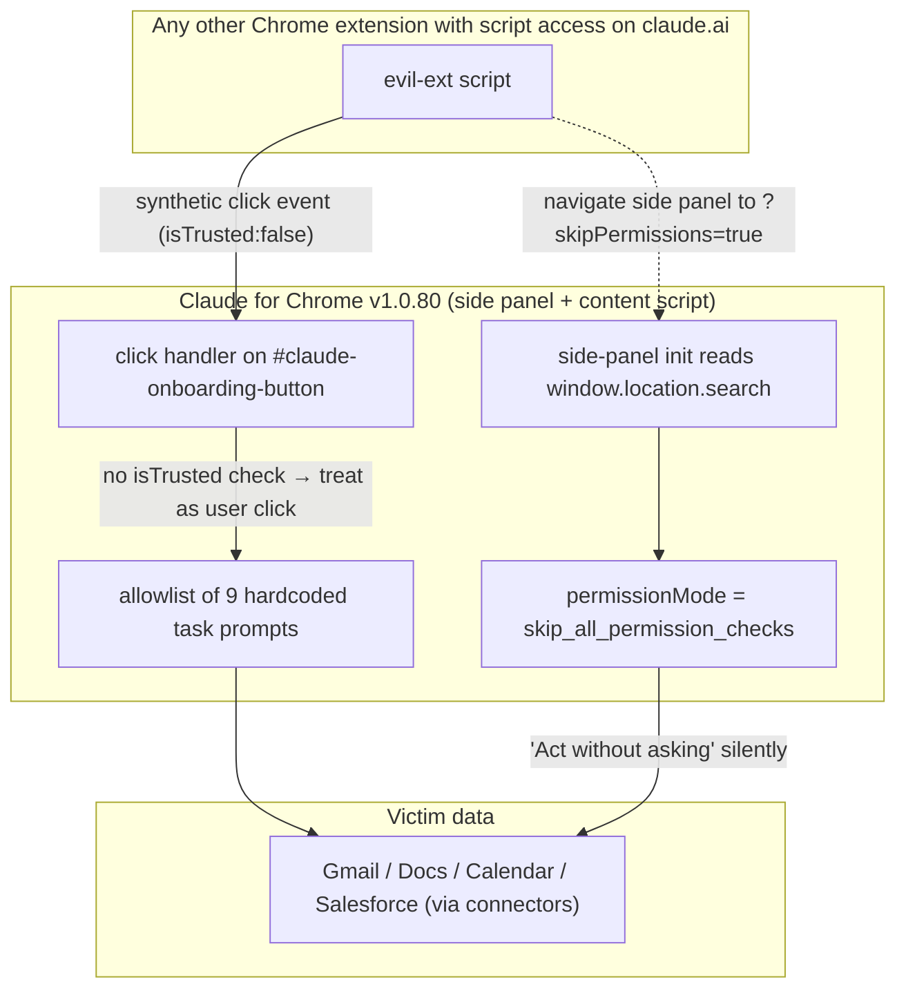

<LevelBadge level="advanced" />

<Callout type="objectives" items={["Claude for Chrome の 2 つのバイパスを理解する — 欠けた event.isTrusted チェックと、サイドパネルを自己昇格させる URL パラメータ", "Anthropic が 6 月 9 日以前にトラッカーを「解決済み」にマークし、その後 8 つのリリース（v1.0.73 → v1.0.80）を変更なしで出荷したことが本当の話であると理解する", "一般的な防御パターンを学ぶ：別の拡張が同じ origin を共有する場合、クライアント専用の allowlist はセキュリティ境界にならない", "今すぐ 2 分未満で適用できる 3 つの具体的な緩和策を取る"]} />

**2026 年 7 月 7 日**、Anthropic は **Claude for Chrome v1.0.80** をリリースした。Manifold Security は同日にテストし、5 月に提出した 2 つのバグレポートが v1.0.72 からバイトごとに再現可能であることを発見した。ブラウザ上で `claude.ai` にスクリプトアクセス権を持つ他の拡張 — 数千の Chrome 拡張が要求する権限 — が、Claude に静かに Gmail を開かせ、メッセージを読ませ、それに基づいて行動させることができる。承認ダイアログなし。ユーザージェスチャーなし。

<VerifyNote lastVerified="2026-07-22" source="https://www.manifold.security/blog/claude-for-chrome-extension-bypass" />

物語は「拡張にバグがあった」ではない。Chrome 拡張は常にバグを出荷している。物語は、9 か月の精査と公開「ClaudeBleed」インシデントを経た出荷済みエージェント型ブラウザ製品が、依然として攻撃者が完全に制御する場所 — クライアント — で権限モデルを強制し、コードが変わらずにトラッキング Issue を **Resolved** とマークしていることだ。

## 2 つの欠陥を 1 枚の絵で

2 つの独立したバグ。**どちらか単独でも** ハードコードされたすべてのタスクをトリガするのに十分だ。一緒に使えば、一方がトリガ（偽クリック）を、もう一方が静かな実行（自動昇格）を与える。

## 欠陥 #1 — 欠けた `isTrusted` チェック

ブラウザがディスパッチするすべてのイベントには `isTrusted` ブール値がある。実際のユーザー動作 — 物理的なクリック、キー押下、タッチ — は `isTrusted: true` で届く。JavaScript が `dispatchEvent(new MouseEvent(...))` で合成したものは `isTrusted: false` で届く。これはブラウザの唯一信頼できる *ユーザー対コード* シグナルであり、セキュリティ機微なハンドラが両者を区別できるようにするために存在する。

Claude for Chrome の content script は id `#claude-onboarding-button` の要素へのクリックをリッスンし、そのクリックが 9 個の allowlist されたタスク ID（`usecase-gmail`、`usecase-gdocs`、`usecase-calendar`、`usecase-salesforce`、加えて DoorDash、Zillow、3 つのオンボーディングチャレンジ）のいずれかに一致すれば、対応するプロンプトを Claude のサイドパネルに転送して実行させる。

ハンドラは `event.isTrusted` を決してチェックしない。研究者の言葉を借りれば：拡張の視点からは、偽のクリックと本物のクリックは区別できない。

これが重要なのは、見落としやすいアーキテクチャ上のポイントのためだ：**`https://claude.ai/*` に一致する `content_scripts` を持つ、あなたがインストールしている他のどの Chrome 拡張も、Chrome の視点からは Claude の origin を共有し、ページにスクリプトを注入できる。** その権限は稀ではない — パスワードマネージャー、ノートクリッパー、翻訳ツール、広告ブロッカー、無数の「生産性」拡張が、当然のように要求する。そのページで一度スクリプトが動けば、`#claude-onboarding-button` に合成クリックをディスパッチするのは約 6 行のコードだ。Manifold のレポートは、まさにそのサイズを指摘してポイントを作っている：修正は `if` 文 1 つ、エクスプロイトは dispatch 呼び出し 1 つ。

9 プロンプトの allowlist は Anthropic の *以前の* ClaudeBleed 緩和策だった — 「クリックが偽装されても、固定リストの安全なタスクしか動かせない」というアイデアだ。「Gmail 統合を実行する」がリストにあった瞬間、そのモデルは破綻する。Gmail を読み行動することは安全なタスクではない。

<Callout type="tip" items={["教訓は「isTrusted を追加する」ではない — その下の教訓だ：「安全な」エージェントタスクの allowlist は、リスト上の最も安全でないタスクと同じだけの安全性しかない。細粒度で統合ごとのユーザー同意は、信頼できないフリーフォームトリガだけでなく、これらすべてのトリガに属する。"]} />

## 欠陥 #2 — パネル URL の `?skipPermissions=true`

Chrome 拡張のサイドパネルには独自の URL があり、その URL のクエリ文字列はパネル内で `window.location.search` から読める。Claude のサイドパネルは `skipPermissions` パラメータを読む。`"true"` に等しければ、パネルは `permissionMode = "skip_all_permission_checks"` で初期化される — ユーザーが手動で *Act without asking* を有効にしたときと同じ内部モードだ。

これはクライアント側の、自己サーブの権限昇格だ。パネルが自分自身に許可を求め、パネル自身が URL で受け取った値に基づいて yes と答えている — `chrome.sidePanel.open({...})` を呼べる、あるいはパネルを navigate できるものが供給できる値だ。

Manifold はそのシナリオを **CVSS 9.6 Critical** と評価している。そのモードでは承認ボックスが一切ないためだ：9 つの allowlist されたプロンプトは静かに実行される。合成クリック欠陥単独（通常の承認ボックスが依然として表示される）は 7.7 High と評価されており、ユーザーが Enter を押す前にダイアログに気付ける可能性があるためだ。

修正の正しい形は「URL パラメータをサニタイズする」ではない。権限モード間の遷移には、パネルがロードされた後に実際の UI コントロールへの明示的で `isTrusted` なユーザージェスチャーが必要 — パネルが自身の URL、自身のストレージ、あるいは他のどの拡張も投稿できるメッセージチャネルから読み取った値ではならない。それはブラウザがすでに全画面表示、カメラ、クリップボード権限に適用しているのと同じアーキテクチャ制約であり、同じ理由からだ。

## なぜ「Resolved」≠ パッチ — プロセス失敗

タイムラインが、これをコードストーリーではなくガバナンスストーリーにしている：

<Steps items={[
{ "title": "2026 年 5 月 21 日 — Manifold が両方の Issue を報告", "body": "v1.0.72 に対し、2 つの別々のバグレポートを Anthropic に提出。" },
{ "title": "5 月 22 日 — 承認およびクローズ", "body": "Anthropic は両方を承認した。レポート #1 は既存トラッカーの重複としてクローズされ、レポート #2 は URL パラメータが「拡張自身によってのみ使われる」という論拠で「informational（情報提供）」として却下された — これはまさにバグが違反している仮定だ。" },
{ "title": "6 月 9 日以前 — 内部トラッカーが「Resolved」とマーク", "body": "包括的な「ClaudeBleed」Issue は Anthropic の内部トラッキングで Resolved に変更された — 明らかに 9 プロンプトの allowlist 緩和策の強度に基づくもので、2 つの根本バグの修正ではない。" },
{ "title": "7 月 7 日 — v1.0.80 出荷、コードはバイト一致", "body": "レポートから今まで、8 つのリリース（v1.0.73 → v1.0.80）が出た。研究者は再検証：クリックハンドラとパネル初期化は、元々テストしたバージョンから変更なし。" },
{ "title": "7 月 14 日 — 公開開示", "body": "CVE なし。Anthropic アドバイザリなし。公開ブログ記事 + Hacker News + 業界プレスの報道。このページ時点：依然として未修正。" }
]} />

内在化する価値のある 2 つの失敗モード。この物語の外でも一般的だからだ：

1. **緩和策の崩壊。** エクスプロイトの形を変える緩和策（「今度は 9 つのボタンのいずれかをクリックしなければならない」）が修正として扱われる。それらのボタンのトリガ自体が偽装可能なとき、緩和策はセキュリティを追加しない — 攻撃レシピを変えるだけだ。
2. **「設計上解決」ドリフト。** バグ #2 は、拡張自身のみが `skipPermissions` を設定するという説でクローズされた。それは *意図* の説明であり、*ブラウザの実際の強制* ではない。`sidePanel` アクセス、あるいはパネル URL 経由のリダイレクトを持つものは何でもそれを設定できる。

両方のパターンは、理由があってセキュリティレビューのアンチパターンリストに載る。自分のコードでも警戒すべきだ。

## 何が動き、どんなデータに到達できるか

Manifold のレポートからの 9 つのハードコードされたタスク ID：

| カテゴリ | タスク ID | プロンプトが Claude に指示するおおよその内容 |
| --- | --- | --- |
| Google | `usecase-gmail`、`usecase-gdocs`、`usecase-calendar` | Gmail を読む（受信箱を反復する「プロモメールから配信停止」フローを含む）、Google Docs のコメントを読む、Calendar の空き状況を読みミーティングを作成 |
| CRM / コマース | `usecase-salesforce`、`usecase-doordash`、`usecase-zillow` | Salesforce のリードを読み opportunities に変換；DoorDash / Zillow のフローを実行 |
| オンボーディング | 3 つのオンボーディングチャレンジ | ガイドツアーのプロンプト |

到達範囲は被害者が有効にしたコネクタに依存する。Gmail が接続されていれば、`usecase-gmail` は Gmail を読む。Salesforce が接続されていれば、`usecase-salesforce` は CRM に触れる。パネルはユーザーが頼んだことをしている — ただしこのユーザーではなく、今ではない。

<Callout type="warning" items={["「Act without asking」は特別な開発者モードではない。Claude for Chrome 設定のチェックボックスだ。ON なら、欠陥 #1 単独で実際の Gmail / Docs / Calendar / Salesforce の読み取りをトリガする。OFF でも、欠陥 #2（?skipPermissions=true）がパネルのライフタイム中それを静かに再有効化できる。"]} />

## 今やる 3 つのこと（2 分）

<Steps items={[
{ "title": "Act without asking をオフにする", "body": "Claude for Chrome 設定 → 「Act without asking」を無効化。承認プロンプトは煩わしいが、欠陥 #1 単独があなたに残す唯一のユーザーに見えるシグナルだ。" },
{ "title": "claude.ai に触れる拡張を監査する", "body": "chrome://extensions → 各拡張の Details → Site access。All sites に設定されているもの、あるいは claude.ai を列挙するものは、Claude ページに content script を注入できる。積極的に信頼しないものは降格または削除。パスワードマネージャーとノートクリッパーは特に二重チェックする価値のある 2 つのカテゴリだ。" },
{ "title": "使っていないコネクタを剪定する", "body": "Claude → Settings → Connectors で、頼っていない Gmail / Docs / Calendar / Salesforce 統合を切断。9 つのハードコードされたタスクは、実際に接続されたコネクタに対してのみ危険だ。" }
]} />

チーム全体でエージェント型拡張を運用するなら、4 つ目を追加：**エージェントが実際に何を実行するかのランタイム観察** — 保持している権限だけではなく。両方の欠陥は権限監査を通過し、挙動観察に失敗する。ユーザーが頼まなかったことをエージェントに *させる* からだ。そのギャップこそが Manifold 自身の推奨が着地するところで、この 1 製品を超えてよく一般化する。

<PromptCard title="Chrome extension audit prompt for Claude">
{`Here is my current chrome://extensions export (or a list I'll paste): {LIST}.

For each extension:
1. Is its "site access" set to "All sites" or does it match claude.ai? Flag those.
2. From its Chrome Web Store description, what content_scripts permissions does it plausibly require? Is claude.ai a required domain for its stated function?
3. Rate each on a "trust to run a script inside my Claude tab" scale from 1 (dedicated password manager from a known vendor) to 5 (random productivity extension with <10k installs).
4. Give me a two-column recommendation: KEEP AS-IS / RESTRICT TO SPECIFIC SITES / REMOVE — with a one-line reason per row.

Do not soften. If something looks sketchy, say sketchy.`}
</PromptCard>

## より広いパターン — クライアント専用の allowlist、エージェント型スコープ

Claude for Chrome から視野を広げよう。同じ形が、増えつつあるエージェント型製品に現れる：

- 信頼された UI（拡張、デスクトップアプリ、IDE プラグイン）が、ユーザーデータに対して実アクションを取れるエージェントを露出する。
- リスクを制約するため、ベンダーは承認なしにエージェントが実行できるタスク／プロンプト／ツールの **allowlist** を追加する。
- allowlist のエントリの **トリガ** は *クライアント内部* に留まる — クリック、URL、保存された設定、他のコンポーネントが共有するチャネルのメッセージ。
- 同じ信頼ゾーンの他のコード（同じ拡張ホスト、同じ origin、同じ IPC バス）はトリガを偽装できる。

各ラウンドが教える教訓は同じだ。参照：`docs/security/agentic-browsers-same-origin.mdx`（エージェントの SOP を超える読み取り）、`docs/security/coding-agents-under-attack.mdx`（自動承認は新しい攻撃表面）、`docs/security/prompt-injection.mdx`（信頼できないコンテンツは信頼できない指示になる）。すべてが *境界が攻撃者がすでに立つ場所に引かれている* ケースだ。

付箋に書き留める価値のある 2 つの不変式：

1. **攻撃者が呼べる権限チェックは権限チェックではない。** 「このページの任意のスクリプト」「任意の URL パラメータ」「任意のストレージ値」「未知の origin からの任意の postMessage」のいずれかがエージェントを *ask* から *act* に切り替えられるなら、その切り替えはあなたがレンダリングした実 DOM 要素での `isTrusted` ジェスチャーの背後に属する。
2. **Allowlist は同意の代替ではない。** リスト上の単一のタスクが求められずに実行されるとユーザーを驚かせるなら（`read my Gmail` は該当）、allowlist は攻撃者の選択肢を減らすが、攻撃者の影響を減らさない。

## クイックチェック

<Quiz questions={[
  {
    "q": "Claude for Chrome v1.0.80 で、claude.ai へのスクリプトアクセス権を持つ普通の Chrome 拡張が 9 つの allowlist されたタスクをトリガするのに十分な理由は？",
    "options": [
      "拡張がユーザーのセッション Cookie を使って Claude API を直接呼べるから。",
      "#claude-onboarding-button のクリックハンドラが event.isTrusted を検証しないため、ページ内の任意のスクリプトからの合成クリックがユーザー入力として扱われるから。",
      "Chrome が拡張の秘密鍵を同一オリジンスクリプトに露出するから。",
      "Claude が攻撃者の拡張コードを自身のプロセスにサイドロードするから。"
    ],
    "answer": 1,
    "explain": "バグは欠けた isTrusted チェックだ。Claude ページで動く任意のスクリプトからディスパッチされた合成 MouseEvent は、ユーザーがクリックしたかのようにハンドラを通過する。API キーの露出やプロセス越境は不要 — ページへのスクリプトアクセスだけでいい。"
  },
  {
    "q": "?skipPermissions=true バイパスの実際のメカニズムは？",
    "options": [
      "URL パラメータが Anthropic のサーバに送られ、サーバが admin トークンを返す。",
      "サイドパネル自身が window.location.search を読み、skipPermissions が \"true\" なら permissionMode をローカルで skip_all_permission_checks に設定する — サーバは関与しない。",
      "パネルの Chrome 同一オリジンポリシーを無効化する。",
      "パネルに Chrome の debugger 権限を付与する。"
    ],
    "answer": 1,
    "explain": "クライアント専用、自己サーブの権限昇格だ。パネルが自分自身に昇格した権限を求め、その答えを自身の URL — パネルを開いたり navigate したりできるものが制御する — から読み取る。"
  },
  {
    "q": "Anthropic は 2026 年 6 月 9 日以前に根本トラッカーを「Resolved」とマークしたが、v1.0.80（7 月 7 日）は v1.0.72 とバイト一致だ。これが最もよく示す失敗モードは？",
    "options": [
      "拡張のビルドパイプラインのサプライチェーン侵害。",
      "緩和策の崩壊：9 プロンプトの allowlist が修正として扱われたが、それらのプロンプトのトリガ自体が偽装可能なため、allowlist はエクスプロイトの形を変えるが影響を減らさない。",
      "Chrome の manifest v3 権限モデルのバグ。",
      "Anthropic が Manifold の開示合意を撤回。"
    ],
    "answer": 1,
    "explain": "allowlist は Anthropic の以前の ClaudeBleed 緩和策だった。それはエントリを選択するトリガが信頼できる場合にのみ役立つ。欠けた isTrusted チェックがトリガを偽装可能にするため、緩和策は攻撃者の選択肢を減らし、攻撃者の影響を減らさない — が、トラッカーは修正であるかのようにクローズされた。"
  },
  {
    "q": "Claude for Chrome ユーザーが今すぐ適用できる最強の単一緩和策は？",
    "options": [
      "claude.ai で JavaScript を無効化する。",
      "Google Chrome をアンインストールする。",
      "「Act without asking」を無効化し、claude.ai へのスクリプトアクセス権を持つ他の拡張を監査する。",
      "Anthropic API キーをローテートする。"
    ],
    "answer": 2,
    "explain": "「Act without asking」を無効化すると承認プロンプトが復活する（欠陥 #1 単独がユーザーに見えるようになる）し、claude.ai へのスクリプトアクセス権を持つ拡張を剪定すれば、そもそも合成クリックをディスパッチできる当事者を除去する。API キーのローテートはここでは何もしない — 攻撃はユーザーの UI セッションに乗っており、API 認証情報ではない。"
  }
]}/>

<Callout type="takeaways" items={["Claude for Chrome の v1.0.80（2026 年 7 月 7 日）は、5 月に v1.0.72 で最初に報告された 2 つの Manifold バグ — 9 プロンプト allowlist の合成クリックバイパス、およびパネル URL の ?skipPermissions=true による自己昇格 — に依然として脆弱。", "両方のバグはクライアント専用の権限チェックだ。トラッカーの「Resolved」は緩和策（allowlist）を指しており、根本の強制ギャップの修正ではない。", "今すぐ：Act without asking をオフにし、claude.ai にスクリプトを注入できる他の Chrome 拡張を監査し、使っていないコネクタを切断する。", "一般ルール：ページ上の任意のスクリプトが呼べる権限チェックは権限チェックではない。モード遷移は URL / ストレージ / メッセージ値ではなく、実 UI 要素上の isTrusted ジェスチャーに乗らなければならない。"]} />

## ソース & 追加読み物

- Manifold Security — [ClaudeBleed Reopened: browser extensions can still push Claude for Chrome to read your Gmail](https://www.manifold.security/blog/claude-for-chrome-extension-bypass)（一次技術解説；タイムライン、CVSS 評価、バイト一致コードの観察）
- The Hacker News — [Researchers Say Claude for Chrome Flaw Lets Rogue Extensions Trigger Gmail Reads](https://thehackernews.com/2026/07/claude-for-chrome-flaw-lets-other.html)（業界報道；Anthropic の公的反応）
- BleepingComputer — [Claude Chrome extension flaw lets malicious extensions trigger AI actions](https://www.bleepingcomputer.com/news/security/claude-chrome-extension-flaw-lets-malicious-extensions-trigger-ai-actions/)（攻撃表面、権限要件）
- TechRadar — [The bypass is still six lines of JavaScript](https://www.techradar.com/pro/the-bypass-is-still-six-lines-of-javascript-security-experts-warn-that-claude-for-chrome-browser-extension-could-be-hijacked-despite-it-alerting-anthropic-several-times-that-something-was-wrong)（修正が単一の条件式である理由の文脈）
- 関連 AILmanac：[エージェント型ブラウザが同一オリジンポリシーを破る](/docs/security/agentic-browsers-same-origin)、[コーディングエージェントが武器化されるとき](/docs/security/coding-agents-under-attack)、[プロンプトインジェクション：無視できない安全モデル](/docs/security/prompt-injection)
- OWASP — [Top 10 for LLM Applications](https://genai.owasp.org/llm-top-10/)（LLM01 Prompt Injection と LLM06 Excessive Agency がこれらのバグがマップされる 2 カテゴリ）
