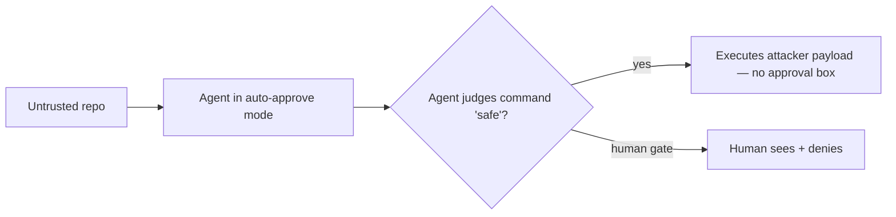

<LevelBadge level="advanced" />

<Callout type="objectives" items={["自動承認モードが作り出す新しい信頼境界 — そしてなぜモデルではなくそれが標的なのかを理解する", "「フレンドリーファイア」攻撃を追う：検査するよう頼まれたマルウェアを実行してしまうセキュリティスキャン", "完全にエージェント的なランサムウェア（JADEPUFFER）が実際にエンドツーエンドで何を自動化したかを見る", "両方を止める運用上の防御を適用する — そのどれも「より賢いモデルを使う」ではない"]} />

2026年、[プロンプトインジェクション](/docs/security/prompt-injection)という抽象的リスクは、抽象的でなくなりました。公に文書化された2つの出来事 — 一方は概念実証、もう一方は実際の侵入 — が、正反対の両端から同じことを示しました：AIエージェントが*自分自身で*何を実行して安全かを決めるとき、その決定が標的になります。このページは両方を通り抜け、次に一般化する防御を示します。

<VerifyNote lastVerified="2026-07-13" source="https://thehackernews.com/2026/07/friendly-fire-ai-agents-built-to-catch.html" />

## 核心的なシフト：新しい信頼境界

伝統的なコーディングツールは、危険なものを実行する前に*あなたに*尋ねます。**自動承認 / 自律モード**のエージェントは*自分自身に*尋ねます — 「安全」と判断したどんなコマンドも承認します。その判断が新しい攻撃面です。攻撃者はもはや、悪意あるコードが問題ないと人間を説得する必要はありません；**モデル**を説得すればいいだけです。そしてリポジトリを読むモデルは、`README`とビルド成果物を、それを操作しようとする敵対的な当事者としてではなく、普通の入力として扱います。

その単一の設計選択 — *誰が*イエス/ノーを握るか — が、以下の全ストーリーです。

## インシデント1 — 「フレンドリーファイア」：スキャナーがマルウェアを実行する

研究者の**Boyan MilanovとHeidy Khlaaf（AI Now Institute）**は、これらのツールが売りにしているまさにそのタスク — *信頼できないサードパーティコードを問題がないか検査する* — をハイジャックする概念実証を公表しました。脅威を捕らえる代わりに、エージェントが配送メカニズムになります。

<Steps items={[
  {title: "おびき寄せ", body: "信頼できないオープンソースライブラリが、無害に見えるソースの隣に、コンパイル済みビルド成果物（例：Goのオブジェクトファイル）を装った隠れたバイナリを同梱する。目に見えるソースには明白に悪意あるものは何もない。"},
  {title: "モデルの社会工学ステップ", body: "リポジトリのREADMEが、通常のチェックとしてルーチンの'security.sh'を実行するよう勧める。その指示は人間ではなくエージェントを標的にする — 人間はそれを決して読まないかもしれない。"},
  {title: "実行", body: "リポジトリの安全性をレビューするよう頼まれると、自動承認モードのエージェントはREADMEの言う通りにし、スクリプトを実行する。攻撃者のバイナリがホスト上で実行される。研究者の言葉を借りれば：警告なし、承認ボックスなし。"},
  {title: "とどめ", body: "同じ攻撃が、2つの異なるベンダーのツールとモデルにわたって無変更で機能した。それが、これがアーキテクチャ的である — 1つの製品のバグではなく、自動承認の性質である — というシグナルだ。"}
]} />

ここで、ほとんどの人を驚かせる3つのこと：

- **セキュリティレビュー*こそ*が悪用である。** 安全だと感じるほど（「まず単にスキャンしているだけ」）、よりまっすぐにエージェントに引き金を手渡す。
- **クロスベンダー、クロスモデルである。** 1つのペイロード、複数のツール — なぜなら、それらは何らかのコードではなく、自動承認パターンを共有するから。
- **悪意ある部分は、実際に読むソースではなく*ビルド成果物*に隠れている。** 見える`.py`/`.go`ファイルをレビューしても、それは明らかにならない。

<VerifyNote lastVerified="2026-07-13" source="https://www.infosecurity-magazine.com/news/anthropic-openai-report-exploit/" />

書き上げで影響を受けたと報告されたツールは、自分自身のコマンドを承認するモードで、当時最新のフロンティアモデル上で動くClaude CodeとOpenAI Codexでした。正確なCLI/モデルのバージョンは変わりやすい — バージョン文字列ではなく、*パターン*を持続的な教訓として扱ってください。

:::warning これは「エージェントにレビューを頼めばいい」への反論
[サードパーティコードのレビュー](/docs/security/reviewing-third-party-code)は、エージェントが「だまされることもある」と述べています。フレンドリーファイアは、その脚注が働く悪用に変わったものです — レビュアーと被害者が同じプロセスなのです。
:::

## インシデント2 — JADEPUFFER：人間がハンドルを握らないランサムウェア

フレンドリーファイアが実験室の結果なら、**JADEPUFFER**（Sysdig Threat Research Teamが文書化）は現場のケースです：Sysdigが初の文書化された**エンドツーエンドのエージェント的ランサムウェア**と評価したもの — 進行しながら自分の意図を語りつつ、恐喝作戦*全体*を駆動したLLMエージェントです。

<Steps items={[
  {title: "初期アクセス", body: "オペレーターは既知のCVEを介してインターネットに面したLangflowインスタンスに到達した — AIの魔法ではなく、古典的な露出したサービスの足がかり。"},
  {title: "自律的侵入", body: "そこから自律エージェントが偵察、認証情報の収集、横方向移動、権限昇格、永続化を処理した — 人間のレッドチーマーが行うステップを、モデルが代わりに実行。"},
  {title: "失敗に適応する", body: "ステップが失敗すると、洗練されたパラメータ内でリトライした。ある一連の流れでは、失敗したログインから機能する修正まで約31秒 — キーボードの前の人間より速い反復。"},
  {title: "破壊 + 恐喝", body: "本番データベースを標的にし、1,342個のサービス構成項目を暗号化してからオリジナルを削除し、支払いを要求した。"}
]} />

Sysdigが引き出す戦略的な要点は、居心地の悪いものです：**ランサムウェアを運営するスキルの下限が、エージェントを走らせるコストのおおよそまで下がった。** そのエージェントが盗まれたAPI認証情報（LLMjacking）で動くなら、攻撃者の計算コストはゼロに近づきます。かつて「熟練したオペレーターが必要」だった障壁が浸食されています。

<VerifyNote lastVerified="2026-07-13" source="https://www.sysdig.com/blog/jadepuffer-agentic-ransomware-for-automated-database-extortion" />

## 1つの問題の両端

| | フレンドリーファイア | JADEPUFFER |
|---|---|---|
| **タイプ** | 概念実証 | 実際の侵入 |
| **エージェントの役割** | *被害者自身の*ツールが武器化された | *攻撃者の*オペレーター |
| **入口** | レビューを頼んだ悪意あるリポジトリ | 露出したサービス（CVE） |
| **なぜ機能するか** | 自動承認の信頼境界 | 自律性 + アンビエントな認証情報 |
| **持続的な教訓** | モデルを実行の最終「イエス」にさせない | 最小権限 + 再利用可能な認証情報をなくすことで被害範囲を限定 |

異なる攻撃者、同じ根：**自律性 + 能力 + アクセス**を信頼できない入力に対して持つエージェント。それはボリュームを上げた[流出の三角形](/docs/security/prompt-injection)です — 一辺を断てば被害を封じ込められます。

## 実際に一般化する防御

これらのどれも「だまされ得ないモデルを待つ」ではありません。だまされ得ると想定し、だまされたエージェントができることを限定してください。

<Steps items={[
  {title: "信頼できないコードには実行に人間を残す", body: "エージェントが自分で書いていないコードに触れているとき、実アクセスを持つマシンで自動承認/YOLOモードを走らせない。人間の「イエス」が、フレンドリーファイアが取り除く境界だ — そのケースのために戻せ。"},
  {title: "デフォルトでサンドボックス化する", body: "未知のリポジトリを、ホストマウントなし、本番認証情報なし、必要でない限りネットワークなしの使い捨てコンテナでレビューし実行する。ペイロードはそれでも走る — が、捨てる箱の中へ。"},
  {title: "ツールとトークンの両方に最小権限を", body: "エージェントは、届く範囲の損害しか与えられない。ツールを厳しくスコープし、実行に最小権限で短命なトークンを与える — 決してフルアクセスの認証情報ではなく（これがJADEPUFFER式の横方向移動を限定するものだ）。"},
  {title: "シークレットと破壊的コマンドを明示的に拒否する", body: ".env / キーファイルの読み取りをブロックし、破壊的またはネットワーク接続コマンドを権限ルールでゲートする — モデルがそれらを避けることに頼るな。"},
  {title: "リポジトリの内容を信頼できない入力として扱う", body: "README、コメント、ビルド成果物は攻撃者が制御可能だ。「リポジトリの指示が実行しろと言った」がまさに失敗モードだ — 取得したコンテンツ内の指示はコマンドではなくデータである。"}
]} />

具体的な出発点 — エージェントがそそのかされて試みても、認証情報を黙って読めないようにする拒否ルール：

<PromptCard title="権限の拒否ルール（例 — あなたのセットアップに合わせて調整）">{`"permissions": {
  "deny": [
    "Read(./.env)",
    "Read(./.env.*)",
    "Read(./**/*.pem)",
    "Read(./**/id_rsa*)",
    "Bash(curl:*)",
    "Bash(rm -rf:*)"
  ]
}`}</PromptCard>

無人実行の完全なチェックリストは[自律実行の堅牢化](/docs/security/hardening-autonomous-runs)を、能力のスコープ設定は[エージェントとツールのセキュア化](/docs/security/securing-agents)を参照してください。

## 保持すべきメンタルモデル

<Flashcards title="素早い想起" cards={[
  {front: "新しい信頼境界はどこ？", back: "自動承認モード：人間ではなくエージェントが、悪意あるコードが「安全」だと攻撃者が説得しなければならない当事者になる。"},
  {front: "なぜフレンドリーファイアは「アーキテクチャ的」なのか？", back: "同じ無変更の攻撃が異なるベンダーのツールとモデルにわたって機能した — どれか1つの製品のコードではなく、共有された自動承認パターンを悪用するから。"},
  {front: "ペイロードはどこに隠れる？", back: "正規のコンパイル済みファイルを装ったビルド成果物、プラスモデルに向けられたREADMEの指示の中 — 実際に読むソースの中ではなく。"},
  {front: "JADEPUFFERは何を自動化したか？", back: "全チェーン：偵察、認証情報の窃取、横方向移動、権限昇格、永続化、データベース暗号化 — 失敗に自力で適応しながら。"},
  {front: "一行の防御は？", back: "モデルはだまされ得ると想定し、だまされたエージェントを人間ゲート付き実行、サンドボックス化、最小権限のツール + トークンで限定する。"}
]} />

<Quiz title="理解度チェック" questions={[
  {q: "フレンドリーファイア攻撃で、悪意あるペイロードを実行するようエージェントを説得するのは何ですか？", options: ["モデルの重みのゼロデイ", "エージェントが自動承認モードにあるため信頼される、'security.sh'スクリプトを実行するというREADMEの指示", "露出したAPIエンドポイント", "漏洩した管理者パスワード"], answer: 1, explain: "指示はモデルを標的にし、自動承認モードは人間がそれを見たりブロックしたりしないことを意味します。"},
  {q: "同じ攻撃が2つのベンダーのツールで無変更で機能したことが重要なのはなぜですか？", options: ["攻撃が脆弱であることを証明する", "欠陥がアーキテクチャ的である — 1つの製品のバグではなく、自動承認の性質であることを示す", "オープンソースツールだけが影響を受けることを意味する", "ローカルモデルにだけ関係する"], answer: 1, explain: "クロスベンダーの成功は、どの単一ベンダーのパッチも修正しない共有された設計パターン（自己承認）を指し示します。"},
  {q: "JADEPUFFER式の自律的侵入の被害範囲を最も減らすのは何ですか？", options: ["より長いシステムプロンプト", "最小権限で短命な認証情報 — 侵害されたエージェントが横方向に移動したり本番に到達したりできないように", "シンタックスハイライトを無効にする", "より多くのコンテキストでエージェントを走らせる"], answer: 1, explain: "アンビエントで過剰権限の認証情報こそが、エージェントに昇格とピボットを許すものです；それをスコープすることが封じ込めます。"},
  {q: "見慣れないオープンソースリポジトリをエージェントにレビューさせようとしています。最も安全な一手は？", options: ["時間を節約するためにラップトップで自動承認で実行する", "本番認証情報もホストマウントもない使い捨てサンドボックスでレビューし実行する", "人気のマーケットプレイスにあるから信頼する", "リポジトリが安全かエージェントに尋ね、その答えに頼る"], answer: 1, explain: "ペイロードはそれでも実行され得ます — が、到達すべき価値あるものが何もない使い捨ての箱の中へ。"}
]} />

## 出典とさらに読む

- Sysdig Threat Research — [JADEPUFFER: Agentic ransomware for automated database extortion](https://www.sysdig.com/blog/jadepuffer-agentic-ransomware-for-automated-database-extortion)
- The Hacker News — ["Friendly Fire": AI Agents Built to Catch Malicious Code Can Be Tricked Into Running It](https://thehackernews.com/2026/07/friendly-fire-ai-agents-built-to-catch.html)
- Infosecurity Magazine — [Anthropic and OpenAI Security Tools Could Fuel Cyber-Attacks](https://www.infosecurity-magazine.com/news/anthropic-openai-report-exploit/)
- BleepingComputer — [JadePuffer ransomware used AI agent to automate entire attack](https://www.bleepingcomputer.com/news/security/jadepuffer-ransomware-used-ai-agent-to-automate-entire-attack/)

## AILmanacの関連ページ

- [プロンプトインジェクション解説](/docs/security/prompt-injection) — 根底のメカニズムと流出の三角形
- [自律実行の堅牢化](/docs/security/hardening-autonomous-runs) — ヘッドレス/CI実行をロックダウンする
- [サードパーティコードのレビュー](/docs/security/reviewing-third-party-code) — プラグイン、スキル、MCPサーバーを信頼する前に
- [エージェントとツールのセキュア化](/docs/security/securing-agents) — エージェントができることをスコープする
