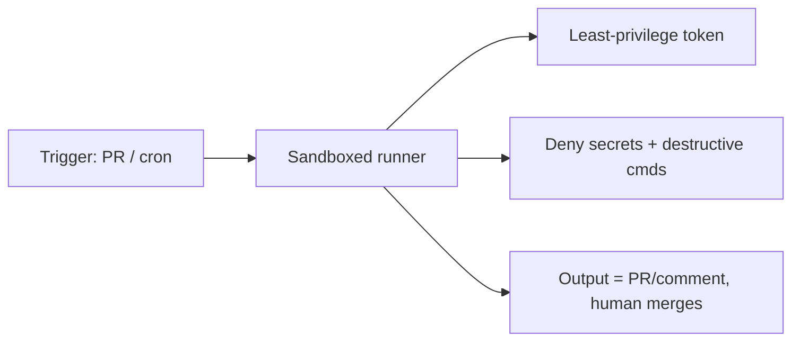

<LevelBadge level="advanced" />

Claudeを[ヘッドレス](/docs/claude-code/headless-and-agent-sdk)で、または[スケジュール](/docs/claude-code/background-tasks)に従って — CI、cronジョブ、pre-commitフックで — 実行すると、通常なら不適切なアクションを食い止める人間がいなくなります。その利便性こそが、これらの実行に最も厳格なガードレールが必要となる理由です。

## 無人実行に特有のリスク

- **その場でリスクのあるツール呼び出しに「ノー」と言う人がいない。**
- **アンビエントな認証情報。** CIにはしばしば強力なトークン（デプロイ、パッケージレジストリ、クラウド）が存在します。そこにあるエージェントはそれらを継承してしまいます。
- **信頼できない入力。** PRやイシューによってトリガーされた実行は、攻撃者が作成したコンテンツを処理する可能性があります（[インジェクション](/docs/security/prompt-injection)）。

## ハードニングのチェックリスト

- **シークレットを明示的に拒否する。** [権限の拒否ルール](/docs/claude-code/permissions)を使って、`.env`、鍵ファイル、認証情報のパスの読み取りをブロックします。モデルがそれらを避けてくれることに頼ってはいけません。
- **実際のアクセス権を持つマシンでは、バイパス/yoloモードを決して使わない。** 「すべてのプロンプトをスキップ」は、使い捨てのサンドボックス専用にします。
- **トークンの範囲を絞る。** 実行には、フルアクセスの認証情報ではなく、最小権限のトークン（可能な限り読み取り専用）を与えます。
- **サンドボックス化とエフェメラル化。** 実行後に破棄されるコンテナ内で実行し、本番環境への永続的なアクセスを持たせないようにします。
- **コマンドとドメインを許可リスト化する。** テスト/lint/ビルドのコマンドは許可し、ネットワーク通信や破壊的なものは拒否します。
- **上限を設ける。** 最大反復回数、時間予算、トークン/コスト予算 — ループや操作されたエージェントが暴走できないようにします。
- **出力を自動適用ではなくレビュー可能にする。** 「mainへプッシュ」よりも「PRを開く / コメントを投稿する」を優先します。マージは人間が行います。

## 例: 安全なCIレビュアー

PRレビューのボットは次のようにすべきです。コードを読み取り専用でチェックアウトし、デプロイ/シークレットへのアクセスは**一切持たず**、コンテナ内で実行し、その所見を**コメント**する — 保護されたブランチを変更することは決してしません。[PRレビューのウォークスルー](/docs/walkthroughs/pr-review-action)を参照してください。

## 次のステップ

- [権限と権限モード](/docs/claude-code/permissions)
- [エージェントとツールのセキュリティ確保](/docs/security/securing-agents)
- [ヘッドレスモードとAgent SDK](/docs/claude-code/headless-and-agent-sdk)
