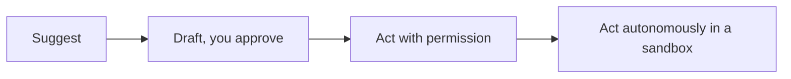

<LevelBadge level="all" />

AIを最大限に活用するには、それを*責任を持って*使うことが含まれます。このページは短く、実践的で、初心者から開発者まですべての人に当てはまります。

## 検証のマインドセット

最も重要な習慣はただ一つ: **検証の度合いをリスクの大きさに合わせること。**

| リスク | 例 | どれだけ検証するか |
|---|---|---|
| 低 | ブレインストーミング、ラフな下書き | 自由に信頼し、ざっと目を通す |
| 中 | 業務メール、要約 | 読んで、事実関係をざっと確認する |
| 高 | 公開する統計、実行するコード、法律/医療/金融 | すべての主張を信頼できる情報源と照合して検証する |

AIは速い初稿であって、決して最終的な権威ではありません — [ハルシネーション](/docs/foundations/hallucinations)を参照してください。

## 自律性のはしご

信頼が積み上がるにつれて、AIにより多くの独立性を与えていきましょう:

「提案し、私が承認する」（[プランモード](/docs/claude-code/plan-mode)）から始め、完全な自律性は低リスクでサンドボックス化された可逆的な作業に限定しましょう（[自律実行のハードニング](/docs/security/hardening-autonomous-runs)）。

## プライバシーとデータ

- 検証していないツールに、シークレット、認証情報、他人の個人データを貼り付けないでください。
- 機微な情報を共有する前に、利用するプロバイダのデータ取り扱いおよびトレーニングのポリシーを把握しておきましょう — [プライバシーとデータの取り扱い](/docs/foundations/privacy)を参照してください。
- 規制対象または機密のデータには、適切なエンタープライズ/管理された設定を使用してください。

## バイアス、公平性、そして限界

モデルはトレーニングデータに含まれるパターンを反映しており、それは**バイアス**を帯びている可能性があります。AIの出力が人々に関する判断（採用、融資、モデレーション）に影響を与える場合は特に注意してください。重大な判断については人間が責任を持ち、AIは判断を置き換えるものではなく、判断を助けるものとして扱いましょう。

## 思考を外注しない

:::tip AIは思考を減らすためではなく、より良く思考するために使う
最も優れた利用者は関与し続けます — 出力に疑問を持ち、そこから学び、結果に責任を持ちます。学習においては、それはコピー＆ペーストではなく[ティーチバックのループ](/docs/playbooks/learning)を意味します。AIの助けを借りて世に送り出すものについては、あなたが責任を負います。
:::

## セキュリティ、手短に

AIが信頼できないコンテンツ（Webページ、メール、ドキュメント）を読み込んだり、アクションを取ったりするなら、あなたはセキュリティモデルを引き継ぎます。[プロンプトインジェクション](/docs/security/prompt-injection)と[エージェントのセキュリティ確保](/docs/security/securing-agents)をお読みください。

## 次のステップ

- [プロンプトインジェクション解説](/docs/security/prompt-injection)
- [ハルシネーションとその減らし方](/docs/foundations/hallucinations)
- [プライバシーとデータの取り扱い](/docs/foundations/privacy)
