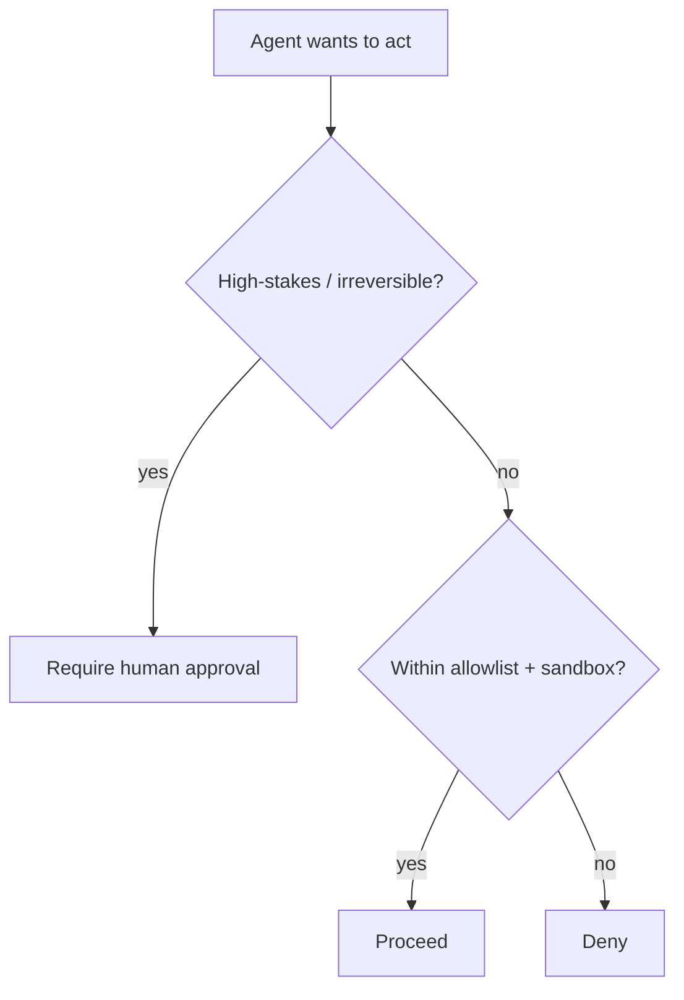

<LevelBadge level="advanced" />

AIが**アクションを取れる**（ツールを呼び出す、コードを実行する、APIを叩く）ようになった瞬間から、AIはセキュリティモデルを引き継ぎます。目標は、モデルを騙されないものにすることではなく、**たとえ騙されたとしても、大きな被害を与えられないようにすること**です。

## 中核となる原則: 最小権限

エージェントには、その仕事に必要な**最小限**のアクセス権を与え、それ以上は与えないようにします。

- ドキュメント要約ツールには**読み取り**が必要であり、書き込みやネットワークは不要です。
- レビュアーにはコードを読みコメントを投稿する権限が必要であり、プッシュやデプロイは不要です。
- ツール、APIキー、ファイルアクセスをタスクごとに範囲を絞ります。狭く範囲を絞られたエージェントが[インジェクション](/docs/security/prompt-injection)を受けても、与えられる被害は狭い範囲に留まります。

## 混乱した代理人問題（confused deputy）

エージェントはしばしば**あなたの権限で**（あなたのトークン、あなたのセッションで）動作します。攻撃者が制御する入力がそれを操ると、攻撃者はあなたの権限を借りることになります — これが「混乱した代理人」です。防御策: エージェントに不要なアンビエント権限を渡さず、機微なツールには明示的で範囲を絞った認証情報を要求します。

## 防御の層

1. コード実行とファイルアクセスを**サンドボックス化**する — コンテナ、エフェメラルなディレクトリを使い、広範なシステムやシークレットへのアクセスを与えない。
2. 危険な接触面を**許可リスト化**する: どのコマンド、どのドメイン、どのパスを許すか。それ以外は拒否します。（Claude Codeでは、これが[権限](/docs/claude-code/permissions)にあたります。）
3. 不可逆的または重大なアクションには**ヒューマン・イン・ザ・ループ**を: 送金、メール、削除、デプロイ、本番設定の変更。
4. **信頼ゾーンを分離する。** 一つのエージェントが、シークレットを保持し、信頼できないコンテンツを読み取り、任意の外向き通信を行うことを同時にできないようにします。
5. エージェントが実際にどのツールを呼び出したかを**ログに記録しレビューする**。

## ツールにはスキーマがある — それを検証する

モデルが生成するツール入力は、誤っていたり操作されていたりすることがあります。実行前に引数を**検証し**、エージェントが闇雲にリトライするのではなく回復できるよう、**エラーを結果として返し**ましょう。

## 次のステップ

- [プロンプトインジェクション解説](/docs/security/prompt-injection)
- [自律実行のハードニング](/docs/security/hardening-autonomous-runs)
- [サードパーティコードのレビュー](/docs/security/reviewing-third-party-code)
