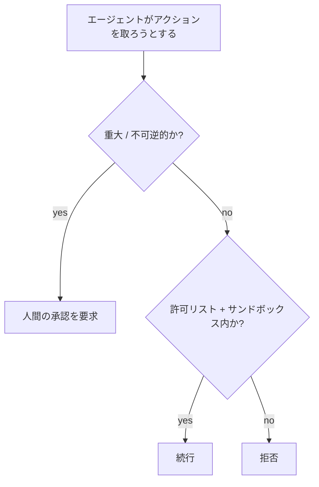

<LevelBadge level="advanced" />

<Callout type="objectives" items={["最小権限を適用する — エージェントには、その仕事に必要なアクセス権だけを与える", "混乱した代理人問題を認識する: エージェントがあなたの権限を借用する", "エージェントが騙されたときに被害範囲を縮小する5つの防御層を積み重ねる", "どのアクションに人間の関与が必要かを判断する", "不正または操作された引数が実行されないよう、ツールの入力を検証する"]} />

AIが**アクションを取れる**（ツールを呼び出す、コードを実行する、APIを叩く）ようになった瞬間から、AIはセキュリティモデルを引き継ぎます。目標は、モデルを騙されないものにすることではなく、**たとえ騙されたとしても、大きな被害を与えられないようにすること**です。

## 中核となる原則: 最小権限

エージェントには、その仕事に必要な**最小限**のアクセス権を与え、それ以上は与えないようにします。

- ドキュメント要約ツールには**読み取り**が必要であり、書き込みやネットワークは不要です。
- レビュアーにはコードを読みコメントを投稿する権限が必要であり、プッシュやデプロイは不要です。
- ツール、APIキー、ファイルアクセスをタスクごとに範囲を絞ります。狭く範囲を絞られたエージェントが[インジェクション](/docs/security/prompt-injection)を受けても、与えられる被害は狭い範囲に留まります。

## 混乱した代理人問題（confused deputy）

エージェントはしばしば**あなたの権限で**（あなたのトークン、あなたのセッションで）動作します。攻撃者が制御する入力がそれを操ると、攻撃者はあなたの権限を借りることになります — これが「混乱した代理人」です。防御策: エージェントに不要なアンビエント権限を渡さず、機微なツールには明示的で範囲を絞った認証情報を要求します。

## 防御の層

これらを積み重ねましょう — 単一の層だけでは不十分です。各層は、その上の層が失敗する可能性を前提としています。

<Steps items={[
  {title: "実行とファイルアクセスをサンドボックス化する", body: "コードやファイル操作を、広範なシステムやシークレットにアクセスできないコンテナやエフェメラルなディレクトリ内で実行します。エージェントが騙されても、箱の中で遊ぶだけになります。"},
  {title: "危険な接触面を許可リスト化する", body: "どのコマンド、どのドメイン、どのパスを許可するかを決め、それ以外は拒否します。Claude Codeでは、これが権限（/docs/claude-code/permissions）にあたります。"},
  {title: "重大な事案にはヒューマン・イン・ザ・ループを", body: "不可逆的または機微なアクションには明示的な承認を要求します: 送金、メール送信、削除、デプロイ、本番設定の変更。"},
  {title: "信頼ゾーンを分離する", body: "一つのエージェントが、シークレットを保持し、信頼できないコンテンツを読み取り、任意の外向き通信を行うことを同時にできないようにします — その組み合わせが情報流出の経路になります。"},
  {title: "ツール呼び出しをログに記録しレビューする", body: "エージェントが実際にどのツールをどの引数で呼び出したかを記録し、挙動を監査して逸脱を検知できるようにします。"}
]} />

## 許可リストを文書化する

「危険な接触面を許可リスト化する」は、うなずくのは簡単で、飛ばすのも簡単です。Claude Codeではこれが具体的になります: タスクに必要な狭いコマンドとドメインの集合を許可し、それ以外は拒否する `settings.json` です。制限的な状態から始め、実際のタスクが行き詰まったときにのみ広げましょう。

<PromptCard title="最小権限の Claude Code 権限ブロック">{`{
  "permissions": {
    "allow": [
      "Read",
      "Edit",
      "Bash(npm test:*)",
      "Bash(npm run build:*)",
      "Bash(git status)",
      "Bash(git diff:*)"
    ],
    "deny": [
      "Bash(git push:*)",
      "Bash(rm:*)",
      "Bash(curl:*)",
      "Read(./.env)",
      "Read(./secrets/**)"
    ]
  }
}`}</PromptCard>

`deny` リストは `allow` より優先されるため、`.env` や `secrets/**` のブロックは、広範な `Read` が付与されていても有効です。完全なルール構文と優先順位については[権限](/docs/claude-code/permissions)を参照してください。

## ツールにはスキーマがある — それを検証する

モデルが生成するツール入力は、誤っていたり操作されていたりすることがあります。実行前に引数を**検証し**、エージェントが闇雲にリトライするのではなく回復できるよう、**エラーを結果として返し**ましょう。

<Flashcards title="中核用語を反復学習" cards={[{front: "最小権限", back: "エージェントには、その特定の仕事に必要なアクセス権だけを与える — それ以上は与えない。狭く範囲を絞られたエージェントは、騙されても狭い範囲の被害しか与えられない。"}, {front: "混乱した代理人", back: "エージェントはあなたの権限（あなたのトークン、あなたのセッション）で動作する。攻撃者が制御する入力がそれを操ると、攻撃者はあなたの権限を借用する。"}, {front: "サンドボックス", back: "コードやファイルアクセスを、広範なシステムやシークレットへの経路のない隔離されたコンテナやエフェメラルなディレクトリ内で実行し、騙されたエージェントを箱の中に閉じ込めておく。"}, {front: "信頼ゾーン", back: "シークレット、信頼できないコンテンツ、外向きネットワークを別々のエージェントに分ける。この3つすべてを保持する一つのエージェントは情報流出の経路になる。"}, {front: "ヒューマン・イン・ザ・ループ", back: "不可逆的または機微なアクションの前に必須となる人間の承認ゲート — 送金、削除、デプロイ、本番設定の変更。"}]} />

<Quiz title="理解度チェック" questions={[
  {
    q: "最小権限の原則は、エージェントを設定する際に何をするよう求めていますか?",
    options: ["タスクの途中でブロックされないよう、広範なアクセス権を与える", "その特定の仕事に必要なアクセス権だけを与える", "それを実行する人間と同じ権限を与える"],
    answer: 1,
    explain: "最小権限とは、その仕事に必要な最小限のアクセス権を意味します。狭く範囲を絞られたエージェントは、インジェクションを受けても狭い範囲の被害しか与えられません。"
  },
  {
    q: "あなたのトークンで動作するエージェントが「混乱した代理人」のリスクとなるのはなぜですか?",
    options: ["どのモデルを呼び出すかを混同する", "攻撃者が制御する入力が、あなたの権限を使うようそれを操れる", "許可を求めずに他のエージェントを代理人に任命する"],
    answer: 1,
    explain: "エージェントはあなたの権限を保持しています。攻撃者が制御する入力がそれを操ると、攻撃者は実質的にあなたの権限を借用します — これが混乱した代理人問題です。"
  },
  {
    q: "Claude Codeの権限ブロックにおいて、エージェントがシークレットファイルを読むのを確実に防ぐエントリはどれですか?",
    options: ["Read の allow エントリ", "deny が allow より優先されるため、シークレットパスの deny エントリ", "Bash ツールを削除する"],
    answer: 1,
    explain: "deny は allow より優先されるため、secrets/** の deny は、広範な Read が付与されていても有効です。"
  }
]} />

<Callout type="takeaways" items={["まず最小権限を: ツール、キー、ファイルアクセスをタスクごとに範囲を絞り、騙されたエージェントが狭い範囲の被害しか与えられないようにする", "エージェントはあなたの権限で動作する — 不要なアンビエント権限を渡してはいけない（混乱した代理人問題）", "5つの層を積み重ねる: サンドボックス、許可リスト、ヒューマン・イン・ザ・ループ、信頼ゾーンの分離、ログ記録とレビュー", "Claude Codeでは、deny ルールが allow ルールに勝つ — .env とシークレットのパスを明示的にブロックする", "実行前にツールの引数を検証し、エラーを結果として返すことで、エージェントが闇雲にリトライするのではなく回復できるようにする"]} />

## 次のステップ

- [プロンプトインジェクション解説](/docs/security/prompt-injection)
- [自律実行のハードニング](/docs/security/hardening-autonomous-runs)
- [サードパーティコードのレビュー](/docs/security/reviewing-third-party-code)
