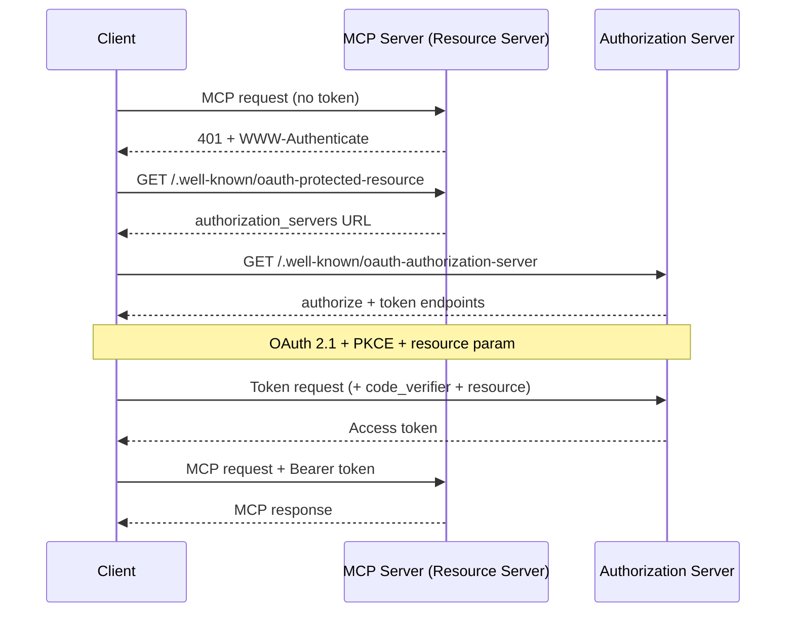
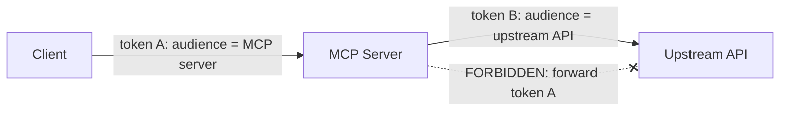

<LevelBadge level="advanced" />

<Callout type="objectives" items={["リモート(HTTP)MCPサーバーが単なるAPIキーのエンドポイントではなく、OAuth 2.1のリソースサーバーである理由を理解する", "ディスカバリのハンドシェイクをたどる: 401 → 保護されたリソースのメタデータ → 認可サーバーのメタデータ → トークン", "トークンのオーディエンス・バインディング(RFC 8707)と、それがあるサービスのトークンを別のサービスで機能させない理由を説明する", "混乱した代理の罠と、それを塞ぐ唯一のルール、すなわちクライアントのトークンを上流APIへ決してパススルーしないことを挙げる", "MCPサーバーをインターネットに公開する前に、短いハードニング・チェックリストを適用する"]} />

[MCP](/docs/claude-code/mcp)は目新しいものからエージェントがツールに到達する既定の手段へと変わりました。つまりMCPサーバーは今や本物のデータと本物のアクションの前に立っています。**STDIO**で起動するローカルサーバーはその環境を信頼します。環境変数から資格情報を読み取り、防御すべきネットワーク境界がありません。同じサーバーを**リモート**(HTTP)にした瞬間、URLに到達できる者は誰でもそれを呼び出そうとできます。これはそれを認可の問題へと反転させ、MCP仕様は独自のAPIキー方式ではなく**OAuth 2.1**でそれに答えます。

このページはリモートのケースについてです。サーバーがSTDIO専用であれば、仕様はOAuthフローに従わ*ない*ことを明示しています。環境から資格情報を取得して先に進んでください。

<VerifyNote lastVerified="2026-07-07" source="https://modelcontextprotocol.io/specification/2025-06-18/basic/authorization" />

## 3つの役割

OAuthは問題を3者に分割します。MCPはそれらにきれいに対応します:

<Flashcards title="MCPのOAuthフローにおける登場人物" cards={[{front: "MCPサーバー = リソースサーバー", back: "保護される対象。アクセストークンを伴うリクエストを受け入れ、トークンを検証し、データを返す。トークンが欠けているか誤っていれば401を返す。ユーザーのログインは行わない。"}, {front: "MCPクライアント = OAuthクライアント", back: "あなたのエージェントホスト(Claude Code、デスクトップアプリ、あなた自身のコード)。ユーザーに代わってトークンを取得し、すべてのリクエストにBearerヘッダーとして添付する。"}, {front: "認可サーバー(AS)", back: "実際にユーザーと対話し、同意を得て、トークンを発行する当事者。サーバーと同居する場合も、別のアイデンティティプロバイダーである場合もある。その内部はMCPのスコープ外。"}]} />

重要な考え方の転換: **MCPサーバーはログインそのものを決して扱いません。** それは他者が発行したトークンを検証するだけです。この分離こそが、あなたが書いたサーバーの前に既製のアイデンティティプロバイダーを置けるようにするものです。

## ディスカバリのハンドシェイク

クライアントは、どこで認証するかをあらかじめ設定しておく必要があってはなりません。MCPはディスカバリを自動化し、`401`によって駆動します:

<Steps items={[
  {title: "クライアントがトークンなしでサーバーを呼び出す", body: "最初のリクエストは裸で送られます。サーバーはHTTP 401 Unauthorizedと、そのリソースメタデータURLを指すWWW-Authenticateヘッダーでそれを拒否します。"},
  {title: "クライアントが保護されたリソースのメタデータを取得する(RFC 9728)", body: "サーバー上の/.well-known/oauth-protected-resourceをGETします。文書のauthorization_serversフィールドは、クライアントが使用できる認可サーバーを少なくとも1つ指名します。"},
  {title: "クライアントが認可サーバーのメタデータを取得する(RFC 8414)", body: "ASの/.well-known/oauth-authorization-serverをGETし、authorizeエンドポイントとtokenエンドポイント、およびサポートされている機能を知ります。"},
  {title: "任意: 動的クライアント登録(RFC 7591)", body: "クライアントがこのASのクライアントIDを持っていない場合、/registerをPOSTして人間を介さずに1つを取得できます。クライアントはあらゆるMCPサーバーを事前に知ることはできないため、これは極めて重要です。"},
  {title: "PKCE + resourceによるOAuth 2.1認可", body: "クライアントはPKCEのverifier/challengeを生成し、resourceパラメータを含むauthorize URLへブラウザを開き、ユーザーが同意し、クライアントは返されたコード(verifierとともに)をアクセストークンと交換します。"},
  {title: "クライアントがトークンを付けて再試行する", body: "これで各リクエストはAuthorization: Bearer <token>を伴います。サーバーはそれを検証し、応答します。"}
]} />

クライアント側に**ハードコードされた認証設定がない**ことに注目してください。`401`がすべてをブートストラップします。それこそが要点です。エージェントは一度も見たことのないサーバーに接続し、どう認証するかを見つけ出せるのです。

## オーディエンス・バインディング: 荷重を支えるルール

オーディエンス・バインディングが防ぐために存在する障害モードがこれです。あるユーザーが`calendar.example.com`向けに発行されたトークンを持っているとします。`evil.example.com`にある悪意ある(あるいは単にずさんな)MCPサーバーが、クライアントを騙して*そのトークン*を自分に送らせます。もし`evil`がそれを受け入れれば、それはユーザーとしてカレンダーAPIを呼び出せるようになります。あるサービスのトークンが別のサービスで機能してしまいました。OAuthのセキュリティ境界が今まさに崩壊したのです。

その対策が**リソースインジケーター(RFC 8707)**です:

<Steps items={[
  {title: "クライアントがターゲットを宣言する", body: "認可リクエストとトークンリクエストの両方で、クライアントは呼び出そうとしているMCPサーバーの正規URIに設定したresourceパラメータを含めなければなりません(MUST)。例: resource=https://mcp.example.com。ASがそれをサポートしているか不確かでも、これを送ります。"},
  {title: "ASがトークンをそのオーディエンスにバインドする", body: "サポートされている場合、ASはトークンにスタンプを押し、その特定のリソースサーバーに対してのみ有効にします。"},
  {title: "サーバーがオーディエンスを検証する", body: "いかなる作業を行う前にも、MCPサーバーはトークンがそれ自身向けに発行されたことを検証しなければなりません(MUST)。オーディエンスクレーム(RFC 9068)をチェックします。他の誰か向けに鋳造されたトークンは、問答無用で401を受け取ります。"}
]} />

<PromptCard title="認可リクエスト上のresourceパラメータ(URLエンコード)">{`&resource=https%3A%2F%2Fmcp.example.com`}</PromptCard>

正規URIは厳格です。`https://mcp.example.com`と`https://mcp.example.com:8443/mcp`は有効です。`mcp.example.com`(スキームなし)と`https://mcp.example.com#frag`(フラグメント)は無効です。相互運用性のため、末尾スラッシュのない形式を優先してください。

## 混乱した代理: トークンを決してパススルーしない

これは、善意のMCPサーバーを攻撃者のプロキシに変えてしまう間違いです。これはエージェントセキュリティにおける同じ[混乱した代理の問題](/docs/security/securing-agents#the-confused-deputy-problem)を、1つの具体的なルールに研ぎ澄ましたものです。

MCPサーバーはしばしば**上流API**(GitHub、データベースサービス、別のSaaS)を呼び出す必要があります。誘惑は、クライアントが渡してきたトークンを取り、それを上流へ転送することです。**やめてください。** 仕様は率直です。MCPサーバーはクライアントから受け取ったトークンをパススルーしてはなりません(MUST NOT)。

なぜ危険か: クライアントのトークンは*あなたの*サーバーをオーディエンスとして発行されました。もしあなたがそれを転送すれば、上流APIはそれをあなたから来たかのように信頼したり、あなたがすでに検証したと想定したりするかもしれません。そして今や1ホップ用にスコープされたトークンが、誰の同意モデルの外でも、2ホップ先で作業をしているのです。

<Callout type="warning" items={["あなたのMCPサーバーが上流APIを呼び出す場合、それはそのAPIに対する別個のOAuthクライアントとして振る舞い、上流の認可サーバーから自分自身のトークンを取得します。2つの独立したトークン、2つの独立したオーディエンス。クライアントのトークンはあなたの玄関で止まります。"]} />

## 事前のハードニング・チェックリスト

リモートMCPサーバーが公共のインターネットに触れる前に:

<Steps items={[
  {title: "すべてをHTTPSで提供する", body: "すべてのASエンドポイントはHTTPSでなければなりません(MUST)。リダイレクトURIはHTTPSまたはlocalhostでなければなりません(MUST)。それ以外は不可です。"},
  {title: "すべてのリクエストでオーディエンスを検証する", body: "このサーバー専用に発行されていないトークンをすべて拒否します。これがサービス間のトークン再利用を止める唯一のチェックです。"},
  {title: "PKCEを必須にする", body: "クライアントはPKCEを使用しなければならず(MUST)、傍受された認可コードは対応するverifierなしでは役に立たなくなります。"},
  {title: "正確なリダイレクトURIを固定する", body: "ASは事前登録された値に対してリダイレクトURIを厳密に一致させなければならず(MUST)、クライアントはstateパラメータを使用し検証すべきです(SHOULD)。両者はオープンリダイレクトのフィッシングを防ぎます。"},
  {title: "短命なトークン + リフレッシュのローテーション", body: "漏洩の被害を限定するため短命なアクセストークンを発行します。パブリッククライアントについてはリフレッシュトークンをローテーションします。トークンを安全に保管し、決してログに出さないでください。"},
  {title: "トークンをURLに決して入れない", body: "トークンはAuthorizationヘッダーに入れ、クエリ文字列には決して入れません。クエリ文字列に入れるとログやリファラに残ってしまいます。"},
  {title: "エージェントセキュリティの基本を重ねる", body: "オーディエンス・バインディングはトランスポートのゲートです。それでも/docs/security/securing-agentsの最小権限、サンドボックス化、ヒューマン・イン・ザ・ループを適用してください。認証は誰かを語るだけで、リクエストが安全だとは語りません。"}
]} />

## 理解度チェック

<Quiz title="理解度チェック" questions={[
  {
    q: "リモートMCPサーバーがアクセストークンなしのリクエストを受け取ります。仕様はまず何をすることを求めていますか?",
    options: [
      "ユーザーにユーザー名とパスワードを求める",
      "そのリソースメタデータURLを指すWWW-AuthenticateヘッダーとともにHTTP 401を返す",
      "リクエストを上流APIへ黙ってプロキシする",
      "サーバー自身がクライアントにトークンを発行する"
    ],
    answer: 1,
    explain: "サーバーはリソースサーバーであり、ログインページではありません。トークンなしのリクエストには401 + WWW-Authenticateで答え、それがクライアントによる認可サーバーのディスカバリをブートストラップします。"
  },
  {
    q: "トークンのオーディエンス・バインディング(RFC 8707)は何を防いでいますか?",
    options: [
      "遅いトークン検証",
      "あるサービス向けに発行されたトークンが、別のサービスで受け入れられ再利用されること",
      "ユーザーがパスワードを忘れること",
      "大きなコンテキストウィンドウ"
    ],
    answer: 1,
    explain: "resourceパラメータはトークンを、それが鋳造された特定のサーバーにバインドします。サーバーはその後オーディエンスクレームを検証し、他者向けに発行されたトークンを拒否します。これがサービス間の再利用の穴を塞ぎます。"
  },
  {
    q: "あなたのMCPサーバーが上流のGitHub APIを呼び出す必要があります。クライアントが送ってきたアクセストークンをどうすべきですか?",
    options: [
      "往復を節約するため、同じトークンをGitHubへ転送する",
      "GitHubにそのトークンは使わない。GitHubへのOAuthクライアントとして自分自身の別個のトークンを取得し、クライアントのトークンは決してパススルーしない",
      "後で再生できるようにトークンをログに出す",
      "トークンをGitHubのリクエストURLに入れる"
    ],
    answer: 1,
    explain: "クライアントのトークンを上流へ渡すことは混乱した代理の罠であり、明示的に禁止されています。サーバーは上流APIに対する自分自身のOAuthクライアントとして振る舞い、そのAPIのオーディエンスにバインドされた別個のトークンを使います。"
  },
  {
    q: "STDIO(ローカル)MCPサーバーについて、仕様は資格情報をどう扱うべきだと言っていますか?",
    options: [
      "起動のたびに完全なOAuth 2.1ブラウザフローを実行する",
      "環境から取得する。OAuth認可フローはHTTPトランスポート向けであり、STDIO向けではない",
      "クライアントにハードコードする",
      "すべてのトランスポートで認証を完全にスキップする"
    ],
    answer: 1,
    explain: "仕様は、STDIOトランスポートはHTTP認可フローに従うべきではなく(SHOULD NOT)、代わりに環境から資格情報を読み取るべきだと述べています。ここでのOAuthは、リモートのHTTPベースのサーバー専用です。"
  }
]} />

## 出典とさらなる読み物

- [MCP認可仕様(2025-06-18)](https://modelcontextprotocol.io/specification/2025-06-18/basic/authorization) — このページが要約する規範的なフロー、役割、MUST/SHOULD要件。
- [MCPセキュリティのベストプラクティス](https://modelcontextprotocol.io/specification/2025-06-18/basic/security_best_practices) — トークンのパススルー、混乱した代理、そしてそれらが禁止されている理由。
- [RFC 8707 — OAuth 2.0のリソースインジケーター](https://www.rfc-editor.org/rfc/rfc8707.html) — `resource`パラメータとオーディエンス・バインディング。
- [RFC 9728 — OAuth 2.0 保護されたリソースのメタデータ](https://datatracker.ietf.org/doc/html/rfc9728) — リソースサーバーが自身の認可サーバーをどう広告するか。
- [RFC 8414 — OAuth 2.0 認可サーバーのメタデータ](https://datatracker.ietf.org/doc/html/rfc8414) および [RFC 7591 — 動的クライアント登録](https://datatracker.ietf.org/doc/html/rfc7591)。
- [OAuth 2.1ドラフト](https://datatracker.ietf.org/doc/html/draft-ietf-oauth-v2-1-13) — PKCE、通信のセキュリティ、トークン処理の要件。
- AILmanacの関連ページ: [エージェントとツールのセキュリティ](/docs/security/securing-agents) · [プロンプトインジェクション](/docs/security/prompt-injection) · [Claude CodeにおけるMCP](/docs/claude-code/mcp)。
