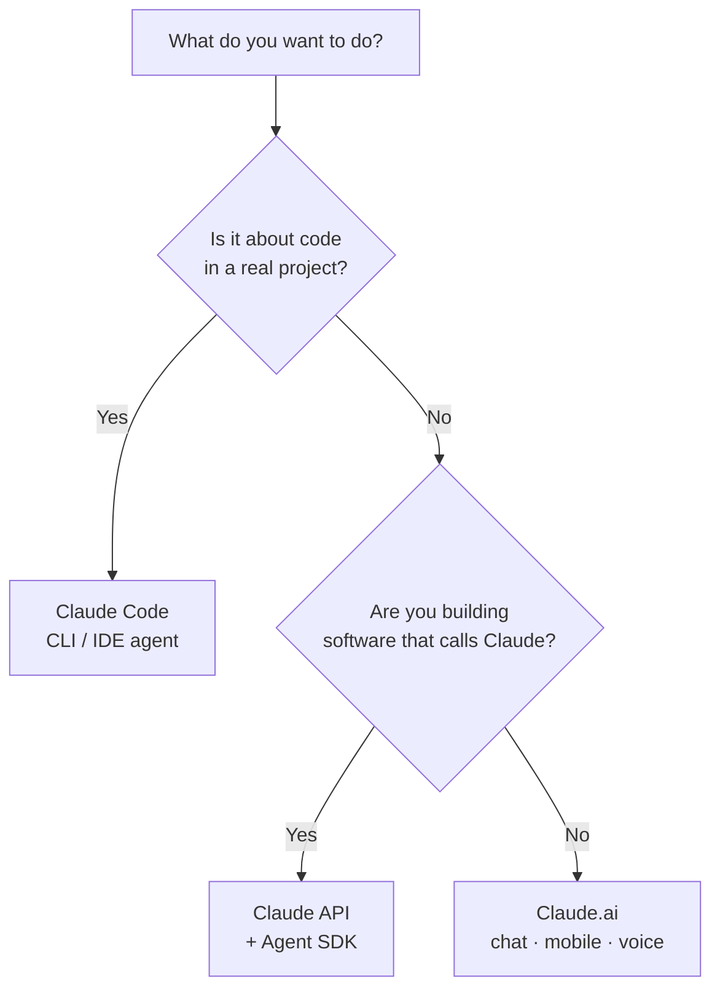

<LevelBadge level="beginner" />

「Claude」にはいくつかの種類があります。聞いたことがあるかどうかではなく、**何をしようとしているか**で選びましょう。

## 30秒で決める

## Claude.ai — チャットアプリ

**用途:** 執筆、調査、分析、学習、計画、日常の質問。**対象:** すべての人、セットアップ不要。

**モバイル**（[iOS/Android](/docs/claude-app/mobile)）や**[音声](/docs/claude-app/voice-mode)**でも使えます — 移動中にアイデアを書き留めるのに最適です。[プロジェクト](/docs/claude-app/projects)、[カスタム指示](/docs/claude-app/custom-instructions)、[アーティファクト](/docs/claude-app/artifacts)でパワーアップしましょう。→ [Claude.ai を始める](/docs/claude-app/getting-started)から。

## Claude Code — エージェント型コーディングツール

**用途:** *コードベースの中で*作業すること — 読み取り、編集、コマンド実行、テストの修正。**対象:** 開発者（および技術的好奇心のある人）。あなたの許可のもとで、あなたのファイルに対してアクションを実行します。→ [Claude Code とは](/docs/claude-code/what-is-claude-code)。

## API と Agent SDK — Claude を自分のソフトウェアに組み込む

**用途:** プログラム的に Claude を呼び出すアプリ、自動化、エージェント。**対象:** 製品やパイプラインを世に出す開発者。→ [初めてのAPI呼び出し](/docs/api/first-call)。

## これらは連携する

これらは競合製品ではありません。ほとんどの人はこれらを段階的に渡り歩いていきます。

| やりたいこと | 使うもの |
|---|---|
| メールの下書き、PDFの要約、ブレインストーミング | Claude.ai（または音声/モバイル） |
| モジュールのリファクタリング、テスト追加、バグ修正 | Claude Code |
| *自分の*アプリにAI機能を追加する | API / Agent SDK |

:::tip 迷ったらチャットから
[Claude.ai](/docs/claude-app/getting-started)はセットアップ不要で、Claude がどう「考える」かを教えてくれます。そこで身につくスキルは、他のすべての場所に応用できます。
:::

## 次へ

- [はじめの5分間](/docs/start-here/your-first-5-minutes)
- [学習パス](/docs/start-here/learning-paths)
- [Claudeモデルの選択](/docs/api/choosing-a-model)（構築を始めたら）
