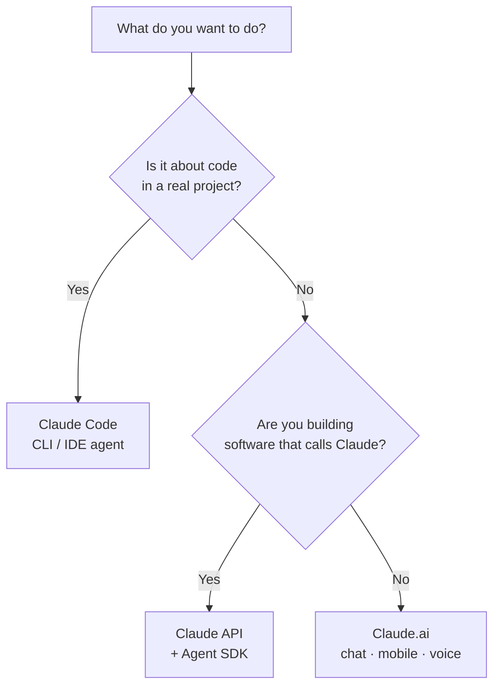

<LevelBadge level="beginner" />

「Claude」にはいくつかの種類があります。聞いたことがあるかどうかではなく、**何をしようとしているか**で選びましょう。

<Callout type="objectives" items={[
  "目的を適切な Claude の入り口に合わせる: チャット、Claude Code、または API",
  "モバイルと音声がどこで役立つかを知る",
  "レベルアップするにつれて 3 つの入り口がどう連携するかを理解する",
  "構築を始めたら、どのモデルに手を伸ばせばよいかの目安を得る"
]} />

## 30 秒で決める

## 3 つの入り口を一目で

| 入り口 | 最適な用途 | 対象 | ここから始める |
|---|---|---|---|
| **Claude.ai** | 執筆、調査、分析、学習、計画、日常の質問 | すべての人、セットアップ不要 | [Claude.ai を始める](/docs/claude-app/getting-started) |
| **Claude Code** | *コードベースの中で*の作業 — 読み取り、編集、コマンド実行、テストの修正 | 開発者（および技術的好奇心のある人） | [Claude Code とは](/docs/claude-code/what-is-claude-code) |
| **API と Agent SDK** | プログラム的に Claude を呼び出すアプリ、自動化、エージェント | 製品やパイプラインを世に出す開発者 | [初めての API 呼び出し](/docs/api/first-call) |

### Claude.ai — チャットアプリ

Claude.ai は、すべての人にとってセットアップ不要の出発点です。**モバイル**（[iOS/Android](/docs/claude-app/mobile)）や**[音声](/docs/claude-app/voice-mode)**でも使えます — 移動中にアイデアを書き留めるのに最適です。[プロジェクト](/docs/claude-app/projects)、[カスタム指示](/docs/claude-app/custom-instructions)、[アーティファクト](/docs/claude-app/artifacts)でパワーアップしましょう。

### Claude Code — エージェント型コーディングツール

Claude Code はあなたのプロジェクトの*内部で*動作します。コードを読み取り、編集し、コマンドを実行し、テストを修正します — あなたの許可のもとで、あなたのファイルに対してアクションを実行します。

### API と Agent SDK — Claude を自分のソフトウェアに組み込む

API と Agent SDK を使えば、自分のソフトウェアからプログラム的に Claude を呼び出せるので、AI 機能、自動化、エージェントを世に出すことができます。

## これらは連携する

これらは競合製品ではありません。ほとんどの人はこれらを段階的に渡り歩いていきます:

| やりたいこと | 使うもの |
|---|---|
| メールの下書き、PDF の要約、ブレインストーミング | Claude.ai（または音声/モバイル） |
| モジュールのリファクタリング、テスト追加、バグ修正 | Claude Code |
| *自分の*アプリに AI 機能を追加する | API / Agent SDK |

:::tip 迷ったらチャットから
[Claude.ai](/docs/claude-app/getting-started) はセットアップ不要で、Claude がどう「考える」かを教えてくれます。そこで身につくスキルは、他のすべての場所に応用できます。
:::

## 構築を始めたら、どのモデル？

*入り口*を選ぶのが第一歩です。Claude Code や API に進むと、*モデル* — Haiku、Sonnet、Opus — も選ぶことになります。3 つの簡単な質問に答えると、このピッカーが出発点を提案します:

<ModelPicker />

:::note 名前をハードコードしないこと
モデルのラインナップと価格は変わります。出荷する前に、必ず[Claude モデルの選択](/docs/api/choosing-a-model)ページで現在のモデル ID を確認してください。
:::

## 理解度チェック

<Quiz title="理解度チェック" questions={[
  {
    q: "メールを下書きし、PDF を要約したい — セットアップなしで。どの入り口？",
    options: ["Claude Code", "Claude.ai（チャット / モバイル / 音声）", "API と Agent SDK"],
    answer: 1,
    explain: "Claude.ai は、執筆・調査・日常の質問のためのセットアップ不要のチャット入り口です — ウェブ、モバイル、音声で利用できます。"
  },
  {
    q: "実際のプロジェクト内でモジュールをリファクタリングし、失敗しているテストを修正する必要があります。どの入り口？",
    options: ["Claude.ai", "Claude Code", "API と Agent SDK"],
    answer: 1,
    explain: "Claude Code はあなたのコードベースの内部で動作します — あなたの許可のもとで読み取り、編集、コマンド実行、テストの修正を行います。"
  },
  {
    q: "現在のモデル名と価格はどこで確認すべきですか？",
    options: ["このページ", "Claude モデルの選択ページ", "上の Mermaid 図"],
    answer: 1,
    explain: "モデルのラインナップは変わるため、このページではハードコードしていません — 現在の ID と価格は Claude モデルの選択ページで確認してください。"
  }
]} />

<Callout type="takeaways" items={[
  "Claude.ai: 執筆・調査・日常業務のためのセットアップ不要のチャット — モバイルや音声でも利用可能",
  "Claude Code: あなたのコードベースの内部でアクションを実行するエージェント",
  "API と Agent SDK: Claude を自分のソフトウェアに組み込む",
  "これらは組み合わさる — ほとんどの人はチャットから始め、Code や API へと進む",
  "モデル（Haiku / Sonnet / Opus）を選ぶのは構築を始めてからで、出荷前に現在の ID を確認する"
]} />

## 次へ

- [最初の 5 分](/docs/start-here/your-first-5-minutes)
- [学習パス](/docs/start-here/learning-paths)
- [Claude モデルの選択](/docs/api/choosing-a-model)（構築を始めたら）
