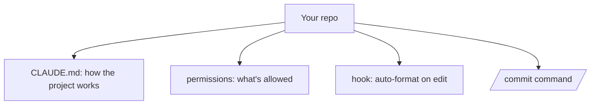

<LevelBadge level="intermediate" />

新しいチェックアウトを、*あなたのプロジェクトを理解し、あなたのルールを尊重する* Claude Code のセットアップに変えましょう — 所要時間は約20分です。各機能の根拠とともに、コア機能をつなぎ合わせていきます。

## 最終的な状態



## ステップ1 — CLAUDE.mdを生成して整理する

`/init` を実行して[CLAUDE.md](/docs/claude-code/claude-md)の下書きを作成し、それを**事実だけに削り込み**ます: スタック、実行/テスト/リントの方法、実際の規約、そしてガードレール（「完了前にテストを実行する」「`/generated` には触れない」）。*理由:* これは最もレバレッジの高いカスタマイズです — Claude は毎セッションこれを読みます。

[CLAUDE.md テンプレート](/docs/templates/claude-md)から雛形を入手しましょう。

## ステップ2 — 権限を設定する

安全で繰り返しの多いコマンドを事前に許可し、危険なものは拒否する `.claude/settings.json`（[リファレンス](/docs/claude-code/settings)）を追加します:

```json
{
  "permissions": {
    "allow": ["Read", "Bash(npm run test:*)", "Bash(npm run lint)", "Bash(git diff:*)"],
    "ask": ["Write", "Bash(npm install:*)"],
    "deny": ["Read(./.env)", "Bash(git push --force:*)"]
  }
}
```

*理由:* 安全なアクションでの中断が減り、リスクのあるアクションは確実に止まります。[権限](/docs/claude-code/permissions)を参照してください。

## ステップ3 — フォーマット用のフックを追加する

すべての編集後に自動フォーマットします（[フック](/docs/claude-code/hooks)）:

```json
{ "hooks": { "PostToolUse": [ { "matcher": "Edit|Write",
  "hooks": [ { "type": "command", "command": "npx prettier --write \"$CLAUDE_FILE_PATH\" 2>/dev/null || true" } ] } ] } }
```

*理由:* 一貫したフォーマットが保証されます — 「忘れずにお願いします」ではありません。

## ステップ4 — `/commit` コマンドを追加する

[スラッシュコマンドライブラリ](/docs/templates/slash-commands)の `/commit` レシピを `.claude/commands/` に配置します。*理由:* 繰り返し行うワークフローを一言で呼び出せます。

## ステップ5 — 最初の本番タスクにプランモードを使う

[プランモード](/docs/claude-code/plan-mode)で実際の目標を与え、プランをレビューしてから実行させます。*理由:* 考えることと実行することを分離することで、信頼を築けます。

## うまくいったか検証する

- 新しいセッション → Claude が促されなくてもあなたの規約を参照する（CLAUDE.md が機能している）。
- ファイルを編集する → フォーマットされる（フックが機能している）。
- リスクのあるコマンド → 確認するか拒否する（権限が機能している）。
- `/commit` → きれいな Conventional Commit メッセージ（コマンドが機能している）。

## 次へ

- [初めてのSkillを書く](/docs/walkthroughs/first-skill)
- [フックと settings.json のレシピ](/docs/templates/hooks-settings)
- [コーディングとソフトウェア開発](/docs/playbooks/coding)
