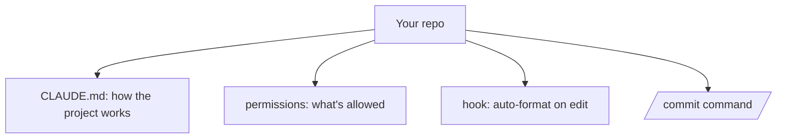

<LevelBadge level="intermediate" />

<Callout type="objectives" items={["新しいチェックアウトを約20分でチューニング済みのClaude Codeセットアップに変える", "4つのカスタマイズ — CLAUDE.md、権限、フック、コマンド — がそれぞれなぜ価値を持つのかを理解する", "安全なアクションでの中断を減らし、リスクのあるアクションは確実に止める権限ルールを書く", "各要素が実際に機能していることを、思い込みではなく検証する"]} />

新しいチェックアウトを、*あなたのプロジェクトを理解し、あなたのルールを尊重する* Claude Code のセットアップに変えましょう — 所要時間は約20分です。各機能の根拠とともに、コア機能をつなぎ合わせていきます。

## 最終的な状態



## ステップ1 — CLAUDE.mdを生成して整理する

`/init` を実行して[CLAUDE.md](/docs/claude-code/claude-md)の下書きを作成し、それを**事実だけに削り込み**ます: スタック、実行/テスト/リントの方法、実際の規約、そしてガードレール（「完了前にテストを実行する」「`/generated` には触れない」）。*理由:* これは最もレバレッジの高いカスタマイズです — Claude は毎セッションこれを読みます。

[CLAUDE.md テンプレート](/docs/templates/claude-md)から雛形を入手しましょう。

## ステップ2 — 権限を設定する

安全で繰り返しの多いコマンドを事前に許可し、危険なものは拒否する `.claude/settings.json`（[リファレンス](/docs/claude-code/settings)）を追加します:

```json
{
  "permissions": {
    "allow": ["Read", "Bash(npm run test:*)", "Bash(npm run lint)", "Bash(git diff:*)"],
    "ask": ["Write", "Bash(npm install:*)"],
    "deny": ["Read(./.env)", "Bash(git push --force:*)"]
  }
}
```

*理由:* 安全なアクションでの中断が減り、リスクのあるアクションは確実に止まります。[権限](/docs/claude-code/permissions)を参照してください。

## ステップ3 — フォーマット用のフックを追加する

すべての編集後に自動フォーマットします（[フック](/docs/claude-code/hooks)）:

```json
{ "hooks": { "PostToolUse": [ { "matcher": "Edit|Write",
  "hooks": [ { "type": "command", "command": "npx prettier --write \"$CLAUDE_FILE_PATH\" 2>/dev/null || true" } ] } ] } }
```

*理由:* 一貫したフォーマットが保証されます — 「忘れずにお願いします」ではありません。

## ステップ4 — `/commit` コマンドを追加する

[スラッシュコマンドライブラリ](/docs/templates/slash-commands)の `/commit` レシピを `.claude/commands/` に配置します。*理由:* 繰り返し行うワークフローを一言で呼び出せます。

## ステップ5 — 最初の本番タスクにプランモードを使う

[プランモード](/docs/claude-code/plan-mode)で実際の目標を与え、プランをレビューしてから実行させます。*理由:* 考えることと実行することを分離することで、信頼を築けます。

## うまくいったか検証する

思い込みで済ませず、各要素を個別に確認しましょう。それぞれのテストは1つのカスタマイズだけを切り分けるので、失敗すればどのファイルを直すべきかがそのまま分かります。

<Steps items={[{title: "CLAUDE.md が機能している", body: "新しいセッションを開始し、通常のタスクを与えます。Claude は、あなたが規約を貼り付けなくても、促されずにそれを参照するはずです。"}, {title: "フックが機能している", body: "ファイルを編集し、Claude に書き込ませます。あなたが何も念押ししなくても、フォーマットされた状態で返ってくるはずです。"}, {title: "権限が機能している", body: "リスクのあるコマンドを試します。Claude はそのまま実行するのではなく、確認するか、きっぱり拒否するはずです。"}, {title: "コマンドが機能している", body: "/commit を実行します。一言で、きれいな Conventional Commit メッセージが得られるはずです。"}]} />

<PromptCard title="最初の本番タスクをプランモードで始める">{`Add pagination to the users list endpoint. Plan it first — I want to review before you touch anything.`}</PromptCard>

<Callout type="takeaways" items={["CLAUDE.md が最もレバレッジの高いカスタマイズなのは、Claude が毎セッションこれを読むからです — /init で生成し、そのあと実際に事実である内容だけに削り込みましょう", "権限は両面的なツールです: 安全で繰り返しの多いコマンドを事前許可して中断を減らし、危険なものは拒否して確実に止めます", "フックはフォーマットを「忘れずにお願いします」ではなく保証されたものにします — ハーネスによって強制される振る舞いは、プロンプトで依頼する振る舞いに勝ります", "スラッシュコマンドは、繰り返し行うワークフローを一言に変えます", "プランモードは考えることと実行することを分離します。これが、より多くの自律性を委ねる前に信頼を築く方法です", "各カスタマイズを個別のテストで検証しましょう。そうすれば失敗が1つのファイルを指し示します"]} />

<Quiz title="理解度チェック" questions={[{q: "CLAUDE.md が最もレバレッジの高いカスタマイズと呼ばれるのはなぜですか？", options: ["Claude Code が書き込める唯一のファイルだから", "Claude が毎セッション読むため、繰り返し説明しなくてもすべてのタスクに影響するから", "権限ルールを上書きするから"], answer: 1, explain: "Claude は毎セッション CLAUDE.md を読みます。そこがレバレッジです — スタック、コマンド、規約、ガードレールが、貼り直さなくても自動的にコンテキストに入ります。だからこそ、実際に事実である内容だけに削り込むのです。"}, {q: "自動フォーマットを、単なる依頼ではなく保証にしたい。正しい仕組みはどれですか？", options: ["CLAUDE.md に「編集後は必ずフォーマットする」と書く", "Edit|Write にマッチする PostToolUse フックでフォーマッタを実行する", "フォーマッタコマンドに対する権限の allow ルール"], answer: 1, explain: "フックはハーネスによって強制されます — モデルが覚えているかどうかに関係なく実行されます。CLAUDE.md の指示はモデルが見落としうる依頼にすぎず、権限ルールはコマンドが「許可されるか」を決めるだけで、実行されるかどうかは決めません。"}, {q: "例の settings.json で、一部のコマンドが \"allow\" に、他が \"ask\" にあるのはなぜですか？", options: ["\"ask\" のコマンドは危険なので、本来は \"deny\" にすべきだから", "安全で繰り返しの多いコマンドを事前許可すると中断が減り、一方 \"ask\" は副作用のあるアクションに人間を関与させ続けるから", "\"allow\" は読み取り操作専用だから"], answer: 1, explain: "この振り分けは、中断のコストとリスクの兼ね合いです。Read やテスト実行のような安全で繰り返しの多いものは事前許可して中断させない。Write や npm install のように実際に副作用があるものは \"ask\" に。force push のように本当に危険なものは \"deny\" に置いて確実に止めます。"}]} />

## 次へ

- [初めてのSkillを書く](/docs/walkthroughs/first-skill)
- [フックと settings.json のレシピ](/docs/templates/hooks-settings)
- [コーディングとソフトウェア開発](/docs/playbooks/coding)
