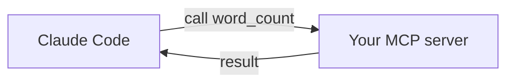

<LevelBadge level="advanced" />

<VerifyNote lastVerified="2026-06-20" source="https://modelcontextprotocol.io">
MCP SDKのAPIや設定は進化します。公式のMCPドキュメントおよびClaude CodeのMCPドキュメントと照らし合わせて確認してください。
</VerifyNote>

小さな[MCP](/docs/claude-code/mcp)サーバーを構築して接続することで、カスタムツールを Claude に公開しましょう。*配線*が明確になるよう最小限に保ち、その後にあなたの実際のロジックに差し替えます。

## 構築するもの

Claude が呼び出せる1つのツール `word_count` を持つ stdio サーバーです。同じパターンが「私のDBにクエリする」「チケットを開く」などにもスケールします。



## ステップ1 — サーバー

`server.py`（Python。TypeScript版は[MCPスキャフォールド](/docs/templates/mcp-config)にあります）:

```python
from mcp.server.fastmcp import FastMCP

mcp = FastMCP("text-tools")

@mcp.tool()
def word_count(text: str) -> int:
    """Count the words in a piece of text."""
    return len(text.split())

if __name__ == "__main__":
    mcp.run()  # stdio transport
```

## ステップ2 — 宣言する

リポジトリのルートにある `.mcp.json` に追加します:

```json
{ "mcpServers": {
  "text-tools": { "command": "python", "args": ["server.py"] }
} }
```

## ステップ3 — 接続してテストする

リポジトリ内で Claude Code を起動します。こう尋ねます: *「text-tools サーバーを使って 'the quick brown fox' の単語数を数えて。」* Claude は `word_count` を呼び出し、`4` と報告するはずです。ツールが見えない場合は、サーバーが単独でクリーンに起動するか、そして `.mcp.json` のパスが正しいかを確認してください。

## ステップ4 — 本物にする

`word_count` を、あなたの実際の能力 — DBクエリ、内部API呼び出し、ファイル操作 — に置き換えます。入力検証を追加し、エラーは結果として返しましょう。

## セキュリティチェックリスト

:::warning サーバーはコード + アクセスである
- **最小権限** — 必要なデータ/アクションだけにします（[エージェントのセキュリティ確保](/docs/security/securing-agents)）。
- モデルが送る**入力を検証する**。
- それが返す信頼できないデータは[プロンプトインジェクション](/docs/security/prompt-injection)を含む可能性があります。
- 接続する前に、サードパーティのサーバーは**レビュー**しましょう。
:::

## 次へ

- [Claude CodeのMCPサーバー](/docs/claude-code/mcp)
- [MCP設定とサーバースキャフォールド](/docs/templates/mcp-config)
- [ツール使用 / 関数呼び出し](/docs/api/tool-use)
